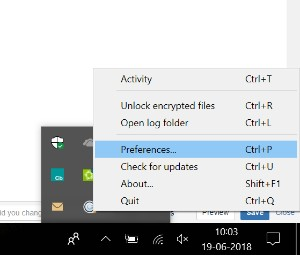

# Acelerar las descargas de Brand Portal {#guide-to-accelerate-downloads-from-brand-portal}

Brand Portal permite mejorar el rendimiento de descarga de archivos de recursos de gran tamaño mediante la integración con IBM Aspera Connect, una aplicación de instalación bajo demanda. La aplicación utiliza tecnología patentada para eliminar los sobrecargos TCP y ayuda a mejorar la velocidad de transferencia de los archivos de recursos. Esta integración garantiza una mejor experiencia de descarga.

>[!NOTE]
>
>La velocidad de descarga varía para los usuarios, ya que depende de factores como el ancho de banda de la red, la latencia del servidor y la ubicación geográfica de los clientes.

Si está activada, los usuarios de Brand Portal pueden reducir considerablemente el tiempo necesario para descargar los archivos de recursos deseados desde Brand Portal o a través de un vínculo compartido mediante la instalación del cliente de Aspera Connect.

## Requisitos previos para acelerar la descarga de archivos {#prerequisites-to-accelerate-file-download}

Para descargar los archivos más rápidamente, asegúrese de lo siguiente:

* **[!UICONTROL Habilite la aceleración]** de descarga (que está deshabilitada de forma predeterminada) desde Configuración  general en el panel Herramientas administrativas.
* El puerto 33001 (TCP y UDP) está abierto en el servidor de seguridad. Para obtener más información sobre los requisitos previos, consulte la documentación [del cliente de](https://downloads.asperasoft.com/en/documentation/8)Aspera Connect.
* Instale Aspera Connect con privilegios de administrador.
* Para obtener compatibilidad con plataformas del cliente de transferencia Aspera, consulte Matriz [de compatibilidad con plataformas](https://www.asperasoft.com/company/support/transfer-clients/)Aspera Connect.

## Descargar dominios {#download-domains}

A continuación se muestran los dominios de descarga de diferentes regiones geográficas:

| Código de región | Dominio |
|---|---|
| NA OR1 | downloads-na1.brand-portal.adobe.com |
| NA VA5 | downloads-na2.brand-portal.adobe.com |
| EMEA LON5 | downloads-emea1.brand-portal.adobe.com |
| APAC SIN2 | downloads-apac1.brand-portal.adobe.com |

## Ejemplo del rendimiento de descarga mediante el acelerador de archivos {#expected-download-performance-using-file-accelerator}

La siguiente tabla muestra el rendimiento de descarga de un archivo de 2 GB mediante el acelerador de descargas de archivos de Aspera Connect:

**Los resultados observados varían debido a factores como el ancho de banda de la red, la latencia del servidor y la ubicación del cliente, teniendo en cuenta que el servidor de Brand Portal está en Oregon (Estados Unidos).*

| Ubicación del cliente | Latencia entre cliente y servidor (milisegundos) | Velocidad con el acelerador de transferencia de archivos Aspera Connect (MBps) | Tiempo necesario para descargar un archivo de 2 GB con el acelerador de transferencia de archivos de Aspera (segundos) |
|---------------------------|-----------------------------------|---------------------------------------------|-------------------------------------------------------------------------|
| Oeste de EE.UU. (N. California) | 18 | 36 | 57 |
| Oeste de EE.UU. (Oregón) | 42 | 36 | 57 |
| U.S. East (N. Virginia) | 85 | 35 | 58 |
| APAC (Tokio) | 124 | 36 | 57 |
| Noida (India) | 275 | 13.36 | 153 |
| Sídney | 175 | 29 | 70 |
| Londres | 179 | 35 | 58 |
| Singapur | 196 | 34 | 60 |

## Descargar flujo de trabajo mediante el acelerador de archivos {#download-workflow-using-file-accelerator}

Para descargar recursos más rápido desde Brand Portal:

1. Inicie sesión en Brand Portal con un navegador compatible.
1. Busque y seleccione el archivo, la carpeta o la colección de recursos que desee descargar. Toque o haga clic en la opción de descarga.
Aparece el cuadro de diálogo Descargar con la opción [Activar aceleración] de descarga seleccionada.
   

   >[!NOTE]
   >
   >Actualmente no se admite la funcionalidad de enviar notificaciones por correo electrónico con el vínculo para descargar recursos mientras se habilitan las descargas más rápidas.

   

1. Toque o haga clic en la opción **[!UICONTROL Descargar]** .
Para acelerar la experiencia de descarga en la cuenta de inquilino de Brand Portal, debe tener instalada la aplicación cliente Aspera Connect en el sistema.

1. **Descargar Aspera Connect Client** Si el cliente de Aspera Connect no está instalado en el sistema o el cliente de Aspera Connect instalado no está actualizado, se mostrará un mensaje en la página del navegador desde la que podrá descargar el cliente de Aspera Connect específico del sistema seleccionando **[!UICONTROL Descargar la versión]** más reciente.

   

   Para descargar la versión más reciente de Aspera Connect desde [https://downloads.asperasoft.com/connect2/](https://downloads.asperasoft.com/connect2/), seleccione **[!UICONTROL Descargar ahora]** y siga las instrucciones.

1. **Instalación de Aspera Connect Client** Para instalar la configuración del cliente de IBM Aspera Connect, ejecute la configuración desde el archivo .msi de la aplicación cliente IBM Aspera Connect y siga el asistente de instalación.

1. Una vez que el cliente se haya instalado correctamente, actualice la página del explorador e inicie los pasos de descarga de nuevo o seleccione **[!UICONTROL Reiniciar]** en el cuadro de diálogo **[!UICONTROL Descargar]** recurso (paso 2).
Al utilizar Aspera Connect por primera vez, el navegador solicita que se abra el vínculo mediante **[!UICONTROL IBM Aspera Connect]**. Para omitir este cuadro de diálogo en el futuro, habilite **[!UICONTROL Recordar mi selección para los vínculos]** FASP.

   >[!NOTE]
   >
   >Este mensaje es diferente en los distintos navegadores.

1. Un cuadro de diálogo confirma si se debe continuar con la transferencia o no. Seleccione **[!UICONTROL Permitir]** que comience.
Para omitir este cuadro de diálogo en el futuro, habilite **[!UICONTROL Usar mi opción para todas las conexiones con este host]**.
Comienza la descarga. Un cuadro de diálogo muestra el progreso de la descarga. Utilice el cuadro de diálogo para **[!UICONTROL pausar]**, **[!UICONTROL reanudar]** o **[!UICONTROL cancelar]** la descarga.
La aplicación Aspera Connect proporciona una ventana de actividad en el sistema donde el usuario puede ver y administrar todas las sesiones de transferencia. Para obtener más información, consulte la documentación [del cliente de](https://downloads.asperasoft.com/en/documentation/8)Aspera Connect.

Una vez completada la descarga, un cuadro de diálogo muestra la ubicación en la que se descargan los recursos en el sistema del usuario. Si hay un error, muestra un error.

>[!NOTE]
>
>Existe una limitación conocida en la aplicación cliente de Aspera Connect de que no aparece ningún mensaje para seleccionar la ubicación de descarga si **[!UICONTROL Preguntarme siempre dónde guardar los archivos]** descargados está habilitado en la ficha [!UICONTROL Transferencias] en [!UICONTROL Preferencias]. Antes de comenzar la descarga, especifique la ubicación en el cuadro de texto **[!UICONTROL Guardar los archivos descargados en]**.

## Uso del acelerador de archivos en el navegador Microsoft Edge {#using-file-accelerator-on-microsoft-edge-browser}

Microsoft Edge se ejecuta en modo protegido mejorado (EPM) para evitar la comunicación con el servidor de Aspera Connect, en la misma red privada o con un sitio de confianza. Por lo tanto, aparece una ventana emergente cada vez que se establece una conexión con el servidor.

Para utilizar la funcionalidad de descarga acelerada en Microsoft Edge, elimine el sitio de Brand Portal de la lista de sitios de confianza.

1. Abra el Panel de control (pulse la tecla **[!UICONTROL Ventana + X]** y, a continuación, seleccione **[!UICONTROL Panel]** de control).
1. Vaya a **[!UICONTROL Red e Internet &gt; Opciones]** de Internet. Haga clic en la ficha **[!UICONTROL Seguridad]** .
1. Haga clic en la zona **[!UICONTROL Sitios de]** confianza y, a continuación, haga clic en **[!UICONTROL Sitios]**.
1. Elimine el sitio de Brand Portal de la lista.

## Preferencias del cliente de Aspera Connect {#aspera-connect-client-preferences}

Hay algunas preferencias útiles que se pueden establecer en las preferencias del cliente de IBM Aspera Connect haciendo clic con el botón derecho en el icono y seleccionando **[!UICONTROL Preferencias]**.

Puede establecer la ubicación de descarga predeterminada.

Además, el cliente de Aspera Connect se puede marcar para que se inicie automáticamente al iniciar el sistema, de modo que el cliente de Connect se esté ejecutando y esté disponible para que la descarga comience más rápido.

## Solución de problemas con la aceleración de la descarga {#troubleshoot-issues-with-download-acceleration}

Si la aceleración de la descarga no funciona correctamente, siga estos pasos para solucionar el problema:

1. Compruebe que los puertos no están bloqueados, visitando [https://test-connect.asperasoft.com](https://test-connect.asperasoft.com/) desde su equipo.

   Si los puertos no están bien, póngase en contacto con el equipo de red y asegúrese de que los puertos 33001 (tanto TCP como UDP) no estén bloqueados en el servidor de seguridad.

1. Si los puertos están bien, compruebe si la red no es lenta, midiendo el ancho de banda disponible mediante [https://www.speedtest.net/](https://www.speedtest.net/).

   Si el ancho de banda es de unos pocos (1-10 Mbps) o en kbps, utilice las preferencias de Aspera e intente limitar el ancho de banda igual al ancho de banda disponible.

1. Para confirmar si las descargas del servidor de demostración de Aspera están funcionando, utilice [https://demo.asperasoft.com/aspera/user](https://demo.asperasoft.com/aspera/user).\
   (inicio de sesión:  asperaweb , contraseña:  demoaspera )

1. Si ninguno de los pasos de solución de problemas anteriores funciona, anule la selección de la opción Activar aceleración de descarga y utilice la descarga normal.
