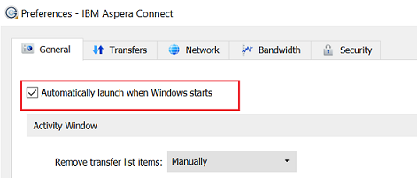

# Acelerar las descargas de Brand Portal {#guide-to-accelerate-downloads-from-brand-portal}

Adobe Experience Manager Assets Brand Portal permite mejorar el rendimiento de descarga de archivos de recursos de gran tamaño mediante la integración con IBM Aspera Connect, que es una aplicación de instalación bajo demanda. La aplicación utiliza tecnología propia para eliminar los sobrecargos TCP y ayuda a mejorar la velocidad de transferencia de los archivos de recursos. Esta integración garantiza una mejor experiencia de descarga.

>[!NOTE]
>
>La velocidad de descarga varía para los usuarios, ya que depende de factores como el ancho de banda de la red, la latencia del servidor y la ubicación geográfica de los clientes.

La variable **[!UICONTROL Descarga rápida]** está activada de forma predeterminada, lo que reduce considerablemente el tiempo necesario para descargar los archivos de recursos deseados desde Brand Portal.

## Requisitos previos para acelerar la descarga de archivos {#prerequisites-to-accelerate-file-download}

Para descargar los archivos más rápido, asegúrese de lo siguiente:

* Vaya a **[!UICONTROL Herramientas]** > **[!UICONTROL Descargar]** y verifique que **[!UICONTROL Descarga rápida]** la configuración está habilitada en **[!UICONTROL Descargar configuración]**.
* Asegúrese de que el puerto 33001 (TCP y UDP) esté abierto en el firewall. Para obtener más información sobre los requisitos previos, consulte [Documentación del cliente IBM Aspera Connect](https://downloads.asperasoft.com/en/documentation/8).
* **Instalación de IBM Aspera Connect 3.9.9** en la extensión del explorador con privilegios de administrador (`https://www.ibm.com/docs/en/aspera-connect/3.9.9`).
* Para obtener compatibilidad con la plataforma del cliente de transferencia Aspera, consulte [Matriz de soporte de la plataforma IBM Aspera Connect](https://www.asperasoft.com/company/support/transfer-clients/).

>[!NOTE]
>
>Hay un problema conocido con IBM Aspera Connect. La descarga rápida no funciona con IBM Aspera Connect versión 3.10 y posteriores.

## Descargar dominios {#download-domains}

A continuación se muestran los dominios de descarga de diferentes regiones geográficas:

| Código de región | Dominio |
|---|---|
| NA OR1 | downloads-na1.brand-portal.adobe.com |
| NA VA5 | downloads-na2.brand-portal.adobe.com |
| EMEA LON5 | downloads-emea1.brand-portal.adobe.com |
| APAC SIN2 | downloads-apac1.brand-portal.adobe.com |

## Ejemplo de rendimiento de descarga mediante el acelerador de archivos {#expected-download-performance-using-file-accelerator}

En la tabla siguiente se muestra el rendimiento de descarga de archivos de 2 GB con el acelerador de descargas de archivos Aspera Connect:

*Los resultados observados sí varían debido a factores como el ancho de banda de la red, la latencia del servidor y la ubicación del cliente, teniendo en cuenta que el servidor Brand Portal está en Oregon (Estados Unidos).*

| Ubicación del cliente | Latencia entre cliente y servidor (milisegundos) | Velocidad con el acelerador de transferencia de archivos (MBps) de Aspera Connect | Tiempo necesario para descargar un archivo de 2 GB con el acelerador de transferencia de archivos de Aspera (segundos) |
|---------------------------|-----------------------------------|---------------------------------------------|-------------------------------------------------------------------------|
| U.S. West (N. California) | 18 | 36 | 57 |
| Oeste de EE. UU. (Oregón) | 42 | 36 | 57 |
| U.S. East (N. Virginia) | 85 | 35 | 58 |
| APAC (Tokio) | 124 | 36 | 57 |
| Adobe (India) | 275 | 13,36 | 153 |
| Sídney | 175 | 29 | 70 |
| Londres | 179 | 35 | 58 |
| Singapur | 196 | 34 | 60 |

## Descargar recursos {#download-assets}

Para descargar recursos más rápido desde Brand Portal:

1. Inicie sesión en su inquilino de Brand Portal. De forma predeterminada, la variable **[!UICONTROL Archivos]** ver las aperturas que contienen todos los recursos y carpetas publicados.

   Realice una de las acciones siguientes:

   * Seleccione los recursos o carpetas que desee descargar. En la barra de herramientas de la parte superior, haga clic en el **[!UICONTROL Descargar]** icono.

      

   * Para descargar representaciones de recursos específicas de un recurso, pase el puntero sobre el recurso y haga clic en el botón **[!UICONTROL Descargar]** en las miniaturas de acción rápida.

      

1. La variable **[!UICONTROL Descargar]** en el que se muestran todos los recursos seleccionados.

   Para conservar la jerarquía de carpetas de Brand Portal al descargar recursos, seleccione la opción **[!UICONTROL Crear una carpeta independiente para cada recurso]** en el Navegador.

   El botón de descarga refleja el recuento de los elementos seleccionados. Una vez que haya terminado de aplicar las reglas, haga clic en **[!UICONTROL Descargar elementos]**. Para obtener más información sobre cómo aplicar reglas, consulte [descargar recursos](../using/download-assets.md#download-assets).

   

1. De forma predeterminada, la variable **[!UICONTROL Descarga rápida]** está habilitado en la variable **[!UICONTROL Descargar configuración]**. Por lo tanto, aparece un cuadro de confirmación para descargar recursos mediante IBM Aspera Connect.

   Si descarga los recursos por primera vez y no tiene IBM Aspera Connect instalado en su explorador o la versión existente está desactualizada, se le pedirá que instale el acelerador de descargas de Aspera (`https://www.ibm.com/docs/en/aspera-connect/3.9.9`).

   

1. **Instalación del cliente de Aspera Connect**

   Para instalar la configuración del cliente de IBM Aspera Connect, ejecute la configuración desde el archivo .msi de la aplicación cliente IBM Aspera Connect y siga el asistente de instalación.

   

1. Una vez que el cliente esté instalado correctamente, actualice la página del explorador e inicie de nuevo los pasos de descarga.

1. Para seguir usando **[!UICONTROL Descarga rápida]**, haga clic en **[!UICONTROL Permitir]**. Todas las representaciones seleccionadas se descargan en una carpeta zip mediante IBM Aspera Connect.

   Una vez finalizada correctamente la descarga, un cuadro de diálogo muestra la ubicación en la que se descargan los recursos en el sistema del usuario.

   

   Si no desea utilizar IBM Aspera Connect, haga clic en **[!UICONTROL Denegar]**. If **[!UICONTROL Descarga rápida]** se deniega o falla, el sistema rellena un mensaje de error. Haga clic en el **[!UICONTROL Descarga normal]** para continuar descargando los recursos.

>[!NOTE]
>
>Si la variable **[!UICONTROL Descarga rápida]** está desactivado por el administrador, las representaciones seleccionadas se descargan directamente en una carpeta zip sin usar IBM Aspera Connect.

<!-- 
On successful completion of the download, a dialog box shows the location where assets are downloaded onto the user's system. If there is a failure, it shows error.

   >[!NOTE]
   >
   >There is a known limitation in Aspera Connect client application that no prompt to select download location appears if **[!UICONTROL Always ask me where to save downloaded files]** is enabled under the tab **[!UICONTROL Transfers]** within **[!UICONTROL Preferences]**. Before any download begins, provide the location in the text box **[!UICONTROL Save downloaded files to]**.

1. Log in to Brand Portal using a supported browser.
1. Browse and select the folders or assets you want to download. From the toolbar at the top, click the **[!UICONTROL Download]** icon. the **[!UICONTROL Download]** dialog appears with the **[!UICONTROL Asset(s)]** and **[!UICONTROL Enable download acceleration]** check boxes selected by default. 

   

   >[!NOTE]
   >
   >The functionality to send email notification with the link to download assets is presently not supported while faster downloads are enabled.

   

1. Click **[!UICONTROL Download]**.

   To speed up the download experience on your Brand Portal tenant account, you need to have Aspera Connect client application installed in your browser's extension.

1. **Download Aspera Connect Client**

   If Aspera Connect client is not installed on your system or the existing Aspera Connect client is out of date, a prompt is displayed on the browser page from where you can download the system-specific Aspera Connect client by selecting **[!UICONTROL Download Latest Version]**.

   

   To download the latest version of Aspera Connect from [https://downloads.asperasoft.com/connect2/](https://downloads.asperasoft.com/connect2/), select **[!UICONTROL Download Now]** and follow the instructions.

1. **Install Aspera Connect Client**

   To install IBM Aspera Connect client setup, run the setup from  .msi  file of IBM Aspera Connect client application and follow the installation wizard.

1. Once the client is successfully installed, refresh the browser page and initiate the download steps again.

   When using Aspera Connect for the first time, the browser prompts to open the link using **[!UICONTROL IBM Aspera Connect]**. To skip this dialog in future, enable **[!UICONTROL Remember my choice for FASP links]**.

   >[!NOTE]
   >
   >This message is different on the different browsers.

1. A dialog box confirms whether to proceed the transfer or not. Select **[!UICONTROL Allow]** to begin.
To skip this dialog in future, enable **[!UICONTROL Use my choice for all connections with this host]**.
Download begins. A dialog box shows the progress of the download. Use the dialog box to **[!UICONTROL pause]**, **[!UICONTROL resume]**, or **[!UICONTROL cancel]** the download.
Aspera Connect application provides an Activity Window on the system where user can view and manage all transfer sessions. For more information, refer [Aspera Connect Client documentation](https://downloads.asperasoft.com/en/documentation/8).

On successful completion of the download, a dialog box shows the location where assets are downloaded onto the user's system. If there is a failure, it shows error.

   >[!NOTE]
   >
   >There is a known limitation in Aspera Connect client application that no prompt to select download location appears if **[!UICONTROL Always ask me where to save downloaded files]** is enabled under the tab **[!UICONTROL Transfers]** within **[!UICONTROL Preferences]**. Before any download begins, provide the location in the text box **[!UICONTROL Save downloaded files to]**.
-->

## Uso del acelerador de archivos en el explorador Microsoft Edge {#using-file-accelerator-on-microsoft-edge-browser}

Microsoft Edge se ejecuta en el modo protegido mejorado (EPM), lo que impide la comunicación con el servidor Aspera Connect, en la misma red privada o con un sitio de confianza. Por lo tanto, aparece una ventana emergente cada vez que se establece una conexión con el servidor.

Para utilizar la funcionalidad de descarga acelerada en Microsoft Edge, elimine el sitio de Brand Portal de la lista de sitios de confianza.

1. Abra el Panel de control de Campaign (**[!UICONTROL Tecla de ventana + X]** y, a continuación, seleccione **[!UICONTROL Panel de control de Campaign]**).
1. Vaya a **[!UICONTROL Red e Internet]** > **[!UICONTROL Opciones de Internet]**. Haga clic en el **[!UICONTROL Seguridad]** pestaña .
1. Haga clic en el **[!UICONTROL Zona de sitios de confianza]** y haga clic en **[!UICONTROL Sitios]**.
1. Elimine el sitio de Brand Portal de la lista.

## Preferencias del cliente de Aspera Connect {#aspera-connect-client-preferences}

Hay algunas preferencias útiles que se pueden configurar en la preferencia del cliente de IBM Aspera Connect haciendo clic con el botón derecho del ratón en el icono y seleccionando **[!UICONTROL Preferencias]**.

Puede establecer la ubicación de descarga predeterminada.

Además, el cliente de Aspera Connect se puede marcar para que se inicie automáticamente al iniciar el sistema, de modo que el cliente de conexión se esté ejecutando y esté disponible para que la descarga comience más rápido.

## Solución de problemas con la aceleración de descargas {#troubleshoot-issues-with-download-acceleration}

Si la aceleración de la descarga no funciona, siga estos pasos para solucionar el problema:

1. Compruebe que los puertos no estén bloqueados visitando [https://test-connect.asperasoft.com](https://test-connect.asperasoft.com/) de su máquina.

   Si los puertos no son correctos, póngase en contacto con el equipo de red y asegúrese de que los puertos 33001 (tanto TCP como UDP) no estén bloqueados en el firewall.

1. Si los puertos son correctos, compruebe si la red no es lenta, midiendo el ancho de banda disponible usando [https://www.speedtest.net/](https://www.speedtest.net/).

   Si el ancho de banda es de unos pocos (1-10 Mbps) o en Kbps, utilice las Preferencias de Aspera e intente limitar el ancho de banda igual al ancho de banda disponible.

1. Para confirmar si las descargas del servidor de demostración de Aspera están funcionando, utilice [https://demo.asperasoft.com/aspera/user](https://demo.asperasoft.com/aspera/user).\
   (inicio de sesión: asperaweb , contraseña: demoaspera )

1. Si ninguno de los pasos de solución de problemas anteriores funciona, anule la selección de la opción Habilitar aceleración de descarga y utilice la descarga normal.
