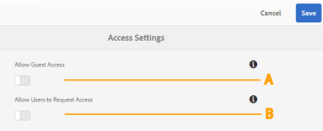
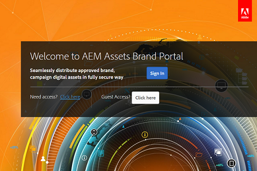

# Administrar el acceso de los usuarios en el Brand Portal {#administer-user-access-on-brand-portal}

A partir de Adobe Experience Manager Assets Brand Portal 6.4.2, autoriza a los administradores a configurar el acceso de los invitados y a permitir que los usuarios soliciten acceso a Brand Portal de su organización. Estas configuraciones se han proporcionado como configuraciones de **[!UICONTROL Access Settings]** en el panel administrativo. Ambas configuraciones están deshabilitadas de forma predeterminada.

****   ¿Configuración para permitir el acceso de los invitados a Brand Portal mediante  **[!UICONTROL Acceso de invitado?]** en la pantalla de bienvenida de Brand Portal. (El valor predeterminado está desactivado)

****   Configuración BC para permitir a los usuarios solicitar acceso a Brand Portal mediante  **[!UICONTROL ¿Necesita acceso?]** en la pantalla de bienvenida de Brand Portal. (El valor predeterminado está desactivado)

## Permitir el acceso de invitados {#allow-guest-access}

Al permitir el acceso de los invitados, los usuarios pueden acceder a los recursos públicos sin tener que iniciar sesión en Brand Portal.
Para permitir el acceso de los invitados, el administrador debe realizar los siguientes pasos:

1. Seleccione el logotipo de AEM para acceder a las herramientas administrativas, en la barra de herramientas de la parte superior.
1. En el panel de herramientas administrativas, seleccione **[!UICONTROL Acceso]** para abrir la página **[!UICONTROL Configuración de acceso]**.
1. Habilite la configuración **[!UICONTROL Permitir acceso de invitado]**.
1. **[!UICONTROL Guarde los cambios.]**
1. Cierre la sesión para que los cambios surtan efecto.

## Permitir a los usuarios que soliciten acceso {#allow-users-to-request-access}

Los administradores pueden permitir que los usuarios de la organización soliciten acceso a Brand Portal desde la pantalla de bienvenida. Sin embargo, los administradores deben habilitar la configuración **[!UICONTROL Permitir que los usuarios soliciten acceso]** para que el vínculo de acceso de solicitud aparezca en la pantalla de bienvenida.

Para permitir que los usuarios de la organización soliciten acceso a Brand Portal, los administradores deben:

1. Seleccione el logotipo de AEM para acceder a las herramientas administrativas, en la barra de herramientas de la parte superior.
1. En el panel de herramientas administrativas, seleccione **[!UICONTROL Acceso]** para abrir la página **[!UICONTROL Configuración de acceso]**.
1. Active la configuración **[!UICONTROL Permitir que los usuarios soliciten acceso]**.
1. **[!UICONTROL Guarde los cambios.]**
1. Cierre la sesión para que los cambios surtan efecto.
