# Manage Users, Groups, and User Roles {#manage-users-groups-and-user-roles}

Los administradores pueden utilizar Adobe Admin Console para crear AEM Assets usuarios de Brand Portal y perfiles de productos, y administrar sus funciones mediante la interfaz de usuario de Brand Portal. Este privilegio no está disponible para visores y editores.

En [[!UICONTROL Admin Console]](http://adminconsole.adobe.com/enterprise/overview), puede realizar la vista de todos los productos asociados con su organización. Un producto puede ser cualquier solución Experience Cloud, como Adobe Analytics, Adobe Target o AEM Brand Portal. Debe elegir el producto AEM Brand Portal y crear Perfiles de producto.

<!--
Comment Type: draft

<note type="note">

Product Profiles (formerly known as product configurations*). 

* The nomenclature has changed from product configurations to product profiles in the new Adobe Admin Console.

</note>
-->
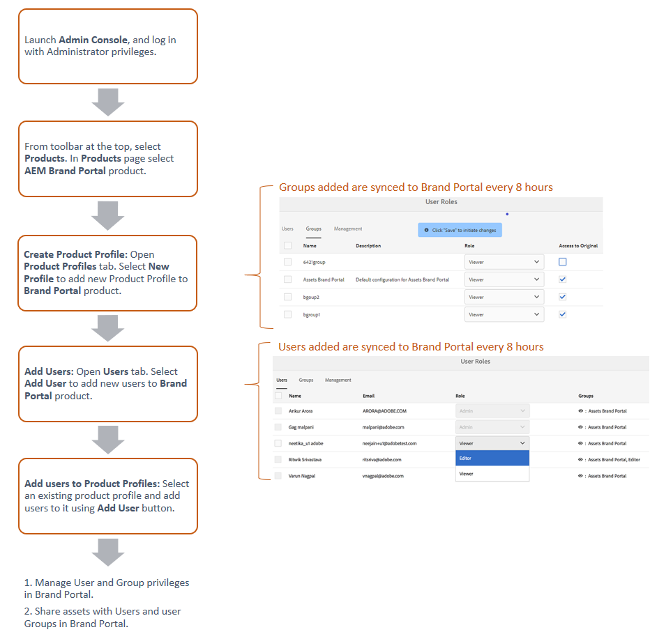

Estos perfiles de producto se sincronizan con la interfaz de usuario de Brand Portal cada 8 horas y se ven como grupos en Brand Portal. Una vez que haya agregado usuarios, creado perfiles de productos y agregado usuarios a esos perfiles de productos, puede asignar funciones a usuarios y grupos en Brand Portal.

>[!NOTE]
>
>Para crear grupos en Brand Portal, desde Adobe [!UICONTROL Admin Console], utilice **[!UICONTROL Productos > Perfiles]** de productos, en lugar de Página de **[!UICONTROL usuario > Grupos]** de usuarios. Los perfiles de producto de Adobe [!UICONTROL Admin Console] se utilizan para crear grupos en Brand Portal.

## Añadir un usuario {#add-a-user}

Si es administrador de productos, utilice Adobe [[!UICONTROL Admin Console]](http://adminconsole.adobe.com/enterprise/overview) para crear usuarios y asignarlos a perfiles de productos (*anteriormente conocidos como configuraciones* de productos), que se muestran como grupos en Brand Portal. Puede utilizar grupos para realizar operaciones masivas, como la administración de funciones y el uso compartido de recursos.

>[!NOTE]
>
>Los usuarios nuevos que no tengan acceso a Brand Portal pueden solicitar acceso desde la pantalla de inicio de sesión de Brand Portal. Para obtener más información, consulte [Solicitar acceso a Brand Portal](../using/brand-portal.md#request-access-to-brand-portal). Después de recibir las notificaciones de solicitud de acceso en el área de notificación, haga clic en la notificación correspondiente y, a continuación, haga clic en **[!UICONTROL Conceder acceso]**. También puede seguir el vínculo del correo electrónico de solicitud de acceso recibido. A continuación, para agregar un usuario a través de [Adobe [!UICONTROL Admin Console]](http://adminconsole.adobe.com/enterprise/overview), siga los pasos 4 a 7 del procedimiento que se describe a continuación.

>[!NOTE]
>
>Puede iniciar sesión en [Adobe [!UICONTROL Admin Console]](http://adminconsole.adobe.com/enterprise/overview) directamente o desde Brand Portal. Si inicia sesión directamente, siga los pasos 4 a 7 del siguiente procedimiento para agregar un usuario.

1. En la barra de herramientas de AEM de la parte superior, haga clic en el logotipo de Adobe para acceder a las herramientas administrativas.

   

1. En el panel Herramientas administrativas, haga clic en **[!UICONTROL Usuarios]**.

   

1. En la página Funciones  de usuario, haga clic en la ficha **[!UICONTROL Administración]** y, a continuación, haga clic en **[!UICONTROL Iniciar Admin Console]**.

   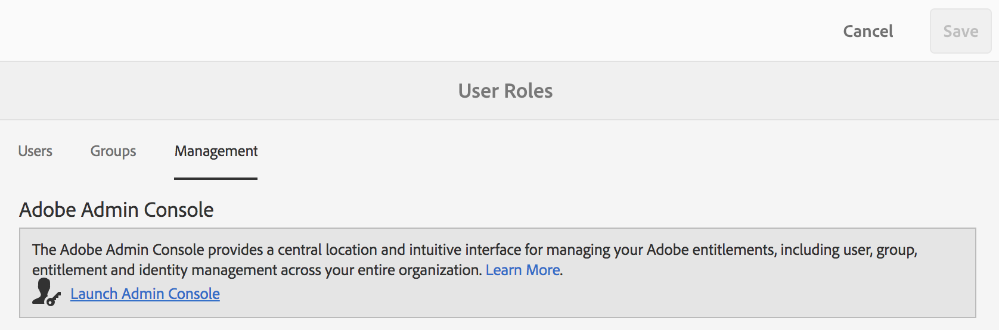

1. En Admin Console, realice una de las siguientes acciones para crear un nuevo usuario:

   * En la barra de herramientas de la parte superior, haga clic en **[!UICONTROL Información general]**. En la página [!UICONTROL Información general] , haga clic en **[!UICONTROL Asignar usuarios]** en la tarjeta de producto de Brand Portal.

   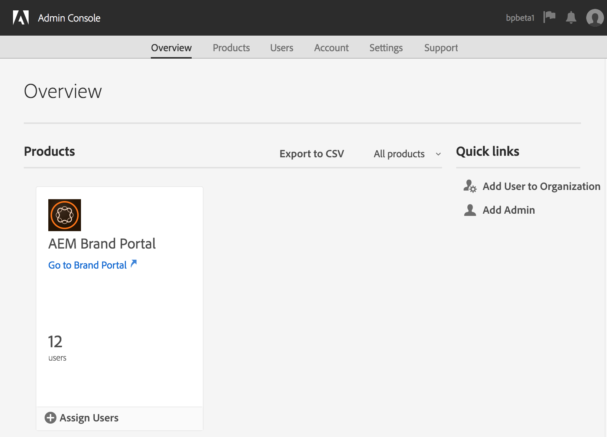

   * En la barra de herramientas de la parte superior, haga clic en **[!UICONTROL Usuarios]**. En la página [!UICONTROL Usuarios] , [!UICONTROL Usuarios] en el carril izquierdo está seleccionado de forma predeterminada. Haga clic en **[!UICONTROL Añadir usuario]**.

   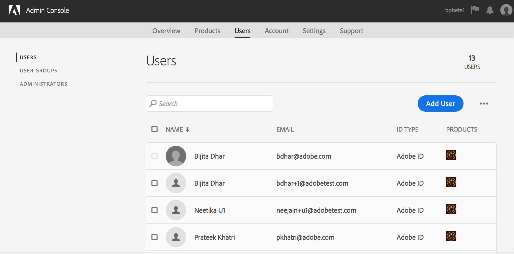

1. En el cuadro de diálogo Agregar usuario, escriba el ID de correo electrónico del usuario que desea agregar o seleccione el usuario en la lista de sugerencias que aparecen a medida que escribe.

   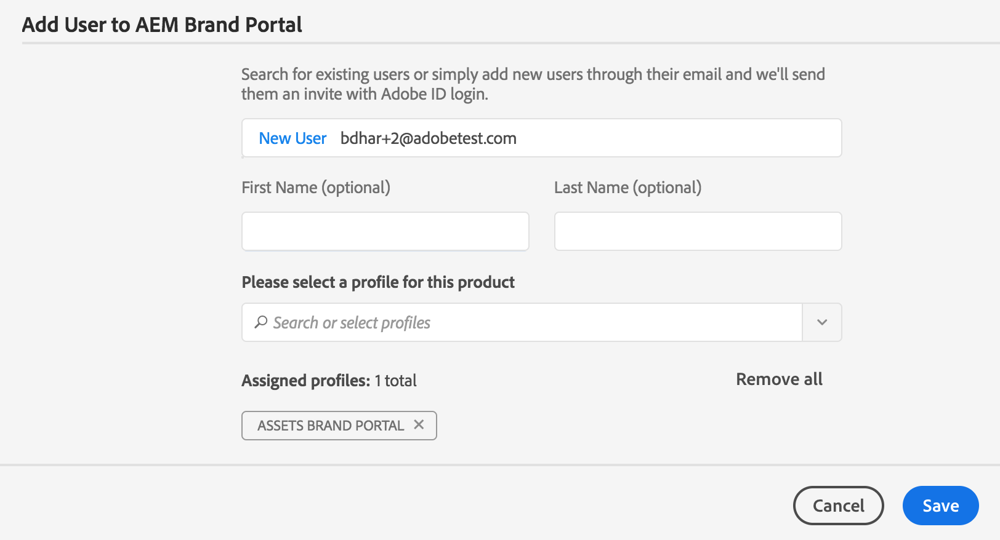

1. Asigne al usuario al menos un perfil de productos (anteriormente conocido como configuraciones de productos) para que el usuario pueda acceder a Brand Portal. Seleccione el perfil de producto apropiado en el campo **[!UICONTROL Seleccione un perfil para este producto]** .
1. Haga clic en **[!UICONTROL Guardar.]** Se envía un mensaje de correo electrónico de bienvenida al usuario que ha agregado. El usuario invitado puede acceder a Brand Portal haciendo clic en el vínculo del correo electrónico de bienvenida e iniciando sesión con un [!UICONTROL Adobe ID]. Para obtener más información, consulte Experiencia de inicio de sesión por primera vez.

   >[!NOTE]
   >
   >Si un usuario no puede iniciar sesión en Brand Portal, el administrador de la organización debe visitar Adobe [!UICONTROL Admin Console] y comprobar si el usuario está presente y se ha agregado al menos a un perfil de productos.

   Para obtener información sobre la concesión de privilegios administrativos al usuario, consulte [Proporcionar privilegios de administrador a los usuarios](../using/brand-portal-adding-users.md#provideadministratorprivilegestousers).

## Añadir un perfil de producto {#add-a-product-profile}

Los perfiles de producto (anteriormente conocidos como configuraciones de producto) en [!UICONTROL Admin Console] se utilizan para crear grupos en Brand Portal para que pueda realizar operaciones masivas como la administración de funciones y el uso compartido de recursos en Brand Portal. **Brand Portal** es el perfil de productos predeterminado disponible; puede crear más perfiles de productos y agregar usuarios a los nuevos perfiles de productos.

>[!NOTE]
>
>Puede iniciar sesión en [[!UICONTROL Admin Console]](http://adminconsole.adobe.com/enterprise/overview) directamente o desde Brand Portal. Si inicia sesión en [!UICONTROL Admin Console] directamente, siga los pasos 4 a 7 del procedimiento que se describe a continuación para agregar un perfil de producto.

1. En la barra de herramientas de AEM de la parte superior, haga clic en el logotipo de Adobe para acceder a las herramientas administrativas.

   

1. En el panel Herramientas administrativas, haga clic en **[!UICONTROL Usuarios]**.

   

1. En la página Funciones  de usuario, haga clic en la ficha **[!UICONTROL Administración]** y, a continuación, haga clic en **[!UICONTROL Iniciar Admin Console]**.

   

1. En la barra de herramientas de la parte superior, haga clic en **[!UICONTROL Productos]**.
1. En la página [!UICONTROL Productos] , los Perfiles [!UICONTROL de producto] están seleccionados de forma predeterminada. Haga clic en **[!UICONTROL Nuevo Perfil]**.

   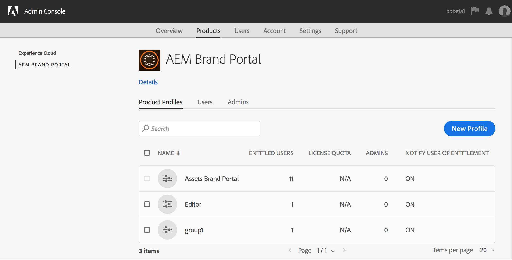

1. En la página [!UICONTROL Crear un nuevo Perfil] , proporcione el nombre del perfil, el nombre para mostrar, la descripción del perfil y elija si desea notificar a los usuarios por correo electrónico cuando se agreguen o eliminen del perfil.

   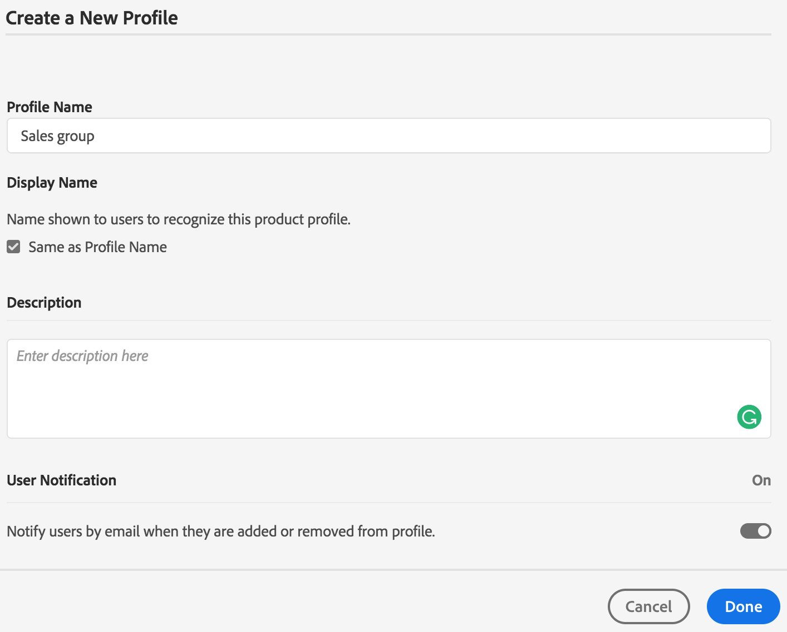

1. Haga clic en **[!UICONTROL Finalizado]**. El grupo de configuración de productos, por ejemplo el grupo **** Ventas, se agrega a Brand Portal.

   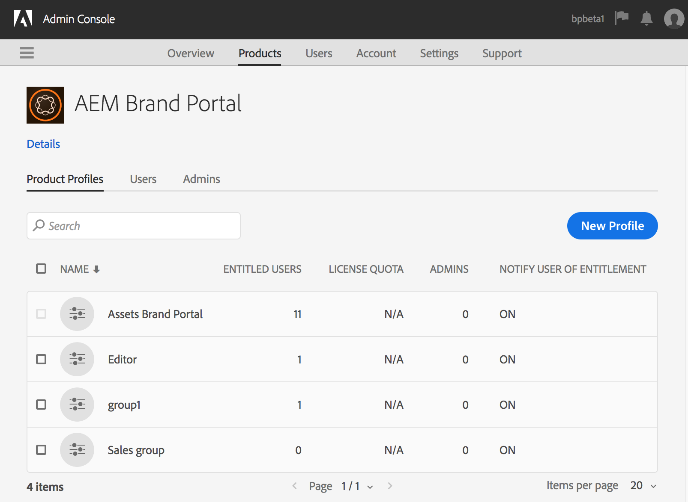

## Añadir usuarios a un perfil de producto {#add-users-to-a-product-profile}

Para agregar usuarios a un grupo de Brand Portal, agréguelos al perfil de productos correspondiente (anteriormente conocido como configuraciones de productos) en [!UICONTROL Admin Console]. Puede agregar usuarios de forma individual o masiva.

>[!NOTE]
>
>Puede iniciar sesión en [[!UICONTROL Admin Console]](http://adminconsole.adobe.com/enterprise/overview) directamente o desde Brand Portal. Si inicia sesión en Admin Console directamente, siga los pasos 4 a 7 del procedimiento que se describe a continuación para agregar usuarios a un perfil de productos.

1. En la barra de herramientas de AEM de la parte superior, haga clic en el logotipo de Adobe para acceder a las herramientas administrativas.

   

1. En el panel Herramientas administrativas, haga clic en **[!UICONTROL Usuarios]**.

   

1. En la página Funciones  de usuario, haga clic en la ficha **[!UICONTROL Administración]** y, a continuación, haga clic en **[!UICONTROL Iniciar Admin Console]**.

   ![Iniciar [!DNL Admin Console]](assets/launch_admin_console.png)

1. En la barra de herramientas de la parte superior, haga clic en **[!UICONTROL Productos]**.
1. En la página [!UICONTROL Productos] , los Perfiles [!UICONTROL de producto] están seleccionados de forma predeterminada. Abra el perfil del producto al que desee agregar un usuario, por ejemplo, el grupo Ventas.

   

1. Para agregar usuarios individuales al perfil del producto, haga lo siguiente:

   * Haga clic en **[!UICONTROL Añadir usuario]**.

   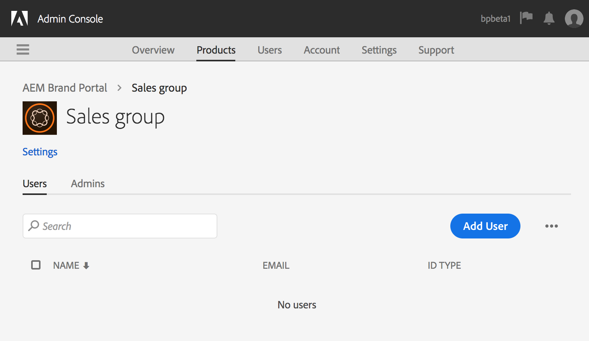

   * En la página  Añadir usuario a ventas, escriba el ID de correo electrónico del usuario que desea agregar o seleccione el usuario en la lista de sugerencias que aparecen a medida que escribe.

   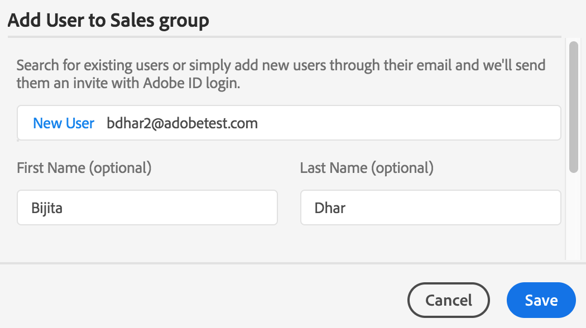

   * Haga clic en **[!UICONTROL Guardar]**.

1. Para agregar usuarios masivos al perfil del producto, haga lo siguiente:

   * Elija **[!UICONTROL puntos suspensivos (...) > Añadir usuarios por CSV]**.

   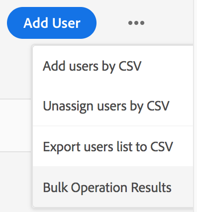

   * En la página **[!UICONTROL Añadir usuarios por CSV]** , descargue una plantilla CSV o arrastre y suelte un archivo CSV.

   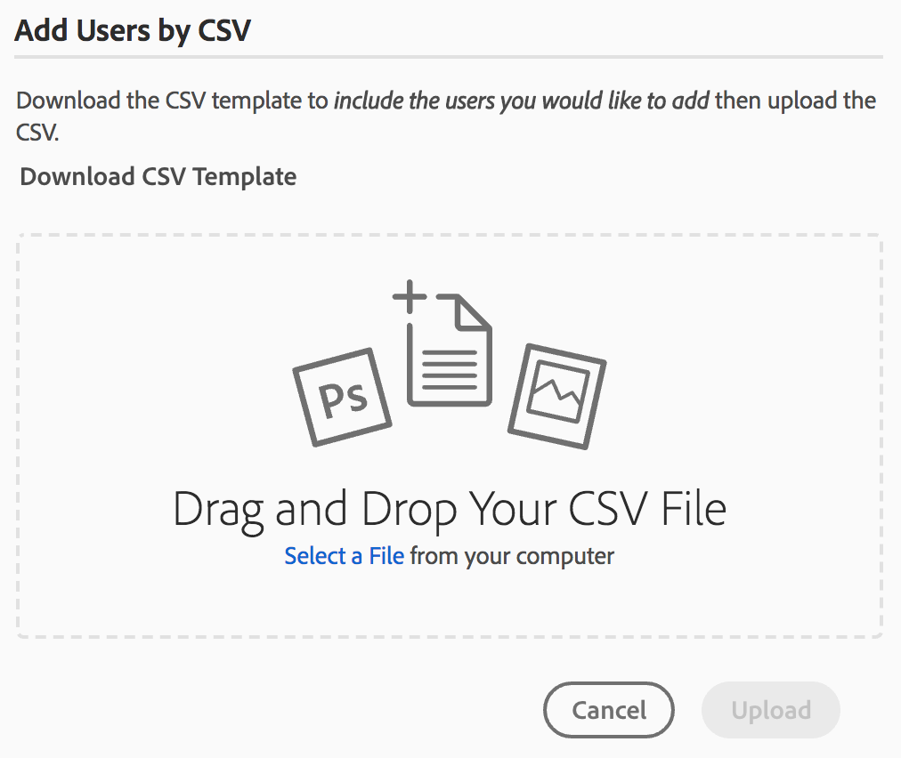

   * Click **[!UICONTROL Upload]**.
   Si ha agregado usuarios al perfil de productos predeterminado, es decir, a Brand Portal, se enviará un mensaje de correo electrónico de bienvenida al ID de correo electrónico de los usuarios agregados. Los usuarios invitados pueden acceder a Brand Portal haciendo clic en el vínculo del correo electrónico de bienvenida e iniciando sesión con un [!UICONTROL Adobe ID]. Para obtener más información, consulte Experiencia de inicio de sesión por primera vez.

   Los usuarios agregados a un perfil de producto nuevo o personalizado no reciben notificaciones por correo electrónico.

## Proporcionar privilegios de administrador a los usuarios {#provide-administrator-privileges-to-users}

Puede proporcionar el privilegio de administrador del sistema o administrador del producto a un usuario de Brand Portal. No proporcione otros derechos administrativos disponibles en [!UICONTROL Admin Console], como administrador de perfiles de productos, administrador de grupos de usuarios y administrador de asistencia. Para obtener más información sobre estas funciones, consulte Funciones [administrativas](https://helpx.adobe.com/enterprise/using/admin-roles.html).

>[!NOTE]
>
>Puede iniciar sesión en [[!UICONTROL Admin Console]](https://adminconsole.adobe.com/enterprise/overview) directamente o desde Brand Portal. Si inicia sesión en [!UICONTROL Admin Console] directamente, siga los pasos 4 a 8 del procedimiento que se describe a continuación para agregar un usuario a un perfil de productos.

1. En la barra de herramientas de AEM de la parte superior, haga clic en el logotipo de Adobe para acceder a las herramientas administrativas.

   

1. En el panel Herramientas administrativas, haga clic en **[!UICONTROL Usuarios]**.

   

1. En la página Funciones  de usuario, haga clic en la ficha **[!UICONTROL Administración]** y, a continuación, haga clic en **[!UICONTROL Iniciar Admin Console]**.

   

1. En la barra de herramientas de la parte superior, haga clic en **[!UICONTROL Usuarios]**.
1. En la página [!UICONTROL Usuarios] , [!UICONTROL Usuarios] en el carril izquierdo está seleccionado de forma predeterminada. Haga clic en el nombre de usuario del usuario al que desea otorgar privilegios de administrador.

   

1. En la página perfil del usuario, busque la sección Derechos **** administrativos en la parte inferior y elija **[!UICONTROL puntos suspensivos (...) > Editar derechos]**de administración.
   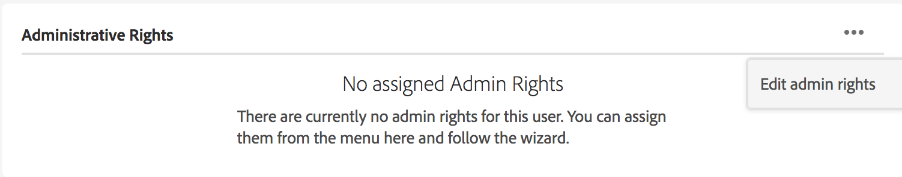

1. En la página [!UICONTROL Editar administrador] , seleccione Administrador del sistema o Administrador del producto.

   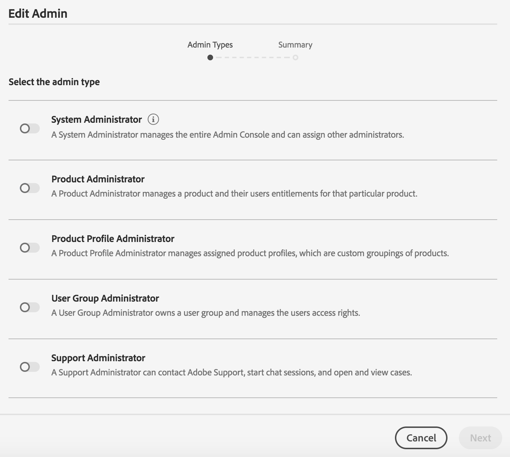

   >[!NOTE]
   >
   >Brand Portal solo admite las funciones de administrador del sistema y administrador del producto.
   >
   >
   >Adobe recomienda evitar el uso de la función de administrador del sistema, ya que otorga privilegios de administrador para toda la organización para todos los productos de una organización. Por ejemplo, un administrador del sistema de una organización que incluye tres productos de Marketing Cloud tiene el conjunto completo de privilegios para los tres productos. Solo un administrador del sistema puede configurar AEM Assets para que los recursos se puedan publicar de AEM Assets a Brand Portal. For more information, see [Configure AEM Assets with Brand Portal](../using/configure-aem-assets-with-brand-portal.md).
   >
   >Por el contrario, la función Administrador de productos otorga privilegios de administrador para un producto específico. Si desea aplicar un control de acceso más granular en Brand Portal, utilice la función de administrador de productos y seleccione el producto como Brand Portal.

   >[!NOTE]
   >
   >Brand Portal no admite privilegios de administrador de perfil de productos (anteriormente conocido como administrador de configuración). Evite asignar derechos de administrador de perfil de productos a un usuario.

1. Revise la selección de tipo de administrador y haga clic en **[!UICONTROL Guardar]**.

   >[!NOTE]
   >
   >Para revocar los privilegios de administrador para un usuario, realice los cambios correspondientes en la página **[!UICONTROL Editar administrador]** y, a continuación, haga clic en **[!UICONTROL Guardar]**.

## Administrar funciones de usuario {#manage-user-roles}

Un administrador puede modificar las funciones de los usuarios en Brand Portal.

Además de la función de administrador, Brand Portal admite las siguientes funciones:

* [!UICONTROL Visor]: Los usuarios con esta función pueden vista los archivos y las carpetas que un administrador comparte con ellos. Los visores también pueden buscar y descargar recursos. Sin embargo, los visores no pueden compartir contenido (archivos, carpetas, [!UICONTROL colecciones]) con otros usuarios.
* [!UICONTROL Editor]: Los usuarios con esta función tienen todos los privilegios de un visor. Además, los editores pueden compartir contenido (carpetas, [!UICONTROL colecciones]y vínculos) con otros usuarios.

1. En la barra de herramientas de AEM de la parte superior, haga clic en el logotipo de Adobe para acceder a las herramientas administrativas.

   

1. En el panel Herramientas administrativas, haga clic en **[!UICONTROL Usuarios]**.

   

1. En la página Funciones  de usuario, la ficha [!UICONTROL Usuarios] está seleccionada de forma predeterminada. Para el usuario cuya función desea cambiar, seleccione **[!UICONTROL Editor]** o **[!UICONTROL Visor]** en la lista desplegable **[!UICONTROL Función]** .

   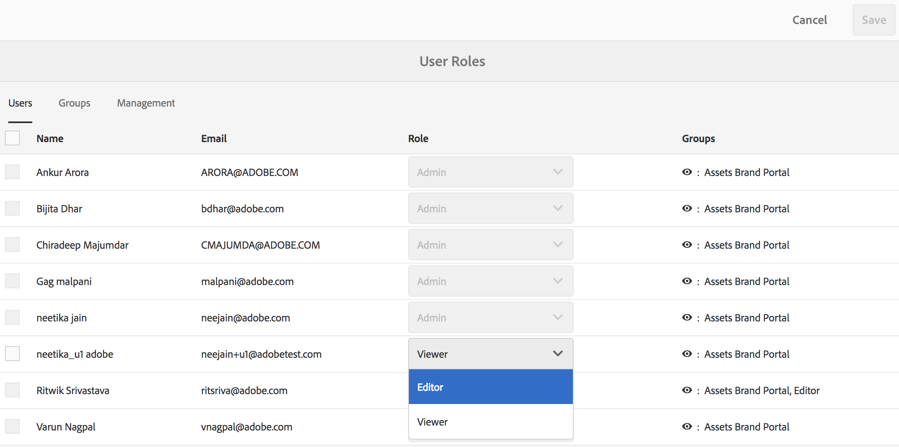

   Para modificar la función de varios usuarios simultáneamente, seleccione los usuarios y elija la función adecuada en la lista desplegable **[!UICONTROL Función]** .

   >[!NOTE]
   >
   >La lista de [!UICONTROL rol] para usuarios administradores está deshabilitada. No puede seleccionar estos usuarios para modificar sus funciones.

   >[!NOTE]
   >
   >La función de usuario también se desactiva si el usuario es miembro del grupo Editor. Para revocar los privilegios de edición del usuario, elimine el usuario del grupo Editor o cambie la función de todo el grupo a Visor.

1. Haga clic en **[!UICONTROL Guardar.]** La función se modifica para el usuario correspondiente. Si ha seleccionado varios usuarios, las funciones de todos los usuarios se modifican simultáneamente.

   >[!NOTE]
   >
   >Los cambios en los permisos de usuario solo se reflejan en la página Funciones **[!UICONTROL de]** usuario después de que los usuarios vuelvan a iniciar sesión en Brand Portal.

## Administrar funciones y privilegios de grupo {#manage-group-roles-and-privileges}

Un administrador puede asociar privilegios específicos a un [grupo](../using/brand-portal-adding-users.md#main-pars-title-278567577) de usuarios en Brand Portal. La ficha **[!UICONTROL Grupos]** de la página Funciones **[!UICONTROL de]** usuario permite a los administradores:

* Asignación de funciones a grupos de usuarios
* Restringir grupos de usuarios para descargar representaciones originales de archivos de imagen (.jpeg, .tiff, .png, .bmp, .gif, .pjpeg, x-portable-anymap, x-portable-bitmap, x-portable-graymap, x-portable-pixmap, x-rgb, x-xbitmap, x-xpixmap, x-icon, image/photoshop, image/x photoshop, .psd, image/vnd.adobe.photoshop) de Brand Portal.

>[!NOTE]
>
>Para los recursos compartidos como vínculo, el permiso para acceder a las representaciones originales de los archivos de imagen se aplicará en función de los permisos del usuario que comparte los recursos.

Para modificar la función y el derecho a acceder a las representaciones originales de miembros de grupo específicos, siga estos pasos:

1. En la página Funciones **** de usuario, vaya a la ficha **[!UICONTROL Grupos]** .
1. Seleccione los grupos para los que desee cambiar las funciones.
1. Seleccione la función adecuada en la lista desplegable **[!UICONTROL Función]** .

   Para permitir que los miembros de un grupo tengan acceso a las representaciones originales de archivos de imagen (.jpeg, .tiff, .png, .bmp, .gif, .pjpeg, x-portable-anymap, x-portable-bitmap, x-portable-graymap, x-portable-pixmap, x-portable-pixmap, x-rgb, x-xbitmap, x-xpixmap, x-icon, photoshop image/x-photoshop, .psd, image/vnd.adobe.photoshop) que descargan desde el portal o el vínculo compartido, mantenga seleccionada la opción **[!UICONTROL Acceso al original]** para ese grupo. De forma predeterminada, la opción **[!UICONTROL Acceso al original]** está seleccionada para todos los usuarios. Para evitar que un grupo de usuarios tenga acceso a las representaciones originales, anule la selección de la opción correspondiente a ese grupo.

   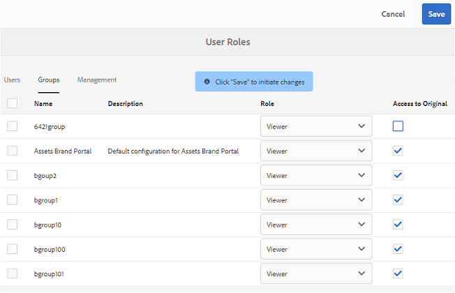

   >[!NOTE]
   >
   >Si se agrega un usuario a varios grupos y uno de ellos tiene restricciones, las restricciones se aplicarán a ese usuario.
   >
   >
   >Además, las restricciones para acceder a las representaciones originales de los archivos de imagen no se aplican a los administradores aunque sean miembros de grupos restringidos.

1. Haga clic en **[!UICONTROL Guardar.]** La función se modifica para los grupos correspondientes.

   >[!NOTE]
   >
   >La asociación de usuario a grupo, o la pertenencia a grupo de un usuario, se sincroniza con Brand Portal cada 8 horas. Los cambios en las funciones de usuario o grupo se aplican después de ejecutar el siguiente trabajo de sincronización.

