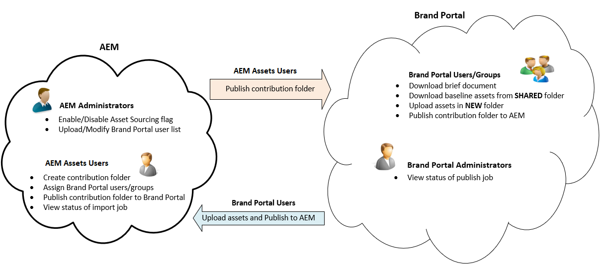

# Información general sobre el origen de recursos {#overview-asset-sourcing-in-bp}

**La fuente** de recursos permite a los usuarios de AEM (administradores/usuarios no administradores) crear nuevas carpetas con una propiedad de contribución **de** recursos adicional, lo que garantiza que la nueva carpeta creada esté abierta al envío de recursos por parte de los usuarios de Brand Portal. Esto desencadena automáticamente un flujo de trabajo que crea dos subcarpetas adicionales, llamadas **COMPARTIDO** y **NUEVO**, dentro de la carpeta **Contribución** recién creada. A continuación, el administrador de AEM define el requisito cargando un resumen sobre los tipos de recursos que deben agregarse a la carpeta de contribución, así como un conjunto de recursos de línea de base, a la carpeta **COMPARTIDO** para garantizar que los usuarios de BP tengan la información de referencia que necesitan. A continuación, el administrador puede otorgar a los usuarios activos de Brand Portal acceso a la carpeta de contribución antes de publicar la carpeta de **contribución** recién creada en Brand Portal. Una vez que el usuario haya terminado de añadir contenido en la carpeta **NEW** , podrá volver a publicar la carpeta de contribución en el entorno de creación de AEM. Tenga en cuenta que la importación puede tardar unos minutos en completarse y reflejar el contenido recién publicado en Recursos AEM.

Además, todas las funcionalidades existentes permanecen sin cambios. Los usuarios de Brand Portal pueden realizar vistas, búsquedas y descargas de recursos desde la carpeta de contribución, así como desde las demás carpetas permitidas. Además, los administradores pueden compartir la carpeta de contribución, modificar las propiedades y añadir recursos a las colecciones.

>[!VIDEO](https://video.tv.adobe.com/v/29365/?quality=12)

>[!NOTE]
>
>La fuente de recursos en Brand Portal es compatible con AEM 6.5.2.0 y versiones posteriores.
>
>La función no es compatible con las versiones anteriores: AEM 6.3 y AEM 6.4.
>
>Póngase en contacto con el servicio de asistencia técnica de Adobe para actualizar su instancia de AEM a la última versión compatible de AEM.

>[!NOTE]
>
>Si es un usuario de AEM 6.5.4, la función de fuentes de recursos seguirá funcionando con la &quot;integración heredada de OAuth&quot;.
>
>Sin embargo, los usuarios de Brand Portal no pueden publicar recursos de carpetas de contribución en Recursos AEM al actualizar a Adobe I/O en AEM 6.5.4.
>
>Este problema se solucionará en el próximo Service Pack AEM 6.5.5.
>
>Para una corrección inmediata en AEM 6.5.4, se recomienda [descargar la revisión](https://www.adobeaemcloud.com/content/marketplace/marketplaceProxy.html?packagePath=/content/companies/public/adobe/packages/cq650/hotfix/cq-6.5.0-hotfix-33041) e instalarla en la instancia de creación.

## Requisitos previos {#prerequisites}

* AEM 6.5.0.2 o posterior.
* Asegúrese de que la instancia de Recursos AEM esté configurada con Brand Portal. Consulte [Configuración de AEM Assets con Brand Portal](../using/configure-aem-assets-with-brand-portal.md).

## Consulte también {#reference-articles}

**Para administradores**

* [Configuración de fuentes de recursos en AEM](brand-portal-configure-asset-sourcing.md)
* [Cargar lista de usuarios de Brand Portal](brand-portal-configure-asset-sourcing.md)
* [Configurar carpeta de contribución](brand-portal-contribution-folder.md)
* [Carga de recursos de línea de base en la carpeta de contribución](brand-portal-upload-baseline-assets.md)
* [Publicar carpeta de contribución en Brand Portal](brand-portal-publish-contribution-folder-to-brand-portal.md)

**Para usuarios de Brand Portal**

* [Descargar requisitos de recursos](brand-portal-download-asset-requirements.md)
* [Carga de recursos nuevos en la carpeta de contribución](brand-portal-upload-assets-to-contribution-folder.md)
* [Publicación de la carpeta de contribución en Recursos AEM](brand-portal-publish-contribution-folder-to-aem-assets.md)
