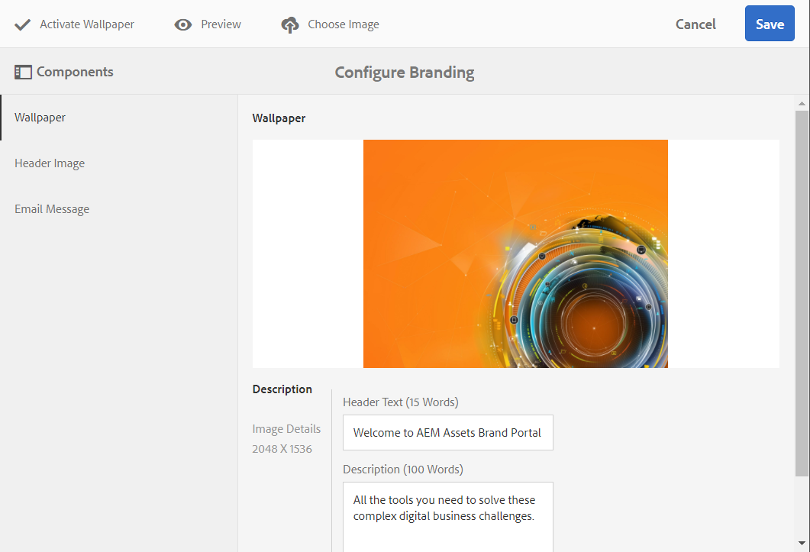

# Personalización del papel tapiz, el encabezado y los mensajes de correo electrónico {#customize-wallpaper-header-and-email-message}

Los administradores de Brand Portal pueden realizar personalizaciones limitadas en la interfaz que se muestra a los usuarios. Puede elegir una imagen de fondo específica (papel tapiz) para la página de inicio de sesión de Brand Portal. También puede añadir una imagen de encabezado y personalizar los correos electrónicos de uso compartido de recursos para que coincidan con la marca del cliente.

## Personalizar el fondo de pantalla de inicio de sesión {#customize-the-login-screen-wallpaper}

Si no hay una imagen de fondo personalizada, se muestra un fondo predeterminado en la página de inicio de sesión.

1. En la barra de herramientas de la parte superior, haga clic en el logotipo del Experience Manager para acceder a las herramientas administrativas.

   

1. En el panel de herramientas administrativas, haga clic en **[!UICONTROL Marca]**.

   

1. En el carril izquierdo del **[!UICONTROL Configurar la marca]** página, **[!UICONTROL Papel pintado]** está seleccionado de forma predeterminada. Se muestra la imagen de fondo predeterminada que aparece en la página de inicio de sesión.

   

1. Para añadir una nueva imagen de fondo, haga clic en **[!UICONTROL Elegir imagen]** en la barra de herramientas de la parte superior.

   

   Realice una de las siguientes acciones:

   * Para cargar una imagen desde el equipo, haga clic en **[!UICONTROL Cargar]**. Navegue hasta la imagen requerida y cárguela.
   * Para utilizar una imagen de Brand Portal existente, haga clic en **[!UICONTROL Seleccionar entre los elementos existentes]**. Seleccione una imagen con el selector de recursos.

   

1. Especifique un texto de encabezado y una descripción para la imagen de fondo. Para guardar los cambios, haga clic en **[!UICONTROL Guardar]** en la barra de herramientas de la parte superior.

1. En la barra de herramientas de la parte superior, haga clic en **[!UICONTROL Previsualizar]** para generar una previsualización de la interfaz de Brand Portal con la imagen.

   

   

1. Para activar o desactivar el fondo de pantalla predeterminado, haga lo siguiente en la **[!UICONTROL Configurar marca > Papel pintado]** página:

   * Para mostrar la imagen de fondo de pantalla predeterminada en la página de inicio de sesión de Brand Portal, haga clic en **[!UICONTROL Desactivar papel tapiz]** en la barra de herramientas de la parte superior. Un mensaje confirma que la imagen personalizada está desactivada.

   

   * Para restaurar la imagen personalizada en la página de inicio de sesión de Brand Portal, haga clic en **[!UICONTROL Activar papel tapiz]** en la barra de herramientas. Un mensaje confirma que la imagen se ha restaurado.

   

   * Clic **[!UICONTROL Guardar]** para guardar los cambios.

## Personalización del encabezado {#customize-the-header}

El encabezado aparece en varias páginas de Brand Portal después de iniciar sesión en Brand Portal.

1. En la barra de herramientas de la parte superior, haga clic en el logotipo del Experience Manager para acceder a las herramientas administrativas.

   

1. En el panel de herramientas administrativas, haga clic en **[!UICONTROL Marca]**.

   

1. Para personalizar el encabezado de página de la interfaz de Brand Portal, en la **[!UICONTROL Configurar la marca]** página, seleccione **[!UICONTROL Imagen de encabezado]** desde el carril izquierdo. Se muestra la imagen de encabezado predeterminada.

   

1. Para cargar una imagen de encabezado, haga clic en **[!UICONTROL Elegir imagen]** y elija **[!UICONTROL Cargar]**.

   Para utilizar una imagen de Brand Portal existente, elija **[!UICONTROL Seleccionar entre los elementos existentes]**.

   

   Seleccione una imagen con el selector de recursos.

   

1. Para incluir una dirección URL en la imagen de encabezado, especifíquela en la **[!UICONTROL URL de imagen]** cuadro. Puede especificar direcciones URL externas o internas. Los vínculos internos también pueden ser vínculos relativos, por ejemplo,
   [!UICONTROL `/mediaportal.html/content/dam/mac/tenant_id/tags`].
Este vínculo dirige a los usuarios a la carpeta de etiquetas.
Para guardar los cambios, haga clic en **[!UICONTROL Guardar]** en la barra de herramientas de la parte superior.

   

1. En la barra de herramientas de la parte superior, haga clic en **[!UICONTROL Previsualizar]** para generar una previsualización de la interfaz de Brand Portal con la imagen del encabezado.

   
   

1. Para activar o desactivar la imagen de encabezado, haga lo siguiente en la **[!UICONTROL Configurar marca > Imagen de encabezado]** página:

   * Para evitar que una imagen de encabezado aparezca en páginas de Brand Portal, haga clic en **[!UICONTROL Desactivar encabezado]** en la barra de herramientas de la parte superior. Un mensaje confirma que la imagen está desactivada.

   

   * Para que la imagen del encabezado vuelva a aparecer en las páginas de Brand Portal, haga clic en **[!UICONTROL Activar encabezado]** en la barra de herramientas de la parte superior. Un mensaje confirma que la imagen está activada.

   

   * Clic **[!UICONTROL Guardar]** para guardar los cambios.

## Personalizar la mensajería de correo electrónico {#customize-the-email-messaging}

Cuando los recursos se comparten como un vínculo, los usuarios reciben un correo electrónico con el vínculo. Los administradores pueden personalizar la mensajería, es decir, el logotipo, la descripción y el pie de página de estos correos electrónicos.

1. En la barra de herramientas de la parte superior, haga clic en el logotipo del Experience Manager para acceder a las herramientas administrativas.

   

1. En el panel de herramientas administrativas, haga clic en **[!UICONTROL Marca]**.

   

1. Cuando los recursos se comparten como vínculos o se descargan a través de correos electrónicos y cuándo  **[!UICONTROL colecciones]** se comparten, las notificaciones por correo electrónico se envían a los usuarios. Para personalizar el mensaje de correo electrónico, en **[!UICONTROL Configurar la marca]** página, seleccione **[!UICONTROL Mensaje de correo electrónico]** desde el carril izquierdo.

   

1. Para añadir un logotipo a los correos electrónicos salientes, haga clic en **[!UICONTROL Cargar]** en la barra de herramientas de la parte superior.

1. En el **[!UICONTROL Descripción]** , especifique el texto del encabezado y pie de página del correo electrónico. Para guardar los cambios, haga clic en **[!UICONTROL Guardar]** en la barra de herramientas de la parte superior.

   >[!NOTE]
   >
   >Si no utiliza el tamaño recomendado para el logotipo, o si el texto del encabezado y del pie de página supera el recuento de palabras recomendado, el contenido del mensaje de correo electrónico puede parecer confuso.
