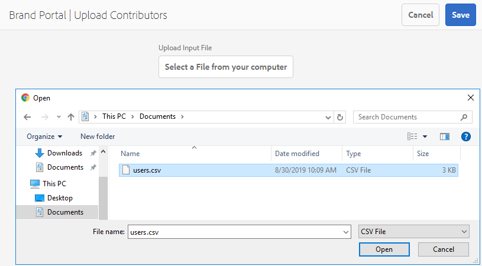

# Configurar el origen de recursos {#configure-asset-sourcing}

Los administradores de AEM pueden configurar **Asset Sourcing** desde la instancia de creación de AEM. El administrador activa la configuración del indicador de característica de fuentes de recursos desde la configuración **de la consola web de** AEM y carga la lista activa de usuarios de Brand Portal en Recursos **AEM**.

>[!NOTE]
>
>Antes de comenzar con la configuración, asegúrese de que la instancia de Recursos AEM está configurada con Brand Portal. See, [Configure AEM Assets with Brand Portal](../using/configure-aem-assets-with-brand-portal.md).

En el siguiente vídeo se muestra cómo configurar la fuente de recursos en la instancia de creación de AEM:

>[!VIDEO](https://video.tv.adobe.com/v/29771)

## Habilitar el origen de recursos {#enable-asset-sourcing}

Los administradores de AEM pueden activar la fuente de recursos desde la configuración de la consola web de AEM (también denominada Administrador de configuración).

**Para habilitar la fuente de recursos:**
1. Inicie sesión en la instancia de creación de AEM y abra Configuration ManagerURL predeterminada: http:// localhost:4502/system/console/configMgr
1. Buscar con la palabra clave **Recurso de origen** para localizar la configuración de la marca de la característica **[!UICONTROL de origen de recursos]**
1. Haga clic en Configuración **[!UICONTROL del indicador de característica de origen de]** recursos para abrir la ventana de configuración
1. Activar la casilla de verificación **[!UICONTROL feature.flag.active.status]**
1. Haga clic en **[!UICONTROL Guardar]**.

## Cargar lista de usuarios de Brand Portal {#upload-bp-user-list}

Los administradores de AEM pueden cargar el archivo de configuración de usuario de Brand Portal (.csv) que contiene la lista de usuario activa de Brand Portal en Recursos AEM. Una carpeta de contribución solo se puede compartir con los usuarios activos de Brand Portal definidos en la lista de usuario. El administrador también puede agregar usuarios nuevos en el archivo de configuración y cargar la lista de usuario modificada.

>[!NOTE]
>
>El formato del archivo CSV es el mismo que el que admite la Consola de administración para la importación masiva de usuarios. El correo electrónico, el nombre y los apellidos son obligatorios.

El administrador puede agregar usuarios nuevos en la Consola de administración de AEM. Consulte [Administrar usuarios](brand-portal-adding-users.md) para obtener información detallada. Después de agregar usuarios en Admin Console, estos usuarios se pueden agregar al archivo de configuración de usuario de Brand Portal y, a continuación, se les puede asignar permiso para acceder a la carpeta de contribución.

**Para cargar la lista de usuarios de Brand Portal:**
1. Inicie sesión en la instancia de creación de AEMURL predeterminada: http:// localhost:4502/aem/start.html
1. En el panel **Herramientas**  , vaya a **[!UICONTROL Recursos > Usuarios de Brand Portal]**
   
1. Se abre la ventana Contribuyentes de carga de Brand Portal.
Navegue desde el equipo local y cargue el archivo **de** configuración (.csv) que contiene la lista activa de usuarios de Brand Portal.
1. Haga clic en **[!UICONTROL Guardar]**.
   

Los administradores pueden proporcionar acceso a usuarios o grupos específicos desde esta lista de usuario mientras configuran la carpeta de contribución.

Para obtener más información, consulte [Configurar carpeta](brand-portal-contribution-folder.md)de contribución.
