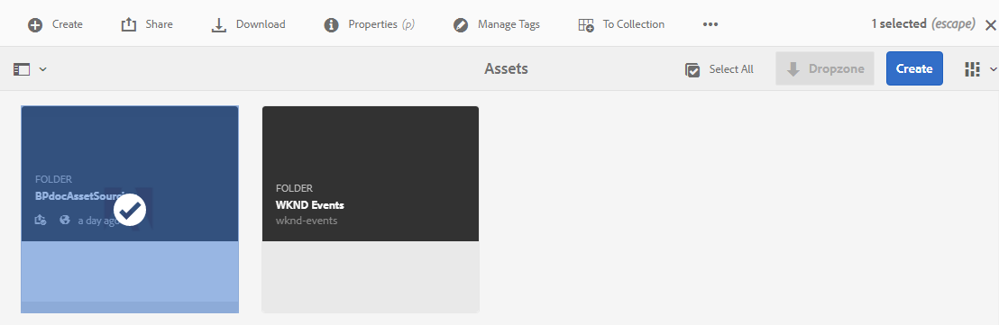
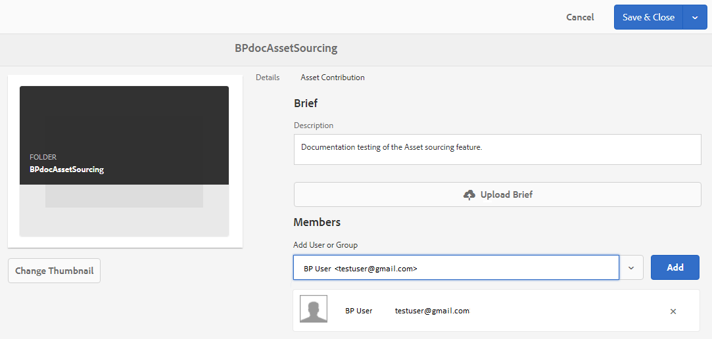

# Configuración de las propiedades de la carpeta de contribución {#configure-contribution-folder-properties}

AEM administrador realiza las siguientes actividades al configurar las propiedades de una carpeta de contribución.

* **Añadir descripción**: Proporcione una descripción de alto nivel de la carpeta de contribución.
* **Cargar resumen**:  Cargar documento de requisitos de recursos que contiene información relacionada con los recursos.
* **Añadir colaboradores**: Añada a los usuarios de Brand Portal para que les concedan acceso a la carpeta de contribución.

El requisito de recursos se refiere a los detalles proporcionados por los administradores para ayudar a los colaboradores (usuarios de Brand Portal) a comprender la necesidad y los requisitos de la carpeta de contribución. El administrador carga un documento de requisitos de recursos que contiene información sobre el tipo de recursos que se deben agregar a la carpeta de contribución y la información relacionada con los recursos, por ejemplo, el propósito, el tipo de imágenes, el tamaño máximo, etc.

A continuación, el administrador puede otorgar a los usuarios de Brand Portal acceso a la carpeta de contribución antes de publicar la carpeta de contribución recién creada en Brand Portal.

**Para configurar las propiedades de la carpeta de contribución:**

1. Inicie sesión en la instancia de creación de AEMDirección URL predeterminada: http:// localhost:4502/aem/start.html
1. Vaya a **[!UICONTROL Recursos > Archivos]** y busque la carpeta de contribución.
1. Seleccione la carpeta de contribución y haga clic en **[!UICONTROL Propiedades]** . Se abre la ventana Propiedades de la carpeta.
   
1. Vaya a la ficha Contribución **[!UICONTROL de]** recursos.
1. Introduzca una **[!UICONTROL descripción]** de alto nivel de la carpeta de contribución.
1. Haga clic en **[!UICONTROL Cargar resumen]**  para buscar en el equipo local y cargar un Documento **de requisitos** de recursos.
1. En el campo **[!UICONTROL Añadir usuario o grupo]** , agregue usuarios de Brand Portal con los que desee compartir la carpeta de contribución. Estos usuarios pueden acceder y cargar contenido en la carpeta de contribución mediante la interfaz de Brand Portal.
1. Haga clic en **[!UICONTROL Guardar]**.

>[!NOTE]
>
>Actualmente, no se pueden agregar grupos a una carpeta de contribución.
>
>Los resultados de la búsqueda se basan en la lista de usuario de Brand Portal configurada en AEM Assets. Asegúrese de que dispone de la lista de usuario de Brand Portal actualizada. Consulte [Carga de la lista](brand-portal-configure-asset-sourcing.md)de usuario de Brand Portal.
