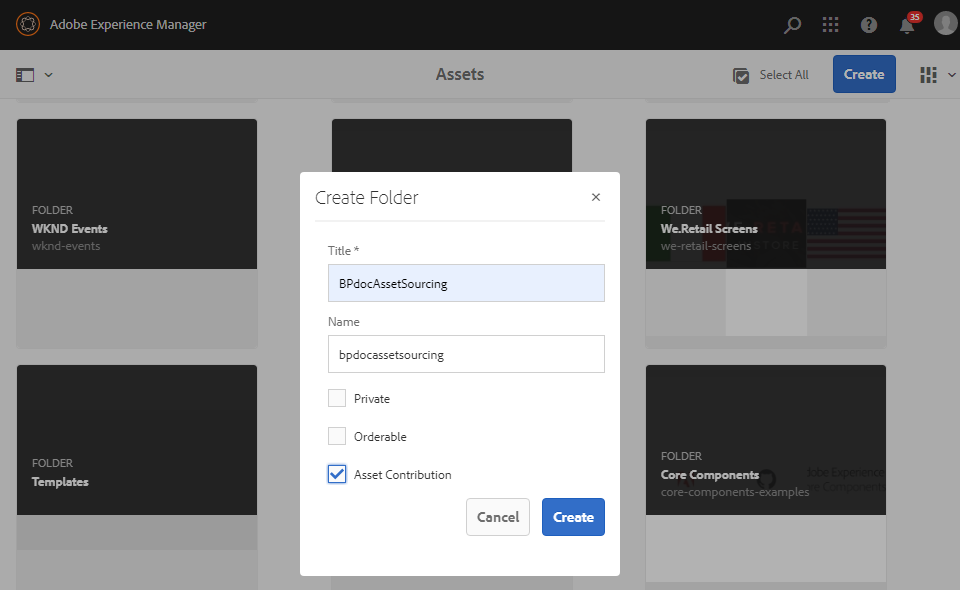
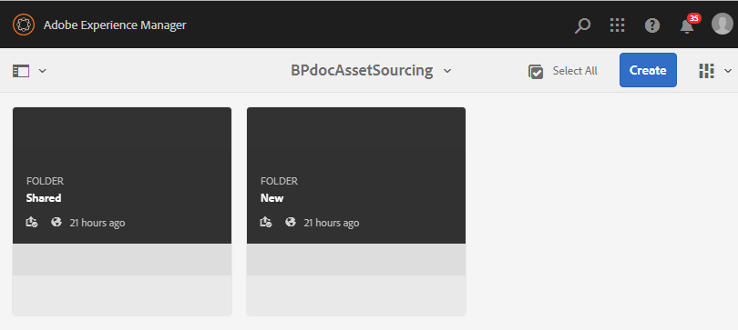

# Create contribution folder {#create-contribution-folder}

Los administradores de AEM y los usuarios no administradores que tengan permiso para crear una nueva carpeta pueden crear una carpeta de **contribución** en AEM Assets.
Para crear una carpeta de **contribución** , cree una nueva carpeta de tipo Contribución de **recursos**, asegurándose de que la nueva carpeta creada esté abierta al envío de recursos por parte de los usuarios de Brand Portal.  Esto desencadena automáticamente un flujo de trabajo que crea dos subcarpetas adicionales, llamadas **COMPARTIDO** y **NUEVO**, dentro de la carpeta **Contribución** recién creada.

**Para crear una nueva carpeta de contribución:**
1. Inicie sesión en la instancia de creación de AEMURL predeterminada: http:// localhost:4502/aem/start.html
1. Vaya a **[!UICONTROL Recursos > Archivos]** lista todas las carpetas existentes en el repositorio de AEM Assets.
1. Click **[!UICONTROL Create]** to create a new folder. Se abre la ventana emergente Crear carpeta.
1. Introduzca **[!UICONTROL Título]** y **[!UICONTROL Nombre]** de la carpeta y marque la casilla de verificación Contribución **[!UICONTROL de]**recursos.
Se recomienda utilizar alfabetos pequeños sin espacio para asignar un nombre a la carpeta.
1. Haga clic en **[!UICONTROL Crear]**.
   
1. Puede ver la carpeta de contribución recién creada en el repositorio de AEM Assets.
1. Haga clic para abrir la carpeta de contribución. Verá dos subcarpetas:**[!UICONTROL COMPARTIDO]** y **[!UICONTROL NUEVO]** , que se crean automáticamente dentro de la carpeta de contribución.\
   

Ahora puede configurar las propiedades de la carpeta Contribution. Consulte [Configuración de las propiedades](brand-portal-configure-contribution-folder-properties.md)de la carpeta Contribution.

>[!NOTE]
>
>Un usuario que no es administrador solo puede crear y compartir una carpeta de contribución. Asegúrese de proporcionar un nombre adecuado a la carpeta Contribution, ya que un usuario no administrador no puede modificar ni eliminar una carpeta de contribución después de la creación.
>
>No se admite el anidado de la carpeta Contribution. Puede crear varias carpetas de contribución dentro de una carpeta pero no crear una carpeta de contribución dentro de otra carpeta de contribución.

