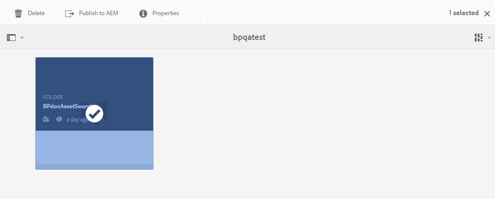
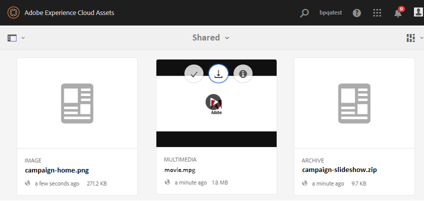

# Descargar requisitos de recursos {#using-asset-souring-in-bp}

Los usuarios de Brand Portal reciben automáticamente notificaciones por correo electrónico o por impulso cada vez que el usuario AEM comparte una carpeta de contribución, lo que les permite descargar el documento breve (requisito de recursos), así como descargar los recursos de línea de base (contenido de referencia) de la carpeta **SHARED** para asegurarse de comprender los requisitos de los recursos.

El usuario de Brand Portal realiza las siguientes actividades para descargar los requisitos de recursos:

* **Descargar resumen**: Descargue la información breve (documento de requisitos de recursos) adjunta a la carpeta de contribución que contiene información relacionada con los recursos, como el tipo de recursos, el propósito, los formatos admitidos, el tamaño máximo de los recursos, etc.
* **Descargar recursos** de línea de base: Descargue los recursos de línea de base que pueden utilizarse para comprender los tipos de recursos necesarios. Los usuarios de Brand Portal pueden utilizar estos recursos como referencia para crear nuevos recursos para contribución.

El panel de Brand Portal refleja todas las carpetas existentes permitidas al usuario de Brand Portal junto con la carpeta de contribución recientemente compartida. En este ejemplo, el usuario de Brand Portal solo tiene acceso a la carpeta de contribución recién creada; no se comparte ninguna otra carpeta con el usuario.

**Para descargar los requisitos de recursos:**

1. Inicie sesión en la instancia de Brand Portal.
1. Seleccione la carpeta de contribución en el panel de Brand Portal.
1. Haga clic en **[!UICONTROL Propiedades]** . Se abre la ventana Propiedad, que muestra los detalles de la carpeta Contribución de recursos.
   
1. Haga clic en **[!UICONTROL Descargar resumen]**  para descargar el documento de requisitos de recursos en el equipo local.
   
1. Vuelva al panel de Brand Portal.
1. Haga clic para abrir la carpeta de contribución y verá dos subcarpetas:**[!UICONTROL COMPARTIDO]** y **[!UICONTROL NUEVO]** dentro de la carpeta de contribución. La carpeta SHARED contiene todos los recursos de línea de base (contenido de referencia) compartidos por los administradores.
1. Puede descargar la carpeta **[!UICONTROL SHARED]** que contiene todos los recursos de línea de base en el equipo local.
O bien, puede abrir la carpeta **[!UICONTROL COMPARTIDO]** y hacer clic en **Descargar** icono  para descargar archivos/carpetas individuales.
   

Consulte los documentos breves (requisitos de activos) y haga referencia a los activos de línea de base para comprender los requisitos de los activos. Ahora puede crear nuevos recursos para contribución y cargarlos en la carpeta de contribución. Consulte [Carga de recursos en la carpeta de contribución](brand-portal-upload-assets-to-contribution-folder.md).

