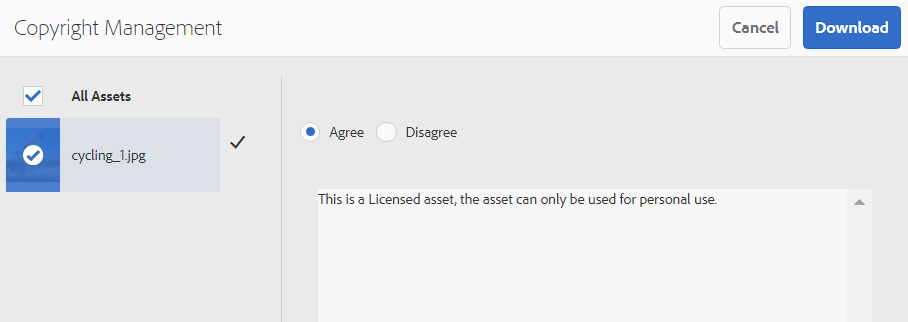
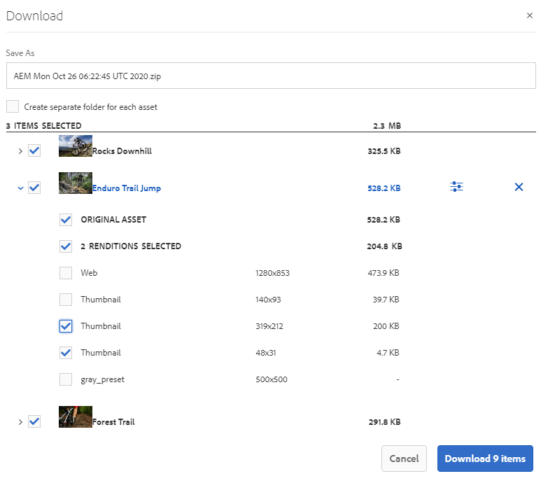
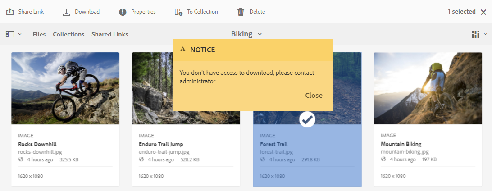
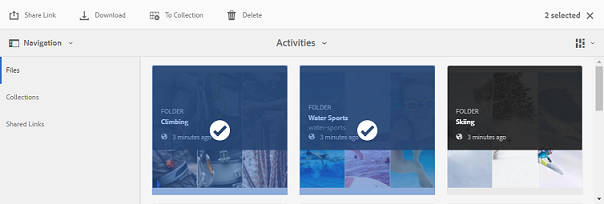
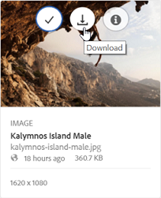
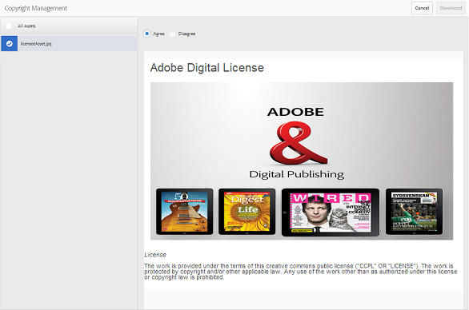
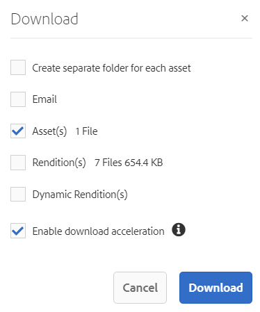
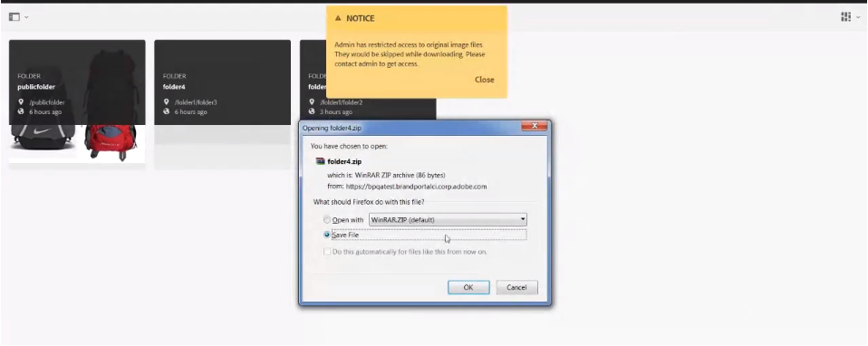
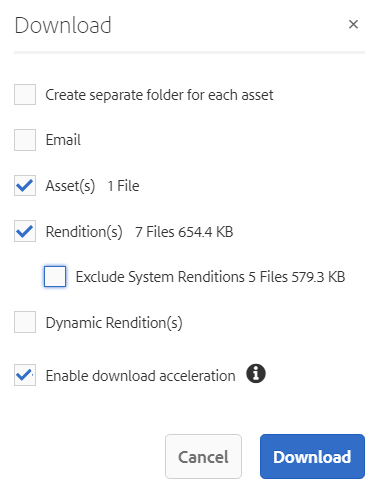
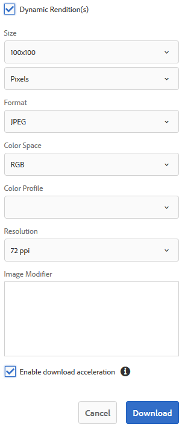

# Descargar recursos de Brand Portal {#download-assets-from-bp}

<!-- Before update in Download experience - 26th Aug 2020 comment by Vishabh.
 All users can simultaneously download multiple assets and folders accessible to them from Brand Portal. This way, approved brand assets can be securely distributed for offline use. Read on to know how to download approved assets from Brand Portal, and what to expect from the [download performance](../using/brand-portal-download-assets.md#main-pars-header).
-->

Adobe Experience Manager Assets Brand Portal mejora la experiencia de descarga al permitir a los usuarios descargar simultáneamente varios recursos y carpetas a los que pueden acceder desde Brand Portal. De este modo, los recursos de marca aprobados se pueden distribuir de forma segura para su uso sin conexión. Siga leyendo para saber cómo descargar los recursos aprobados desde Brand Portal y qué esperar del rendimiento [de la](../using/brand-portal-download-assets.md#expected-download-performance)descarga.

>[!NOTE]
>
>En Brand Portal 2020.10.0 (y versiones posteriores), el ajuste Descarga **** rápida está habilitado de forma predeterminada, que utiliza IBM Aspera Connect para la descarga acelerada de los recursos. Instale IBM Aspera Connect 3.9.9 en la extensión de su navegador antes de descargar los recursos de Brand Portal.
>
>Si no desea utilizar IBM Aspera Connect y continuar con el proceso normal de descarga, póngase en contacto con el administrador de Brand Portal para desactivar la configuración de Descarga **** rápida.

## Configuración de la descarga de recursos {#configure-download}

Los administradores de Brand Portal pueden configurar la descarga de recursos y los permisos para los usuarios de Brand Portal, lo que les permite acceder a las representaciones de recursos y descargarlas desde la interfaz de Brand Portal.

El acceso y la descarga de las representaciones desde Brand Portal se definen en las siguientes configuraciones:

* Habilitar la configuración de descarga
* Configurar permisos de descarga

### Habilitar la configuración de descarga {#enable-download-settings}

Los administradores pueden habilitar la configuración **[!UICONTROL de]** descarga de recursos para definir el conjunto de representaciones a las que pueden acceder los usuarios de Brand Portal para descargar.

Las opciones de configuración disponibles son:

* **[!UICONTROL Descarga rápida]**

   Proporciona una descarga acelerada de los recursos mediante IBM Aspera Connect. De forma predeterminada, la opción Descarga **** rápida está activada en Configuración **[!UICONTROL de]** descarga.

   Para obtener más información, consulte la [guía para acelerar las descargas desde Brand Portal](../using/accelerated-download.md).

* **[!UICONTROL Representaciones personalizadas]**

   Permite descargar representaciones personalizadas y dinámicas de los recursos.

   Todas las representaciones de recursos que no sean el recurso original y las representaciones generadas por el sistema se denominan representaciones personalizadas. Incluye tanto representaciones estáticas como dinámicas disponibles para el recurso. Cualquier usuario puede crear una representación estática personalizada en AEM Assets, mientras que solo el administrador de AEM puede crear representaciones dinámicas personalizadas. Para obtener más información, consulte [cómo aplicar ajustes preestablecidos de imagen o representaciones](../using/brand-portal-image-presets.md)dinámicas.

* **[!UICONTROL Representaciones del sistema]**

   Permite descargar representaciones de los recursos generadas por el sistema.

   Estas son las miniaturas que se generan automáticamente en AEM Assets en función del flujo de trabajo &quot;Recurso de actualización DAM&quot;.

Inicie sesión como administrador en el inquilino de Brand Portal y vaya a **[!UICONTROL Herramientas]** > **[!UICONTROL Descargar]**.

Los administradores pueden habilitar cualquier combinación de configuraciones para que los usuarios de Brand Portal accedan a las representaciones y las descarguen.

>[!NOTE]
>
>Solo los administradores pueden descargar los recursos caducados. Para obtener más información sobre los recursos caducados, consulte [Gestión de derechos digitales de los recursos](../using/manage-digital-rights-of-assets.md).

### Configurar permisos de descarga {#configure-download-permissions}

Además de la configuración **[!UICONTROL de]** descarga, los administradores de Brand Portal pueden configurar los permisos de vista para distintos grupos de usuarios y descargar los recursos originales y sus representaciones.

Inicie sesión como administrador en el inquilino de Brand Portal y vaya a **[!UICONTROL Herramientas]** > **[!UICONTROL Usuarios]**. En la página Funciones **[!UICONTROL de]** usuario, vaya a la ficha **[!UICONTROL Grupos]** para configurar la vista y (o) los permisos de descarga para los grupos de usuarios.

>[!NOTE]
>
>Si se agrega un usuario a varios grupos y uno de ellos tiene restricciones, las restricciones se aplicarán al usuario.

En función de la configuración, el flujo de trabajo de descarga permanece constante para los recursos independientes, varios recursos, carpetas que contienen recursos, recursos con licencia o sin licencia, y la descarga de recursos mediante un vínculo compartido.

La siguiente matriz define si un usuario tendría acceso a las representaciones en función de las configuraciones [de](#configure-download)descarga:

| **Configuración de descarga: Representaciones personalizadas** | **Configuración de descarga: Representaciones del sistema** | **Permisos del grupo de usuarios: Descargar original** | **Permisos del grupo de usuarios: Descargar representaciones** | **Resultado** |
|---|---|---|---|---|
| ACTIVADO | ACTIVADO | ACTIVADO | ACTIVADO | Vista y descarga de todas las representaciones |
| ACTIVADO | ACTIVADO | DESACTIVADO | DESACTIVADO | Vista del recurso original |
| DESACTIVADO | DESACTIVADO | ACTIVADO | ACTIVADO | Vista y descarga del recurso original |
| ACTIVADO | DESACTIVADO | ACTIVADO | ACTIVADO | Vista y descarga del recurso original y las representaciones personalizadas |
| DESACTIVADO | ACTIVADO | ACTIVADO | ACTIVADO | Vista y descarga de representaciones de recursos y sistemas originales |
| ACTIVADO | DESACTIVADO | DESACTIVADO | DESACTIVADO | Vista del recurso original |
| DESACTIVADO | ACTIVADO | DESACTIVADO | DESACTIVADO | Vista del recurso original |
| DESACTIVADO | DESACTIVADO | DESACTIVADO | ACTIVADO | Vista del recurso original |
| DESACTIVADO | DESACTIVADO | ACTIVADO | DESACTIVADO | Vista y descarga del recurso original |
| DESACTIVADO | DESACTIVADO | DESACTIVADO | DESACTIVADO | Vista del recurso original |

## Descargar recursos {#download-assets}

Los usuarios de Brand Portal pueden descargar varios recursos, carpetas que contengan recursos y colecciones desde la interfaz de Brand Portal.

>[!NOTE]
>
>Póngase en contacto con el administrador de Brand Portal si no tiene permisos para acceder o descargar las representaciones.

Si el usuario tiene acceso a las representaciones, se le proporcionará el cuadro de diálogo de **[!UICONTROL descarga]** mejorado con las siguientes funciones:
* Vista todas las representaciones disponibles de cualquier recurso en la lista de descarga.
* Excluya las representaciones de los recursos que no sean necesarias para la descarga.
* Aplique el mismo conjunto de representaciones a todos los tipos de recursos similares con un solo clic.
* Aplique un conjunto diferente de representaciones para distintos tipos de recursos.
* Cree una carpeta independiente para cada representación de recursos.
* Descargue los recursos seleccionados y sus representaciones.

>[!NOTE]
>
>El cuadro de diálogo **[!UICONTROL Descargar]** solo aparece si los recursos están seleccionados para la descarga y Representaciones **** personalizadas o Representaciones **[!UICONTROL del sistema está habilitado en la Configuración]** de **** descarga.

### Pasos para descargar recursos {#bulk-download}

A continuación se indican los pasos para descargar recursos o carpetas que contienen recursos de la interfaz de Brand Portal:

1. Inicie sesión en el inquilino de Brand Portal. De forma predeterminada, se abre la vista **[!UICONTROL Archivos]** , que contiene todos los recursos y carpetas publicados.

   Realice una de las acciones siguientes:

   * Seleccione los recursos o las carpetas que desee descargar. En la barra de herramientas de la parte superior, haga clic en el icono **[!UICONTROL Descargar]** .

      

   * Para descargar representaciones de recursos específicas de un recurso, pase el puntero sobre el recurso y haga clic en el icono **[!UICONTROL Descargar]** disponible en las miniaturas de acción rápida.

      

      >[!NOTE]
      >
      >Si descarga los recursos por primera vez y no tiene instalado IBM Aspera Connect en su navegador, se le pedirá que instale el acelerador de descargas de Aspera.

      >[!NOTE]
      >
      >Si los recursos que está descargando también incluyen recursos con licencia, se le redirigirá a la página Administración de **[!UICONTROL derechos de autor]** . En esta página, seleccione los recursos, haga clic en **[!UICONTROL Aceptar]** y, a continuación, haga clic en **[!UICONTROL Descargar]**. Si no está de acuerdo, los recursos con licencia no se descargan.
      > 
      >Los recursos protegidos por licencias tienen un contrato de [licencia adjunto](https://helpx.adobe.com/experience-manager/6-5/assets/using/drm.html#DigitalRightsManagementinAssets) , lo que se realiza estableciendo la propiedad [de](https://helpx.adobe.com/experience-manager/6-5/assets/using/drm.html#DigitalRightsManagementinAssets) metadatos del recurso en Recursos Experience Manager.

      

1. Se abre el cuadro de diálogo **[!UICONTROL Descargar]** con todos los recursos seleccionados.

   Haga clic en cualquier recurso para vista de las representaciones disponibles y active las casillas de verificación correspondientes a las representaciones que desee descargar.

   Puede seleccionar o excluir manualmente las representaciones de recursos individuales o hacer clic en el icono **Aplicar** para aplicar el mismo conjunto de representaciones a todos los tipos de recursos similares (todos los archivos de imagen de este ejemplo) seleccionados para la descarga. Haga clic en **[!UICONTROL Listo]** para confirmar la regla aplicada.

   

   También puede eliminar un recurso de la lista de descarga (si es necesario) haciendo clic en el icono **Eliminar** .

   

   Para conservar la jerarquía de carpetas de Brand Portal al descargar recursos, active la casilla de verificación **[!UICONTROL Crear carpeta independiente para cada recurso]** . De forma predeterminada, se ignora la jerarquía de carpetas de Brand Portal y todos los recursos se descargan en una carpeta zip.

   El botón de descarga refleja el recuento de los elementos seleccionados. Una vez que haya terminado de aplicar las reglas, haga clic en **[!UICONTROL Descargar elementos]**.

   

1. De forma predeterminada, la opción Descarga **** rápida está activada en Configuración **[!UICONTROL de]** descarga. Por lo tanto, aparece un cuadro de confirmación que permite la descarga acelerada mediante IBM Aspera Connect.

   Para continuar usando Descarga **** rápida, haga clic en **[!UICONTROL Permitir]**. Todas las representaciones seleccionadas se descargan en una carpeta zip con IBM Aspera Connect.

   Si no desea utilizar IBM Aspera Connect, haga clic en **[!UICONTROL Denegar]**. Si se deniega o falla la descarga **** rápida, el sistema rellena un mensaje de error. Haga clic en el botón Descarga **** normal para continuar descargando los recursos. Las representaciones seleccionadas se descargan en una carpeta zip sin utilizar IBM Aspera Connect.

>[!NOTE]
>
>Si el administrador desactiva la opción Descarga **** rápida, las representaciones seleccionadas se descargan directamente en una carpeta zip sin utilizar IBM Aspera Connect.

>[!NOTE]
>
>Si se seleccionan más de 20 recursos para la descarga, se omite el cuadro de diálogo **[!UICONTROL Descargar]** y todas las representaciones accesibles para el usuario, excluidas las representaciones dinámicas, se descargan directamente en una carpeta zip.
>
>Se sigue el mismo comportamiento al descargar las carpetas que contienen recursos y colecciones. Las representaciones accesibles, excluidas las representaciones dinámicas, se descargan directamente en una carpeta zip.

>[!NOTE]
>
>Brand Portal admite la configuración de Dynamic Media tanto en modo híbrido como en modo Scene7.
>
>(*Si AEM instancia de autor se está ejecutando en el modo **híbrido de medios***dinámicos)
>
>Para realizar la previsualización o descarga de representaciones dinámicas de un recurso, asegúrese de que el medio dinámico está activado y que la representación de tiff piramidal del recurso existe en la instancia de creación de AEM Assets desde donde se han publicado los recursos. Cuando se publica un recurso de AEM a Brand Portal, también se publica su representación de tiff piramidal.

Si el administrador no le [autoriza a acceder a las representaciones](../using/brand-portal-adding-users.md#main-pars-procedure-202029708)originales, las representaciones originales de los recursos seleccionados no se descargarán.

<!-- This issue has been resolved, check with engineering.
>[!NOTE]
>
>Once you have downloaded the asset renditions, the **[!UICONTROL Download]** button is disabled to avoid creating duplicate copies of the renditions. To download more (missing or another copy of renditions), refresh the browser to re-enable the download button.
-->

### Descargar recursos de la página de detalles de recursos {#download-assets-from-asset-details-page}

Además del flujo de trabajo de descarga, existe otro método para descargar las representaciones de recursos individuales directamente desde la página de detalles del recurso.

Los usuarios pueden realizar previsualizaciones de distintas representaciones, seleccionar representaciones específicas y descargarlas directamente desde el panel **[!UICONTROL Representaciones]** de la página de detalles del recurso sin tener que abrir el cuadro de diálogo **[!UICONTROL Descargar]** .

A continuación se indican los pasos para descargar representaciones de recursos desde la página de detalles de recursos:

1. Inicie sesión en el inquilino de Brand Portal y haga clic en el recurso para abrir la página de detalles del recurso.
1. Haga clic en el icono de superposición de la izquierda y, a continuación, haga clic en **[!UICONTROL Representaciones]**.

   

1. El panel **[!UICONTROL Representaciones]** lista todas las representaciones de recursos accesibles en función de las configuraciones [de](#configure-download)descarga de recursos.

   Seleccione las representaciones específicas que desee descargar y haga clic en **[!UICONTROL Descargar elementos]**.

   

1. De forma predeterminada, la opción Descarga **** rápida está activada en Configuración **[!UICONTROL de]** descarga. Por lo tanto, aparece un cuadro de confirmación que permite la descarga acelerada mediante IBM Aspera Connect.

   Para continuar usando Descarga **** rápida, haga clic en **[!UICONTROL Permitir]**. Todas las representaciones seleccionadas se descargan en una carpeta zip con IBM Aspera Connect.

   Si rechaza el uso de Descarga **** rápida, el sistema rellena un mensaje de error. Haga clic en el botón Descarga **** normal para continuar con la descarga. Las representaciones seleccionadas se descargan en una carpeta zip sin utilizar IBM Aspera Connect.

>[!NOTE]
>
>Si el administrador desactiva la opción Descarga **** rápida, las representaciones seleccionadas se descargan directamente en una carpeta zip sin utilizar IBM Aspera Connect.

>[!NOTE]
>
>Los recursos que se descargan de forma individual están visibles en el informe de descarga de recursos. Sin embargo, si se descarga una carpeta que contiene recursos, la carpeta y los recursos no se muestran en el informe de descarga de recursos.

<!--
>[!NOTE]
>
>Assets that are individually downloaded are visible in the assets download report. However, if a folder containing assets is downloaded, the folder and assets are not displayed in the assets download report.
-->

<!-- Backup of content before updating the new feature docs.
## Configure asset download {#configure-download}

The download configuration allows the Brand Portal administrators to define the set of renditions available to the Brand Portal users for downloading the assets. The administrator can configure the asset **[!UICONTROL Download]** settings from the Brand Portal interface. 

The available configurations are:

* **[!UICONTROL Fast Download]** 

  Enables high-speed download of the assets. To know more, see [guide to accelerate downloads from Brand Portal](../using/accelerated-download.md).

* **[!UICONTROL Custom Renditions]** 
  
  Download custom and (or) dynamic renditions of the assets. 
  All the asset renditions other than the original asset and system-generated renditions are called as custom renditions. It includes static as well as dynamic renditions available for the asset. Any user can create a custom static rendition in AEM Assets, whereas, only the AEM administrator can create custom dynamic renditions. To know more, see [how to apply image presets or dynamic renditions](../using/brand-portal-image-presets.md)

* **[!UICONTROL System Renditions]** 

  Download system-generated renditions of the assets. These are the thumbnails which are automatically generated in AEM Assets based on the "DAM update asset" workflow. 

Log in to your Brand Portal tenant as an administrator and navigate to **[!UICONTROL Tools]** > **[!UICONTROL Download]**. By default, the **[!UICONTROL Fast Download]** configuration is enabled in the **[!UICONTROL Download Settings]**. 

The administrators can enable any combination to configure the asset download process.

Based on the configuration, the download workflow remains constant for stand-alone assets, multiple assets, folders containing assets, licensed or unlicensed assets, and downloading assets using share link. 

* If both **[!UICONTROL Custom Renditions]** and **[!UICONTROL System Renditions]** configurations are turned-off, the original renditions of the assets are downloaded without any additional dialog being presented to the users.    

* If any of the **[!UICONTROL Custom Renditions]** or **[!UICONTROL System Renditions]** configuration is enabled, an additional **[!UICONTROL Download]** dialog box appears wherein you can choose whether to download the original asset along with its renditions, or download only specific renditions. 

>[!NOTE]
>
>Only the administrators can download the expired assets. For more information about expired assets, see [manage digital rights of assets](../using/manage-digital-rights-of-assets.md).

## Steps to download assets {#steps-to-download-assets}

Following are the steps to download assets or folders containing assets from Brand Portal:

1. From the Brand Portal interface, do one of the following:

   * Select the folders or assets you want to download. From the toolbar at the top, click the **[!UICONTROL Download]** icon.

     

   * To download a specific asset or folder, hover the pointer over the asset or folder and click the **[!UICONTROL Download]** icon available in the quick action thumbnails.

     

     >[!NOTE]
     >
     >If you are downloading the assets for the first time and do not have IBM Aspera Connect installed in your browser, it will prompt you to install the Aspera download accelerator. 

     >[!NOTE]
     >
     >If the assets you are downloading also include licensed assets, you are redirected to the **[!UICONTROL Copyright Management]** page. In this page, select the assets, click **[!UICONTROL Agree]**, and then click **[!UICONTROL Download]**. If you choose to disagree, licensed assets are not downloaded. 
     > 
     >License-protected assets have [license agreement attached](https://helpx.adobe.com/experience-manager/6-5/assets/using/drm.html#DigitalRightsManagementinAssets) to them, which is done by setting asset's [metadata property](https://helpx.adobe.com/experience-manager/6-5/assets/using/drm.html#DigitalRightsManagementinAssets) in Experience Manager Assets.

     

     
     >[!NOTE]
     >
     >Ensure to select all the required asset renditions while downloading them from the asset details page, and click **[!UICONTROL Download]**. The selected renditions are downloaded to your local machine.
     > 
     >Once you download, the **[!UICONTROL Download]** button is disabled to avoid creating duplicate copies of the downloaded renditions. To download more (missing or another copy of renditions), refresh the browser to re-enable the download button.

     If any of the **[!UICONTROL Custom Renditions]** or **[!UICONTROL System Renditions]** configuration is enabled in the **[!UICONTROL Download Settings]**, the **[!UICONTROL Download]** dialog appears with the **[!UICONTROL Asset(s)]** check box selected by default. If the **[!UICONTROL Fast Download]** configuration is enabled, the **[!UICONTROL Enable download acceleration]** check box is selected by default.

     

     >[!NOTE]
     >
     >If the downloading assets are image files, and you select only the **[!UICONTROL Asset(s)]** check box in the **[!UICONTROL Download]** dialog but are not [authorized by the administrator to have access to the original renditions of image files](../using/brand-portal-adding-users.md#main-pars-procedure-202029708) then no image files are downloaded and a notification appears, stating that you have been restricted by the administrator to access original renditions.

     

1. To download the renditions in addition to the original assets, select the **[!UICONTROL Rendition(s)]** check box. However, if you want to download the system-generated renditions along with the custom renditions, clear the **[!UICONTROL Exclude System Renditions]** check box.

   

   * To download only the renditions, clear the **[!UICONTROL Asset(s)]** check box.

     >[!NOTE]
     >
     >By default, only the assets are downloaded. However, original renditions of image files are not downloaded if you are not [authorized by the administrator to have access to the original renditions of image files](../using/brand-portal-adding-users.md#main-pars-procedure-202029708).

    * To share the selected assets with other users through a link, select the **[!UICONTROL Email]** check box. An email notification is sent to the users with the download link. To know how to download assets from shared links, see [downloading assets from shared links](../using/brand-portal-link-share.md#main-pars-header-1703469193).  

      

      >[!NOTE]
      >
      >The download link on email notification expires after 45 days.
      >
      >The administrators can customize email messages, that is, logo, description, and footer, using the [Branding](../using/brand-portal-branding.md) feature.

    * You can select a predefined image preset or create a custom dynamic rendition from the **[!UICONTROL Download]** dialog box. 

      To apply a [custom image preset to the asset and its renditions](../using/brand-portal-image-presets.md#applyimagepresetswhendownloadingimages), select the **[!UICONTROL Dynamic Rendition(s)]** check box. Specify the image preset properties (such as size, format, color space, resolution, and image modifier) to apply the custom image preset while downloading the asset and its renditions. To download only the dynamic renditions, clear the **[!UICONTROL Asset(s)]** check box.

      

      >[!NOTE]
      >
      >Brand Portal supports configuring Dynamic Media in both - Hybird and Scene 7 mode. 
      >
      >(*If AEM author instance is running on **Dynamic Media Hybrid mode***)
      >
      >To preview or download dynamic renditions of an asset, ensure that the dynamic media is enabled and the asset's Pyramid tiff rendition exists at the AEM Assets author instance from where the assets have been published. When an asset is published to Brand Portal, its Pyramid tiff rendition is also published.
      
  
    * To preserve the Brand Portal folder hierarchy while downloading assets, select the **[!UICONTROL Create separate folder for each asset]** check box. By default, the Brand Portal folder hierarchy is ignored and all the assets are downloaded in one folder in your local system.

1. Click **[!UICONTROL Download]**.

   The assets (and renditions if selected) are downloaded as a zip file to your local folder. However, no zip file is created if a single asset is downloaded without any of the renditions. 

   If you are not [authorized by the administrator to have access to the original renditions](../using/brand-portal-adding-users.md#main-pars-procedure-202029708), the original renditions of the selected assets are not downloaded. 

   >[!NOTE]
   >
   >Assets that are individually downloaded are visible in the assets download report. However, if a folder containing assets is downloaded, the folder and assets are not displayed in the assets download report.
-->

## Rendimiento de descarga esperado {#expected-download-performance}

La experiencia de descarga de archivos puede variar para los usuarios en diferentes ubicaciones de clientes, según factores como la conectividad local a Internet y la latencia del servidor. El rendimiento de descarga esperado para archivos de 2 GB observado en diferentes ubicaciones de cliente es el siguiente, con el servidor Brand Portal en Oregon, Estados Unidos:

| Ubicación del cliente | Latencia entre cliente y servidor | Velocidad de descarga esperada | Tiempo necesario para descargar un archivo de 2 GB |
|-------------------------|-----------------------------------|-------------------------|------------------------------------|
| Zona occidental de Estados Unidos (Norte de California) | 18 milisegundos | 7,68 MB/s | 4 minutos |
| Zona occidental de EE. UU. (Oregón) | 42 milisegundos | 3,84 MB/s | 9 minutos |
| Zona oriental de EE. UU. (Norte de Virginia ) | 85 milisegundos | 1,61 MB/s | 21 minutos |
| APAC (Tokio) | 124 milisegundos | 1,13 MB/s | 30 minutos |
| Adobe | 275 milisegundos | 0,5 MB/s | 68 minutos |
| Sídney | 175 milisegundos | 0,49 MB/s | 69 minutos |
| Londres | 179 milisegundos | 0,32 MB/s | 106 minutos |
| Singapur | 196 milisegundos | 0,5 MB/s | 68 minutos |

>[!NOTE]
>
>Los datos citados se observan en condiciones de prueba, que pueden variar para los usuarios en distintas ubicaciones que presencian latencia y ancho de banda variados.

