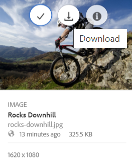

# Descarga de recursos {#download-assets-from-bp}

Adobe Experience Manager Assets Brand portal mejora la experiencia de descargar al permitir a los usuarios descargar simultáneamente activos y las carpetas a las que acceden con Brand portal. De este modo, los marca aprobados activos se pueden distribuir de forma segura para sin conexión uso. Siga leyendo para saber cómo descargar activos (aprobado activos) desde Brand portal y lo que debe esperar del rendimiento ](#expected-download-performance) de [ Descargar.

>[!NOTE]
>
>En Brand portal 2020.10.0 (y versiones posteriores), la configuración de **[!UICONTROL descarga]** rápida está habilitada de forma predeterminada, que utiliza IBM aspera Connect para obtener una descargar acelerada del activos. Instale IBM aspera Connect 3.9.9 ( `https://www.ibm.com/docs/en/aspera-connect/3.9.9` ) en la extensión de su explorador antes de descargar el activos en Brand portal. Para obtener más información, consulte [ Guía para acelerar las descargas de Brand portal ](../using/accelerated-download.md) .
>
>Si no desea utilizar IBM aspera Connect y continuar con el proceso normal de descargar, póngase en contacto con el administrador de Brand portal para desactivar la **[!UICONTROL configuración de descarga]** rápida.

## Configurar la descarga de recursos {#configure-download}

Los administradores de Brand Portal pueden configurar las opciones de descarga de recursos y grupo de usuarios para los usuarios de Brand Portal, lo que les permite acceder y descargar representaciones de recursos desde la interfaz de Brand Portal.

>[!NOTE]
>
>La configuración de descarga aplicada en la interfaz de usuario facilita una experiencia de autoservicio a los usuarios de Brand Portal para configurar y descargar fácilmente representaciones de recursos. No restringe la descarga de recursos en la capa de aplicación; por ejemplo, los usuarios pueden seguir accediendo y descargando representaciones de recursos con la ruta de URL completa.

El acceso y la descarga de las representaciones de recurso desde la interfaz de Brand portal se define mediante las siguientes configuraciones:

* Habilitar configuración de descargar
* Configurar grupos de usuarios

### Habilitar configuración de descarga {#enable-download-settings}

Los administradores pueden habilitar el recurso **[!UICONTROL Configuración de descarga]** para definir el conjunto de representaciones accesibles para los usuarios de Brand Portal para su descarga.

Los ajustes disponibles son:

* **[!UICONTROL Descarga rápida]**

   Proporciona una descarga acelerada de los recursos mediante IBM Aspera Connect. De forma predeterminada, la variable **[!UICONTROL Descarga rápida]** La configuración de está habilitada en **[!UICONTROL Configuración de descarga]**.

* **[!UICONTROL Representaciones personalizadas]**

   Permite descargar representaciones dinámicas y personalizadas (o) de la activos.

   Todas las recurso generaciones que no sean las recurso originales y las representaciones generadas por el sistema se denominan representaciones personalizadas. Incluye las representaciones estáticas y dinámicas disponibles para el recurso. Cualquier usuario puede crear una representación estática personalizada en Experience Manager Assets, mientras que solo el administrador puede crear representaciones dinámicas personalizadas. Para obtener más información, consulte [ Cómo aplicar ajustes preestablecidos de imagen o representaciones ](../using/brand-portal-image-presets.md) dinámicas.

* **[!UICONTROL Representaciones del sistema]**

   Permite descargar representaciones generadas por el sistema de los recursos.

   Estas son las miniaturas que se generan automáticamente en Experience Manager Assets en función del flujo de trabajo &quot;Recurso de actualización DAM&quot;.

* **[!UICONTROL Descarga de recurso]**

   Permite descargar las representaciones en una carpeta independiente para cada recurso. La configuración se aplica a carpetas, colecciones y descargas masivas de recursos (más de 20 recursos).

Inicie sesión en su inquilino de Brand portal como administrador y vaya a Herramientas ]**descarga]** de **[!UICONTROL >**[!UICONTROL  .

Los administradores pueden habilitar cualquier combinación de ajustes para que los usuarios de Brand portal accedan y descargarn recurso rendiciones.

>[!NOTE]
>
>Solo los administradores pueden descargar el activos caducado. Para obtener más información sobre los activos caducados, consulte [ administrar derechos digitales de activos ](../using/manage-digital-rights-of-assets.md) .

### Configurar opciones de grupo de usuarios {#configure-user-group-settings}

Además de la **[!UICONTROL configuración]** de descarga, los administradores de Brand portal pueden configurar las opciones de los distintos grupo de usuarios para vista y (o) descargar los activos originales y las representaciones.

Inicie sesión en su inquilino de Brand portal como administrador y vaya a **[!UICONTROL herramientas]** usuarios ]**de >**[!UICONTROL  . En el **[!UICONTROL Página funciones]** de usuario, vaya a la **[!UICONTROL pestaña grupos]** para configurar la vista y (o) Descargar configuración para los grupos de usuario.

>[!NOTE]
>
>Si se agrega un usuario a varios grupos y uno de esos grupos tiene restricciones, las restricciones se aplicarán a la usuario.

En base a la configuración, la descargar flujo de trabajo permanece constante para activos independientes, varios activos, carpetas que contengan activos, licenciado o sin licencia, y descargar activos con el uso compartido activos.

La siguiente matriz define si una usuario tendría acceso a las representaciones según las [ configuraciones ](#configure-download) de descargar:

| **Descargar Configuración: representaciones personalizadas** | **Configuración de descarga: representaciones del sistema** | **Configuración de grupo de usuarios: descargar original** | **Configuración de grupo de usuarios: descargar representaciones** | **Resultado** |
|---|---|---|---|---|
| ACTIVADO | ACTIVADO | ACTIVADO | ACTIVADO | Ver y descargar todas las representaciones |
| ACTIVADO | ACTIVADO | DESACTIVADO | DESACTIVADO | Ver recurso original |
| DESACTIVADO | DESACTIVADO | ACTIVADO | ACTIVADO | Ver y descargar el recurso original |
| ACTIVADO | DESACTIVADO | ACTIVADO | ACTIVADO | Ver y descargar recurso originales y representaciones personalizadas |
| DESACTIVADO | ACTIVADO | ACTIVADO | ACTIVADO | Ver y descargar representaciones originales de recursos y sistemas |
| ACTIVADO | DESACTIVADO | DESACTIVADO | DESACTIVADO | Ver recurso original |
| DESACTIVADO | ACTIVADO | DESACTIVADO | DESACTIVADO | Ver recurso original |
| DESACTIVADO | DESACTIVADO | DESACTIVADO | ACTIVADO | Ver recurso original |
| DESACTIVADO | DESACTIVADO | ACTIVADO | DESACTIVADO | Ver y descargar recurso original |
| DESACTIVADO | DESACTIVADO | DESACTIVADO | DESACTIVADO | Ver recurso original |

## Descarga de recursos {#download-assets}

Los usuarios de Brand Portal pueden descargar varios recursos, carpetas que contengan recursos y colecciones desde la interfaz de Brand Portal.

>[!NOTE]
>
>Póngase en contacto con el administrador de Brand portal si no tiene permiso para acceder o descargar las representaciones de recurso.

Si el usuario tiene acceso a las representaciones, el usuario se proporciona con el cuadro de diálogo de descarga ]**mejorado**[!UICONTROL  con las siguientes capacidades:

* Ver todas las representaciones disponibles de cualquier recurso en la lista descargar.
* Excluya las representaciones de la activos que no son necesarias para descargar.
* Aplique el mismo conjunto de representaciones a todos los tipos de recursos similares con un solo clic.
* Aplique un conjunto diferente de representaciones para diferentes tipos de recursos.
* Cree una carpeta independiente para cada recurso.
* Descargar los recursos seleccionados y sus representaciones.

>[!NOTE]
>
>El cuadro de diálogo de **[!UICONTROL descarga]** aparece únicamente si **[!UICONTROL las representaciones]** personalizadas y **[!UICONTROL las representaciones]** del sistema están activadas en la **[!UICONTROL configuración]** de descarga.

### Pasos para descargar activos {#bulk-download}

A continuación se detallan los pasos para descargar activos o carpetas que contengan activos de la interfaz de Brand Portal:

1. Inicie sesión en su inquilino de Brand portal. De forma predeterminada, se abre la **[!UICONTROL Archivos]** vista que contiene todos los activos y carpetas publicados.

   Realice una de las siguientes acciones:

   * Seleccione las activos o carpetas que desee descargar. En la barra de herramientas de la parte superior, haga clic en el **[!UICONTROL icono Descargar]** .

      

   * Para descargar representaciones de recurso específicas de una recurso, pase el ratón por encima de la recurso y haga clic en el **[!UICONTROL icono de descarga]** disponible en las miniaturas de accione rápida.

      

      >[!NOTE]
      >
      >Si está descargando el activos por primera vez y no tiene instalado IBM aspera Connect en su explorador, le pedirá que instale el acelerador de descargar de Aspera ( `https://www.ibm.com/docs/en/aspera-connect/3.9.9` ).

      >[!NOTE]
      >
      >Si la activos que está descargando también incluye activos con licencia, se le redirige a la Página de **[!UICONTROL Administración]** de derechos de autor. En este Página, seleccione el activos, haga clic en **[!UICONTROL Aceptar]** y, a continuación, haga clic en **[!UICONTROL Descargar]** . Si elige no estar en desacuerdo, no se descargarán activos con licencia.
      > 
      >Los recursos protegidos por licencias tienen [contrato de licencia adjunto](https://experienceleague.adobe.com/docs/experience-manager-65/assets/administer/drm.html) a ellos, lo que se hace estableciendo el [propiedad de metadatos](https://experienceleague.adobe.com/docs/experience-manager-65/assets/administer/drm.html) en Experience Manager Assets.

      

1. El **[!UICONTROL Descargar]** se abre un cuadro de diálogo con todos los recursos seleccionados.

   Haga clic en cualquier recurso para vista las representaciones disponibles y seleccione las casillas de verificación correspondientes a las representaciones que desee descargar.

   Puede seleccionar o excluir manualmente las representaciones de activos individuales o hacer clic en el icono Aplicar **para seleccionar el** mismo conjunto de representaciones descargar para tipos de recurso similares (todos los archivos de imagen en este ejemplo). En el **[!UICONTROL cuadro de diálogo aplicar todos]** , haga clic en **[!UICONTROL listo]** para aplicar la regla a todas las activos similares.

   

   También puede eliminar una recurso de la lista descargar (si es necesario) haciendo clic en el **icono quitar** .

   

   Para conservar la jerarquía de carpetas de Brand Portal al descargar recursos, seleccione la **[!UICONTROL Crear una carpeta independiente para cada recurso]** casilla de verificación.

   El botón de descarga refleja el recuento de los elementos seleccionados. Cuando haya terminado de aplicar las reglas, haga clic en **[!UICONTROL Descargar elementos]**.

   

1. De forma predeterminada, la **[!UICONTROL configuración de descarga]** rápida está habilitada en la **[!UICONTROL configuración]** de descarga. Por lo tanto, aparece un cuadro de confirmación que permite la descargar acelerada utilizando IBM aspera Connect.

   Para continuar con **[!UICONTROL la descarga]** rápida, haga clic en **[!UICONTROL permitir]** . Todas las representaciones seleccionadas se descargan en una carpeta zip con IBM Aspera Connect.

   Si no desea utilizar IBM Aspera Connect, haga clic en **[!UICONTROL Denegar]**. If **[!UICONTROL Descarga rápida]** se deniegue o falle, el sistema rellenará un mensaje de error. Haga clic en **[!UICONTROL Descarga normal]** para seguir descargando los recursos.

<!-- removed the known issue from step 2 as it is fixed in 2022.02.0 release.
   >[!CAUTION]
   >
   >(**Experience Manager Assets as a Cloud Service** only) The following known issue will be fixed in the upcoming release:
   >
   >The download dialog lists the smart crop renditions of the selected asset, however, the user cannot download the smart crop renditions.
-->

>[!NOTE]
>
>Si la variable **[!UICONTROL Descarga rápida]** Si el administrador desactiva la configuración, las representaciones seleccionadas se descargan directamente en una carpeta zip sin utilizar IBM Aspera Connect.

>[!NOTE]
>
>Si la variable **[!UICONTROL Descarga de recursos]** La configuración de está habilitada en **[!UICONTROL Configuración de descarga]**, las representaciones de recursos se descargan en una carpeta independiente para cada recurso dentro de la carpeta zip.
>  
>Si los recursos se descargan desde un vínculo compartido, las representaciones de recursos se descargan en una carpeta independiente para cada recurso dentro de la carpeta zip.
>
>Si se selecciona una carpeta, una colección o más de 20 recursos para la descarga, la variable **[!UICONTROL Descargar]** se omite el cuadro de diálogo y todas las representaciones de recursos accesibles para el usuario, excluidas las representaciones dinámicas, se descargan en una carpeta zip.

>[!NOTE]
>
>Brand Portal admite la configuración de Dynamic Media en modo híbrido y en modo Scene7.
>
>( *Si Experience Manager assets author instancia se está ejecutando en **Dynamic media modo*** híbrido)
>
>Para previsualización o descargar representaciones dinámicas de un recurso, asegúrese de que la medios dinámicos esté habilitada y el recurso de TIFF piramidal de representación se encuentre en la Experience Manager assets autor instancia desde la que se han publicado los activos. Cuando se publica un recurso de Experience Manager Assets en Brand portal, también se publica su representación piramidal TIFF.

Si no [ está autorizado por el administrador para tener acceso a las representaciones ](../using/brand-portal-adding-users.md#main-pars-procedure-202029708) originales, no se descargan las representaciones originales de las activos seleccionadas.

<!-- This issue has been resolved, check with engineering.
>[!NOTE]
>
>Once you have downloaded the asset renditions, the **[!UICONTROL Download]** button is disabled to avoid creating duplicate copies of the renditions. To download more (missing or another copy of renditions), refresh the browser to re-enable the download button.
-->

### Descargar recursos desde la página de detalles del recurso {#download-assets-from-asset-details-page}

Además del flujo de trabajo de descarga, existe otro método para descargar las representaciones de recursos individuales directamente desde la página de detalles del recurso.

Los usuarios pueden obtener una vista previa de las distintas representaciones de recursos, seleccionar representaciones específicas y descargar directamente representaciones de recursos desde el **[!UICONTROL Representaciones]** en la página de detalles del recurso sin tener que abrir el panel **[!UICONTROL Descargar]** diálogo.

A continuación se indican los pasos para descargar representaciones de recursos desde la página de detalles de recursos:

1. Inicie sesión en el inquilino de Brand Portal y haga clic en el recurso para abrir la página de detalles del recurso.
1. Haga clic en el icono de superposición de la izquierda y, a continuación, haga clic en **[!UICONTROL Representaciones]**.

   

1. El **[!UICONTROL Representaciones]** el panel enumera todas las representaciones de recursos accesibles en función del recurso [descargar configuraciones](#configure-download).

   Seleccione las representaciones específicas que desea descargar y haga clic en **[!UICONTROL Descargar elementos]**.

   

1. De forma predeterminada, la variable **[!UICONTROL Descarga rápida]** La configuración de está habilitada en **[!UICONTROL Configuración de descarga]**. Por lo tanto, aparece un cuadro de confirmación para permitir la descarga acelerada mediante IBM Aspera Connect.

   Para continuar con **[!UICONTROL la descarga]** rápida, haga clic en **[!UICONTROL permitir]** . Todas las representaciones seleccionadas se descargan en una carpeta ZIP con IBM aspera Connect.

   Si deniega el uso **[!UICONTROL de la descarga]** rápida, el sistema rellena un mensaje error. Haga clic en la **[!UICONTROL botón de descarga]** normal para continuar con la descarga de la activos.

<!-- removed the known issue from step 3 as it is fixed in 2022.02.0 release.
   >[!CAUTION]
   >
   >(**Experience Manager Assets as a Cloud Service** only) The following known issues will be fixed in the upcoming release:
   >
   >The **[!UICONTROL Renditions]** panel does not list all the static renditions of the assets that are published to Brand Portal after December 16, 2021.
   >
   >The **[!UICONTROL Renditions]** panel lists the smart crop renditions of the asset, however, the user cannot preview or download the smart crop renditions.
-->

>[!NOTE]
>
>Si el administrador desactiva la **[!UICONTROL configuración de descarga]** rápida, las representaciones seleccionadas se descargan directamente en una carpeta ZIP sin usar IBM aspera Connect.

>[!NOTE]
>
>Los recursos que se descargan individualmente se pueden ver en el informe de descarga de recursos. Sin embargo, si se descarga una carpeta que contiene recursos, la carpeta y los recursos no se muestran en el informe de descarga de recursos.

<!--
>[!NOTE]
>
>Assets that are individually downloaded are visible in the assets download report. However, if a folder containing assets is downloaded, the folder and assets are not displayed in the assets download report.
-->

<!-- Backup of content before updating the new feature docs.
## Configure asset download {#configure-download}

The download configuration allows the Brand Portal administrators to define the set of renditions available to the Brand Portal users for downloading the assets. The administrator can configure the asset **[!UICONTROL Download]** settings from the Brand Portal interface. 

The available configurations are:

* **[!UICONTROL Fast Download]** 

  Enables high-speed download of the assets. To know more, see [guide to accelerate downloads from Brand Portal](../using/accelerated-download.md).

* **[!UICONTROL Custom Renditions]** 
  
  Download custom and (or) dynamic renditions of the assets. 
  All the asset renditions other than the original asset and system-generated renditions are called as custom renditions. It includes static as well as dynamic renditions available for the asset. Any user can create a custom static rendition in AEM Assets, whereas, only the AEM administrator can create custom dynamic renditions. To know more, see [how to apply image presets or dynamic renditions](../using/brand-portal-image-presets.md)

* **[!UICONTROL System Renditions]** 

  Download system-generated renditions of the assets. These are the thumbnails which are automatically generated in AEM Assets based on the "DAM update asset" workflow. 

Log in to your Brand Portal tenant as an administrator and navigate to **[!UICONTROL Tools]** > **[!UICONTROL Download]**. By default, the **[!UICONTROL Fast Download]** configuration is enabled in the **[!UICONTROL Download Settings]**. 

The administrators can enable any combination to configure the asset download process.

Based on the configuration, the download workflow remains constant for stand-alone assets, multiple assets, folders containing assets, licensed or unlicensed assets, and downloading assets using share link. 

* If both **[!UICONTROL Custom Renditions]** and **[!UICONTROL System Renditions]** configurations are turned-off, the original renditions of the assets are downloaded without any additional dialog being presented to the users.    

* If any of the **[!UICONTROL Custom Renditions]** or **[!UICONTROL System Renditions]** configuration is enabled, an additional **[!UICONTROL Download]** dialog box appears wherein you can choose whether to download the original asset along with its renditions, or download only specific renditions. 

>[!NOTE]
>
>Only the administrators can download the expired assets. For more information about expired assets, see [manage digital rights of assets](../using/manage-digital-rights-of-assets.md).

## Steps to download assets {#steps-to-download-assets}

Following are the steps to download assets or folders containing assets from Brand Portal:

1. From the Brand Portal interface, do one of the following:

   * Select the folders or assets you want to download. From the toolbar at the top, click the **[!UICONTROL Download]** icon.

     

   * To download a specific asset or folder, hover the pointer over the asset or folder and click the **[!UICONTROL Download]** icon available in the quick action thumbnails.

     

     >[!NOTE]
     >
     >If you are downloading the assets for the first time and do not have IBM Aspera Connect installed in your browser, it will prompt you to install the Aspera download accelerator. 

     >[!NOTE]
     >
     >If the assets you are downloading also include licensed assets, you are redirected to the **[!UICONTROL Copyright Management]** page. In this page, select the assets, click **[!UICONTROL Agree]**, and then click **[!UICONTROL Download]**. If you choose to disagree, licensed assets are not downloaded. 
     > 
     >License-protected assets have [license agreement attached]() to them, which is done by setting asset's [metadata property]() in Experience Manager Assets.

     

     
     >[!NOTE]
     >
     >Ensure to select all the required asset renditions while downloading them from the asset details page, and click **[!UICONTROL Download]**. The selected renditions are downloaded to your local machine.
     > 
     >Once you download, the **[!UICONTROL Download]** button is disabled to avoid creating duplicate copies of the downloaded renditions. To download more (missing or another copy of renditions), refresh the browser to re-enable the download button.

     If any of the **[!UICONTROL Custom Renditions]** or **[!UICONTROL System Renditions]** configuration is enabled in the **[!UICONTROL Download Settings]**, the **[!UICONTROL Download]** dialog appears with the **[!UICONTROL Asset(s)]** check box selected by default. If the **[!UICONTROL Fast Download]** configuration is enabled, the **[!UICONTROL Enable download acceleration]** check box is selected by default.

     

     >[!NOTE]
     >
     >If the downloading assets are image files, and you select only the **[!UICONTROL Asset(s)]** check box in the **[!UICONTROL Download]** dialog but are not [authorized by the administrator to have access to the original renditions of image files](../using/brand-portal-adding-users.md#main-pars-procedure-202029708) then no image files are downloaded and a notification appears, stating that you have been restricted by the administrator to access original renditions.

     

1. To download the renditions in addition to the original assets, select the **[!UICONTROL Rendition(s)]** check box. However, if you want to download the system-generated renditions along with the custom renditions, clear the **[!UICONTROL Exclude System Renditions]** check box.

   

   * To download only the renditions, clear the **[!UICONTROL Asset(s)]** check box.

     >[!NOTE]
     >
     >By default, only the assets are downloaded. However, original renditions of image files are not downloaded if you are not [authorized by the administrator to have access to the original renditions of image files](../using/brand-portal-adding-users.md#main-pars-procedure-202029708).

    * To share the selected assets with other users through a link, select the **[!UICONTROL Email]** check box. An email notification is sent to the users with the download link. To know how to download assets from shared links, see [downloading assets from shared links](../using/brand-portal-link-share.md#main-pars-header-1703469193).  

      

      >[!NOTE]
      >
      >The download link on email notification expires after 45 days.
      >
      >The administrators can customize email messages, that is, logo, description, and footer, using the [Branding](../using/brand-portal-branding.md) feature.

    * You can select a predefined image preset or create a custom dynamic rendition from the **[!UICONTROL Download]** dialog box. 

      To apply a [custom image preset to the asset and its renditions](../using/brand-portal-image-presets.md#applyimagepresetswhendownloadingimages), select the **[!UICONTROL Dynamic Rendition(s)]** check box. Specify the image preset properties (such as size, format, color space, resolution, and image modifier) to apply the custom image preset while downloading the asset and its renditions. To download only the dynamic renditions, clear the **[!UICONTROL Asset(s)]** check box.

      

      >[!NOTE]
      >
      >Brand Portal supports configuring Dynamic Media in both - Hybird and Scene 7 mode. 
      >
      >(*If AEM author instance is running on **Dynamic Media Hybrid mode***)
      >
      >To preview or download dynamic renditions of an asset, ensure that the dynamic media is enabled and the asset's Pyramid tiff rendition exists at the AEM Assets author instance from where the assets have been published. When an asset is published to Brand Portal, its Pyramid tiff rendition is also published.
      
  
    * To preserve the Brand Portal folder hierarchy while downloading assets, select the **[!UICONTROL Create separate folder for each asset]** check box. By default, the Brand Portal folder hierarchy is ignored and all the assets are downloaded in one folder in your local system.

1. Click **[!UICONTROL Download]**.

   The assets (and renditions if selected) are downloaded as a zip file to your local folder. However, no zip file is created if a single asset is downloaded without any of the renditions. 

   If you are not [authorized by the administrator to have access to the original renditions](../using/brand-portal-adding-users.md#main-pars-procedure-202029708), the original renditions of the selected assets are not downloaded. 

   >[!NOTE]
   >
   >Assets that are individually downloaded are visible in the assets download report. However, if a folder containing assets is downloaded, the folder and assets are not displayed in the assets download report.
-->

## Rendimiento de descarga esperado {#expected-download-performance}

La experiencia de descarga de archivos puede variar para los usuarios en diferentes ubicaciones de clientes, según factores como la conectividad local a Internet y la latencia del servidor. El rendimiento de descarga esperado para archivos de 2 GB observado en diferentes ubicaciones de clientes es el siguiente, con el servidor de Brand Portal en Oregón, Estados Unidos:

| Ubicación del cliente | Latencia entre el cliente y el servidor | Velocidad de descargar prevista | Tiempo empleado en descargar un archivo de 2 GB |
|-------------------------|-----------------------------------|-------------------------|------------------------------------|
| Zona occidental de Estados Unidos (Norte de California) | 18 milisegundos | 7,68 MB/s | 4 minutos |
| Zona occidental de EE. UU. (Oregón) | 42 milisegundos | 3,84 MB/s | 9 minutos |
| Zona oriental de EE. UU. (Norte de Virginia ) | 85 milisegundos | 1,61 MB/s | 21 minutos |
| APAC (Tokio) | 124 milisegundos | 1,13 MB/s | 30 minutos |
| Noida | 275 milisegundos | 0,5 MB/s | 68 minutos |
| Sídney | 175 milisegundos | 0,49 MB/s | 69 minutos |
| Londres | 179 milisegundos | 0,32 MB/s | 106 minutos |
| Singapur | 196 milisegundos | 0,5 MB/s | 68 minutos |

>[!NOTE]
>
>Los datos citados se observan en condiciones de prueba, que pueden variar para los usuarios en diferentes ubicaciones que presenten una variada latencia y ancho de banda.
