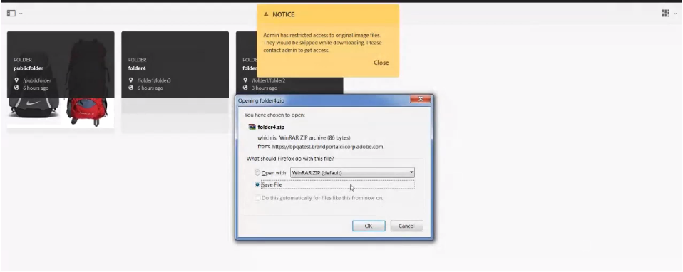

# Descargar recursos {#download-assets}

Todos los usuarios pueden descargar simultáneamente varios recursos y carpetas a los que tengan acceso desde Brand Portal. De este modo, los recursos de marca aprobados se pueden distribuir de forma segura para su uso sin conexión. Siga leyendo para saber cómo descargar los recursos aprobados desde Brand Portal y qué esperar del rendimiento [de la](../using/brand-portal-download-users.md#main-pars-header)descarga.

>[!NOTE]
>
>Solo los administradores pueden descargar recursos caducados. Para obtener más información sobre los recursos caducados, consulte [Gestión de derechos digitales de los recursos](../using/manage-digital-rights-of-assets.md).

## Pasos para descargar recursos {#steps-to-download-assets}

Para descargar recursos o carpetas que contengan recursos para Brand Portal, siga estos pasos:

1. En la interfaz de Brand Portal, realice una de las siguientes acciones:

   * Seleccione las carpetas o los recursos que desee descargar. En la barra de herramientas de la parte superior, haga clic en el icono **[!UICONTROL Descargar]** .

   

   * Para descargar una sola carpeta o un recurso, pase el puntero sobre la carpeta o el recurso. En las miniaturas de acción rápida disponibles, haga clic en el icono **[!UICONTROL Descargar]** .

   

   >[!NOTE]
   >
   >Si los recursos que está descargando también incluyen recursos con licencia, se le redirigirá a la página Administración de **[!UICONTROL derechos de autor]** . En esta página, seleccione los recursos, haga clic en **[!UICONTROL Aceptar]** y, a continuación, haga clic en **[!UICONTROL Descargar]**. Si no está de acuerdo, los recursos con licencia no se descargan.\
   >Los recursos protegidos por licencias tienen un contrato de [licencia adjunto](https://helpx.adobe.com/experience-manager/6-5/assets/using/drm.html#DigitalRightsManagementinAssets) , lo que se realiza estableciendo la propiedad [de](https://helpx.adobe.com/experience-manager/6-5/assets/using/drm.html#DigitalRightsManagementinAssets) metadatos del recurso en AEM Assets.

   

   El cuadro de diálogo **[!UICONTROL Descargar]** aparece con la opción **** Recursos seleccionada de forma predeterminada.

   

   >[!NOTE]
   >
   >Si los recursos que está descargando son archivos de imagen y selecciona únicamente la opción **[!UICONTROL Recursos del cuadro de diálogo Descargar pero el administrador no]** autoriza el acceso a las representaciones originales de los archivos  de imagen, no se descargará ningún archivo de imagen y se mostrará un aviso indicando que el administrador le ha restringido el acceso a las representaciones originales.

   

1. Para descargar las representaciones de recursos además de los recursos, seleccione **[!UICONTROL Representaciones]**. Sin embargo, para permitir la descarga de representaciones generadas automáticamente junto con representaciones personalizadas, anule la selección de **[!UICONTROL Excluir representaciones]** generadas automáticamente, que está seleccionada de forma predeterminada.

   

   Para descargar solo las representaciones, anule la selección de **[!UICONTROL Recursos]**.

   >[!NOTE]
   >
   >De forma predeterminada, solo se descargan los recursos. Sin embargo, las representaciones originales de los archivos de imagen no se descargan si el administrador no le [autoriza a acceder a las representaciones originales de los archivos](../using/brand-portal-adding-users.md#main-pars-procedure-202029708)de imagen.

   * Para acelerar la descarga de archivos de recursos desde Brand Portal, seleccione la opción **[!UICONTROL Activar aceleración]** de descarga y [siga el asistente](../using/accelerated-download.md#main-pars-header-405749062). Para obtener más información sobre la descarga más rápida de recursos, consulte la [guía para acelerar las descargas desde Brand Portal](../using/accelerated-download.md).

   * Para aplicar un ajuste preestablecido de imagen [personalizado al recurso y a sus representaciones](../using/brand-portal-image-presets.md#applyimagepresetswhendownloadingimages), seleccione Representaciones **[!UICONTROL dinámicas]**. Especifique las propiedades de ajustes preestablecidos de imagen personalizados (tamaño, formato, espacio de color, resolución y modificador de imagen) para aplicar el ajuste preestablecido de imagen personalizado al descargar el recurso y sus representaciones. Para descargar solo las representaciones dinámicas, seleccione **[!UICONTROL Recursos]**.

   

   >[!NOTE]
   >
   >Para realizar la previsualización (o descarga) de representaciones dinámicas de cualquier recurso, asegúrese de que el medio dinámico está activado y que la representación de tiff piramidal del recurso existe en la instancia de creación de AEM, desde donde se han publicado los recursos. Cuando se publica un recurso en Brand Portal, también se publica su representación de tiff piramidal. No hay forma de generar la representación de tiff de la Pirámide desde Brand Portal.

   * Para conservar la jerarquía de carpetas de Brand Portal durante la descarga de recursos, seleccione **[!UICONTROL Crear carpeta independiente para cada recurso]**. De forma predeterminada, la jerarquía de carpetas de Brand Portal se ignora y todos los recursos se descargan en una carpeta del sistema local.

   * Para enviar una notificación por correo electrónico a los usuarios con un vínculo para descargar los recursos, seleccione **[!UICONTROL Correo electrónico]**.

   

   >[!NOTE]
   >
   >El vínculo de descarga de la notificación por correo electrónico caduca pasados 45 días.
   >
   >Los administradores pueden personalizar los mensajes de correo electrónico, es decir, el logotipo, la descripción y el pie de página, mediante la función [Marcas](../using/brand-portal-branding.md) .

1. Haga clic en **[!UICONTROL Descargar]**.

   Los recursos (y las representaciones si se seleccionan) se descargan como un archivo ZIP en la carpeta local. Sin embargo, no se crea ningún archivo zip si se descarga un único recurso sin ninguna representación, lo que garantiza una descarga rápida.

   Las representaciones originales de los recursos seleccionados no se descargan si el administrador no le [autoriza a acceder a las representaciones](../using/brand-portal-adding-users.md#main-pars-procedure-202029708)originales.

   >[!NOTE]
   >
   >Los recursos seleccionados de forma individual y descargados están visibles en el informe de recursos descargados. Sin embargo, si se descarga una carpeta que contiene recursos, ni la carpeta ni los recursos se muestran en el informe de recursos descargados.

   Para saber cómo descargar recursos de vínculos compartidos, consulte [Descarga de recursos de vínculos](../using/brand-portal-link-share.md#main-pars-header-1703469193)compartidos.

## Rendimiento de descarga esperado {#expected-download-performance}

La experiencia de descarga de archivos puede variar para los usuarios en diferentes ubicaciones de clientes, según factores como la conectividad local a Internet y la latencia del servidor. El rendimiento de descarga esperado para un archivo de 2 GB observado en diferentes ubicaciones de cliente es el siguiente, con el servidor Brand Portal en Oregon, Estados Unidos:

| Ubicación del cliente | Latencia entre cliente y servidor | Velocidad de descarga esperada | Tiempo necesario para descargar un archivo de 2 GB |
|-------------------------|-----------------------------------|-------------------------|------------------------------------|
| Zona occidental de Estados Unidos (Norte de California) | 18 milisegundos | 7,68 MB/s | 4 minutos |
| Zona occidental de EE. UU. (Oregón) | 42 milisegundos | 3,84 MB/s | 9 minutos |
| Zona oriental de EE. UU. (Norte de Virginia ) | 85 milisegundos | 1,61 MB/s | 21 minutos |
| APAC (Tokio) | 124 milisegundos | 1,13 MB/s | 30 minutos |
| Adobe | 275 milisegundos | 0,5 MB/s | 68 minutos |
| Sídney | 175 milisegundos | 0,49 MB/s | 69 minutos |
| Londres | 179 milisegundos | 0,32 MB/s | 106 minutos |
| Singapur | 196 milisegundos | 0,5 MB/s | 68 minutos |

**Nota**: Los datos citados se observan en condiciones de prueba, que pueden variar para los usuarios en distintas ubicaciones que presencian latencia y ancho de banda variados.
