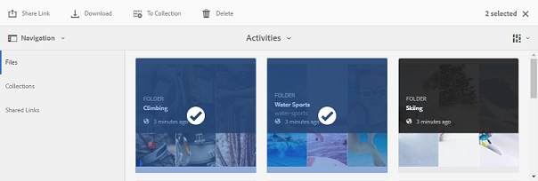

# Descargar recursos {#download-assets}

Todos los usuarios pueden descargar simultáneamente varios recursos y carpetas accesibles desde Brand Portal. De esta forma, los recursos de marca aprobados pueden distribuirse de forma segura para uso sin conexión. Lea cómo descargar los recursos aprobados desde Brand Portal y qué esperar del rendimiento [de descarga](../using/brand-portal-download-users.md#main-pars-header).

>[!NOTE]
>
>Solo los administradores pueden descargar recursos caducados. Para obtener más información sobre los recursos caducados, consulte [Administrar derechos digitales de recursos](../using/manage-digital-rights-of-assets.md).

## Pasos para descargar recursos {#steps-to-download-assets}

Para descargar recursos o carpetas que contengan recursos para Brand Portal, siga estos pasos:

1. Desde la interfaz de Brand Portal, realice una de las siguientes acciones:

   * Seleccione las carpetas o los recursos que desee descargar. En la barra de herramientas de la parte superior, haga clic en el icono **[!UICONTROL Descargar]** .
   

   * Para descargar una sola carpeta o recurso, coloque el puntero sobre la carpeta o el recurso. En las miniaturas de acción rápida disponibles, haga clic en el icono **[!UICONTROL Descargar]** .
   

   >[!NOTE]
   >
   >Si los recursos que descarga también incluyen recursos con licencia, se le redirigirá a la página **[!UICONTROL Administración]** de copyright. En esta página, seleccione los recursos, haga clic **[!UICONTROL en Aceptar]** y, a continuación, haga clic **[!UICONTROL en Descargar]**. Si decide rechazar, los recursos con licencia no se descargarán.\
   >Los recursos protegidos por licencia tienen [un acuerdo de licencia asociado](https://helpx.adobe.com/experience-manager/6-5/assets/using/drm.html#DigitalRightsManagementinAssets) a ellos, que se realiza estableciendo la propiedad [de metadatos del recurso](https://helpx.adobe.com/experience-manager/6-5/assets/using/drm.html#DigitalRightsManagementinAssets) en Recursos AEM.

   

   El cuadro **[!UICONTROL de]** diálogo Descargar aparece con la opción **[!UICONTROL Recurso]** seleccionada de forma predeterminada.

   

   >[!NOTE]
   >
   >Si los recursos que está descargando son archivos de imagen y selecciona solo la opción **[!UICONTROL Recurso]** en el cuadro de diálogo Descargar, pero no [está autorizado por el administrador para tener acceso a las representaciones originales de archivos](../using/brand-portal-adding-users.md#main-pars-procedure-202029708) de imagen, entonces no se descargan archivos de imagen y aparecerá Aviso, lo que indica que el administrador ha restringido el acceso a las representaciones originales.

   

2. Para descargar las representaciones de recursos además de los recursos, seleccione **[!UICONTROL Representaciones]**. Sin embargo, para permitir que las representaciones generadas automáticamente se descarguen junto con representaciones personalizadas, anule la selección **[!UICONTROL de Excluir representaciones generadas automáticamente]**, que se seleccionan de forma predeterminada.

   

   Para descargar solo las representaciones, anule la selección **[!UICONTROL de Recursos]**.

   >[!NOTE]
   >
   >De forma predeterminada, solo se descargan los recursos. Sin embargo, las representaciones originales de archivos de imagen no se descargan si el administrador no [tiene autorización para acceder a las representaciones originales de archivos de imagen](../using/brand-portal-adding-users.md#main-pars-procedure-202029708).

   * Para acelerar la descarga de archivos de recursos desde Brand Portal, seleccione **[!UICONTROL Activar la opción de aceleración]** de descarga y [siga el asistente](../using/accelerated-download.md#main-pars-header-405749062). Para obtener más información sobre la descarga más rápida de recursos, consulte [guía para acelerar las descargas desde Brand Portal](../using/accelerated-download.md).

   * Para aplicar un [ajuste preestablecido de imagen personalizado al recurso y sus representaciones](../using/brand-portal-image-presets.md#applyimagepresetswhendownloadingimages), seleccione **[!UICONTROL Representación dinámica]**. Especifique las propiedades preestablecidas de la imagen (tamaño, formato, espacio de color, resolución y modificador de imagen) para aplicar el ajuste preestablecido de imagen personalizado al descargar el recurso y sus representaciones. Para descargar solo las representaciones dinámicas, haga clic en **[!UICONTROL Recurso (s)]**.
   

   >[!NOTE]
   >
   >Para obtener una vista previa (o descargar) representaciones dinámicas de cualquier recurso, asegúrese de que el Dynamic Media está habilitado y de que la representación Pyramid Tiff del recurso existe en la instancia de creación de AEM, desde donde se han publicado los recursos. Cuando un recurso se publica en Brand Portal, también se publica su representación Tiff Pyramid. No hay manera de generar la representación Pyramid Tiff desde Brand Portal.

   * Para conservar la jerarquía de carpetas de Brand Portal al descargar recursos, seleccione **[!UICONTROL Crear carpeta independiente para cada recurso]**. De forma predeterminada, se omite la jerarquía de carpetas de Brand Portal y todos los recursos se descargan en una carpeta del sistema local.

   * Para enviar una notificación por correo electrónico a los usuarios con un vínculo para descargar los recursos, seleccione **[!UICONTROL Correo electrónico]**.
   

   >[!NOTE]
   >
   >El vínculo de descarga por correo electrónico caduca después de 45 días.
   >
   >Los administradores pueden personalizar los mensajes de correo electrónico, es decir, el logotipo, la descripción y el pie de página, mediante la función [de marca](../using/brand-portal-branding.md) .

3. Haga clic **[!UICONTROL en Descargar]**.

   Los recursos (y las representaciones si se seleccionan) se descargan como un archivo ZIP en la carpeta local. Sin embargo, no se crea ningún archivo zip si se descarga un único recurso sin ninguna de las representaciones, lo que asegura una descarga rápida.

   Las representaciones originales de los recursos seleccionados no se descargan si el administrador no [tiene autorización para acceder a las representaciones originales](../using/brand-portal-adding-users.md#main-pars-procedure-202029708).

   >[!NOTE]
   >
   >Los recursos seleccionados de forma individual y descargados son visibles en el informe descargado de recursos. Sin embargo, si se descarga una carpeta que contiene recursos, ni la carpeta ni los recursos se muestran en el informe descargado.

   Para obtener información sobre cómo descargar recursos de vínculos compartidos, consulte [Descarga de recursos de vínculos compartidos](../using/brand-portal-link-share.md#main-pars-header-1703469193).

## Rendimiento de descarga esperado {#expected-download-performance}

La experiencia de descarga de archivos puede variar para los usuarios en diferentes ubicaciones de cliente, según los factores como conexión a Internet local y latencia del servidor. El rendimiento de descarga esperado para un archivo de 2 GB observado en distintas ubicaciones de cliente es el siguiente, con el servidor Brand Portal en Oregón en Estados Unidos:

| Ubicación del cliente | Latencia entre cliente y servidor | Velocidad de descarga esperada | Tiempo empleado para descargar un archivo de 2 GB |
|-------------------------|-----------------------------------|-------------------------|------------------------------------|
| Zona occidental de Estados Unidos (Norte de California) | 18 milisegundos | 7,68 MB/s | 4 minutos |
| Zona occidental de EE. UU. (Oregón) | 42 milisegundos | 3,84 MB/s | 9 minutos |
| Zona oriental de EE. UU. (Norte de Virginia ) | 85 milisegundos | 1,61 MB/s | 21 minutos |
| APAC (Tokio) | 124 milisegundos | 1,13 MB/s | 30 minutos |
| Noida | 275 milisegundos | 0,5 MB/s | 68 minutos |
| Sídney | 175 milisegundos | 0,49 MB/s | 69 minutos |
| Londres | 179 milisegundos | 0,32 MB/s | 106 minutos |
| Singapur | 196 milisegundos | 0,5 MB/s | 68 minutos |

**Nota**: Los datos citados se observan bajo condiciones de prueba, que pueden variar para los usuarios en distintas ubicaciones que ven diversas latencia y ancho de banda.
