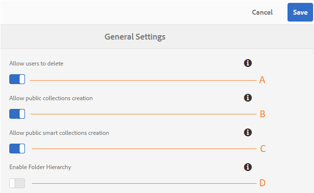

# Administrar configuraciones de inquilino generales {#administer-general-tenant-configurations}

AEM Assets Brand Portal permite a las organizaciones configurar las siguientes capacidades para inquilinos específicos:

* Eliminación de recursos por administradores
* Creación de una colección pública por usuarios no administradores
* Creación pública de colecciones inteligentes por usuarios no administradores
* Jerarquía principal de carpetas compartidas visibles para usuarios no administradores

Estas configuraciones se han proporcionado como configuraciones **[!UICONTROL General Settings]** en el panel de herramientas administrativas.

****   Configuración para permitir a los administradores eliminar recursos de Brand Portal. (El valor predeterminado está activado)

****   BConfiguration para permitir que los usuarios que no son administradores creen colecciones públicas. (El valor predeterminado está activado)

****   Configuración que permite a los usuarios no administradores crear colecciones inteligentes públicas. (El valor predeterminado está activado)

****  Configuración para mostrar la jerarquía de carpetas (desde la raíz) de las carpetas compartidas a los usuarios no administradores (editores, visualizadores, usuarios invitados). (El valor predeterminado está desactivado)

## Habilitar/deshabilitar las configuraciones generales {#enable-disable-general-configurations}

Para habilitar/deshabilitar cada una de estas configuraciones:

1. Inicie sesión con privilegios de administrador.
1. Seleccione el logotipo de AEM para acceder a las herramientas administrativas, en la barra de herramientas de la parte superior.
1. En el panel de herramientas administrativas, seleccione **[!UICONTROL General]** para abrir la página **[!UICONTROL Configuración general]**.
1. Utilice el conmutador correspondiente para habilitar/deshabilitar cualquiera de las configuraciones generales.
1. **[!UICONTROL Guarde los cambios.]**
1. Cierre la sesión para que los cambios surtan efecto.

## Permitir que los usuarios administradores eliminen activos de Brand Portal {#allow-admin-users-to-delete-assets-from-brand-portal}

**[!UICONTROL Permitir que los usuarios]** eliminen la configuración permite que las organizaciones permitan (o restrinjan) a los usuarios con privilegios de administrador eliminar recursos y carpetas de Brand Portal.

## Permitir la creación de colecciones públicas por usuarios que no sean administradores {#allow-public-collections-creation-by-non-admins}

[[!UICONTROL Permitir la ]](../using/brand-portal-share-collection.md#main-pars-text-1915052376) creación de colecciones públicas, la configuración controla si los usuarios que no son administradores pueden crear colecciones públicas en Brand Portal. La configuración está habilitada de forma predeterminada. Al desactivar las organizaciones de configuración, pueden evitar tener numerosas colecciones públicas en su portal, de modo que se pueda guardar el espacio del sistema.

## Permitir la creación de colecciones inteligentes públicas por parte de usuarios que no sean administradores {#allow-public-smart-collections-creation-by-non-admins}

[[!UICONTROL Permitir la ]](../using/brand-portal-searching.md#main-pars-header-500620467) creación de colecciones inteligentes públicas, la configuración controla si los usuarios que no son administradores pueden guardar sus búsquedas como colecciones inteligentes y hacerlas públicas para ese inquilino. La configuración está habilitada de forma predeterminada. Al deshabilitar las organizaciones de configuración, puede evitar tener un gran número de colecciones inteligentes públicas creadas por usuarios no administradores en Brand Portal de la organización.

<!-- 
## Allow download acceleration {#allow-download-acceleration}

[[!UICONTROL Allow download acceleration]](../using/accelerated-download.md) configuration lets the organizations to allow accelerated downloads of assets from Brand Portal and shared links, by integrating with IBM Aspera Connect that is an install-on-demand application. The application uses proprietary technology to remove TCP overheads.
-->

## Habilitar la jerarquía de carpetas {#enable-folder-hierarchy}

[[!UICONTROL Habilitar la configuración de ]](../using/brand-portal-sharing-folders.md#non-admin-user-access-to-shared-folders) jerarquía de carpetas permite a los administradores controlar cómo los usuarios que no son administradores (editores, visualizadores y usuarios invitados) ven las carpetas compartidas después de iniciar sesión.
