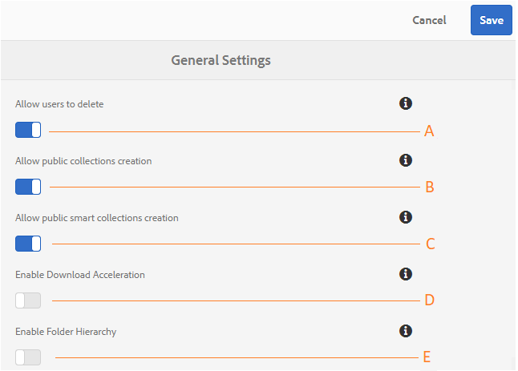

# Administrar configuraciones de inquilino generales {#administer-general-tenant-configurations}

AEM Assets Brand Portal permite a las organizaciones configurar las siguientes capacidades para inquilinos específicos:

* Eliminación de recursos por administradores
* Creación de colecciones públicas por usuarios no administradores
* Creación de colecciones inteligentes públicas por usuarios no administradores
* Aceleración de descarga
* Jerarquía principal de carpetas compartidas visible para usuarios no administradores

Estas configuraciones se han proporcionado como configuraciones de Configuración **** general en el panel de herramientas administrativas.

**Una** configuración que permite a los administradores eliminar recursos de Brand Portal. (El valor predeterminado está habilitado)

**Configuración B** para permitir que los usuarios no administradores creen colecciones públicas. (El valor predeterminado está habilitado)

**Configuración de C** para permitir que los usuarios no administradores creen colecciones inteligentes públicas. (El valor predeterminado está habilitado)

**Configuración D** para permitir la aceleración de descargas de recursos descargados del portal y de los vínculos compartidos. (El valor predeterminado está desactivado)

**Configuración electrónica** para mostrar la jerarquía de carpetas (desde la raíz) de las carpetas compartidas a usuarios no administradores (editores, visores, usuarios invitados). (El valor predeterminado está desactivado)

## Habilitar o deshabilitar configuraciones generales {#enable-disable-general-configurations}

Para habilitar/deshabilitar cada una de estas configuraciones:

1. Inicie sesión con privilegios de administrador.
1. Seleccione el logotipo de AEM para acceder a las herramientas administrativas, en la barra de herramientas de la parte superior.
1. En el panel Herramientas administrativas, seleccione **[!UICONTROL General]** para abrir la página Configuración **** general.
1. Utilice el conmutador correspondiente para habilitar o deshabilitar cualquiera de las configuraciones generales.
1. **[!UICONTROL Guarde los cambios.]**
1. Cierre la sesión para que los cambios surtan efecto.

## Permitir que los usuarios administradores eliminen recursos de Brand Portal {#allow-admin-users-to-delete-assets-from-brand-portal}

**[!UICONTROL Permitir que los usuarios eliminen]** la configuración permite a las organizaciones permitir (o restringir) a los usuarios con privilegios de administrador eliminar recursos y carpetas de Brand Portal.

## Permitir la creación de colecciones públicas por usuarios que no sean administradores {#allow-public-collections-creation-by-non-admins}

[[!UICONTROL Permitir la configuración de creación]](../using/brand-portal-share-collection.md#main-pars-text-1915052376) de colecciones públicas controla si los no administradores pueden crear colecciones públicas en Brand Portal. La configuración está habilitada de forma predeterminada. Al desactivar las organizaciones de configuración, se puede evitar tener numerosas colecciones públicas en el portal para que se pueda guardar el espacio del sistema.

## Permitir la creación de colecciones inteligentes públicas por usuarios que no sean administradores {#allow-public-smart-collections-creation-by-non-admins}

[[!UICONTROL Permitir la configuración de creación]](../using/brand-portal-searching.md#main-pars-header-500620467) de colecciones inteligentes públicas controla si los usuarios que no son administradores pueden guardar sus búsquedas como colecciones inteligentes y hacerlas públicas para ese inquilino. La configuración está habilitada de forma predeterminada. Al desactivar las organizaciones de configuración, se puede evitar tener un gran número de colecciones inteligentes públicas creadas por usuarios no administradores en Brand Portal de la organización.

## Permitir aceleración de descarga {#allow-download-acceleration}

[[!UICONTROL Permitir la configuración de aceleración]](../using/accelerated-download.md) de descargas permite a las organizaciones permitir descargas aceleradas de recursos desde Brand Portal y vínculos compartidos, mediante la integración con IBM Aspera Connect, que es una aplicación de instalación bajo demanda. La aplicación utiliza tecnología patentada para eliminar los sobrecargos TCP.

## Habilitar la jerarquía de carpetas {#enable-folder-hierarchy}

[[!UICONTROL Habilitar la configuración de jerarquía]](../using/brand-portal-sharing-folders.md#non-admin-user-access-to-shared-folders) de carpetas permite a los administradores controlar cómo los usuarios no administradores (editores, visores y usuarios invitados) ven las carpetas compartidas después de iniciar sesión.
