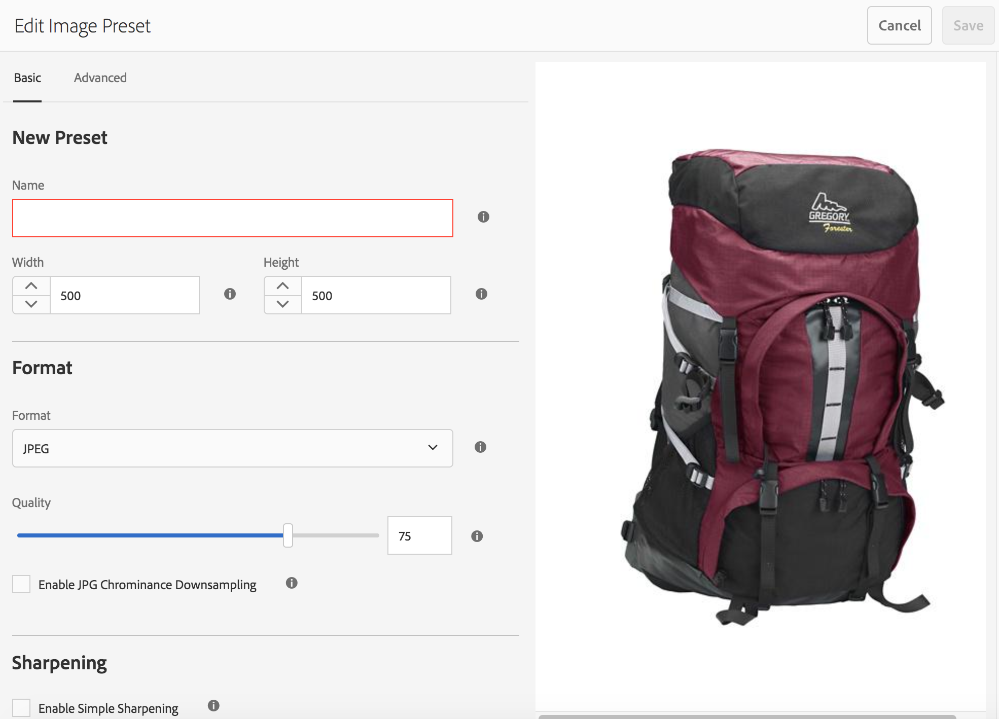
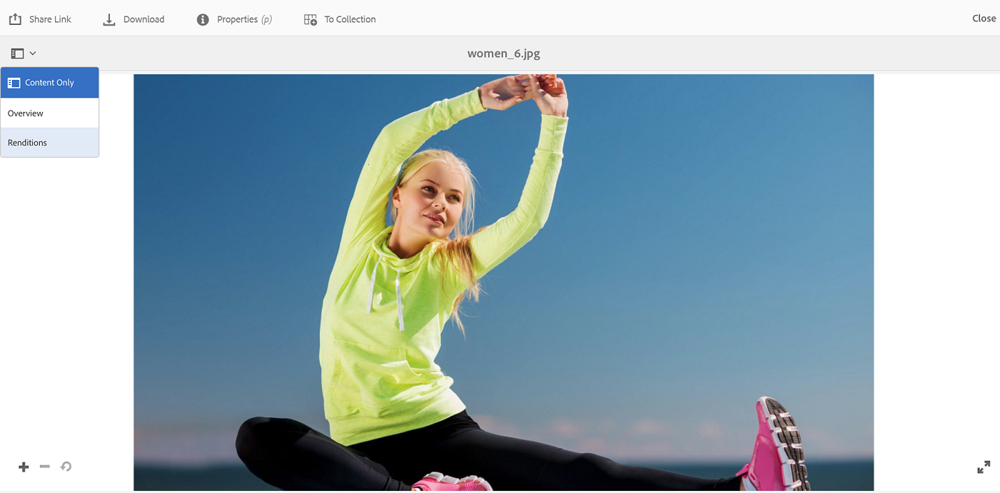
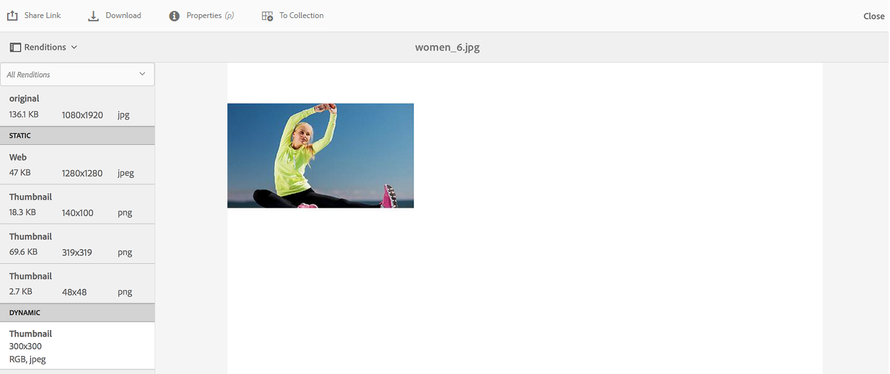
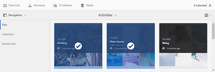
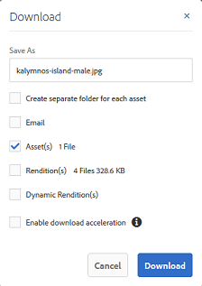
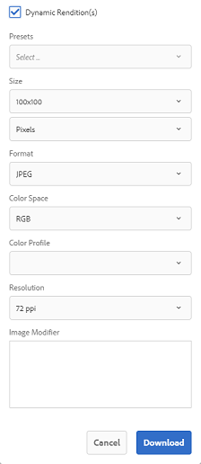

# Aplicar ajustes preestablecidos de imagen o representaciones dinámicas {#apply-image-presets-or-dynamic-renditions}

Al igual que una macro, un ajuste preestablecido de imagen es una colección predefinida de comandos de tamaño y formato guardados con un nombre. Los ajustes preestablecidos de imagen permiten a los AEM Assets que el portal de marca distribuya de forma dinámica imágenes de diferentes tamaños, formatos y propiedades.

Un ajuste preestablecido de imagen se utiliza para generar representaciones dinámicas de imágenes que se pueden previsualizar y descargar. Al obtener una vista previa de las imágenes y sus representaciones, puede elegir un ajuste preestablecido para cambiar el formato de las imágenes según las especificaciones establecidas por el administrador.

Para vista de representaciones dinámicas de un recurso en Brand Portal, asegúrese de que su representación de tiff piramidal existe en la instancia de creación de AEM desde la que publica en Brand Portal. Al publicar el recurso, su representación PTIFF también se publica en Brand Portal. No hay forma de generar la representación PTIFF desde Brand Portal.

>[!NOTE]
>
>Al descargar imágenes y sus representaciones, no hay opción de elegir entre los ajustes preestablecidos existentes. En su lugar, puede especificar las propiedades de un ajuste preestablecido de imagen personalizado. Para obtener más información, consulte [Aplicación de ajustes preestablecidos de imagen al descargar imágenes](../using/brand-portal-image-presets.md#main-pars-text-1403412644).

Para obtener más información sobre los parámetros requeridos al crear ajustes preestablecidos de imagen, consulte [Administración de ajustes preestablecidos](https://docs.adobe.com/docs/en/AEM/6-0/administer/integration/dynamic-media/image-presets.html)de imagen.

## Creación de un ajuste preestablecido de imagen {#create-an-image-preset}

Los administradores pueden crear ajustes preestablecidos de imagen que aparecen como representaciones dinámicas en la página de detalles del recurso. Puede crear un ajuste preestablecido de imagen desde cero o guardar uno existente con un nombre nuevo. Al crear un ajuste preestablecido de imagen, elija un tamaño para el envío de la imagen y los comandos de formato. Cuando se envía una imagen para su visualización, su aspecto se optimiza según los comandos seleccionados.
Tenga en cuenta que solo los administradores pueden crear ajustes preestablecidos de imagen en Brand Portal.

Tenga en cuenta que solo los administradores pueden crear ajustes preestablecidos de imagen en Brand Portal.

>[!NOTE]
>
>Las representaciones dinámicas de una imagen se crean con su TIFF piramidal. Si el TIFF piramidal no está disponible para ningún recurso, las representaciones dinámicas para ese recurso no se pueden recuperar en el portal de marca.
Si la instancia de AEM (Autor) se está ejecutando en el modo **Híbrido de** Dynamic Media, las representaciones TIFF piramidales de los recursos de imagen se crean y guardan en el repositorio de AEM. Mientras que, si la instancia de AEM (Autor) se está ejecutando en el modo **de**Dynamic Media Scene 7, entonces existen representaciones TIFF piramidales de recursos de imagen en el servidor de Scene 7.
Cuando estos recursos se publican en el portal de marca, se aplican ajustes preestablecidos de imagen y se muestran representaciones dinámicas.

1. En la barra de herramientas de AEM de la parte superior, haga clic en el logotipo de Adobe para acceder a las herramientas administrativas.

1. En el panel Herramientas administrativas, haga clic en Ajustes preestablecidos **[!UICONTROL de imagen]**.

   

1. En la página Ajustes preestablecidos de imagen, haga clic en **[!UICONTROL Crear]**.

   

1. En la página **[!UICONTROL Editar ajuste preestablecido]** de imagen, introduzca valores en las fichas **[!UICONTROL Básico]** y **[!UICONTROL Avanzado]** según corresponda, incluido un nombre. The options are outlined in [Image Preset options](https://docs.adobe.com/docs/en/AEM/6-0/administer/integration/dynamic-media/image-presets.html#Image%20preset%20options). Los ajustes preestablecidos aparecen en el panel izquierdo y se pueden utilizar sobre la marcha con otros recursos.

   

   >[!NOTE]
   >
   >También puede utilizar la página **[!UICONTROL Editar ajuste preestablecido]** de imagen para editar las propiedades de un ajuste preestablecido de imagen existente. Para editar un ajuste preestablecido de imagen, selecciónelo en la página Ajustes preestablecidos de imagen y haga clic en **[!UICONTROL Editar]**.

1. Haga clic en **[!UICONTROL Guardar.]** El ajuste preestablecido de imagen se crea y se muestra en la página de ajustes preestablecidos de imagen.
1. Para eliminar un ajuste preestablecido de imagen, selecciónelo en la página Ajustes preestablecidos de imagen y haga clic en **[!UICONTROL Eliminar]**. En la página de confirmación, haga clic en **[!UICONTROL Eliminar]** para confirmar la eliminación. El ajuste preestablecido de imagen se elimina de la página de ajustes preestablecidos de imagen.

## Aplicación de ajustes preestablecidos de imagen al previsualizar imágenes  {#apply-image-presets-when-previewing-images}

Al obtener una vista previa de las imágenes y sus representaciones, elija entre los ajustes preestablecidos existentes para cambiar el formato de las imágenes según las especificaciones establecidas por el administrador.

1. En la interfaz de Brand Portal, haga clic en una imagen para abrirla.
1. Haga clic en el icono de superposición de la izquierda y elija **[!UICONTROL Representaciones]**.

   

1. En la lista **[!UICONTROL Representaciones]** , seleccione la representación dinámica adecuada, por ejemplo, **[!UICONTROL Miniatura]**. La imagen de la previsualización se procesa según la elección de la representación.

   

## Aplicación de ajustes preestablecidos de imagen al descargar imágenes {#apply-image-presets-when-downloading-images}

Al descargar imágenes y sus representaciones desde Brand Portal, no puede elegir entre los ajustes preestablecidos de imagen existentes. Sin embargo, puede personalizar las propiedades de ajustes preestablecidos de imagen en función de las cuales desee cambiar el formato de las imágenes.

1. En la interfaz de Brand Portal, realice una de las siguientes acciones:

   * Pase el puntero sobre la imagen que desee descargar. En las miniaturas de acción rápida disponibles, haga clic en el icono **[!UICONTROL Descargar]** .

   

   * Seleccione la imagen que desee descargar. En la barra de herramientas de la parte superior, haga clic en el icono **[!UICONTROL Descargar]** .

   

1. En el cuadro de diálogo **[!UICONTROL Descargar]** , seleccione las opciones necesarias en función de si desea descargar el recurso con o sin sus representaciones.

   

1. Para descargar representaciones dinámicas del recurso, seleccione la opción Representaciones **[!UICONTROL dinámicas]** .
1. Personalice las propiedades de ajustes preestablecidos de imagen en función de las cuales desee cambiar el formato de la imagen y sus representaciones de forma dinámica durante la descarga. Especifique el tamaño, el formato, el espacio de color, la resolución y el modificador de imagen.

   

1. Haga clic en **[!UICONTROL Descargar]**. Las representaciones dinámicas personalizadas se descargan en un archivo ZIP junto con la imagen y las representaciones que elija descargar. Sin embargo, no se crea ningún archivo zip si se descarga un solo recurso, lo que garantiza una descarga rápida.
