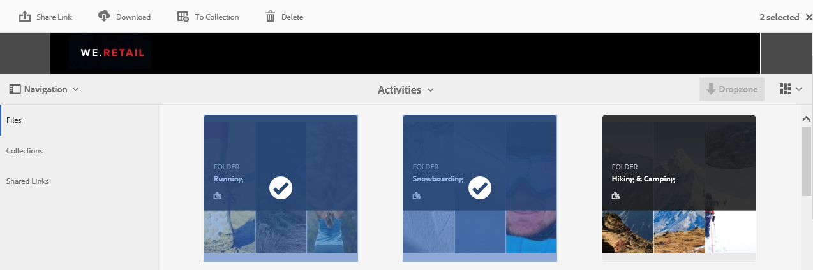
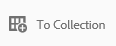
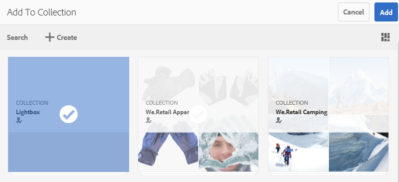
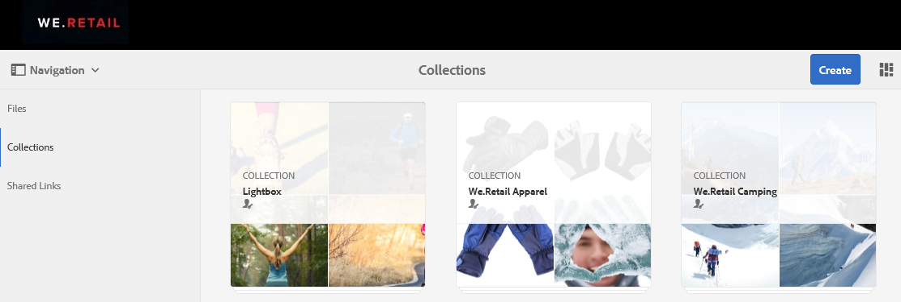
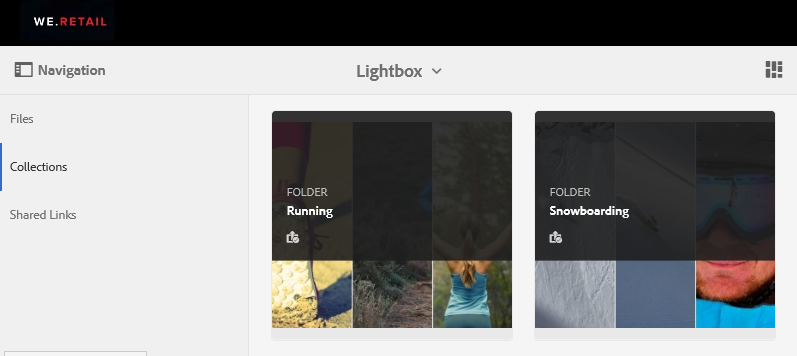
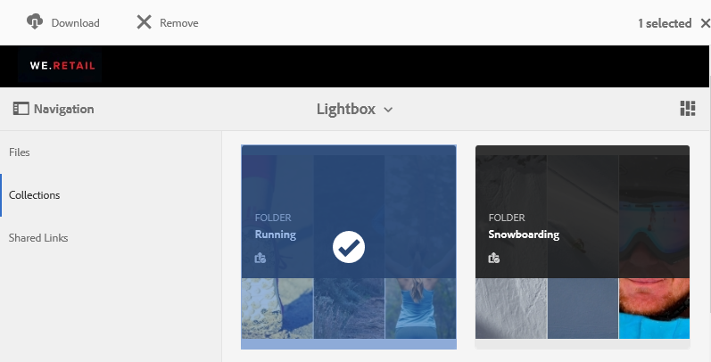

# Administrar la colección Lightbox {#manage-the-lightbox-collection}

[!UICONTROL Lightbox] es un tipo especial de colección que facilita el acceso a los recursos. Cada usuario tiene una [!UICONTROL Lightbox] exclusiva que se crea automáticamente cuando inician sesión en Brand Portal por primera vez. La colección [!UICONTROL Lightbox] no se puede eliminar.

## Agregar recursos a Lightbox {#add-assets-to-lightbox}

Para agregar recursos a [!UICONTROL Lightbox], haga lo siguiente:

1. Navegue a la ubicación de los recursos que desee agregar a [!UICONTROL Lightbox]y seleccione los recursos.

   

2. En la barra de herramientas de la parte superior, haga clic en el icono Agregar a la colección.

   

3. En la página **[!UICONTROL Agregar a la colección]** , la colección [!UICONTROL Lightbox] está seleccionada de forma predeterminada.

   Haga clic en **[!UICONTROL Agregar]**. Los recursos seleccionados se agregan a [!UICONTROL Lightbox].

   

4. Para revisar los recursos añadidos a [!UICONTROL Lightbox], haga clic **[!UICONTROL en Colecciones]** en la barra de la izquierda y, a continuación, haga clic en la colección **[!UICONTROL Lightbox]** .

   

   Los recursos añadidos a [!UICONTROL Lightbox] aparecen en la página [!UICONTROL Lightbox] .

   

## Eliminación de recursos de Lightbox {#remove-assets-from-lightbox}

1. Para revisar los recursos en [!UICONTROL Lightbox], haga clic **[!UICONTROL en Colecciones]** en el carril izquierdo y, a continuación, haga clic en la colección [!UICONTROL Lightbox] .

   

2. Seleccione la carpeta que desee eliminar de la colección y, a continuación, haga clic **[!UICONTROL en Eliminar]** de la barra de herramientas situada en la parte superior.

   

3. En el cuadro de mensaje de advertencia, haga clic **[!UICONTROL en Quitar]** para confirmar la eliminación.

La carpeta se elimina de la colección [!UICONTROL Lightbox] .
