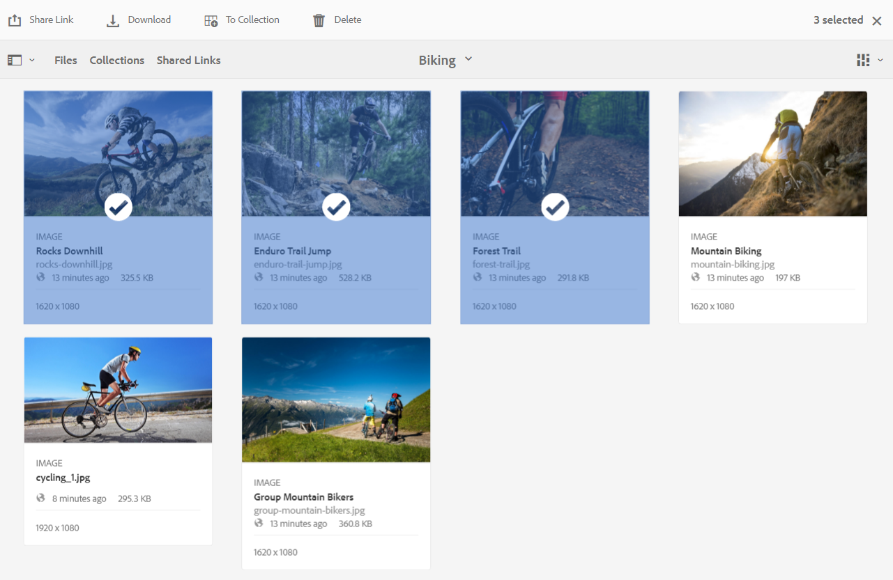

# Compartir recursos como un vínculo {#share-assets-as-a-link}

Los administradores de Adobe Experience Manager Assets Brand Portal pueden compartir vínculos de varios recursos con usuarios internos autorizados y entidades externas, incluidos socios y proveedores. Los editores solo pueden ver y compartir los recursos que se han compartido con ellos.

Compartir recursos a través de un vínculo es una forma cómoda de ponerlos a disposición de terceros externos, ya que los receptores no tienen que iniciar sesión en Brand Portal para acceder a los recursos.

<!-- Link sharing access is restricted to editors and administrators. 
-->

Para obtener más información, consulte [Administración de usuarios, grupos y funciones de usuario](../using/brand-portal-adding-users.md#manage-user-roles).

>[!NOTE]
>
>Se permiten hasta 5 GB de descarga zip mediante la función de uso compartido de vínculos en Brand Portal.

A continuación se indican los pasos para compartir recursos como vínculo:

1. Inicie sesión en su inquilino de Brand Portal. De forma predeterminada, se abre la vista **[!UICONTROL Files]** que contiene todos los recursos y carpetas publicados.

1. Seleccione los recursos o carpetas que desea compartir o vaya a la vista **[!UICONTROL Colecciones]** para compartir las colecciones que ha creado.

   

1. En la barra de herramientas de la parte superior, haga clic en el icono **[!UICONTROL Compartir vínculo]**.

   Aparece el cuadro de diálogo **[!UICONTROL Uso compartido de vínculos]**.

   

   * En el cuadro de dirección de correo electrónico, escriba el ID de correo electrónico del usuario con el que desea compartir el vínculo. Puede compartir el vínculo con varios usuarios. Si el usuario es miembro de su organización, seleccione su ID de correo electrónico en las sugerencias que aparecen en la lista desplegable. Si el usuario es externo, escriba el ID de correo electrónico completo y pulse **[!UICONTROL Enter]**; el ID de correo electrónico se agrega a la lista de usuarios.

      

   * En el cuadro **[!UICONTROL Subject]**, escriba un asunto para el recurso que desea compartir.
   * En el cuadro **[!UICONTROL Message]**, escriba un mensaje si es necesario.
   * En el campo **[!UICONTROL Expiration]**, utilice el selector de fechas para especificar una fecha y hora de caducidad para el vínculo. De forma predeterminada, la fecha de caducidad se establece en 7 días a partir de la fecha en que se comparte el vínculo.
   * Active la casilla **[!UICONTROL Permitir descarga del archivo original]** para permitir que los destinatarios descarguen la representación original.

   Los recursos compartidos mediante el vínculo caducan después de superar la fecha y la hora especificadas en el campo **[!UICONTROL Caducidad]**. Para obtener información sobre el comportamiento de los recursos caducados y los cambios en las actividades permisibles basados en las funciones de usuario en Brand Portal, consulte [Administrar derechos digitales de los recursos](../using/manage-digital-rights-of-assets.md#asset-expiration).

   >[!NOTE]
   >
   >El tiempo de caducidad predeterminado del vínculo es de 7 días. El vínculo debe enviarse por correo electrónico a los usuarios mediante el cuadro de diálogo **[!UICONTROL Compartir vínculos]**, no copie ni comparta el vínculo por separado.

1. Haga clic en **[!UICONTROL Compartir]**. Un mensaje confirma que el vínculo se comparte con los usuarios. Los usuarios reciben un correo electrónico que contiene el vínculo compartido.

   

   >[!NOTE]
   >
   >Los administradores pueden personalizar los mensajes de correo electrónico, lo que incluye personalizar el logotipo, la descripción y el pie de página con la función [Marcas](../using/brand-portal-branding.md).

## Descargar recursos de vínculos compartidos {#download-assets-from-shared-links}

Haga clic en el vínculo del correo electrónico para acceder al recurso compartido. Se abre la página Compartir vínculos de AEM.

Para descargar los recursos compartidos:

1. Haga clic en los recursos o carpetas y, a continuación, haga clic en el icono **[!UICONTROL Descargar]** de la barra de herramientas.

   

   >[!NOTE]
   >
   >Actualmente, puede generar una vista previa y una miniatura solo para determinados recursos, según el formato de archivo. Para obtener más información sobre los formatos de archivo admitidos, consulte [Compatibilidad con vistas previas y miniaturas para formatos de recurso](#preview-thumbnail-support).

1. Aparece el cuadro de diálogo **[!UICONTROL Descargar]**.

   

1. De forma predeterminada, la configuración **[!UICONTROL Fast Download]** está habilitada en **[!UICONTROL Download Settings]**. Por lo tanto, aparece un cuadro de confirmación para seguir descargando mediante IBM Aspera Connect.

   Para seguir utilizando **[!UICONTROL Fast Download]**, haga clic en **[!UICONTROL Permitir]**.

   Todas las representaciones seleccionadas se descargan en una carpeta zip que contiene una carpeta independiente para cada recurso.

   >[!NOTE]
   >
   >Se crea una carpeta independiente para cada recurso al descargar los recursos de un vínculo compartido.
   >
   >Si se selecciona una carpeta, colección o más de 20 recursos para su descarga, el cuadro de diálogo **[!UICONTROL Descargar]** se omite y todas las representaciones de recursos accesibles para el usuario, excluidas las representaciones dinámicas, se descargan en una carpeta zip que contiene una carpeta independiente para cada recurso.

   >[!NOTE]
   >
   >Las representaciones originales no se descargan mediante el vínculo compartido si el usuario que compartió los recursos como vínculo no está [autorizado por el administrador para tener acceso a las representaciones originales](../using/brand-portal-adding-users.md#manage-group-roles-and-privileges).

>[!NOTE]
>
>Brand Portal restringe la descarga de recursos superiores a 5 GB por tamaño de archivo.

<!--
1. The **[!UICONTROL Download]** dialog box appears.

   

    * To speed up the download of asset files shared as the link, select **[!UICONTROL Enable download acceleration]** option and [follow the wizard](../using/accelerated-download.md#download-workflow-using-file-accelerator). To know more about the fast download of assets on Brand Portal refer [Guide to accelerate downloads from Brand Portal](../using/accelerated-download.md).
    
1. To download the renditions of assets in addition to the assets from the shared link, select **[!UICONTROL Rendition(s)]** option. When you do so, **[!UICONTROL Exclude System Renditions]** option appears that is selected by default. This prevents the download of out-of-the-box renditions along with approved assets or their custom renditions.

   However, to allow auto-generated renditions to download along with custom renditions, deselect the **[!UICONTROL Exclude System Renditions]** option.

   >[!NOTE]
   >
   >Original renditions are not downloaded using the shared link if the user who shared the assets as a link is not [authorized by the administrator to have access to the original renditions](../using/brand-portal-adding-users.md#manage-group-roles-and-privileges).

   

1. Click **[!UICONTROL Download]**. The assets (and renditions if selected) are downloaded as a ZIP file to your local folder. However, no zip file is created if a single asset is downloaded without any of the renditions, thereby ensuring speedy download.

>[!NOTE]
>
>Brand Portal restricts downloading assets larger than 5GB per file size.
-->

## Compatibilidad con vista previa y miniaturas para formatos de recursos {#preview-thumbnail-support}

La siguiente matriz enumera los formatos de recurso para los que Brand Portal admite miniaturas y previsualización:

| Formato del recurso | Compatibilidad con miniaturas | Compatibilidad de vista previa |
|--------------|-------------------|-----------------|
| PNG | ✓ | ✓ |
| GIF | ✓ | ✓ |
| TIFF | ✓ | ✓ |
| JPEG | ✓ | ✓ |
| BMP | ✓ | ✓ |
| PNM* | ND | ND |
| PGM* | ND | ND |
| PBM* | ND | ND |
| PPM* | ND | ND |
| PSD | ✓ | ✓ |
| EPS | ND | ✓ |
| DNG | ✓ | ✓ |
| PICT | ✓ | ✓ |
| PSB* | ✓ | ✓ |
| JPG | ✓ | ✓ |
| AI | ✓ | ✓ |
| DOC | ✓ | ✓ |
| DOCX | ✓ | ✓ |
| ODT* | ✓ | ✓ |
| PDF | ✓ | ✓ |
| HTML | ✓ | ✓ |
| RTF | ✓ | ✓ |
| TXT | ✓ | ✓ |
| XLS | ✓ | ✓ |
| XLSX | ✓ | ✓ |
| ODS | ✓ | ✓ |
| PPT | ✓ | ✓ |
| PPTX | ✓ | ✓ |
| ODP | ✓ | ✓ |
| INDD | ✓ | ✓ |
| PS | ✓ | ✓ |
| QXP | ✓ | ✓ |
| EPUB | ✓ | ✓ |
| AAC | ✓ | ✓ |
| MIDI | ✓ | ✓ |
| 3GP | ✓ | ✓ |
| MP3 | ✓ | ✓ |
| MP4 | ✓ | ✓ |
| OGA | ✓ | ✓ |
| OGG | ✓ | ✓ |
| RA | ✓ | ✓ |
| WAV | ✓ | ✓ |
| WMA | ✓ | ✓ |
| DVI | ✓ | ✓ |
| FLV | ✓ | ✓ |
| M4V | ✓ | ✓ |
| MPG | ✓ | ✓ |
| OGV | ✓ | ✓ |
| MOV | ✓ | ✓ |
| WMV | ✓ | ✓ |
| SWF | ✓ | ✓ |
| TGZ | ND | ✓ |
| JAR | ✓ | ✓ |
| RAR | ND | ✓ |
| TAR | ND | ✓ |
| ZIP | ✓ | ✓ |

La leyenda siguiente explica los símbolos utilizados en la matriz:

| Símbolo | Significado |
|---|---|
| ✓ | Este formato de archivo admite esta función |
| ✓ | Este formato de archivo no admite esta función |
| ND | Esta función no es aplicable a este formato de archivo |
| * | Esta función requiere compatibilidad con complementos para este formato de archivo en AEM instancia de autor, pero no en Brand Portal después de publicar los recursos en Brand Portal |

## Dejar de compartir recursos compartidos como vínculo {#unshare-assets-shared-as-a-link}

Para dejar de compartir recursos compartidos previamente como vínculo, haga lo siguiente:

1. Cuando inicia sesión en Brand Portal, la vista **[!UICONTROL File]** se abre de forma predeterminada. Para ver los recursos que ha compartido como vínculos, vaya a la vista **[!UICONTROL Vínculos compartidos]**.

1. Revise los vínculos que ha compartido desde la lista mostrada.

   

1. Para dejar de compartir un vínculo de la lista, selecciónelo y haga clic en el icono **[!UICONTROL Dejar de compartir]** en la barra de herramientas de la parte superior.

   

   >[!NOTE]
   >
   >La visualización de vínculos compartidos es específica del usuario. Esta función no muestra todos los vínculos compartidos por todos los usuarios de un inquilino.

1. En el cuadro de mensaje de advertencia, haga clic en **[!UICONTROL Continuar]** para confirmar la eliminación del uso compartido. La entrada del vínculo se elimina de la lista de vínculos compartidos.
