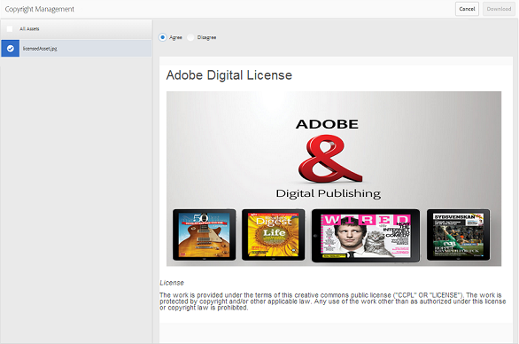

# Compartir recursos como un vínculo {#share-assets-as-a-link}

[!DNL AEM Assets Brand Portal] Los administradores pueden compartir vínculos de varios recursos con usuarios internos autorizados y entidades externas, incluidos socios y proveedores. Los editores pueden ver y compartir solo los recursos compartidos con ellos.

El uso compartido de recursos a través de un vínculo es una manera cómoda de ponerlos a disposición de los usuarios externos, ya que los destinatarios no tienen que iniciar sesión para [!DNL Brand Portal] acceder a los recursos.

El acceso compartido de vínculos está restringido a editores y administradores. Para obtener más información, consulte [Administración de usuarios, grupos y funciones de usuario](../using/brand-portal-adding-users.md#manage-user-roles).

>[!NOTE]
>
>Se permite el uso de hasta 5 GB de descarga zip mediante la función de compartir vínculos.[!DNL brand portal]

Para compartir recursos como vínculo, siga estos pasos:

1. Haga clic en el icono de superposición a la izquierda y elija **Navegación**.

   

2. En el sideril de la izquierda, haga clic **en Archivos** para compartir carpetas o imágenes. Para compartir colecciones, haga clic **[!UICONTROL en Colecciones]**.

   

3. Seleccione las carpetas o colecciones que desee compartir como vínculo.

   

4. En la barra de herramientas de la parte superior, haga clic en el icono **Compartir vínculo** .

   Aparecerá **el cuadro de** diálogo Compartir vínculos.

   

   >[!NOTE]
   >
   >El campo **Compartir vínculo** muestra un vínculo de recurso creado automáticamente. La hora de caducidad predeterminada para este vínculo es de 7 días. Puede copiar el vínculo y compartirlo por separado con usuarios o compartirlo desde el **cuadro de diálogo Compartir** vínculos.

5. En el cuadro de dirección de correo electrónico, escriba el ID de correo electrónico del usuario con el que desee compartir el vínculo. Puede compartir el vínculo con varios usuarios.

   Si el usuario es miembro de su organización, seleccione su ID de correo electrónico de las sugerencias que aparecen en la lista desplegable. Si el usuario es externo, escriba el ID de correo electrónico completo y pulse **Intro**; El ID de correo electrónico se agrega a la lista de usuarios.

   

6. En el cuadro **Asunto** , escriba un asunto para el recurso que desee compartir.
7. En el cuadro **Mensaje** , escriba un mensaje si es necesario.
8. En el campo **Caducidad** , utilice el selector de fechas para especificar una fecha y hora de caducidad para el vínculo. De forma predeterminada, la fecha de caducidad se establece en 7 días desde la fecha en que se comparte el vínculo.

   Los recursos compartidos a través del vínculo caducan después de atravesar la fecha y la hora especificadas en el campo **Caducidad** . Para obtener información sobre el comportamiento de los recursos caducados y los cambios en las actividades permisibles en función de las funciones de usuario en [!DNL Brand Portal], consulte [Administración de derechos digitales de recursos](../using/manage-digital-rights-of-assets.md#asset-expiration).

9. Haga clic en **Compartir**. Un mensaje confirma que el vínculo se comparte con los usuarios. Los usuarios reciben un correo electrónico que contiene el vínculo.

   

   >[!NOTE]
   >
   >Los administradores pueden personalizar los mensajes de correo electrónico, que incluyen personalización del logotipo, la descripción y el pie de [página con](../using/brand-portal-branding.md) la función de marca.

## Descarga de recursos de vínculos compartidos {#download-assets-from-shared-links}

Haga clic en el vínculo del correo electrónico para ver el recurso compartido. Se abre la página Compartir [!DNL AEM] vínculos.

Para descargar los recursos compartidos:

1. Haga clic en los recursos y, a continuación, en **el icono Descargar** de la barra de herramientas.

   

   >[!NOTE]
   >
   >Actualmente, puede generar una vista previa y una miniatura solo para determinados recursos, según el formato de archivo. Para obtener más información sobre los formatos de archivo compatibles, consulte [Vista previa y compatibilidad con miniaturas para formatos de recursos](#preview-thumbnail-support).

   >[!NOTE]
   >
   >Si los recursos que descarga también incluyen recursos con licencia, se le redirigirá a la página **Administración** de copyright. En esta página, seleccione los recursos con licencia, haga clic **en Aceptar** y, a continuación, haga clic **en Descargar**. Si decide rechazar, solo se descargarán los recursos sin licencia.\
   >Los recursos protegidos por licencia tienen [un acuerdo de licencia asociado](https://helpx.adobe.com/experience-manager/6-5/assets/using/drm.html#DigitalRightsManagementinAssets) a ellos, que se realiza estableciendo la propiedad [de metadatos del recurso](https://helpx.adobe.com/experience-manager/6-5/assets/using/drm.html#DigitalRightsManagementinAssets) en [!DNL AEM Assets].

   

   Aparecerá el cuadro **de** diálogo Descargar.
   

   * Para acelerar la descarga de los archivos de recursos compartidos como vínculo, seleccione **Activar la opción de aceleración** de descarga y [siga el asistente](../using/accelerated-download.md#download-workflow-using-file-accelerator). Para obtener más información sobre la descarga rápida de recursos en [!DNL Brand Portal] la [Guía de referencia, consulte la guía para acelerar las descargas desde [! DNL Brand Portal]](../using/accelerated-download.md).

2. Para descargar las representaciones de recursos además de los recursos del vínculo compartido, seleccione **la** opción Representaciones. Al hacerlo, aparece la opción **Excluir representaciones** del sistema que está seleccionada de forma predeterminada. Esto evita la descarga de representaciones integradas junto con los recursos aprobados o sus representaciones personalizadas.

   Sin embargo, para permitir que las representaciones generadas automáticamente se descarguen junto con representaciones personalizadas, anule la selección de **la opción Excluir representaciones** del sistema.

   >[!NOTE]
   >
   >Las representaciones originales no se descargan usando el vínculo compartido si el usuario que ha compartido los recursos como vínculo no [está autorizado por el administrador para tener acceso a las representaciones originales](../using/brand-portal-adding-users.md#manage-group-roles-and-privileges).

   

3. Toque o haga clic **en Descargar**. Los recursos (y las representaciones si se seleccionan) se descargan como un archivo ZIP en la carpeta local. Sin embargo, no se crea ningún archivo zip si se descarga un único recurso sin ninguna de las representaciones, lo que asegura una descarga rápida.

>[!NOTE]
>
>[!DNL Brand Portal] restringe la descarga de recursos de más de 5 GB por tamaño de archivo.

## Compatibilidad con vista previa y en miniatura para formatos de recursos {#preview-thumbnail-support}

La siguiente matriz enumera los formatos de recurso para [!DNL Brand Portal] los que se admiten miniaturas y vista previa:

| Formato de recurso | Compatibilidad con miniaturas | Compatibilidad con vista previa |
|--------------|-------------------|-----------------|
| PNG | ✓ | ✓ |
| GIF | ✓ | ✓ |
| TIFF | ✓ | ✕ |
| JPEG | ✓ | ✓ |
| BMP | ✓ | ✕ |
| PNM * | ND | ND |
| PGM * | ND | ND |
| PBM * | ND | ND |
| PPM * | ND | ND |
| PSD | ✓ | ✕ |
| EPS | ND | ✕ |
| DNG | ✓ | ✕ |
| PICT | ✓ | ✕ |
| PSB * | ✓ | ✕ |
| JPG | ✓ | ✓ |
| AI | ✓ | ✕ |
| DOC | ✕ | ✕ |
| DOCX | ✕ | ✕ |
| ODT * | ✕ | ✕ |
| PDF | ✓ | ✕ |
| HTML | ✕ | ✕ |
| RTF | ✕ | ✕ |
| TXT | ✓ | ✕ |
| XLS | ✕ | ✕ |
| XLSX | ✕ | ✕ |
| ODS | ✕ | ✕ |
| PPT | ✓ | ✕ |
| PPTX | ✕ | ✕ |
| PAO | ✕ | ✕ |
| INDD | ✓ | ✕ |
| PS | ✕ | ✕ |
| QXP | ✕ | ✕ |
| EPUB | ✓ | ✕ |
| AAC | ✕ | ✕ |
| MIDI | ✕ | ✕ |
| 3GP | ✕ | ✕ |
| MP3 | ✕ | ✕ |
| MP4 | ✕ | ✕ |
| OGA | ✕ | ✕ |
| OGG | ✕ | ✕ |
| RA | ✕ | ✕ |
| WAV | ✕ | ✕ |
| WMA | ✕ | ✕ |
| DVI | ✕ | ✕ |
| FLV | ✕ | ✕ |
| M4V | ✕ | ✕ |
| MPG | ✕ | ✕ |
| OGV | ✕ | ✕ |
| MOV | ✕ | ✕ |
| WMV | ✕ | ✕ |
| SWF | ✕ | ✕ |
| TGZ | ND | ✕ |
| JAR | ✓ | ✕ |
| RAR | ND | ✕ |
| TAR | ND | ✕ |
| ZIP | ✓ | ✕ |

La leyenda siguiente explica los símbolos utilizados en la matriz:

| Símbolo | Significado |
|---|---|
| ✓ | Este formato de archivo admite esta función |
| ✕ | Este formato de archivo no admite esta función |
| ND | Esta función no se aplica a este formato de archivo |
| * | Esta función requiere compatibilidad complementaria con este formato de archivo en [!DNL AEM] la instancia de creación pero no con [!DNL Brand Portal] la publicación de recursos en [!DNL Brand Portal] |

## Dejar de compartir recursos compartidos como vínculo {#unshare-assets-shared-as-a-link}

Para dejar de compartir recursos compartidos anteriormente como vínculo, haga lo siguiente:

1. Para ver los recursos que ha compartido como vínculos, haga clic en el icono de superposición a la izquierda y elija **Navegación**.

   

2. En el siderail, haga clic en Vínculos **compartidos**.

   

3. Revise los vínculos compartidos desde la lista mostrada.
4. Para dejar de compartir un vínculo de la lista, selecciónelo y haga clic en el icono de bandeja junto a la entrada de vínculo, o en el icono **Dejar de compartir** en la barra de herramientas situada en la parte superior.

   

   >[!NOTE]
   >
   >La visualización de vínculos compartidos es específica del usuario. Esta función no muestra todos los vínculos compartidos por todos los usuarios de un inquilino.

5. En el cuadro de mensaje de advertencia, haga clic **en Continuar** para confirmar la acción. La entrada del vínculo se elimina de la lista de vínculos compartidos.