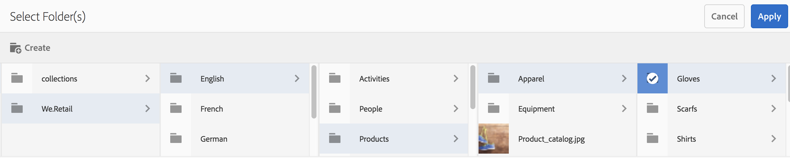

# Utilizar el formulario de esquema de metadatos {#use-the-metadata-schema-form}

Una esquema de metadatos describe la presentación de la Página de Propiedades y las propiedades de metadatos mostradas para activos que utilizan los esquema concretos. La esquema que se aplica a un recurso determina los campos metadatos que aparecen en su Página Propiedades.

El **[!UICONTROL Propiedades]** para cada recurso incluye propiedades de metadatos predeterminadas según el tipo MIME del recurso. Los administradores pueden utilizar el Editor de esquemas de metadatos para modificar esquemas existentes o agregar esquemas de metadatos personalizados. Experience Manager Assets Brand Portal proporciona formularios predeterminados para recursos de varios tipos MIME. Sin embargo, también puede Agregar formularios personalizados para estos activos.

## añadir un formulario metadatos esquema {#add-a-metadata-schema-form}

Para crear un nuevo metadatos esquema formulario, haga lo siguiente:

1. En la barra de herramientas de la parte superior, haga clic en el logotipo Experience Manager para acceder a las herramientas administrativas.

   

1. En el panel de herramientas administrativas, haga clic en **[!UICONTROL Esquemas de metadatos]**.

   

1. En el **[!UICONTROL Forms de esquema de metadatos]** página, haga clic en **[!UICONTROL Crear]**.

   

1. En el **[!UICONTROL Crear formulario de esquema]** , especifique el título del formulario Esquema y, a continuación, haga clic en **[!UICONTROL Crear]** para completar el proceso de creación del formulario.

   

## Edición de un formulario de esquema de metadatos {#edit-a-metadata-schema-form}

Puede editar un formulario de esquema de metadatos recién agregado o existente. El formulario de esquema de metadatos contiene contenido derivado de su elemento principal, incluidas pestañas y elementos de formulario dentro de pestañas. Puede asignar o configurar estos elementos de formulario a un campo dentro de un nodo de metadatos.

Puede agregar nuevas pestañas o elementos de formulario al formulario de esquema de metadatos. Las pestañas derivadas y los elementos de formulario (del elemento principal) están en estado bloqueado. No se pueden modificar en el nivel secundario.

Para editar un formulario de esquema de metadatos, haga lo siguiente:

1. En la barra de herramientas de la parte superior, haga clic en el logotipo del Experience Manager para acceder a las herramientas administrativas.

   

1. En el panel de herramientas administrativas, haga clic en **[!UICONTROL Esquemas de metadatos]**.
1. En el **[!UICONTROL esquema de metadatos Forms]** página, seleccione un formulario esquema para editar sus propiedades, por ejemplo, **[!UICONTROL colección]** .

   

   >[!NOTE]
   >
   >Las plantillas sin editar muestran un símbolo de bloqueo antes que las demás. Si personaliza cualquiera de las plantillas, desaparece el símbolo de bloqueo antes de la plantilla.

1. En la barra de herramientas de la parte superior, haga clic en **[!UICONTROL Editar]**.

   El **[!UICONTROL Editor de esquemas de metadatos]** página se abre con el **[!UICONTROL Básico]** pestaña abierta a la izquierda y el **[!UICONTROL Generar formulario]** pestaña abierta a la derecha.

1. En el **[!UICONTROL Editor de esquemas de metadatos]** página, personalice la **[!UICONTROL Propiedades]** página del recurso arrastrando uno o más componentes desde una lista de tipos de componentes en la **[!UICONTROL Generar formulario]** a la pestaña **[!UICONTROL Básico]** pestaña.

   

1. Para configurar un componente, selecciónelo y modifique sus propiedades en el **[!UICONTROL Configuración]** pestaña.

### Componentes del formulario de compilación pestaña {#components-in-the-build-form-tab}

El **[!UICONTROL formulario]** de compilación pestaña enumera los elementos que se pueden utilizar en el formulario de esquema. La **[!UICONTROL Configuración]** pestaña proporciona los atributos de cada elemento que seleccione en el **[!UICONTROL pestaña de formulario]** de compilación. En la tabla siguiente se enumeran los elementos de formulario disponibles en el **[!UICONTROL formulario]** de compilación pestaña:

| Nombre de la Componente | Descripción |
|---------------------|--------------------------------------------------------------------------------------------------------------------------------------------------------------------------------------------------------------------------------------------------------------------------------------------|
| **[!UICONTROL Encabezado de sección]** | Añada un encabezado de sección para una lista de componentes comunes. |
| **[!UICONTROL Texto de una sola línea]** | Agregue una propiedad de texto de una sola línea. Se almacena como una cadena. |
| **[!UICONTROL Texto con varios valores]** | Agregue una propiedad de texto de varios valores. Se almacena como una matriz de cadenas. |
| **[!UICONTROL Número]** | Añada un componente numérico. |
| **[!UICONTROL Fecha]** | Añadir un componente de fecha. |
| **[!UICONTROL Lista desplegable]** | Añadir un lista desplegable. |
| **[!UICONTROL Etiquetas estándar]** | Añadir una etiqueta. **Nota:** es posible que los administradores necesiten cambiar el valor de ruta, por ejemplo `/etc/tags/mac/<tenant_id>/<custom_tag_namespace>` , si publicar el metadatos esquema formulario de Experience Manager Assets, donde la ruta no incluye la información de los inquilinos, por ejemplo, `/etc/tags/<custom_tag_namespace>` . |
| **[!UICONTROL Etiquetas inteligentes]** | Etiquetas detectadas automáticamente si ha adquirido y configurado el complemento Experience Manager Assets smart tags. |
| **[!UICONTROL Campo oculto]** | Agregue un campo oculto. Se envía como parámetro de POST cuando se guarda el recurso. |
| **[!UICONTROL Recurso al que se hace referencia en]** | Agregue este componente para ver la lista de recursos a los que hace referencia el recurso. |
| **[!UICONTROL Referencia de recursos]** | Agregar para mostrar una lista de recursos que hacen referencia al recurso. |
| **[!UICONTROL Clasificación del recurso]** | Clasificación promedio de un recurso agregado desde Experience Manager Assets antes de publicarse en Brand Portal. |
| **[!UICONTROL Metadatos de contexto]** | Añadir para controlar la visualización de otras fichas de metadatos en la Página Propiedades de activos. |

>[!NOTE]
>
>No utilice **[!UICONTROL las referencias]** del producto, ya que no funciona.

#### Editar el componente metadatos {#edit-the-metadata-component}

Para editar las propiedades de un componente de metadatos del formulario, haga clic en el componente y edite sus propiedades en el **[!UICONTROL pestaña configuración]** .

* **[!UICONTROL Etiquetar]** de campo: el nombre de la propiedad de metadatos que se muestra en el propiedades página del recurso.

* **[!UICONTROL Asignar a la propiedad]**: el valor de esta propiedad proporciona la ruta/nombre relativo al nodo del recurso donde se guarda en el repositorio CRX. Comienza con &quot;**./** &quot;porque indica que la ruta está debajo de la nodo del recurso.

A continuación se muestran los valores válidos para este Propiedad:

-- `./jcr:content/metadata/dc:title`: Almacena el valor en el nodo de metadatos del recurso como propiedad [!UICONTROL `dc:title`].

-- `./jcr:created` : Muestra el propiedad JCR en la nodo de recurso. Si configura estas propiedades en propiedades de vista, le recomendamos que las marque como Deshabilitar edición, ya que están protegidas. De lo contrario, se produce el fallo “Error al modificar los recursos” al guardar las propiedades del recurso.

* **[!UICONTROL Marcador]**: utilice esta propiedad para proporcionar al usuario cualquier información relevante sobre la propiedad de metadatos.
* **[!UICONTROL Requerido]**: utilice esta propiedad para marcar una propiedad de metadatos como obligatoria en la página Propiedades.
* **[!UICONTROL Desactivar edición]**: utilice esta propiedad para que una propiedad de metadatos no se pueda editar en la página Propiedades.
* **[!UICONTROL Mostrar campo vacío en solo lectura]**: Marque esta propiedad para mostrar una propiedad de metadatos en la página Propiedades aunque no tenga valor. De forma predeterminada, cuando una propiedad de metadatos no tiene valor, no se muestra en la página Propiedades.
* **[!UICONTROL Descripción]**: utilice esta propiedad para agregar una descripción breve para el componente de metadatos.
* **[!UICONTROL Icono Eliminar]**: haga clic en este icono para eliminar un componente del formulario de esquema.

>[!NOTE]
>
>Todos los campos de metadatos son de solo lectura en el formulario del editor de metadatos de un recurso. Dado que los metadatos del recurso deben editarse en Experience Manager Assets antes de publicar un recurso en Brand Portal.

#### Agregar o eliminar una pestaña en el formulario de esquema {#add-or-delete-a-tab-in-the-schema-form}

El formulario de esquema predeterminado incluye el **[!UICONTROL Básico]** y **[!UICONTROL Avanzadas]** pestañas. El editor de esquemas permite agregar o eliminar una pestaña.

* Para agregar una pestaña nueva en un formulario de esquema, haga clic en **[!UICONTROL +]** . De forma predeterminada, el pestaña nuevo tiene el nombre &quot;sin nombre-1&quot;. Puede modificar el nombre desde el **[!UICONTROL pestaña configuración]** .

* Para eliminar una pestaña, haga clic en **[!UICONTROL x]**. Clic **[!UICONTROL Guardar]** para guardar los cambios.

## Aplicar un esquema de metadatos a una carpeta {#apply-a-metadata-schema-to-a-folder}

Brand Portal permite personalizar y controlar el esquema de metadatos para que la variable **[!UICONTROL Propiedades]** de un recurso muestra únicamente la información específica que decida mostrar. Para controlar los metadatos mostrados en **[!UICONTROL Propiedades]** , elimine los metadatos requeridos del formulario de esquema de metadatos y aplíquelo a la carpeta específica.

Para aplicar un metadatos esquema formulario a una carpeta, haga lo siguiente:

1. En la barra de herramientas de la parte superior, haga clic en el logotipo Experience Manager para acceder a las herramientas administrativas.

   

1. En el panel Herramientas administrativas, haga clic en **[!UICONTROL esquemas]** de metadatos.

1. En el **[!UICONTROL esquema de metadatos Forms]** página, seleccione el formulario esquema que desee aplicar a un recurso, por ejemplo, **[!UICONTROL ropa]** .

   

1. En la barra de herramientas de la parte superior, haga clic en **[!UICONTROL aplicar a carpeta]** .

1. Desde el **[!UICONTROL Seleccione las carpetas]** , vaya a la carpeta a la que desee aplicar el **[!UICONTROL ropa]** esquema de metadatos, por ejemplo, **[!UICONTROL Guantes]**.

   

1. Clic **[!UICONTROL Aplicar]** para aplicar el formulario de esquema de metadatos a la carpeta.

   Los metadatos disponibles en la variable **[!UICONTROL ropa]** el formulario de esquema de metadatos se aplica al **[!UICONTROL Guantes]** carpeta y visible en el **[!UICONTROL Propiedades]** de la carpeta.

   

>[!NOTE]
>
>Si aplica un esquema que incluye esquemas anidados a una carpeta que contiene archivos de vídeo, es posible que las propiedades de metadatos de los archivos de vídeo no se representen correctamente. Para garantizar que las propiedades de metadatos se representen correctamente, elimine los esquemas anidados y aplique solo el esquema principal a la carpeta.

## Eliminar un formulario de esquema de metadatos {#delete-a-metadata-schema-form}

Brand Portal solo permite eliminar formularios de esquema personalizados. No permite eliminar los formularios o las plantillas de esquema predeterminados. Sin embargo, puede eliminar cualquier cambio personalizado en estos formularios.

Para eliminar un formulario, seleccione un formulario y haga clic en **[!UICONTROL Eliminar]** icono.

>[!NOTE]
>
>Después de eliminar los cambios personalizados realizados en un formulario predeterminado, la variable **[!UICONTROL Bloquear]** vuelve a aparecer antes del nombre del formulario en la interfaz de esquema de metadatos para indicar que el formulario se ha revertido a su estado predeterminado.

## Formularios de esquema para TIPOS MIME {#schema-forms-for-mime-types}

### Adición de nuevos formularios para tipos MIME {#adding-new-forms-for-mime-types}

Además de los formularios predeterminados, puede Agregar formularios personalizados para activos de varios tipos MIME o crear un nuevo formulario bajo un tipo de formulario adecuado. Por ejemplo, para agregar una nueva plantilla para el subtipo **[!UICONTROL imagen/png]**, cree el formulario en los formularios de “imagen”. El título del formulario de esquema es el nombre del subtipo. En este caso, el título es &quot;png&quot;.

#### Uso de una plantilla de esquema existente para varios tipos MIME {#using-an-existing-schema-template-for-various-mime-types}

Puede utilizar una plantilla existente para un tipo MIME diferente. Por ejemplo, utilice el **formulario de imagen/JPEG** para activos de tipo **MIME image/png** .

En este caso, cree un nuevo nodo en [!UICONTROL `/etc/dam/metadataeditor/mimetypemappings`] en el repositorio CRX. Especifique un nombre para el nodo y defina las siguientes propiedades:

| **Nombre** | **Tipo** | **Valor** |
|---|---|---|
| exponsedmimetype | Cadena | image/jpeg |
| mimetipos | Cadena[] | image/png |

* **exponsedmimetype**: Nombre del formulario existente que se va a asignar
* **mimeTypes** : lista de tipos MIME que utilizan el formulario definido en el **atributo exposedmimetype**

Brand portal asigna los siguientes tipos MIME y esquema formularios:

| **Formulario de esquema** | **Tipos MIME** |
|---|---|
| image/jpeg | image/pjpeg |
| image/tiff | imagen/x-TIFF |
| application/pdf | application/postscript |
| aplicación/x-conjunto imágenes | Multipart/Related; type=application/x-ImageSet |
| application/x-SpinSet | Multipart/Related; type=application/x-SpinSet |
| application/x-MixedMediaSet | Multipart/Related; type=application/x-MixedMediaSet |
| video/quicktime | video/x-quicktime |
| video/mpeg4 | video/mp4 |
| video/avi | video/avi, video/msvideo, video/x-msvideo |
| Video/WMV | video/x-ms-wmv |
| video/flv | video/x-flv |

A continuación se muestra una lista de propiedades de metadatos predeterminadas:

* jcr:content/metadata/cq:tags
* jcr:content/metadata/dc:format
* jcr:content/metadata/dam:status
* jcr:content/metadata/videoCodec
* jcr:content/metadata/audioCodec
* jcr:content/metadata/dc:title
* jcr:content/metadata/dc:description
* jcr:content/metadata/xmpMM:InstanceID
* jcr:content/metadata/xmpMM:DocumentID
* jcr:content/metadata/dam:sha1
* jcr:content/metadata/dam:solutionContext
* jcr:content/metadata/videoBitrate
* jcr:content/metadata/audioBitrate
* jcr:content/usages/usedBy
* jcr:content/jcr:lastModified
* jcr:content/metadata/prism:expirationDate
* jcr:content/onTime
* JCR: contenido/offTime
* jcr:content/metadata/dam:size
* JCR: contenido/metadatos/TIFF: ImageWidth
* JCR: contenido/metadatos/TIFF: ImageLength
