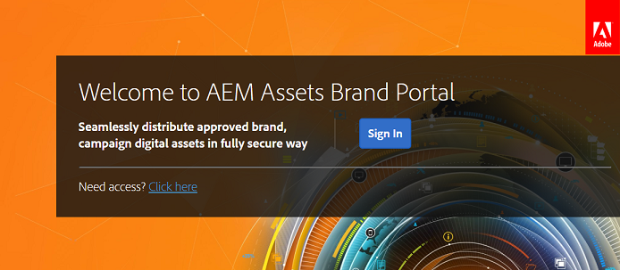

# Experiencia del primer inicio de sesión {#first-time-login-experience}

La primera vez que se inicia sesión es la misma para todos los usuarios nuevos de Assets Brand Portal de Experience Manager, incluidos los administradores. Una vez que un administrador le agrega a la cuenta de Brand Portal de su organización, no necesita aceptar invitaciones y se le agrega automáticamente. Recibirá un correo electrónico de bienvenida que contiene un vínculo a la cuenta de Brand Portal de su organización.

A continuación se indican los pasos que se deben seguir para los usuarios que inician sesión en Brand Portal por primera vez:

1. Abra el correo electrónico de bienvenida y haga clic en **[!UICONTROL Introducción]**.

1. En la página de registro, especifique sus detalles (incluidos el nombre, apellidos, contraseña y país o región).
   >[!NOTE]
   >
   >Si ya es usuario de Adobe Marketing Cloud, se muestra una página de inicio de sesión en lugar de la página de inicio de sesión. Para iniciar sesión en Adobe Marketing Cloud, introduzca su Adobe ID y contraseña.

   >[!NOTE]
   >
   >Si su organización utiliza Enterprise ID, en lugar de ver esta página de registro, se le redirigirá a la página de inicio de sesión de Enterprise. Para obtener más información, consulte [Enterprise ID, inicio de sesión y ayuda de la cuenta](https://helpx.adobe.com/in/enterprise/kb/enterprise-id-faq.html).

1. Haga clic en **[!UICONTROL Continuar]** para continuar con la página de Brand Portal de su organización.
1. En la página de inicio de sesión de Brand Portal, haga clic en **[!UICONTROL Iniciar sesión]** para iniciar sesión en Brand Portal.

   

   >[!NOTE]
   >
   >Para poder iniciar sesión en Brand Portal, debe tener derecho a al menos un perfil de producto de Recursos de Experience Manager.
