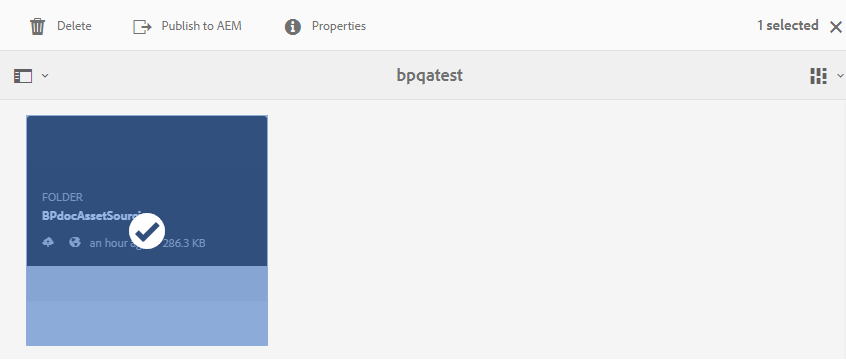

# Publicación de la carpeta de contribución en Recursos AEM {#publish-contribution-folder-to-aem}

Los usuarios de Brand Portal pueden publicar la carpeta de contribución en Recursos AEM sin necesidad de acceder a la instancia de creación de AEM.

Asegúrese de que ha superado los requisitos [de](brand-portal-download-asset-requirements.md) recursos y de cargar los recursos recién creados en la carpeta **NEW** de la carpeta de contribución. Consulte [Carga de recursos en la carpeta](brand-portal-upload-assets-to-contribution-folder.md)de contribución.

**Para publicar la carpeta de contribución:**

1. Inicie sesión en la instancia de Brand Portal.
1. Seleccione la carpeta de contribución en el panel de Brand Portal.
1. Haga clic en **[!UICONTROL Publicar en AEM]** .
   

Se envía una notificación por correo electrónico o por impulso a Brand Portal y a AEM, administrador y usuario en las distintas etapas del flujo de trabajo de publicación:
1. **En cola** : cuando se activan los flujos de trabajo de publicación en Brand Portal, la carpeta de contribución se publica en AEM desde Brand Portal.
1. **En curso** : cuando Recursos AEM empiece a importar la carpeta de contribución.
1. **Completado** : cuando se completa la acción de publicación, la carpeta de contribución se importa correctamente a Recursos AEM.

