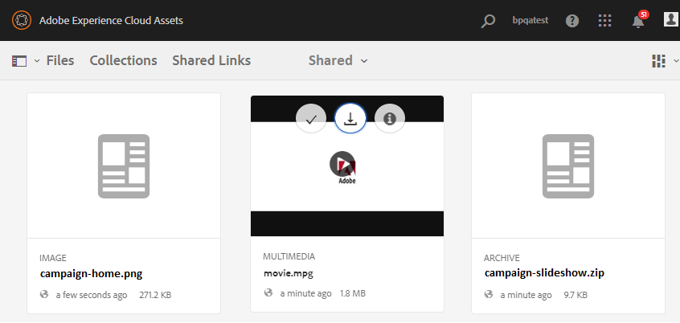
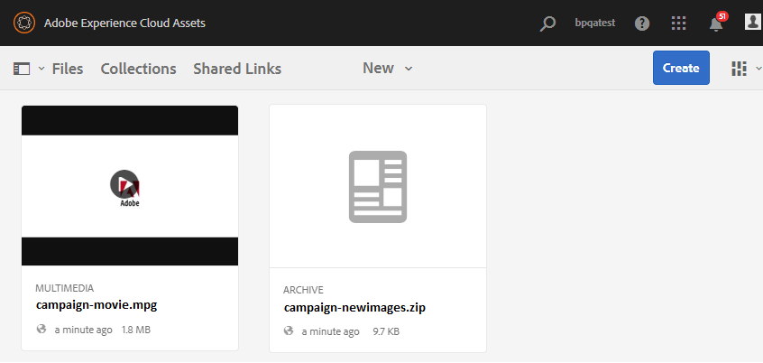

# Publicar carpeta de contribución en AEM Assets {#using-asset-souring-in-bp}

Los usuarios de Brand Portal con los permisos adecuados pueden cargar varios recursos o carpetas que contengan varios recursos en la carpeta de contribución. Sin embargo, los usuarios de Brand Portal solo pueden cargar recursos en la carpeta **NEW** . La carpeta **SHARED** está diseñada para la distribución de recursos de línea de base (contenido de referencia) que pueden utilizar los usuarios de Brand Portal al crear nuevos recursos para la contribución.

El usuario de Brand Portal que tiene permiso para acceder a la carpeta de contribución puede realizar las siguientes actividades:

* [Descargar los requisitos de los recursos](#download-asset-requirements)
* [Cargar nuevos recursos a la carpeta de contribución](#uplad-new-assets-to-contribution-folder)
* [Publicar carpeta de contribución en AEM Assets](#publish-contribution-folder-to-aem)

## Descargar los requisitos de recursos {#download-asset-requirements}

Los usuarios de Brand Portal reciben automáticamente notificaciones por correo electrónico/pulso cada vez que el usuario de AEM comparte una carpeta de contribución, lo que les permite descargar el documento breve (requisito de recursos), así como descargar los recursos de línea de base (contenido de referencia) de la carpeta **SHARED** para asegurarse de que comprenden los requisitos de recursos.

El usuario de Brand Portal realiza las siguientes actividades para descargar los requisitos de recursos:

* **Descargar resumen**: Descargue el documento breve (documento de requisitos de recursos) adjunto a la carpeta de contribución que contiene información relacionada con los recursos, como el tipo de recursos, el propósito, los formatos admitidos, el tamaño máximo de los recursos, etc.
* **Descargar recursos** de línea de base: Descargue los recursos de línea de base que se pueden utilizar para comprender los tipos de recursos necesarios. Los usuarios de Brand Portal pueden utilizar estos recursos como referencia para crear nuevos recursos para la contribución.

El tablero de Brand Portal refleja todas las carpetas existentes permitidas al usuario de Brand Portal junto con la carpeta de contribución recientemente compartida. En este ejemplo, el usuario de Brand Portal solo tiene acceso a la carpeta de contribución recién creada, no se comparte ninguna otra carpeta con el usuario.

**Para descargar los requisitos de recursos:**

1. Inicie sesión en la instancia de Brand Portal.
1. Seleccione la carpeta de contribución en el panel de control de Brand Portal.
1. Haga clic en **[!UICONTROL Propiedades]**. Se abre la ventana Propiedad que contiene los detalles de la carpeta de contribución.

   

   

1. Haga clic en la opción **[!UICONTROL Descargar breve]** para descargar el documento de requisitos de recursos en el equipo local.

   

1. Vuelva al tablero de Brand Portal.
1. Haga clic en para abrir la carpeta de contribución. En la carpeta de contribución, puede ver dos subcarpetas, **[!UICONTROL SHARED]** y **[!UICONTROL NEW]**. La carpeta SHARED contiene todos los recursos de línea de base (contenido de referencia) compartidos por los administradores.
1. Puede descargar la carpeta **[!UICONTROL SHARED]** que contiene todos los recursos de línea de base en el equipo local.
O bien, puede abrir la carpeta **[!UICONTROL SHARED]** y hacer clic en el icono **Download** para descargar archivos/carpetas individuales.

   

   

Consulte el documento breve (documento de requisitos de recursos) y consulte los recursos de línea de base para comprender los requisitos de los recursos. Ahora, puede crear nuevos recursos para la contribución y cargarlos en la carpeta de contribución.

## Cargar recursos a la carpeta de contribución {#uplad-new-assets-to-contribution-folder}

Después de pasar por los requisitos de recursos, los usuarios de Brand Portal pueden crear nuevos recursos para la contribución y cargarlos en la carpeta NEW de la carpeta de contribución.

>[!NOTE]
>
>Los usuarios de Brand Portal solo pueden cargar recursos en la carpeta NEW .
>
>El límite máximo de carga para cualquier inquilino de Brand Portal es **10** GB que se aplica acumulativamente a todas las carpetas de contribución.

>[!NOTE]
>
>Se recomienda liberar el espacio de carga después de publicar la carpeta de contribución en AEM Assets, de modo que esté disponible para los demás usuarios de Brand Portal para la contribución.
>
>Si es necesario ampliar el límite de carga del inquilino de Brand Portal más allá de **10** GB, póngase en contacto con el servicio de asistencia de Adobe para especificar el requisito.

**Para cargar nuevos recursos:**

1. Inicie sesión en la instancia de Brand Portal.
El tablero de Brand Portal refleja todas las carpetas existentes permitidas al usuario de Brand Portal junto con la carpeta de contribución recientemente compartida.

1. Seleccione la carpeta de contribución y haga clic en para abrirla. La carpeta de contribución contiene dos subcarpetas: **[!UICONTROL SHARED]** y **[!UICONTROL NEW]**.

1. Haga clic en la carpeta **[!UICONTROL NEW]**.

   

1. Haga clic en **[!UICONTROL Crear]** > **[!UICONTROL Archivos]** para cargar archivos o carpetas individuales (.zip) que contengan varios recursos.

   

1. Examine y cargue los recursos (archivos o carpetas) en la carpeta **[!UICONTROL NEW]**.

   

Después de cargar todos los recursos o carpetas en la carpeta NEW , publique la carpeta de contribución en AEM Assets.

## Publicar carpeta de contribución en AEM Assets {#publish-contribution-folder-to-aem}

Los usuarios de Brand Portal pueden publicar la carpeta de contribución en AEM Assets sin necesidad de acceder a la instancia de creación de AEM.

Asegúrese de haber pasado por los requisitos de recursos y cargar los recursos recién creados en la carpeta **NEW** dentro de la carpeta de contribución.

**Para publicar la carpeta de contribución:**

1. Inicie sesión en la instancia de Brand Portal.

1. Seleccione la carpeta de contribución en el panel de control de Brand Portal.
1. Haga clic en **[!UICONTROL Publicar en AEM]**.

   

   

Se envía una notificación por correo electrónico o por pulso al usuario y a los administradores de Brand Portal en diferentes etapas del flujo de trabajo de publicación:
1. **En cola** : se envía una notificación al usuario de Brand Portal y a los administradores de Brand Portal cuando se activa un flujo de trabajo de publicación en Brand Portal.

1. **Completado** : se envía una notificación al usuario de Brand Portal y a los administradores de Brand Portal cuando la carpeta de contribución se publica correctamente en AEM Assets.

Después de publicar los recursos recién creados en AEM Assets, los usuarios de Brand Portal pueden eliminarlos de la carpeta NEW . En cambio, el administrador de Brand Portal puede eliminar los recursos de las carpetas NUEVO y COMPARTIDO.

Una vez alcanzado el objetivo de crear la carpeta de contribución, el administrador de Brand Portal puede eliminar la carpeta de contribución para liberar el espacio de carga para otros usuarios.

## Estado del trabajo de publicación {#publishing-job-status}

Los administradores pueden utilizar dos informes para ver el estado de las carpetas de contribución de recursos publicadas desde Brand Portal en AEM Assets.

* En Brand Portal, vaya a **[!UICONTROL Tools]** > **[!UICONTROL Asset Contribution Status]**. Este informe refleja el estado de todos los trabajos de publicación en diferentes etapas del flujo de trabajo de publicación.

   

* En AEM Assets (servicio local o administrado), vaya a **[!UICONTROL Assets]** > **[!UICONTROL Jobs]**. Este informe refleja el estado final (éxito o error) de todos los trabajos de publicación.

   

* En AEM Assets as a Cloud Service, vaya a **[!UICONTROL Assets]** > **[!UICONTROL Trabajos]**.

   O bien, puede navegar directamente a **[!UICONTROL Trabajos]** desde la navegación global.

   Este informe refleja el estado final (éxito o error) de todos los trabajos de publicación, incluida la importación de recursos de Brand Portal a AEM Assets as a Cloud Service.

   

<!--
>[!NOTE]
>
>Currently, no report is generated in AEM Assets as a Cloud Service for the Asset Sourcing workflow. 
-->

