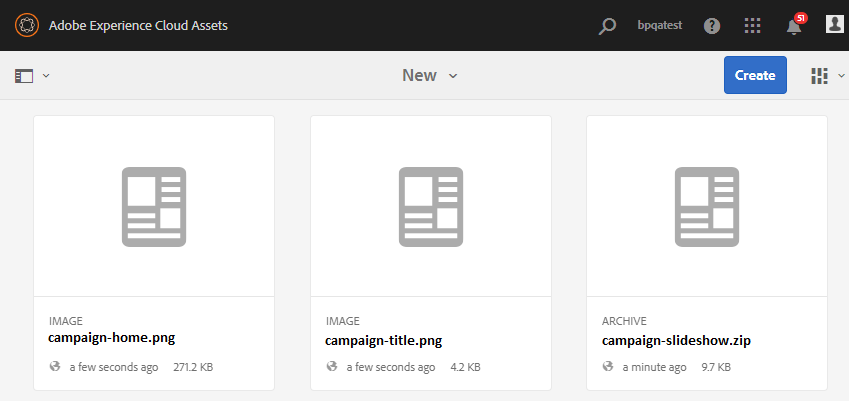

# Publish carpeta de contribución para Experience Manager Assets {#using-asset-souring-in-bp}

Los usuarios de Brand portal con los permisos adecuados pueden cargar múltiples activos o carpetas que contengan varios activos a la carpeta de contribución. No obstante, los usuarios de Brand portal solo pueden cargar activos a la **nueva** carpeta. La **carpeta compartida** está pensada para la distribución de activos de línea de base (referencia contenido) que los usuarios de Brand portal pueden utilizar durante la creación de una nueva activos para la contribución.

Brand portal usuario tener permiso para acceder a la carpeta de contribución puede realizar las siguientes actividades:

* [Requisitos de recurso de descarga](#download-asset-requirements)
* [Cargar nuevas activos en la carpeta de contribución](#uplad-new-assets-to-contribution-folder)
* [Publish carpeta de contribución para Experience Manager Assets](#publish-contribution-folder-to-aem)

## Requisitos de recurso de descarga {#download-asset-requirements}

Los usuarios de Brand portal reciben automáticamente notificaciones de correo electrónico/impulso cada vez que la Experience Manager Assets usuario, lo que permite descargar el informe breve (recurso requisito) documento, así como descargar la línea de base activos (referencia contenido) de la **carpeta compartida** para garantizar que comprenden los requisitos de recurso.

Brand portal usuario realiza las siguientes actividades para descargar requisitos de recurso:

* **Resumen** de descarga: Descargue el informe breve (recurso requisito documento) adjuntado a la carpeta de contribución que contiene recurso información relacionada gustar tipo de activos, propósito, formato admitido, tamaño máximo de recurso, etc.
* **Descargar línea de base activos** : Descargue la línea de base activos que se puede utilizar para comprender los tipos de activos requeridos. Los usuarios de Brand portal pueden utilizar estos activos como referencia para crear nuevos activos para la contribución.

Brand portal panel refleja todas las carpetas existentes permitidas en Brand portal usuario junto con la carpeta de contribución recientemente compartida. En este ejemplo, la usuario de Brand portal solo tiene acceso a la carpeta de contribución recién creada, por lo que no se comparte ninguna otra carpeta existente con la usuario.

**Para descargar requisitos de recurso:**

1. Inicie sesión en su instancia de Brand portal.
1. Seleccione la carpeta de contribución de la panel de Brand portal.
1. Haga clic en **[!UICONTROL propiedades]** . Se abre la ventana de propiedades que contiene los detalles de la carpeta de contribución.

   

   

1. Haga clic en la **[!UICONTROL opción descargar Brief]** para descargar el requisito recurso documento en el equipo local.

   

1. Vuelva al panel de Brand Portal.
1. Haga clic en para abrir la carpeta Contribution, en la que puede ver dos subcarpetas:**[!UICONTROL COMPARTIDO]** y **[!UICONTROL NUEVO]** en la carpeta de contribución. La carpeta COMPARTIDA contiene todos los recursos de línea de base (contenido de referencia) compartidos por los administradores.
1. Puede descargar el **[!UICONTROL COMPARTIDO]** carpeta que contiene todos los recursos de línea de base del equipo local.
O bien, puede abrir el **[!UICONTROL COMPARTIDO]** y haga clic en la **Descargar** para descargar archivos o carpetas individuales.

   

   

Consulte el resumen (documento de requisitos de activos) y consulte los activos de línea de base para comprender los requisitos de activos. Ahora puede crear nuevos recursos para su contribución y cargarlos en la carpeta de contribución.

## Cargar recursos a la carpeta de contribuciones {#upload-new-assets-to-contribution-folder}

Después de revisar los requisitos de los recursos, los usuarios de Brand Portal pueden crear nuevos recursos para la contribución y cargarlos en la NUEVA carpeta, dentro de la carpeta de contribución. Un usuario puede cargar varios recursos en una carpeta de contribución de recursos. Sin embargo, solo se puede crear una carpeta a la vez.

>[!NOTE]
>
>Los usuarios de Brand Portal pueden cargar recursos (un máximo de **2** GB por tamaño de archivo) a la carpeta NEW.
>
>El límite máximo de carga para cualquier inquilino de Brand Portal es **10** GB que se aplica acumulativamente a todas las carpetas de contribución.
>
>Los recursos cargados en Brand Portal no se procesan para representaciones y no contiene vistas previas.

>[!NOTE]
>
>Se recomienda liberar el espacio de carga después de publicar la carpeta de contribución en Experience Manager Assets, de modo que esté disponible para los demás usuarios de Brand Portal para contribuir.
>
>Si es necesario ampliar el límite de carga del inquilino de Brand Portal más allá de **10** GB, póngase en contacto con Atención al cliente especificando el requisito.

**Para cargar nuevos recursos:**

1. Inicie sesión en su instancia de Brand portal.
El portal de marca panel refleja todas las carpetas existentes permitidas en Brand portal usuario junto con la carpeta de contribución recientemente compartida.

1. Seleccione la carpeta de contribución y haga clic en para abrirla. La carpeta de contribución contiene dos subcarpetas: **[!UICONTROL COMPARTIDO]** y **[!UICONTROL NUEVO]**.

1. Haga clic en **[!UICONTROL NUEVO]** carpeta.

   

1. Clic **[!UICONTROL Crear]** > **[!UICONTROL Archivos]** para cargar archivos o carpetas individuales (.zip) que contengan varios recursos.

   

1. Examine y cargue recursos (archivos o carpetas) en **[!UICONTROL NUEVO]** carpeta.

   

Después de cargar todos los recursos o carpetas en la NUEVA carpeta, publique la carpeta Contribution en Experience Manager Assets.

## Publish carpeta de contribución para Experience Manager Assets {#publish-contribution-folder-to-aem}

Los usuarios de Brand portal pueden publicar la carpeta de contribución a Experience Manager Assets sin necesidad de acceder a la Experience Manager autor instancia.

Asegúrese de que ha pasado los requisitos de recurso y cargar la activos recién creada en **nueva** carpeta dentro de la carpeta de contribución.

**Para publicar carpeta de contribución:**

1. Inicie sesión en su instancia de Brand portal.

1. Seleccione la carpeta de contribución de la panel de Brand portal.
1. Clic **[!UICONTROL AEM Publicar en el]**.

   

   

Se envía una notificación por correo electrónico/pulso al usuario y a los administradores de Brand Portal en diferentes etapas del flujo de trabajo de publicación:

1. **En cola** : se envía una notificación al usuario de Brand Portal y a los administradores de Brand Portal cuando se produce un déclencheur en un flujo de trabajo de publicación en Brand Portal.

1. **Completar** : se envía una notificación al usuario de Brand Portal y a los administradores de Brand Portal cuando la carpeta de contribución se publica correctamente en Experience Manager Assets.

Después de publicar los recursos recién creados en Experience Manager Assets, los usuarios de Brand Portal pueden eliminarlos de la nueva carpeta. Por su parte, el administrador de Brand Portal puede eliminar los recursos de las carpetas NUEVO y COMPARTIDO.

Una vez alcanzado el objetivo de crear la carpeta de contribución, el administrador de Brand Portal puede eliminarla para liberar el espacio de carga para otros usuarios.

## Estado del trabajo de publicación {#publishing-job-status}

Existen dos informes que los administradores pueden utilizar para ver el estado de las carpetas de contribución de recursos publicadas desde Brand Portal a Experience Manager Assets.

* En Brand Portal, vaya a **[!UICONTROL Herramientas]** > **[!UICONTROL Estado de contribución de recursos]**. Este informe refleja el estado de todos los trabajos de publicación en diferentes etapas del flujo de trabajo de publicación.

   

* En Experience Manager Assets (local o servicio administrado), vaya a **[!UICONTROL Assets]** > **[!UICONTROL Trabajos]**. Este informe refleja el estado final (éxito o Error) de todos los trabajos de publicación.

   

* En Experience Manager Assets como Cloud Service, vaya a **[!UICONTROL assets]** trabajos ]**de >**[!UICONTROL  .

   O bien, puede navegar directamente a **[!UICONTROL los trabajos]** desde la navegación global.

   Este informe refleja el estado final (éxito o Error) de todos los trabajos de publicación, incluida la importación de activos de Brand portal a Experience Manager Assets como un Cloud Service.

   

<!--
>[!NOTE]
>
>Currently, no report is generated in AEM Assets as a Cloud Service for the Asset Sourcing workflow. 
-->

## Eliminación automática de activos publicado en Experience Manager Assets desde la carpeta de contribución {#automatically-delete-published-assets-from-contribution-folder}

Brand portal ahora ejecuta trabajos automáticos cada doce horas para analizar todas las carpetas de contribución y eliminar todas las activos publicadas en AEM. Como resultado, no es necesario eliminar manualmente la activos en la carpeta de contribución para mantener el tamaño de la carpeta debajo del [ límite ](#upload-new-assets-to-contribution-folder) de umbral. También puede monitor el estado de los trabajos de eliminación que se ejecutan automáticamente durante los últimos siete días. El informe de un trabajo proporciona los siguientes detalles:

* Tiempo de inicio de trabajo
* Hora de finalización del trabajo
* Estado del trabajo
* activos totales incluidos en un trabajo
* La activos total se eliminó correctamente en un trabajo
* almacenamiento totales disponibles como resultado de la ejecución del trabajo

   

También puede profundizar más para vista los detalles de cada recurso que se incluyen en un trabajo de eliminación. Los detalles como el título, el tamaño, el autor, el estado de eliminación y el tiempo de eliminación de recurso se incluyen en el informe.

>[!NOTE]
>
> * Los clientes pueden solicitud Adobe Systems asistencia al cliente deshabilitar y volver a habilitar la capacidad de eliminación automática o cambiar la Frecuencia de su ejecución.
> * Esta función está disponible con Experience Manager 6.5.13.0 y versiones posteriores.

### Informes de eliminación de Ver y descargar {#view-delete-jobs}

Para vista y descargar informes para un trabajo de eliminación:

1. En el portal de marca, vaya a **[!UICONTROL herramientas]** contribución de recursos de > **[!UICONTROL estado]** opción informes ]**de eliminación de >**[!UICONTROL  .

1. Seleccione un trabajo y haga clic en **[!UICONTROL Ver]** para ver el informe.

   Ver los detalles de cada recurso incluido en un trabajo de eliminación. En el informe se incluyen detalles como el título del recurso, el tamaño, el autor, el estado de eliminación y el tiempo de eliminación. Clic **[!UICONTROL Descargar]** para descargar el informe del trabajo en formato CSV.

   El estado de eliminación de un recurso en el informe puede tener los siguientes valores posibles:

   * **Eliminado** - El recurso se ha eliminado correctamente de la carpeta Contribution.

   * **No encontrado** : Brand Portal no pudo encontrar el recurso en la carpeta Contribution. El recurso ya se ha eliminado manualmente de la carpeta.

   * **Omitido** : Brand Portal omitió la eliminación del recurso porque hay una nueva versión disponible para el recurso en la carpeta Contribution que aún no se ha publicado en Experience Manager.

   * **Error** : Brand Portal no ha podido eliminar el recurso. Hay tres intentos de reintento para eliminar un recurso con una `Failed` estado de eliminación. Si el recurso no supera el tercer intento de eliminación de reintentos, debe eliminarlo manualmente.

### Eliminar un informe

Brand Portal también le permite seleccionar uno o varios informes y eliminarlos manualmente.

Para eliminar un informe, haga lo siguiente:

1. Vaya a **[!UICONTROL Herramientas]**>**[!UICONTROL Estado de contribución de recursos]**>**[!UICONTROL Informes de eliminación]** opción.

1. Seleccione uno o varios informes y haga clic en **[!UICONTROL Eliminar]**.

