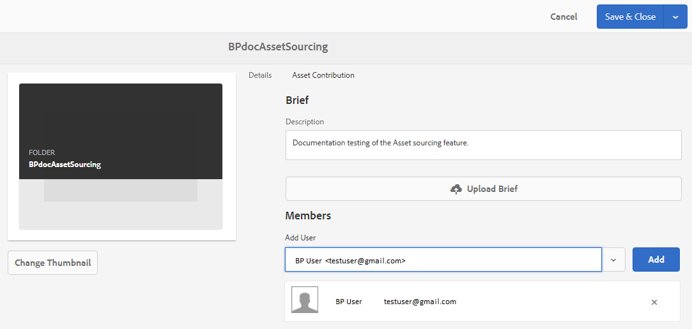
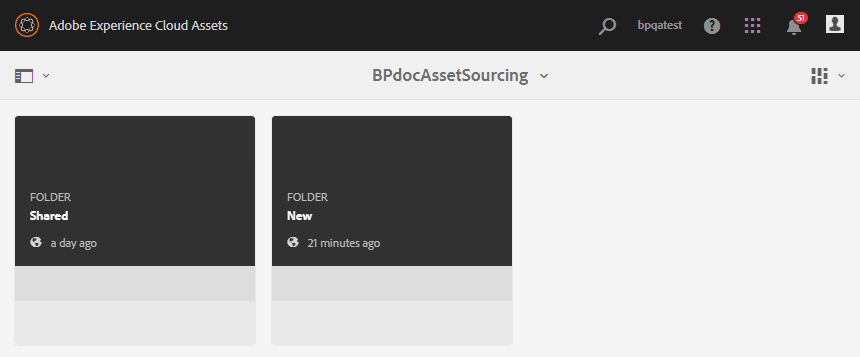
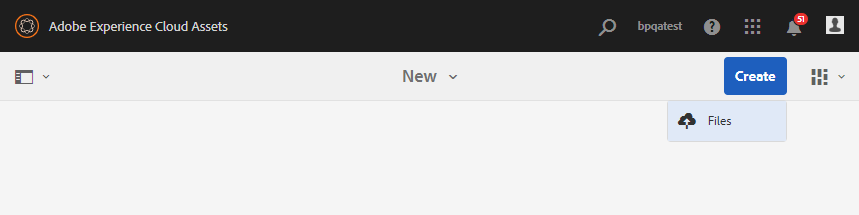
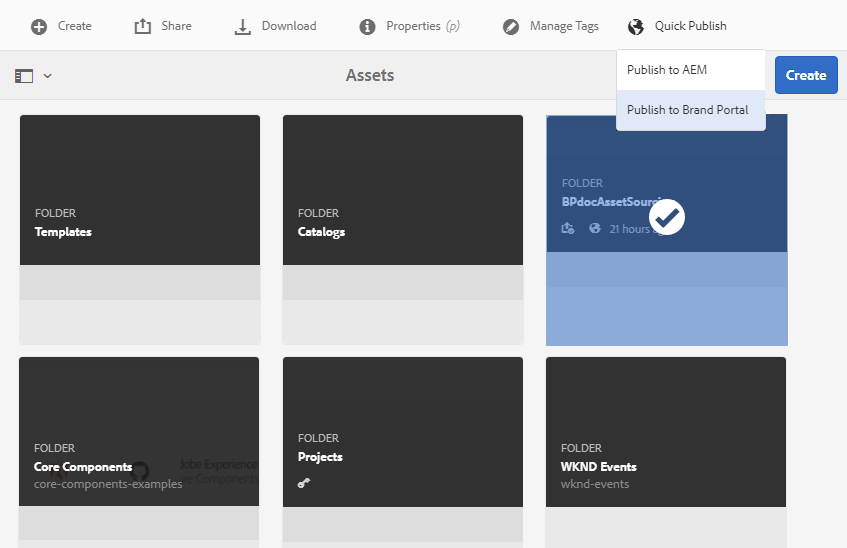

# Configurar la carpeta de contribución en AEM Assets {#configure-contribution-folder}

Para la colaboración con fuentes de recursos, los usuarios de AEM (administradores y usuarios no administradores con permiso) pueden crear nuevas carpetas de tipo **Contribución de recursos**, lo que garantiza que la nueva carpeta creada esté abierta al envío de recursos por parte de los usuarios de Brand Portal.  Esto activa automáticamente un flujo de trabajo que crea dos subcarpetas adicionales, llamadas **SHARED** y **NEW**, dentro de la carpeta **Contribution** recién creada.

A continuación, el usuario de AEM define los requisitos de los recursos cargando un resumen sobre los tipos de recursos que deben agregarse a la carpeta de contribución, así como un conjunto de recursos de línea base, a la carpeta **SHARED** para garantizar que los usuarios de Brand Portal tengan la información que necesitan. A continuación, el administrador puede otorgar a los usuarios activos de Brand Portal acceso a la carpeta de contribución antes de publicar la carpeta de contribución recién creada en Brand Portal.

En el siguiente vídeo se muestra cómo configurar una carpeta de contribución en AEM Assets:

>[!VIDEO](https://video.tv.adobe.com/v/30547)

El usuario de AEM realiza las siguientes actividades al configurar una carpeta de contribución:

* [Crear carpeta de contribución](#create-contribution-folder)
* [Cargar requisitos de recursos y asignar colaboradores](#configure-contribution-folder-properties)
* [Cargar recursos de línea de base](#uplad-new-assets-to-contribution-folder)
* [Publicar carpeta de contribución desde AEM Assets en Brand Portal](#publish-contribution-folder-to-brand-portal)

## Crear carpeta de contribución {#create-contribution-folder}

Los administradores de AEM y los usuarios no administradores que tengan permiso para crear una nueva carpeta pueden crear una carpeta de contribución en AEM Assets.
Para crear una carpeta de contribución, cree una nueva carpeta de tipo Contribución de recursos, asegurándose de que la nueva carpeta creada esté abierta al envío de recursos por parte de los usuarios de Brand Portal.  Esto activa automáticamente un flujo de trabajo que crea dos subcarpetas adicionales, denominadas SHARED y NEW, en la carpeta de contribución.

>[!NOTE]
>
>Puede crear varias carpetas de contribución dentro de una carpeta. No cree una carpeta de contribución dentro de otra carpeta de contribución.

**Para crear una carpeta de contribución:**
1. Inicie sesión en la instancia de AEM Assets.

1. Vaya a **[!UICONTROL Assets]** > **[!UICONTROL Files]**. Enumera todas las carpetas existentes en el repositorio de AEM Assets.

1. Haga clic en **[!UICONTROL Create]** para crear una carpeta nueva. **[!UICONTROL Se abre el cuadro de]** diálogo Crear carpeta .

1. Introduzca **[!UICONTROL Title]** y **[!UICONTROL Name]** de la carpeta y seleccione la casilla de verificación **[!UICONTROL Asset Contribution]**.
Se recomienda utilizar letras minúsculas sin ningún espacio para asignar un nombre a la carpeta.

1. Haga clic en **[!UICONTROL Crear]**. Puede ver la carpeta de contribución en el repositorio de AEM Assets.

   >[!NOTE]
   >
   >Un usuario no administrador puede crear y compartir una carpeta de contribución de recursos, pero no puede modificarla ni eliminarla.

   

1. Haga clic en para abrir la carpeta de contribución. Verá dos subcarpetas:**[!UICONTROL SHARED]** y **[!UICONTROL NEW]** se crean automáticamente dentro de la carpeta de contribución.

   

Ahora puede configurar las propiedades de la carpeta de contribución.

## Configurar las propiedades de la carpeta de contribución {#configure-contribution-folder-properties}

El administrador de AEM realiza las siguientes actividades al configurar las propiedades de una carpeta de contribución.

* **Agregar descripción**: Proporcione una descripción de alto nivel de la carpeta de contribución.
* **Cargar información**: Cargar el documento de requisitos de recursos que contiene información relacionada con los recursos.
* **Agregar colaboradores**: Agregue usuarios de Brand Portal para otorgarles acceso a la carpeta de contribución.

El requisito de recursos se refiere a los detalles proporcionados por los administradores para ayudar a los colaboradores (usuarios de Brand Portal) a comprender la necesidad y los requisitos de la carpeta de contribución. El administrador carga un documento de requisitos de recursos que contiene información breve sobre el tipo de recursos que se deben agregar a la carpeta de contribución y la información relacionada con los recursos, por ejemplo, el propósito, el tipo de imágenes, el tamaño máximo, etc.

**Para configurar las propiedades de la carpeta de contribución:**

1. Inicie sesión en la instancia de AEM Assets.

1. Vaya a **[!UICONTROL Assets > Files]** y busque la carpeta de contribución.
1. Seleccione la carpeta de contribución y haga clic en **[!UICONTROL Properties]** para abrir la ventana Propiedades de la carpeta.

   

   

1. Vaya a la pestaña **[!UICONTROL Contribución de recursos]**.
1. Introduzca **[!UICONTROL Description]** de alto nivel de la carpeta de contribución.
1. Haga clic en **[!UICONTROL Cargar resumen]** para buscar desde el equipo local y cargar un **documento de requisitos de recursos**.

   

1. En el campo **[!UICONTROL Agregar usuario]**, agregue usuarios de Brand Portal con los que desee compartir la carpeta de contribución. Estos usuarios pueden acceder y cargar contenido en la carpeta de contribución a través de la interfaz de Brand Portal.
1. Haga clic en **[!UICONTROL Guardar]**.

   

>[!NOTE]
>
>Los resultados de la búsqueda se basan en la lista de usuarios de Brand Portal configurada en AEM Assets. Asegúrese de tener la lista de usuarios actualizada de Brand Portal.

## Cargar recursos a la carpeta de contribución {#uplad-new-assets-to-contribution-folder}

Los usuarios de Brand Portal pueden descargar los requisitos de recursos para comprender la necesidad de la contribución.
A continuación, pueden crear nuevos recursos para la contribución y cargarlos en la carpeta NEW dentro de la carpeta de contribución.

>[!NOTE]
>
>Los usuarios de Brand Portal solo pueden cargar recursos en la carpeta NEW .
>
>El límite máximo de carga para cualquier inquilino de Brand Portal es **10** GB que se aplica acumulativamente a todas las carpetas de contribución.

Después de publicar los recursos recién creados en AEM Assets, los usuarios de Brand Portal pueden eliminarlos de la carpeta NEW . En cambio, el administrador de Brand Portal puede eliminar los recursos de las carpetas NUEVO y COMPARTIDO.

Una vez alcanzado el objetivo de crear la carpeta de contribución, el administrador de Brand Portal puede eliminar la carpeta de contribución para liberar el espacio de carga para otros usuarios.

>[!NOTE]
>
>Se recomienda liberar el espacio de carga después de publicar la carpeta de contribución en AEM Assets, de modo que esté disponible para los demás usuarios de Brand Portal para la contribución.
>
>Si es necesario ampliar el límite de carga del inquilino de Brand Portal más allá de **10** GB, póngase en contacto con el servicio de asistencia de Adobe para especificar el requisito.

**Para cargar nuevos recursos:**

1. Inicie sesión en la instancia de Brand Portal.
El tablero de Brand Portal refleja todas las carpetas existentes permitidas al usuario de Brand Portal junto con la carpeta de contribución recientemente compartida.

1. Seleccione la carpeta de contribución y haga clic en para abrirla. La carpeta de contribución contiene dos subcarpetas: **[!UICONTROL SHARED]** y **[!UICONTROL NEW]**.

1. Haga clic en la carpeta **[!UICONTROL NEW]**.

   

1. Haga clic en **[!UICONTROL Crear]** > **[!UICONTROL Archivos]** para cargar archivos o carpetas individuales (.zip) que contengan varios recursos.

   

1. Examine y cargue los recursos (archivos o carpetas) en la carpeta **[!UICONTROL NEW]**.

   

Después de cargar todos los recursos o carpetas en la carpeta NEW , publique la carpeta de contribución en AEM Assets.

## Publicar carpeta de contribución en Brand Portal {#publish-contribution-folder-to-brand-portal}

Una vez configurada la carpeta de contribución, el usuario de AEM (administrador/usuario no administrador) puede publicar la carpeta de contribución de AEM Assets en Brand Portal. Los usuarios de Brand Portal que tengan permiso para acceder a la carpeta de contribución recibirán una notificación por correo electrónico o por pulso una vez finalizada la acción de publicación.

**Para publicar la carpeta de contribución:**

1. Inicie sesión en la instancia de AEM Assets.

1. Vaya a **[!UICONTROL Assets > Archivos]** y busque la carpeta de contribución en la que desea publicar en Brand Portal.
1. Seleccione la carpeta de contribución y haga clic en **[!UICONTROL Publicación rápida]** > **[!UICONTROL Publicar en Brand Portal]**.

   

   Recibirá un mensaje de éxito una vez que la carpeta de contribución se publique en Brand Portal.

Se envía una notificación por correo electrónico o por pulso a los usuarios de Brand Portal asignados a la carpeta de contribución. Los usuarios de Brand Portal pueden acceder a la carpeta de contribución y comenzar la contribución. Consulte [Cargar recursos a la carpeta de contribución y publicarlos en AEM Assets](brand-portal-publish-contribution-folder-to-aem-assets.md).
