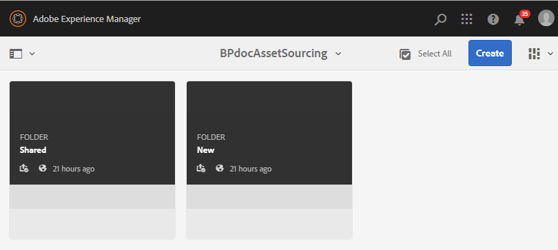

# Configurar la carpeta de contribución en Experience Manager Assets {#configure-contribution-folder}

Para la colaboración de fuentes de recursos, los usuarios de Experience Manager Assets (administradores y usuarios no administradores con permiso) pueden crear nuevas carpetas de tipo **Contribución de recursos**, lo que garantiza que la nueva carpeta creada esté abierta al envío de recursos por parte de los usuarios de Brand Portal.  Esto déclencheur automáticamente un flujo de trabajo que crea dos subcarpetas adicionales, llamadas **COMPARTIDO** y **NUEVO**, dentro del **Contribución** carpeta.

A continuación, el usuario de Experience Manager Assets define los requisitos de los recursos cargando un resumen sobre los tipos de recursos que se deben añadir a la carpeta de contribución, así como un conjunto de recursos de línea base, en la variable **COMPARTIDO** para garantizar que los usuarios de Brand Portal tengan la información que necesitan. A continuación, el administrador puede conceder a los usuarios activos de Brand Portal acceso a la carpeta de contribución antes de publicar la carpeta de contribución recién creada en Brand Portal.

En el siguiente vídeo se muestra cómo configurar una carpeta de contribución en Experience Manager Assets:

>[!VIDEO](https://video.tv.adobe.com/v/30547)

El usuario de Experience Manager Assets realiza las siguientes actividades al configurar una carpeta de contribución:

* [Crear carpeta de contribución](#create-contribution-folder)
* [Cargar requisitos de recursos y asignar colaboradores](#configure-contribution-folder-properties)
* [Cargar recursos de línea de base](#uplad-new-assets-to-contribution-folder)
* [Publicar carpeta de contribución de Experience Manager Assets en Brand Portal](#publish-contribution-folder-to-brand-portal)

## Crear carpeta de contribución {#create-contribution-folder}

Los administradores de Experience Manager Assets y los usuarios no administradores que tengan permiso para crear una carpeta nueva pueden crear una carpeta de contribución en Experience Manager Assets.
Para crear una carpeta de contribución, cree una nueva carpeta de tipo Contribución de recursos y asegúrese de que la nueva carpeta creada esté abierta al envío de recursos por parte de los usuarios de Brand Portal.  Esto déclencheur automáticamente un flujo de trabajo que crea dos subcarpetas adicionales, denominadas SHARED y NEW, dentro de la carpeta de contribución.

>[!NOTE]
>
>Los administradores pueden crear varias carpetas de contribución de recursos dentro de una carpeta.
>
>Una carpeta de contribución de recursos contiene carpetas NUEVAS y COMPARTIDAS para la distribución y contribución de los recursos. No cree ninguna carpeta de recursos, carpetas o contribuciones dentro de una carpeta de contribución.

Puede configurar las propiedades de la carpeta de contribución por separado, así como al crear la carpeta de contribución. En este ejemplo, configuramos las propiedades por separado.

**Para crear una carpeta de contribución:**

1. Inicie sesión en la instancia de Experience Manager Assets.

1. Vaya a **[!UICONTROL Recursos]** > **[!UICONTROL Archivos]**. Enumera todas las carpetas existentes en el repositorio de Experience Manager Assets.

1. Haga clic en **[!UICONTROL Crear]** para crear una carpeta nueva. **[!UICONTROL Crear carpeta]** se abre.

1. Entrar **[!UICONTROL Título]** y **[!UICONTROL Nombre]** de la carpeta y seleccione la **[!UICONTROL Contribución de recursos]** en el Navegador.
Se recomienda utilizar letras minúsculas sin ningún espacio para asignar un nombre a la carpeta.

1. Haga clic en **[!UICONTROL Crear]**. Puede ver la carpeta de contribución en el repositorio de Experience Manager Assets.

   >[!NOTE]
   >
   >Un usuario no administrador puede crear y compartir una carpeta de contribución de recursos, pero no puede modificarla ni eliminarla.

   

1. Haga clic para abrir la carpeta de contribución. Verá dos subcarpetas:**[!UICONTROL COMPARTIDO]** y **[!UICONTROL NUEVO]** se crean automáticamente dentro de la carpeta de contribución.

   

## Configuración de las propiedades de la carpeta de contribución {#configure-contribution-folder-properties}

El administrador de Experience Manager Assets realiza las siguientes actividades al configurar las propiedades de una carpeta de contribución.

* **Agregar descripción**: Proporcione una descripción de alto nivel de la carpeta de contribución.
* **Cargar información**: Cargar el documento de requisitos de recursos que contiene información relacionada con los recursos.
* **Agregar colaboradores**: Agregue usuarios de Brand Portal para otorgarles acceso a la carpeta de contribución.

El requisito de recursos se refiere a los detalles proporcionados por los administradores para ayudar a los colaboradores (usuarios de Brand Portal) a comprender la necesidad y los requisitos de la carpeta de contribución. El administrador carga un documento de requisitos de recursos que contiene información breve sobre el tipo de recursos que se deben agregar a la carpeta de contribución y la información relacionada con los recursos, por ejemplo, el propósito, el tipo de imágenes, el tamaño máximo, etc.

**Para configurar las propiedades de la carpeta de contribución:**

1. Inicie sesión en la instancia de Experience Manager Assets.

1. Vaya a **[!UICONTROL Assets > Archivos]** y busque la carpeta de contribución.
1. Seleccione la carpeta de contribución y haga clic en **[!UICONTROL Propiedades]** para abrir la ventana Propiedades de la carpeta.

   

   

1. Vaya a **[!UICONTROL Contribución de recursos]** pestaña .
1. Introducir de alto nivel **[!UICONTROL Descripción]** de la carpeta de contribución.
1. Haga clic en **[!UICONTROL Cargar resumen]** para navegar desde el equipo local y cargar un **Documento de requisitos de recursos**.

   

1. En el **[!UICONTROL Agregar usuario]** , agregue los usuarios de Brand Portal con los que desee compartir la carpeta de contribución. Estos usuarios pueden acceder y cargar contenido en la carpeta de contribución a través de la interfaz de Brand Portal.
1. Haga clic en **[!UICONTROL Guardar]**.

   

>[!NOTE]
>
>Los resultados de la búsqueda se basan en la lista de usuarios de Brand Portal configurada en Experience Manager Assets. Asegúrese de tener la lista de usuarios de Brand Portal actualizada.

Los administradores pueden descargar la `user.csv` del archivo [!DNL Admin Console] y utilícelo como plantilla base para añadir usuarios de Brand Portal. Vaya a [!UICONTROL Usuarios] y haga clic en el botón [!UICONTROL Exportar lista de usuarios a csv] para descargar la `users.csv` archivo. La siguiente lista de usuarios de ejemplo detalla los atributos necesarios para agregar los usuarios. El único atributo obligatorio para una entrada de usuario es el `Email` y todos los demás atributos son opcionales.

[Obtener archivo](assets/users.csv)

## Cargar recursos a la carpeta de contribución {#uplad-new-assets-to-contribution-folder}

El usuario de Experience Manager Assets carga un conjunto de recursos de línea de base en la variable **COMPARTIDO** para garantizar que los usuarios de Brand Portal tengan la información que necesitan.

**Para cargar recursos de línea de base:**

1. Inicie sesión en la instancia de Experience Manager Assets.

1. Vaya a **[!UICONTROL Assets > Archivos]** y busque la carpeta de contribución.

1. Seleccione la carpeta de contribución y haga clic en para abrirla.

1. Haga clic en el **[!UICONTROL NUEVO]** carpeta.

   

1. Haga clic en **[!UICONTROL Crear]** > **[!UICONTROL Archivos]** para cargar archivos individuales o carpetas (.zip) que contengan varios recursos.

   

1. Examine y cargue recursos (archivos o carpetas) en el **[!UICONTROL NUEVO]** carpeta.

   

Después de cargar todos los recursos o carpetas en la carpeta NEW , publique la carpeta de contribución en Experience Manager Assets.

## Publicar carpeta de contribución en Brand Portal {#publish-contribution-folder-to-brand-portal}

Una vez configurada la carpeta de contribución, el usuario de Experience Manager Assets (administrador/usuario no administrador) puede publicar la carpeta de contribución de Experience Manager Assets en Brand Portal. Los usuarios de Brand Portal que tengan permiso para acceder a la carpeta de contribución recibirán una notificación por correo electrónico o por pulso una vez finalizada la acción de publicación.

**Para publicar la carpeta de contribución:**

1. Inicie sesión en la instancia de Experience Manager Assets.

1. Vaya a **[!UICONTROL Assets > Archivos]** y busque la carpeta de contribución en la que desea publicar en Brand Portal.
1. Seleccione la carpeta de contribución y haga clic en **[!UICONTROL Publicación rápida]** > **[!UICONTROL Publicar en Brand Portal]**.

   

   Recibirá un mensaje de éxito una vez que la carpeta de contribución se publique en Brand Portal.

Se envía una notificación por correo electrónico o por impulso a los usuarios de Brand Portal asignados a la carpeta de contribución. Los usuarios de Brand Portal pueden acceder a la carpeta de contribución y comenzar la contribución. Consulte [Cargar recursos a la carpeta de contribución y publicar en Experience Manager Assets](brand-portal-publish-contribution-folder-to-aem-assets.md).
