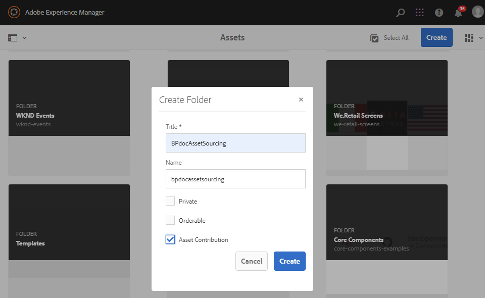

# Configuración de la carpeta Contribution en Experience Manager Assets {#configure-contribution-folder}

Para el abastecimiento colaborativo de recursos, los usuarios de Experience Manager Assets (administradores y no administradores con permiso) pueden crear nuevas carpetas de tipo **Contribución de recursos**, asegurándose de que la nueva carpeta creada esté abierta al envío de recursos por parte de los usuarios de Brand Portal.  Esto almacena automáticamente en déclencheur un flujo de trabajo que crea dos subcarpetas adicionales, denominadas **COMPARTIDO** y **NUEVO**, en el recién creado **Contribución** carpeta.

A continuación, el usuario de Experience Manager Assets define los requisitos de los recursos cargando una breve descripción de los tipos de recursos que se deben añadir a la carpeta Contribution, así como un conjunto de recursos de línea de base, a **COMPARTIDO** para garantizar que los usuarios de Brand Portal tengan la información que necesitan. El administrador puede otorgar a los usuarios activos de Brand Portal acceso a la carpeta Contribution antes de publicar la carpeta Contribution recién creada en Brand Portal.

En el siguiente vídeo se muestra cómo configurar una carpeta Contribution en Experience Manager Assets:

>[!VIDEO](https://video.tv.adobe.com/v/30547)

El usuario de Experience Manager Assets realiza las siguientes actividades al configurar una carpeta de contribución:

* [Crear carpeta de contribuciones](#create-contribution-folder)
* [Cargar requisitos de recursos y asignar colaboradores](#configure-contribution-folder-properties)
* [Cargar línea de base activos](#uplad-new-assets-to-contribution-folder)
* [Publish carpeta de contribución de Experience Manager Assets a Brand portal](#publish-contribution-folder-to-brand-portal)

## Crear carpeta de contribución {#create-contribution-folder}

Experience Manager Assets los administradores y usuarios que no son administradores no permiso crear una nueva carpeta, puede crear una carpeta de contribución en Experience Manager Assets.
Para crear una carpeta de contribución, cree una nueva carpeta de tipo contribución del recurso, asegurándose de que la nueva carpeta creada esté abierta recurso el envío por los usuarios de Brand portal.  Esto activa automáticamente una flujo de trabajo que crea dos subcarpetas adicionales, denominadas SHARED y NEW, dentro de la carpeta de contribución.

>[!NOTE]
>
>Los administradores pueden crear varias carpetas de contribución recurso dentro de una carpeta.
>
>Una carpeta de contribución de recursos contiene carpetas NUEVAS y COMPARTIDAS para la distribución y contribución de los recursos. No cree ningún recurso, carpeta ni carpeta de contribución dentro de una carpeta de contribución.

Puede configurar las propiedades de la carpeta Contribution por separado y al crear la carpeta Contribution. En este ejemplo, configuramos las propiedades por separado.

**Para crear una carpeta de contribución:**

1. Inicie sesión en su Experience Manager Assets instancia.

1. Vaya a **[!UICONTROL Assets]** > **[!UICONTROL Archivos]**. Enumera todas las carpetas existentes en el repositorio de Experience Manager Assets.

1. Clic **[!UICONTROL Crear]** para crear una carpeta nueva. **[!UICONTROL Crear carpeta]** se abre.

1. Entrar **[!UICONTROL Título]** y **[!UICONTROL Nombre]** de la carpeta y seleccione la **[!UICONTROL Contribución de recursos]** casilla de verificación.
Se recomienda utilizar letras minúsculas sin ningún espacio para asignar un nombre a la carpeta.

1. Haga clic en **[!UICONTROL Crear]**. Puede ver la carpeta de contribución en la lista del repositorio de Experience Manager Assets.

   >[!NOTE]
   >
   >Un usuario no administrador puede crear y compartir una carpeta de contribución de recursos, pero no puede modificarla ni eliminarla.

   

1. Haga clic en para abrir la carpeta Contribution, en la que puede ver dos subcarpetas:**[!UICONTROL COMPARTIDO]** y **[!UICONTROL NUEVO]** se crean automáticamente en la carpeta de contribución.

   

## Configurar propiedades de la carpeta Contribution {#configure-contribution-folder-properties}

Experience Manager Assets administrator realiza las siguientes actividades mientras configura las propiedades de una carpeta de contribución.

* **Añadir descripción**: proporcione una descripción de alto nivel de la carpeta de contribución.
* **Brief** cargar: requisito de carga de recursos documento que contiene información relacionada con recurso.
* **Colaboradores** de añadir: Añadir Brand portal a los usuarios que les conceden acceso a la carpeta de contribución.

Los requisitos del recurso se refieren a los detalles que proporcionan los administradores para ayudar a los colaboradores (usuarios de Brand portal) a comprender la necesidad y los requisitos de la carpeta de contribución. El administrador carga una recurso requisito documento que contiene un breve informe sobre el tipo de activos que debe añadirse a la carpeta de contribución y recurso información relacionada, por ejemplo, propósito, tipo de imágenes, tamaño máximo, etc.

**Para configurar las propiedades de la carpeta de contribución:**

1. Inicie sesión en la instancia de Experience Manager Assets.

1. Vaya a **[!UICONTROL Recursos > Archivos]** y busque la carpeta de contribución.
1. Seleccione la carpeta de contribución y haga clic en **[!UICONTROL Propiedades]** para abrir la ventana Folder properties.

   

   

1. Desplácese a contribución ]**de**[!UICONTROL  recursos pestaña.
1. Introduzca Descripción ]**de alto nivel**[!UICONTROL  de la carpeta de contribución.
1. Haga clic en **[!UICONTROL cargar Brief]** para buscar desde su equipo local y cargar un **documento** de requisitos del recurso.

   

1. En el **[!UICONTROL campo añadir usuario]** , agregue los usuarios de Brand portal con los que desee compartir la carpeta de contribución. Estos usuarios pueden acceder y cargar contenido en la carpeta de contribuciones mediante la interfaz de Brand Portal.
1. Haga clic en **[!UICONTROL Guardar]**.

   

>[!NOTE]
>
>Los resultados de la búsqueda se basan en la lista de usuarios de Brand Portal configurada en Experience Manager Assets. Asegúrese de tener la lista de usuarios de Brand Portal actualizada.

Los administradores pueden descargar `user.csv` archivo de [!DNL Admin Console] y utilícela como plantilla base para añadir usuarios de Brand Portal. Ir a [!UICONTROL Usuarios] y haga clic en [!UICONTROL Exportar lista de usuarios a csv] opción para descargar `users.csv` archivo. La siguiente lista de usuarios de ejemplo detalla los atributos necesarios para agregar a los usuarios. El único atributo obligatorio para una entrada de usuario es `Email` y todos los demás atributos son opcionales.

[Obtener archivo](assets/users.csv)

## Cargar activos en la carpeta de contribución {#uplad-new-assets-to-contribution-folder}

Experience Manager Assets usuario carga un conjunto de activos de línea de base en la **carpeta compartida** para garantizar que los usuarios de Brand portal tengan la información que necesitan.

**Para cargar activos de línea de base:**

1. Inicie sesión en su Experience Manager Assets instancia.

1. Vaya a **[!UICONTROL Recursos > Archivos]** y busque la carpeta de contribución.

1. Seleccione la carpeta de contribución y haga clic en para abrirla.

1. Haga clic en **[!UICONTROL NUEVO]** carpeta.

   

1. Haga clic en **[!UICONTROL crear]** > **[!UICONTROL archivos]** para cargar archivos individuales o carpetas (. zip) que contengan varios activos.

   

1. Examinar y cargar activos (archivos o carpetas) en la **[!UICONTROL nueva]** carpeta.

   

Después de cargar todos los activos o carpetas en la nueva carpeta, publicar la carpeta de contribución a Experience Manager Assets.

## Publicar carpeta de contribución en Brand Portal {#publish-contribution-folder-to-brand-portal}

Una vez configurada la carpeta de contribución, el usuario de Experience Manager Assets (administrador/usuario no administrador) puede publicar la carpeta de contribución de Experience Manager Assets a Brand Portal. Los usuarios de Brand Portal que tengan permiso para acceder a la carpeta de contribuciones recibirán una notificación por correo electrónico/pulso al finalizar la acción de publicación.

**Para publicar la carpeta Contribution:**

1. Inicie sesión en la instancia de Experience Manager Assets.

1. Vaya a **[!UICONTROL Recursos > Archivos]** y busque la carpeta de contribución en la que desea publicar en Brand Portal.
1. Seleccione la carpeta de contribución y haga clic en **[!UICONTROL Publicación rápida]** > **[!UICONTROL Publicar en Brand Portal]**.

   

   Recibirá un mensaje de éxito una vez que la carpeta de contribución se publique en Brand Portal.

Se envía una notificación por correo electrónico/pulso a los usuarios de Brand Portal asignados a la carpeta Contribution. Los usuarios de Brand Portal pueden acceder a la carpeta de contribuciones y comenzar la contribución. Consulte. [Cargar recursos a la carpeta Contribution y publicarlos en Experience Manager Assets](brand-portal-publish-contribution-folder-to-aem-assets.md).
