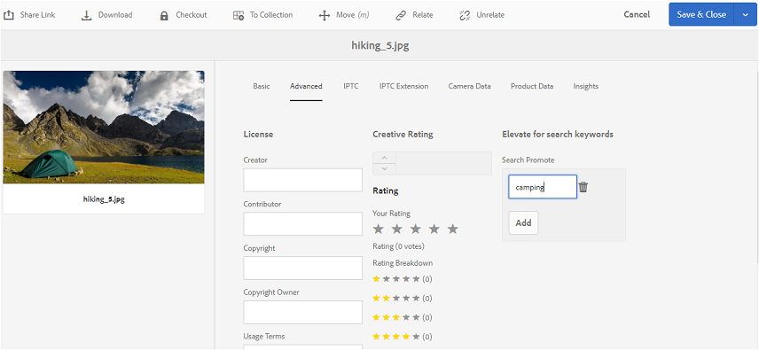

# Publicar etiquetas en Brand Portal {#publish-tags-to-brand-portal}

Obtenga información sobre cómo publicar etiquetas de Experience Manager Assets en Brand Portal.

Las etiquetas son útiles para organizar los recursos y mejorar la capacidad de búsqueda de los recursos a los que están asociados. Las etiquetas pueden considerarse como palabras clave o etiquetas (metadatos) que están adjuntas a los recursos, y permiten que los recursos se encuentren rápidamente como resultado de una búsqueda. Para saber cómo asignar etiquetas a recursos en Experience Manager Assets, consulte [usar etiquetas para organizar recursos](https://experienceleague.adobe.com/docs/experience-manager-65/assets/managing/organize-assets.html).

Las etiquetas (asociadas con recursos y colecciones en AEM) se publican automáticamente en Brand Portal cuando los recursos (y colecciones) con etiquetas asociadas se publican en Brand Portal. Las etiquetas publicadas son útiles para permitir que las búsquedas encuentren los recursos asociados.

>[!NOTE]
>
>Sin embargo, se recomienda publicar exclusivamente etiquetas en Brand Portal antes de publicar los recursos (y colecciones) con los que están asociadas las etiquetas. Esto garantiza una publicación más rápida de los recursos (y colecciones) en Brand Portal.

## Administrar etiquetas {#manage-tags}

Puede utilizar las etiquetas preexistentes para adjuntarlas a un recurso o crear nuevas etiquetas desde AEM consola Etiquetas (**[!UICONTROL Herramientas | Etiquetado | Etiquetas AEM]**). En ambos casos, primero debe publicar las etiquetas en Brand Portal y luego asociarlas con los recursos adecuados.

Para crear etiquetas en AEM, publicar las etiquetas en Brand Portal y asociarlas a los recursos (o colecciones) adecuados, siga estos pasos:

1. **Cree**
EtiquetasInicie sesión en la instancia de AEM Author con privilegios administrativos y acceda a  **[!UICONTROL AEM consola]** Etiquetas desde la navegación global:

   1. Seleccionar **[!UICONTROL Herramientas]**

   1. Seleccione **[!UICONTROL General]**

   1. Seleccione **[!UICONTROL Etiquetado]**

1. Seleccione **[!UICONTROL Crear]** y, a continuación, seleccione la opción **[!UICONTROL Crear etiqueta]**.
1. Especifique:

   * **[!UICONTROL Título]**

      *(obligatorio)* Un título que se muestra para la etiqueta.
   * **[!UICONTROL Nombre]**
      *(obligatorio)* Un nombre para la etiqueta. Si no se especifica, se crea un nombre de nodo válido desde el Título. Consulte [TagID](https://experienceleague.adobe.com/docs/experience-manager-65/developing/platform/tagging/framework.html).
   * **Descripción**

      *(opcional)* Una descripción de la etiqueta.
   * **Tag**
PathJCR path de la etiqueta .

1. Seleccione **[!UICONTROL Submit]** para crear la etiqueta.

   Una vez que haya creado una etiqueta en AEM instancia, la etiqueta estará disponible para adjuntarse a un recurso (mediante la sección Propiedades o la sección Administrar etiquetas de ese recurso).

1. **Publique la etiqueta en Brand Portal**.

   Vaya a la consola **[!UICONTROL AEM Etiquetas]** ([!UICONTROL Herramientas | Etiquetado | AEM Etiquetas]), seleccione la etiqueta que desee y publique en Brand Portal.

1. **Adjunte la etiqueta a un recurso (o colección)**.

   Seleccione un recurso (o colección) y adjunte la etiqueta deseada mediante la sección Propiedades o la sección Administrar etiquetas de ese recurso. Para obtener más información sobre cómo asignar etiquetas a recursos en AEM Assets, consulte [usar etiquetas para organizar recursos](https://experienceleague.adobe.com/docs/experience-manager-65/assets/managing/organize-assets.html).

1. **Publicar recursos (o colecciones) en Brand Portal**.\
   Cuando publica un recurso (o colección) en Brand Portal, la etiqueta adjunta también está disponible en Brand Portal.

   Para ver la etiqueta adjunta en el recurso (o colección) correspondiente de Brand Portal, inicie sesión en Brand Portal y seleccione el recurso. En la sección Propiedades , verá la etiqueta adjunta.

## Buscar Promocionar {#search-promote}

AEM Assets Brand Portal le permite hacer que recursos específicos aparezcan como los principales resultados de búsquedas basadas en una etiqueta de palabra clave.

Para aumentar un recurso para una palabra clave de búsqueda, siga estos pasos:

1. Abra la página **[!UICONTROL Properties]** de un recurso en AEM instancia de autor.
1. Vaya a la pestaña **[!UICONTROL Advanced]**.
1. En **[!UICONTROL Buscar promoción]** dentro de la sección **[!UICONTROL Elevar para palabras clave de búsqueda]**, seleccione **[!UICONTROL Agregar]** para agregar las palabras clave o etiquetas de búsqueda.

   

1. Guarde los cambios.
1. Publicar el recurso en el portal de marca.
1. Inicie sesión en Brand Portal. Ver la pestaña **[!UICONTROL Avanzado]** en la sección **[!UICONTROL Propiedades]** del recurso.
Tenga en cuenta que la palabra clave **[!UICONTROL Search Promote]** también está visible en las Propiedades de ese recurso.
