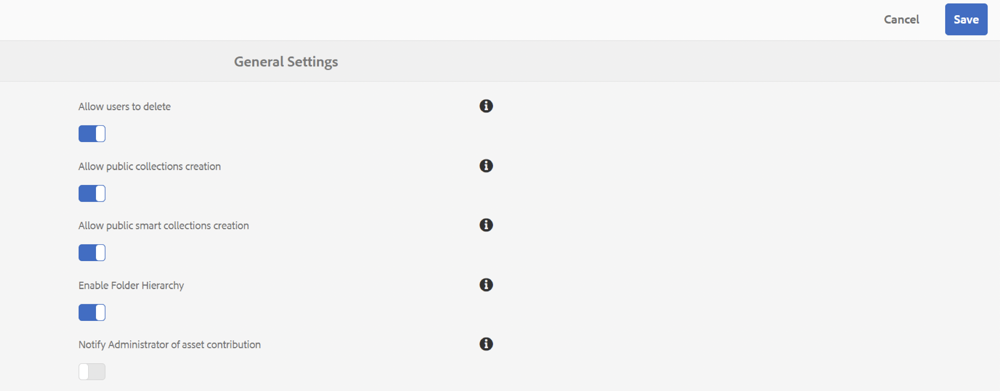

# Notas de la versión {#release-notes}

Obtenga información sobre las nuevas funciones, mejoras, problemas críticos corregidos y problemas conocidos de la versión 2023.08.0 de Adobe Experience Manager Assets Brand Portal.

## Información de la versión {#release-information}

| Producto | Adobe Experience Manager Assets Brand Portal |
|---|---|
| Versión | 2023.08.0 |
| Fecha | Agosto de 2023 |

## Información general {#overview}

Adobe Experience Manager AEM () Assets Brand Portal le ayuda a adquirir, controlar y distribuir de forma segura recursos creativos aprobados a terceros externos y usuarios internos de la empresa a través de dispositivos. Ayuda a mejorar la eficacia del uso compartido de recursos, acelera el tiempo de salida al mercado de recursos y reduce el riesgo de incumplimiento y acceso no autorizado. Brand Portal permite a los usuarios examinar, buscar, previsualizar, descargar y exportar recursos en formatos aprobados por la empresa, en cualquier momento y en cualquier lugar.

## Novedades de la versión 2023.08.0 {#whats-new-in-2023.08.0}

### Problemas críticos corregidos {#critical-issues-fixed}

#### Correcciones de errores y mejoras {#bug-fixes-enhancements}

Esta versión incorpora las siguientes mejoras:

* Mejoras de rendimiento al cargar recursos en [!UICONTROL Descargar] que aparece.
* Al descargar un recurso o una representación de un recurso, ahora se descarga en su formato de tipo de archivo original en lugar de un archivo zip.

Esta versión incluye las siguientes correcciones de errores:

* Las etiquetas largas o las etiquetas no se muestran correctamente en los filtros de búsqueda.
* No se pueden mostrar los nombres de representación largos en el cuadro de diálogo Descargar.
* No se pueden previsualizar los recursos de vídeo en la vista de tarjeta.

## Versiones anteriores

### Versión de mayo de 2023 {#may-2023}

**Corrección de errores**
Esta versión incluye correcciones a los siguientes problemas críticos:

* Si se produce un error al descargar un recurso desde un vínculo compartido, la variable `Notice` y `Close` las etiquetas del mensaje de error no están localizadas.
* Pantallas Brand Portal **Campos de encabezado de solicitud demasiado grandes** error al acceder a los filtros de búsqueda mediante `Filter` panel.

**Problemas conocidos**
Esta versión de incluye los siguientes problemas conocidos:

* Localización parcial en el contenido del informe de abastecimiento de recursos.
* Algunos campos del perfil de usuario no se pueden editar en el perfil de usuario.

### Versión de febrero de 2023 {#feb-2023}

**Corrección de errores**

Esta versión incluye correcciones a los siguientes problemas críticos:

* La imagen de perfil no se puede actualizar en Brand Portal.
* No se puede cambiar el tamaño del panel del árbol de contenido. Si el nombre de archivo es mayor que la anchura predeterminada del árbol de contenido, no podrá arrastrar el árbol de contenido horizontal y verticalmente. Como resultado, los nombres de archivo más largos no son legibles.
* Los resultados de búsqueda son incoherentes para el mismo predicado de propiedad utilizado dos veces en los formularios de búsqueda.
* El texto de las páginas de inicio de sesión intermedias no está localizado para todos los idiomas.

**Mejoras**

Esta versión incorpora las siguientes mejoras:

* Ahora hay disponible un nuevo visor de PDF moderno para obtener una vista previa mejorada de los recursos de PDF.
* Ahora puede activar o desactivar las notificaciones de abastecimiento de recursos para los administradores. Vaya a [!UICONTROL Configuración general] y, a continuación, habilitar o deshabilitar [!UICONTROL `Notify Administrator of asset contribution`].

  

* Un usuario no autorizado no puede solicitar acceso a Brand Portal si la solicitud de acceso está deshabilitada.
* Las organizaciones que solo están aprovisionadas para Brand Portal están visibles en la lista de selección de perfiles.

**Problemas conocidos**

Esta versión de incluye los siguientes problemas conocidos:

* Localización parcial en el contenido del informe de abastecimiento de recursos.
* Algunos campos del perfil de usuario no se pueden editar en el perfil de usuario.

### Versión de octubre de 2022 {#oct-2022}

**Problemas críticos corregidos**

Esta versión incluye correcciones a los siguientes problemas críticos:

* Tiempos de respuesta lentos al copiar archivos grandes de Brand Portal a una herramienta de terceros.
* Al seleccionar la casilla de verificación Recuento de representaciones, las casillas de verificación para seleccionar representaciones individuales están desactivadas.
* Tiempo de respuesta lento para la búsqueda.

>[!IMPORTANT]
>
>Las notificaciones de Pulse en AEM Assets Brand Portal se suspenderán el 1 de diciembre de 2022. En lugar de notificaciones de Pulse, seguirá recibiendo notificaciones por correo electrónico para los eventos siguientes:
>* Uso compartido de recursos mediante un vínculo
>* Solicitando flujo de trabajo de acceso
>* Uso compartido de la carpeta Contribution
>* AEM Inicio de la exportación a
>* AEM Exportación completada a la
>

### Versión de agosto de 2022 {#aug-2022}

**Problemas críticos corregidos**

Esta versión incluye correcciones a los siguientes problemas críticos:

* Cuando NUI no puede procesar un recurso en Experience Manager, Brand Portal muestra un estado de importación de recursos inexacto.
* Cuando falla la acción de previsualización, no hay ninguna notificación que comunique el error.
* El valor impreciso de la propiedad totalUploadedSize para cada recurso es fijo.
* Al hacer clic en **Descargar todos los elementos** y hay un gran número de representaciones disponibles para un recurso, Brand Portal descarga un archivo .ZIP no válido.
* La traducción de algunas cadenas se trunca en la interfaz de usuario de Brand Portal.

### Lanzamiento de mayo de 2022 {#may-2022}

**Nuevas funciones**

Brand Portal ahora ejecuta trabajos automáticos cada doce horas para eliminar todos los recursos de Brand Portal que se publican en AEM. Como resultado, no es necesario eliminar manualmente los recursos de la carpeta Contribution para mantener el tamaño de la carpeta por debajo del límite de umbral.

**Problemas críticos corregidos**

Esta versión incluye correcciones a los siguientes problemas críticos:

* Al descargar una carpeta o una colección que incluye recursos con etiquetas de color, también se descarga un archivo XML.
* Al descargar un vídeo que incluye representaciones, Brand Portal crea un archivo .ZIP no válido.
* AEM Al crear ajustes preestablecidos y recursos en el autor de los mismos, publicarlos en Brand Portal y, a continuación, seleccionar representaciones dinámicas al descargar los recursos, no se puede extraer el archivo .ZIP descargado.
* Problemas al descargar recursos de vídeo de ciertas carpetas disponibles en Brand Portal.
* Cuando comparte la dirección URL de la carpeta Contribution mediante un correo electrónico, las funciones Visualizador y Editor tienen problemas al acceder a la carpeta principal mediante la ruta de exploración.
* El informe publicado de abastecimiento muestra una hora de inicio de trabajo incorrecta.

### Versión de febrero de 2022 {#feb-2022}

**Nuevas funciones**

* El umbral de tiempo de espera de sesión para los usuarios invitados se ha reducido de 2 horas a 15 minutos.
* Las adicionales **[!UICONTROL Ver páginas]** Se ha eliminado la opción para PDF de varias páginas, ya que el usuario ahora puede ver las páginas del PDF desde el visor de Adobe Document Cloud.
* Los usuarios no pueden buscar, navegar ni abrir carpetas. La interfaz de usuario refleja el mensaje de error: `Failed to load data`.
* El **[!UICONTROL Representaciones]** el panel no enumera todas las representaciones estáticas de los recursos publicados en Brand Portal.
* El **[!UICONTROL Representaciones]** el panel enumera las representaciones de recorte inteligente del recurso; sin embargo, el usuario no puede obtener una vista previa ni descargar las representaciones de recorte inteligente.
* El cuadro de diálogo de descarga enumera las representaciones de recortes inteligentes del recurso seleccionado. Sin embargo, el usuario no puede descargar estas representaciones.
* Un usuario no administrador solo obtiene la representación del recurso original al descargar un recurso. El sistema y las representaciones personalizadas no se descargan.
* Al aplicar el filtro de búsqueda para descargar un recurso, la variable `Download` El botón está desactivado en el cuadro de diálogo de descarga y no permite al usuario descargar el recurso.
* If `Smart Tags` y (o) `Color Tags` están activadas, el cuadro de diálogo de descarga enumera las `json` archivos como representaciones y descarga estos `json` archivos en la carpeta zip archivada.
* Los usuarios anónimos no pueden descargar recursos mediante un vínculo compartido porque el vínculo redirige a la página de inicio de sesión de Brand Portal.
* El sistema no refleja el valor correcto para el número de usuarios simultáneos activos.

<!--
### New Features {#new-features}

This release includes the following new features:

* AEM Assets as a Cloud Service is now entitled to have a pre-configured Brand Portal instance. The Cloud Manager user can activate Brand Portal on the AEM Assets as a Cloud Service instance.

* Asset Sourcing feature is now available on AEM Assets as a Cloud Service. It allows the Brand Portal users to upload assets to the permitted contribution folders and publish the contribution folder from Brand Portal to AEM Assets as a Cloud Service instance. 

* An additional **[!UICONTROL Asset Download]** setting has been introduced under the **[!UICONTROL Download Settings]**. It creates a separate folder for each asset while downloading the folders, collections, or bulk download of assets. 
-->
<!-- 
* The **[!UICONTROL Download]** dialog is revamped in a list view with additional options to exclude the renditions which are not required, apply the same set of rules for similar asset types, and download the selected asset renditions.
-->

<!--
* The new **[!UICONTROL Download]** dialog now appears with all the renditions of the selected assets or folders containing assets in a list view, wherein the Brand Portal users can apply same set of renditions for similar asset types and download the selected asset renditions. 
-->

<!-- 
* Navigation to the **[!UICONTROL Files]**, **[!UICONTROL Collections]**, and **[!UICONTROL Shared Links]** is now possible from all the Brand Portal pages in one-click.  

* The **[!UICONTROL Renditions]** panel in the asset details page now allows the Brand Portal users to select the original asset and (or) specific asset renditions, and directly download them from the **[!UICONTROL Renditions]** panel without having to open the **[!UICONTROL Download]** dialog.
-->

<!--
Brand Portal users can exclude specific renditions which are not required and directly download the original asset and its renditions from the **[!UICONTROL Renditions]** panel on the asset details page. 
-->

<!-- 
* In addition to the existing **[!UICONTROL Download]** configurations, the Brand Portal administrators can also [configure permissions for different group of users]() to view and (or) download the original asset and its renditions from the asset details page. These configurations will define who can access and (or) download the asset renditions.
-->

<!--
### Enhancements {#enhancements}

Brand Portal 2021.08.0 is an internal release that introduces Business profiles for enterprise and teams customers to give organizations better control over their assets. 

This release includes the following enhancements:

* The users now have organization-specific entitlement on the new and migrated organizations. If a user is entitled to multiple organizations, the user has to select the organization at the time of login.

* The new users that are added in Admin Console must **Join Team** to get entitled to the organization. 

>[!NOTE]
>
>Business profiles are currently applicable for the new organizations that are created after August 16, 2021. 
>
>Until your organization is migrated, you can continue to use Adobe ID, Enterprise ID, or Federated ID types to access the organization.   
-->

<!-- 
* For folder download, a separate folder is created for each asset using share link irrespective of the **[!UICONTROL Download Settings]**. 
* The Brand Portal **[!UICONTROL Usage Report]** has been modified to reflect only the active Brand Portal users.
-->

<!--
* The threshold of session timeout for the guest users has been reduced from 2 hours to 15 minutes.
* The additional **[!UICONTROL View pages]** option has been removed for multi-page PDFs as the user can now view the PDF pages from the Adobe Document Cloud Viewer.

* The users are unable to search, navigate, or open folders. The user interface reflects the error message: `Failed to load data`. 
* The **[!UICONTROL Renditions]** panel does not list all the static renditions of the assets that are published to Brand Portal.
* The **[!UICONTROL Renditions]** panel lists the smart crop renditions of the asset, however, the user cannot preview or download the smart crop renditions.
* The download dialog lists the smart crop renditions of the selected asset, however, the user cannot download the smart crop renditions. 
* A non-admin user is getting only the original asset rendition when downloading an asset. The system and custom renditions are not downloaded.  
* When applying search filter to download an asset, the `Download` button is disabled in the download dialog and does not allows the user to download the asset.
* If `Smart Tags` and (or) `Color Tags` are enabled, the download dialog lists the `json` files as renditions and downloads these `json` files in the archived zip folder.
* The anonymous users are unable to download assets using a shared link because the link redirects to the Brand Portal login page. 
* The system is not reflecting the correct value for the number of active concurrent users.
-->

<!--
### New features {#new-features}

Brand Portal now executes automatic jobs every twelve hours to delete all Brand Portal assets that are published to AEM. As a result, you do not need to delete the assets in the Contribution folder manually to keep the folder size below the threshold limit. See [What's new in Experience Manager Assets Brand Portal](whats-new.md).
-->

<!--
This release includes fixes to the following critical issues:

* When you download a folder or a collection that includes assets with color tags, an XML file gets downloaded as well.

* When you download a video that includes renditions, Brand Portal creates an invalid .ZIP file.

* When you create presets and assets on AEM author and publish them to Brand Portal and then select dynamic renditions while downloading the assets, you cannot extract the downloaded .ZIP file.

* Issues while downloading video assets from certain folders available on Brand Portal.

* When you share the Contribution folder's URL using an email, Viewer and Editor roles face issues while accessing its parent folder using the breadcrumb.

* Sourcing published report displays an incorrect job start time.
>
 
<!--
* Asset Sourcing email notifications are not delivered for some organizations. 

* Video files with extension `.mov` are not running on Brand Portal. 

* In the **[!UICONTROL Smart Collections]** dropdown list, only ten saved collections are visible. 
-->
<!--
* *_deleted tenants are listed as valid tenant which fails during the execution of TenantCustomizers/TenantUpdates where tenant id is returned as /etc/tenants/`<nodename>`.
-->

<!--
In case only the original assets are downloaded, the asset reflects its own extension and does not open until the extension is manually changed to zip. 
* The user interface of the collection folder does not respond on clicking the navigation arrow. 
* **[!UICONTROL Create]** button is visible in the **[!UICONTROL Column]** view even when the folders are empty.
* **[!UICONTROL Omni search]** fails with a 414 error message (Request-URI Too Long) if the dispatcher is bypassed while accessing the Brand Portal instance.
* An empty zip folder is downloaded if the asset contains a comma (`,`) in the file name.
* The viewer users get the option to add users to the collection they have created. 
* Inconsistent behavior is experienced when an asset (thumbnail or web rendition) is downloaded using share link.

See [what's new in Brand Portal 2021.02.0](whats-new.md).
-->

<!--
### Known Issues {#known-issues}

This release includes the following known issue:

* Search on the **[!UICONTROL Asset Reports]** shows processing on the product interface with no search result.
* The video DM encodes are not visible to the non-admin users on the asset details page.
* The alignment of the size of individual asset renditions and total download size is distorted in the Download dialog.
-->

<!--
* Download Settings configuration to configure asset download from Brand Portal. Fast download, custom renditions, and system renditions are the available configurations. 
-->

<!--
* Document Viewer has been introduced to enhance the PDF viewing experience. New options are available for viewing the PDF files in Brand Portal.

* Advances in the asset download process which improves the Brand Portal user experience while [downloading assets from Brand Portal](brand-portal-download-assets.md). Brand Portal administrators can configure **[!UICONTROL Fast Download]**, **[!UICONTROL Custom Renditions]**, and **[!UICONTROL System Renditions]** from the **[!UICONTROL Download]** settings. 

For details, see [what's new in Brand Portal 6.4.7](whats-new.md). 

### Critical Issues Fixed {#critical-issues-fixed-647}

This release includes fixes to the following critical issues:

* The viewer users are not permitted to share link for collections but the option to share is visible to them on the product interface.

* The **[!UICONTROL Download]** button on the options bar does not list all the licensed assets of the selected folder.

* The search takes longer to show the results for certain keywords.

* The **[!UICONTROL Agree]** and **[!UICONTROL Disagree]** check boxes does not appear on bulk selection of licensed and unlicensed assets during download.

* Filter-based search shows processing on the product interface with no search result. 

* The assets do not download from share link if the shared folder contains numerous and large assets.

### Known Issues {#known-issues-647}

This release includes the following known issues:

* If multiple assets are selected, license text does not appear on clicking Terms and Conditions on the license agreement page during download using share link.   

-->

## Idiomas {#languages}

La interfaz de usuario de Brand Portal está disponible en los siguientes idiomas:

* Inglés
* Alemán
* Francés
* Español
* Italiano
* Portugués de Brasil
* Japonés
* Chino simplificado
* Coreano

## Plataformas certificadas {#certified-platforms}

Para saber qué plataformas están certificadas para ejecutarse con esta versión de Brand Portal, consulte la **Compatibilidad con la IU táctil optimizada** en la tabla de la columna **Exploradores admitidos para la interfaz de usuario de creación** sección de [Requisitos técnicos](https://experienceleague.adobe.com/docs/experience-manager-65/deploying/introduction/technical-requirements.html).

## Vínculos {#links}

* [Página de productos de Adobe Experience Manager en adobe.com](https://business.adobe.com/in/products/experience-manager/adobe-experience-manager.html)
* [Documentación de Assets Brand Portal](https://experienceleague.adobe.com/docs/experience-manager-brand-portal/using/home.html)

## Acceso y asistencia de productos (sitios restringidos) {#product-access-and-support-restricted-sites}

Estos sitios solo están disponibles para los clientes de. Si es cliente y necesita acceso, póngase en contacto con el administrador de cuentas de Adobe.

<!--
* [https://daycare.day.com](https://daycare.day.com) 
-->

<!--
* [Customer Support]()
-->
