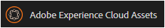
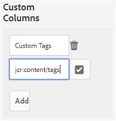

# Trabajar con informes {#work-with-reports}

La capacidad de generación de informes es fundamental para evaluar el uso de Brand Portal y saber cómo interactúan los usuarios internos y externos con los recursos aprobados. Los administradores pueden ver el informe Uso de Brand Portal, que siempre está disponible en la página Informes de recursos . Sin embargo, los informes de inicios de sesión de usuarios y recursos descargados, caducados, publicados y compartidos a través de vínculos se pueden generar y ver desde la página Informes de recursos . Estos informes son útiles para analizar la implementación de recursos, que le permiten derivar métricas de éxito clave para medir la adopción de recursos aprobados dentro y fuera de la organización.

La interfaz de administración de informes es intuitiva e incluye opciones y controles detallados para acceder a los informes guardados. Puede ver, descargar o eliminar informes desde la página Informes de recursos , donde se muestran todos los informes generados anteriormente.

## Ver informes {#view-reports}

Para ver un informe, siga estos pasos:

1. En la barra de herramientas de la parte superior, pulse o haga clic en el logotipo de AEM para acceder a las herramientas administrativas.

   

1. En el panel de herramientas administrativas, haga clic en **[!UICONTROL Crear/administrar informes]** para abrir la página **[!UICONTROL Informes de recursos]**.

   

1. Acceda al informe **[!UICONTROL Uso]** y a otros informes generados desde la página Informes de recursos .

   >[!NOTE]
   >
   >El informe de uso es un informe predeterminado generado en Brand Portal. No se puede crear ni eliminar. Sin embargo, puede crear, descargar y eliminar los informes de Descarga, Caducidad, Publicación, Uso compartido de vínculos e Inicios de sesión de usuario.

   Para ver un informe, haga clic en el vínculo del informe. Como alternativa, seleccione el informe y pulse o haga clic en el icono Ver de la barra de herramientas.

   **[!UICONTROL El]** informe de uso muestra información sobre el número de usuarios activos de Brand Portal, el espacio de almacenamiento ocupado por todos los recursos y el recuento total de recursos en Brand Portal. Los usuarios del portal de marca que no están asignados a ningún perfil de producto en el Admin Console se consideran usuarios inactivos y no se reflejan en el **[!UICONTROL Informe de uso]**.
El informe también muestra la capacidad permitida para cada una de estas métricas de información.

   

   **[!UICONTROL El informe]** de inicios de sesión del usuario proporciona información sobre los usuarios que iniciaron sesión en Brand Portal. El informe muestra los nombres para mostrar, los ID de correo electrónico, las personas (administrador, visor, editor, invitado), los grupos, el último inicio de sesión, el estado de la actividad y el recuento de inicios de sesión de cada usuario desde la implementación de Brand Portal 6.4.2 hasta el momento de la generación del informe.

   

   **** Descargar listas de informes y detalles sobre todos los recursos descargados en un intervalo de fecha y hora específico.

   

   >[!NOTE]
   >
   >El informe de recursos **[!UICONTROL Descargar]** solo muestra los recursos seleccionados y descargados de forma individual desde Brand Portal. Si un usuario ha descargado una carpeta que contiene recursos, el informe no muestra la carpeta ni los recursos de la carpeta.

   **** Expirationreport enumera y detalla todos los recursos que caducaron en un intervalo de tiempo específico.

   

   **** Publicar informe enumera y proporciona información sobre todos los recursos que se publican desde AEM a Brand Portal en un lapso de tiempo especificado.

   

   >[!NOTE]
   >
   >Publicar informe no muestra información sobre fragmentos de contenido, ya que los fragmentos de contenido no se pueden publicar en Brand Portal.

   **[!UICONTROL Los]** informes Compartir vínculos muestran todos los recursos compartidos a través de los vínculos de la interfaz de Brand Portal en un intervalo de tiempo específico. El informe también indica cuándo se compartió el recurso mediante un vínculo, qué usuario, cuándo caduca el vínculo y la cantidad de vínculos compartidos para el inquilino (y los usuarios con los que se compartió el vínculo del recurso). Las columnas del informe Compartir vínculos no se pueden personalizar.

   

   >[!NOTE]
   >
   >El informe Compartir vínculos no muestra los usuarios que tienen acceso al recurso compartido mediante el vínculo o que han descargado el recurso a través del vínculo.
   >
   >Para realizar el seguimiento de descargas a través del vínculo compartido, debe generar el informe de descarga después de seleccionar la opción **[!UICONTROL Solo vincular descargas]** en la página **[!UICONTROL Crear informe]**. Sin embargo, el usuario (descargado por) es anónimo en este caso.

## Generar informes {#generate-reports}

Los administradores pueden generar y administrar los siguientes informes estándar, una vez generados, se guardan para [acceder](../using/brand-portal-reports.md#main-pars-header) más adelante:

* Inicios de sesión de usuario
* Descargar
* Vencimiento
* Publicación
* Vínculos compartidos

Las columnas del informe Descargar, Caducidad y Publicar se pueden personalizar para su visualización. Para generar un informe, siga estos pasos:

1. En la barra de herramientas de la parte superior, pulse o haga clic en el logotipo de AEM para acceder a las herramientas administrativas.

1. En el panel de herramientas administrativas, pulse o haga clic en **[!UICONTROL Crear/administrar informes]** para abrir la página **[!UICONTROL Informes de recursos]**.

   

1. En la página Informes de recursos, pulse o haga clic en **[!UICONTROL Crear]**.
1. En la página **[!UICONTROL Crear informe]**, seleccione un informe para crear y pulse o haga clic en **[!UICONTROL Siguiente]**.

   

1. Configure los detalles del informe. Especifique el título, la descripción, la estructura de la carpeta (donde el informe necesita ejecutar y generar estadísticas) y el intervalo de fechas para los informes **[!UICONTROL Download]**, **[!UICONTROL Expiration]** y **[!UICONTROL Publish]**.

   

   Por su parte, **[!UICONTROL Link Share Report]** solo necesita los parámetros de título, descripción y intervalo de fechas.

   

   >[!NOTE]
   >
   >Los caracteres especiales # y % del título del informe se sustituyen por un guión (-) en la generación del informe.

1. Toque o haga clic en **[!UICONTROL Siguiente]** para configurar las columnas de los informes Descargar, Caducidad y Publicar.
1. Seleccione o anule la selección de las casillas de verificación correspondientes según sea necesario. Por ejemplo, para ver los nombres de los usuarios (que descargaron los recursos) en el informe **[!UICONTROL Descargar]**, seleccione **[!UICONTROL Descargado por]**. La siguiente imagen ilustra la selección de columnas predeterminadas en el informe Descargar.

   

   También puede agregar columnas personalizadas a estos informes para mostrar más datos según sus necesidades personalizadas.

   Para agregar columnas personalizadas al informe Descargar, Publicar o Caducidad, siga estos pasos:

   1. Para mostrar una columna personalizada, pulse o haga clic en **[!UICONTROL Agregar]** dentro de [!UICONTROL Columnas personalizadas].
   1. Especifique el nombre de la columna en el campo **[!UICONTROL Nombre de columna]**.
   1. Seleccione la propiedad a la que debe asignarse la columna mediante el selector de propiedades.

      
También puede escribir la ruta en el campo de ruta de la propiedad.

      

      Para agregar más columnas personalizadas, pulse o haga clic en **Agregar** y repita los pasos 2 y 3.

1. Toque o haga clic en **[!UICONTROL Crear]**. Un mensaje notifica que se ha iniciado la generación del informe.

## Descargar informes {#download-reports}

Para guardar y descargar un informe como archivo .csv, realice una de las siguientes acciones:

* Seleccione un informe en la página Informes de recursos y pulse o haga clic en **[!UICONTROL Descargar]** en la barra de herramientas de la parte superior.

* En la página Informes de recursos , abra un informe. Seleccione la opción **[!UICONTROL Descargar]** en la parte superior de la página del informe.

## Eliminar informes {#delete-reports}

Para eliminar un informe existente, seleccione el informe en la página **[!UICONTROL Informes de recursos]** y pulse o haga clic en **[!UICONTROL Eliminar]** en la barra de herramientas de la parte superior.

>[!NOTE]
>
>**** El informe de usuario no se puede eliminar.
