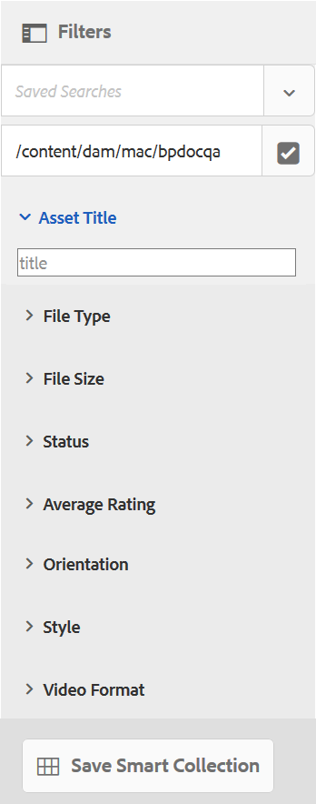

# Utilizar facetas de búsqueda personalizadas {#use-custom-search-facets}

Los administradores pueden agregar predicados de búsqueda al panel [!UICONTROL Filtros] para personalizar la búsqueda y hacer que la funcionalidad de búsqueda sea versátil.

Brand Portal admite la [búsqueda por facetas](../using/brand-portal-searching.md#search-using-facets-in-filters-panel) para búsquedas granulares de recursos de marca aprobados, lo que es posible debido a [**Filters** panel](../using/brand-portal-searching.md#search-using-facets-in-filters-panel). Las facetas de búsqueda están disponibles en el panel Filtros a través de **[!UICONTROL Buscar formulario]** en las herramientas de administración. Existe un formulario de búsqueda predeterminado denominado Carril de búsqueda de administración de recursos en la página Buscar en Forms de las herramientas de administración. Sin embargo, los administradores pueden personalizar el panel Filtros predeterminado editando el formulario de búsqueda predeterminado (carril de búsqueda de administración de recursos) añadiendo, modificando o eliminando predicados de búsqueda, lo que convierte la funcionalidad de búsqueda en versátil.

Puede utilizar varios predicados de búsqueda para personalizar el panel **[!UICONTROL Filters]**. Por ejemplo, agregue el predicado de propiedades para buscar recursos que coincidan con una sola propiedad especificada en este predicado. Añada el predicado de opciones para buscar recursos que coincidan con uno o más valores especificados para una propiedad concreta. Agregue el predicado de intervalo de fechas para buscar recursos creados dentro de un intervalo de fechas especificado.

>[!NOTE]
>
>AEM permite que las organizaciones [publiquen los formularios de búsqueda personalizados desde AEM Author](../using/publish-schema-search-facets-presets.md#publish-search-facets-to-brand-portal) en Brand Portal, en lugar de volver a crear el mismo formulario en Brand Portal.

## Agregar un predicado de búsqueda {#add-a-search-predicate}

Para agregar un predicado de búsqueda al panel **[!UICONTROL Filtros]**:

1. Para acceder a las herramientas administrativas, haga clic en el logotipo de AEM en la barra de herramientas de la parte superior.

   

1. En el panel de herramientas administrativas, haga clic en **[!UICONTROL Buscar Forms]**.

   

1. En la página **[!UICONTROL Buscar en Forms]**, seleccione **[!UICONTROL Carril de búsqueda de administración de recursos]**.

   

1. En la barra de herramientas que aparece en la parte superior, haga clic en **[!UICONTROL Editar]** para abrir el formulario de edición de búsqueda.

   

1. En la página [!UICONTROL Editar formulario de búsqueda], arrastre un predicado desde la pestaña [!UICONTROL Seleccionar predicado] hasta el panel principal. Por ejemplo, arrastre **[!UICONTROL Predicado de propiedad]**.

   El campo **[!UICONTROL Propiedad]** aparece en el panel principal y la pestaña **[!UICONTROL Configuración]** a la derecha muestra los predicados de propiedades.

   

   >[!NOTE]
   >
   >La etiqueta de encabezado de la pestaña **[!UICONTROL Settings]** identifica el tipo de predicado que se selecciona.

1. En la pestaña **[!UICONTROL Settings]**, introduzca una etiqueta, un texto de marcador de posición y una descripción para el predicado de propiedades.

   * Seleccione **[!UICONTROL Búsqueda parcial]** si desea permitir la búsqueda parcial de frases (y la búsqueda comodín) de recursos en función del valor de propiedad especificado. De forma predeterminada, el predicado admite la búsqueda de texto completo.
   * Seleccione **[!UICONTROL Ignorar mayúsculas y minúsculas]** si desea que la búsqueda de recursos basada en el valor de la propiedad distinga entre mayúsculas y minúsculas. De forma predeterminada, la búsqueda de valores de propiedad en el filtro de búsqueda distingue entre mayúsculas y minúsculas.

   >[!NOTE]
   >
   >Al seleccionar la casilla de verificación **[!UICONTROL Búsqueda parcial]**, **[!UICONTROL Ignorar mayúsculas y minúsculas]** está seleccionada de forma predeterminada.

1. En el campo **[!UICONTROL Nombre de propiedad]**, abra el selector de propiedades y seleccione la propiedad en función de la cual se realiza la búsqueda. Como alternativa, introduzca un nombre para la propiedad. Por ejemplo, escriba `  jcr :content/metadata/dc:title` o `./jcr:content/metadata/dc:title`.

   >[!NOTE]
   >
   >En Brand Portal, todas las propiedades (excepto las que comienzan por `xmp`) en `jcrcontent/metadata` de `dam:asset` se indexan de forma predeterminada.
   >
   >Cualquier propiedad indexada se puede utilizar al crear un predicado de propiedad. Si se configura cualquier propiedad no indexada, la consulta de búsqueda en una propiedad no indexada puede no dar ningún resultado de búsqueda.

   

1. Haga clic en **[!UICONTROL Listo]** para guardar la configuración.
1. En la interfaz de usuario [!UICONTROL Assets], haga clic en el icono de superposición y elija **[!UICONTROL Filtro]** para ir al panel **[!UICONTROL Filtros]**. El predicado **[!UICONTROL Property]** se agrega al panel.

   

1. Introduzca un título para la búsqueda del recurso en el cuadro de texto **[!UICONTROL Propiedad]**. Por ejemplo, &quot;Adobe&quot;. Cuando realice una búsqueda, los recursos con el título que coincida con &quot;Adobe&quot; se mostrarán en los resultados de la búsqueda.

## Lista de predicados de búsqueda {#list-of-search-predicates}

De forma similar a como se agrega un predicado **[!UICONTROL Property]**, se pueden agregar los siguientes predicados al panel **[!UICONTROL Filters]**:

| **Nombre del predicado** | **Descripción** | **Propiedades** |
|-------|-------|----------|
| **[!UICONTROL Navegador de rutas]** | Busque en el predicado para buscar recursos en una ubicación concreta. **Nota:** *Para un usuario que ha iniciado sesión, el navegador de rutas en Filtro solo muestra la estructura de contenido de las carpetas (y sus antecesores) compartidas con el usuario.*   Los usuarios administradores pueden buscar recursos en cualquier carpeta navegando a ella mediante el explorador de rutas.   Por su parte, los usuarios no administradores pueden buscar recursos en una carpeta (accesible para ellos) navegando a esa carpeta en el explorador de rutas. | <ul><li>Etiqueta de campo</li><li>Ruta</li><li>Descripción</li></ul> |
| **[!UICONTROL Propiedad]** | Buscar recursos en función de una propiedad de metadatos concreta. **Nota:** *Al seleccionar Búsqueda parcial, se selecciona Ignorar mayúsculas y minúsculas de forma predeterminada*. | <ul><li>Etiqueta de campo</li><li>Marcador de posición</li><li>Nombre de propiedad</li><li>Búsqueda parcial</li><li>Ignorar mayúsculas y minúsculas</li><li> Descripción</li></ul> |
| **[!UICONTROL Propiedad de varios valores]** | Similar al predicado de propiedad, pero permite que se devuelvan en los resultados varios valores de entrada, separados por un delimitador (el valor predeterminado es COMMA[,]) que coinciden con cualquiera de los valores de entrada. | <ul><li>Etiqueta de campo</li><li>Marcador de posición</li><li>Nombre de la propiedad </li><li>Compatibilidad con el delimitador</li><li>Ignorar mayúsculas y minúsculas</li><li>Descripción</li></ul> |
| **[!UICONTROL Etiquetas]** | El predicado de búsqueda busca recursos en función de etiquetas. Puede configurar la propiedad Ruta para rellenar varias etiquetas en la lista Etiquetas. *Nota: Es posible que los administradores tengan que cambiar el valor de la ruta, por ejemplo, [!UICONTROL `/etc/tags/mac/<tenant_id>/<custom_tag_namespace>`], si publican el formulario de búsqueda desde AEM, donde la ruta no incluye información del inquilino, por ejemplo, [!UICONTROL `/etc/tags/<custom_tag_namespace>`]. | <ul><li>Etiqueta de campo</li><li>Nombre de la propiedad </li><li>Ruta</li><li>Descripción</li></ul> |
| **[!UICONTROL Ruta]** | Busque en el predicado para buscar recursos en una ubicación concreta. | <ul><li>Etiqueta de campo</li><li>Ruta</li><li>Descripción</li></ul> |  |
| **[!UICONTROL Fecha relativa]** | El predicado de búsqueda busca recursos en función de la fecha relativa de su creación. | <ul><li>Etiqueta de campo</li><li>Nombre de la propiedad </li><li>Fecha relativa</li></ul> |
| **[!UICONTROL Intervalo]** | El predicado de búsqueda busca recursos que se encuentran dentro de un rango especificado de valores de propiedad. En el panel Filtros , puede especificar valores de propiedad mínimos y máximos para el intervalo. | <ul><li>Etiqueta de campo</li><li>Nombre de la propiedad </li><li>Descripción</li></ul> |
| **[!UICONTROL Intervalo de fechas]** | El predicado de búsqueda busca recursos creados dentro de un intervalo especificado para una propiedad de fecha. En el panel Filtros , puede especificar las fechas de inicio y finalización. | <ul><li>Etiqueta de campo</li><li>Marcador de posición</li><li>Nombre de la propiedad </li><li>Texto de rango (de)</li><li>Texto de intervalo (hasta)</li><li>Descripción</li></ul> |
| **[!UICONTROL Fecha]** | Busque en el predicado una búsqueda de recursos basada en el control deslizante en función de una propiedad de fecha. | <ul><li>Etiqueta de campo</li><li>Nombre de la propiedad </li><li>Descripción</li></ul> |
| **[!UICONTROL Tamaño del archivo]** | El predicado de búsqueda busca recursos en función de su tamaño. | <ul><li>Etiqueta de campo</li><li>Nombre de la propiedad </li><li>Ruta</li><li>Descripción</li></ul> |
| **[!UICONTROL Última modificación del recurso]** | Busque en el predicado para buscar recursos en función de la fecha de la última modificación. | <ul><li>Etiqueta de campo</li><li>Nombre de la propiedad </li><li>Descripción</li></ul> |
| **[!UICONTROL Estado de aprobación]** | El predicado de búsqueda busca recursos en función de la propiedad de metadatos de aprobación. El nombre de propiedad predeterminado es **dam:status**. | <ul><li>Etiqueta de campo</li><li>Nombre de la propiedad </li><li>Descripción</li></ul> |
| **[!UICONTROL Estado de extracción]** | El predicado de búsqueda permite buscar recursos en función del estado de desprotección de un recurso cuando se publicó desde AEM Assets. | <ul><li>Etiqueta de campo</li><li>Nombre de la propiedad </li><li>Descripción</li></ul> |
| **[!UICONTROL Extraído por]** | Predicado de búsqueda para buscar recursos en función del usuario que ha desprotegido el recurso. | <ul><li>Etiqueta de campo</li><li>Nombre de la propiedad </li><li>Descripción</li></ul> |
| **[!UICONTROL Estado de caducidad]** | Busque en el predicado para buscar recursos en función del estado de caducidad. | <ul><li>Etiqueta de campo</li><li>Nombre de la propiedad </li><li>Descripción</li></ul> |
| **[!UICONTROL Miembro de la colección]** | Predicado de búsqueda para buscar recursos en función de si un recurso forma parte de una colección. | Descripción |
| **[!UICONTROL Oculto]** | Este predicado no es explícitamente visible para los usuarios finales y se utiliza para cualquier restricción oculta normalmente para restringir el tipo de resultados de búsqueda a **dam:Asset**. | <ul><li>Etiqueta de campo</li><li>Nombre de la propiedad </li><li>Descripción</li></ul> |

>[!NOTE]
>
>No utilice **[!UICONTROL Options Predicate]**, **[!UICONTROL Publish Status Predicate]** y **[!UICONTROL Rating Predicate]**, ya que estos predicados no funcionan en Brand Portal.

## Eliminar un predicado de búsqueda {#delete-a-search-predicate}

Para eliminar un predicado de búsqueda, siga estos pasos:

1. Haga clic en el logotipo de Adobe para acceder a las herramientas administrativas.

   

1. En el panel de herramientas administrativas, haga clic en **[!UICONTROL Buscar Forms]**.

   

1. En la página **[!UICONTROL Buscar en Forms]**, seleccione **[!UICONTROL Carril de búsqueda de administración de recursos]**.

   

1. En la barra de herramientas que aparece en la parte superior, haga clic en **[!UICONTROL Editar]** para abrir el formulario de edición de búsqueda.

   

1. En la página [!UICONTROL Editar formulario de búsqueda], en el panel principal, seleccione el predicado que desee eliminar. Por ejemplo, seleccione **[!UICONTROL Predicado de propiedad]**.

   La pestaña **[!UICONTROL Settings]** de la derecha muestra los campos de predicado de propiedades.

1. Para eliminar el predicado de propiedades, haga clic en el icono bin . En el cuadro de diálogo **[!UICONTROL Eliminar campo]**, haga clic en **[!UICONTROL Eliminar]** para confirmar la acción de eliminar.

   El campo **[!UICONTROL Predicado de propiedad]** se elimina del panel principal y la pestaña **[!UICONTROL Configuración]** se queda vacía.

   

1. Para guardar los cambios, haga clic en **[!UICONTROL Listo]** en la barra de herramientas.
1. En la interfaz de usuario **[!UICONTROL Assets]**, haga clic en el icono de superposición y elija **[!UICONTROL Filtro]** para ir al panel **[!UICONTROL Filtros]**. El predicado **[!UICONTROL Property]** se elimina del panel.

   
