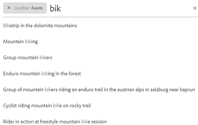
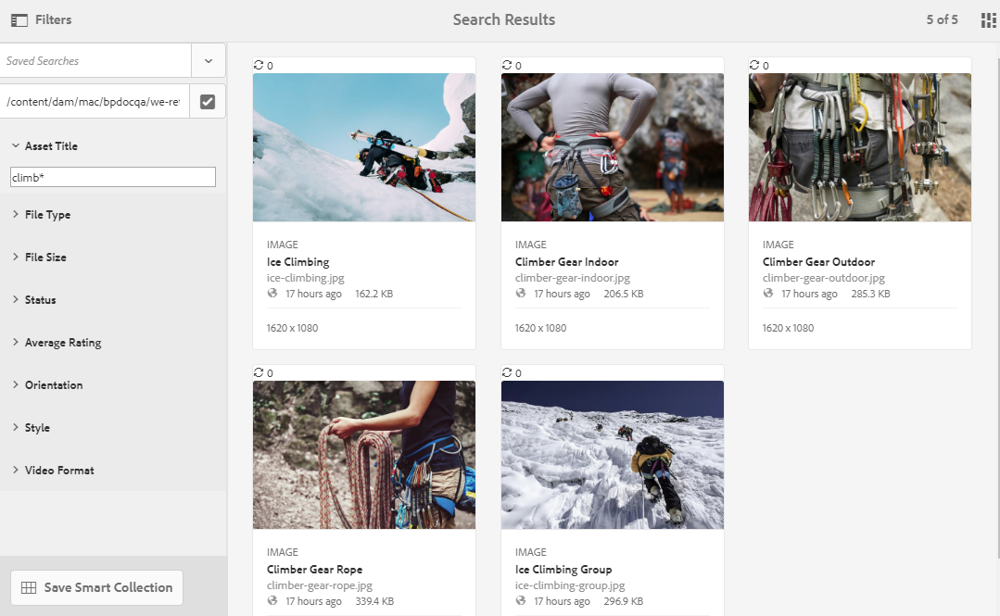
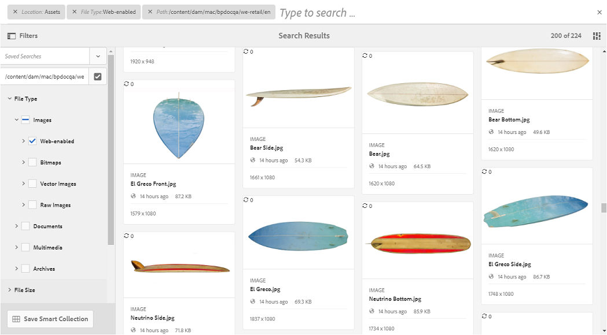
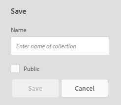
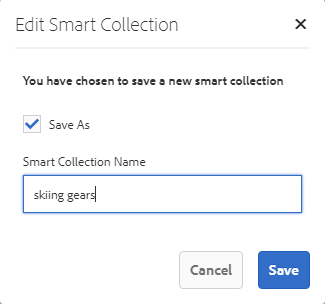

# Buscar recursos en Brand Portal {#search-assets-on-brand-portal}

La función de búsqueda de Brand Portal le permite buscar rápidamente recursos relevantes mediante la búsqueda por omnidirección y por facetas que utilizan filtros para ayudarle a reducir aún más la búsqueda. También puede guardar las búsquedas como colecciones inteligentes para el futuro.

## Buscar recursos con Omnisearch {#search-assets-using-omnisearch}

Para buscar recursos en Brand Portal:

1. En la barra de herramientas, haga clic en el icono **[!UICONTROL Buscar]** o presione la tecla "**[!UICONTROL /]**" para iniciar Omniture Search.

   

1. En el cuadro de búsqueda, escriba una palabra clave para los recursos que desee buscar.

   

   >[!NOTE]
   >
   >Se requieren al menos 3 caracteres en la búsqueda de omnidatos para que aparezcan las sugerencias de búsqueda.

1. Seleccione entre las sugerencias relacionadas que aparecen en la lista desplegable para acceder rápidamente a los recursos relevantes.

   

   *Búsqueda de recursos mediante omnisearch*

Para obtener información sobre el comportamiento de búsqueda con recursos con etiquetas inteligentes, consulte [Comprender los resultados y el comportamiento](https://helpx.adobe.com/experience-manager/6-5/assets/using/search-assets.html)de la búsqueda.

## Búsqueda mediante facetas en el panel Filtros {#search-using-facets-in-filters-panel}

Las facetas de búsqueda del panel Filtros agregan granularidad a la experiencia de búsqueda y hacen que la funcionalidad de búsqueda sea eficiente. Las facetas de búsqueda utilizan varias dimensiones (predicados) que le permiten realizar búsquedas intrincadas. Puede desplazarse fácilmente hasta el nivel de detalle deseado para una búsqueda más enfocada.

Por ejemplo, si busca una imagen, puede elegir si desea un mapa de bits o una imagen vectorial. Puede reducir aún más el alcance de la búsqueda especificando el tipo MIME de la imagen en la faceta de búsqueda Tipo de archivo. Del mismo modo, al buscar documentos, puede especificar el formato, por ejemplo, PDF o MS Word. 

El panel [!UICONTROL Filtros] incluye algunas facetas estándar como: Navegador [!UICONTROL de]rutas, Tipo [!UICONTROL de]archivo, Tamaño de archivo, [!UICONTROL Estado]y Orientación. Sin embargo, puede [agregar facetas](../using/brand-portal-search-facets.md) de búsqueda personalizadas o quitar facetas de búsqueda específicas del panel [!UICONTROL Filtros] agregando o eliminando predicados en el formulario de búsqueda subyacente. Consulte la lista de los predicados de [búsqueda disponibles y utilizables en Brand Portal](../using/brand-portal-search-facets.md#list-of-search-predicates).

Para aplicar filtros a la búsqueda, utilice las facetas [de](../using/brand-portal-search-facets.md)búsqueda disponibles:

1. Haga clic en el icono de superposición y seleccione **[!UICONTROL Filtro]**.

   

1. En el panel **[!UICONTROL Filtros]** de la izquierda, seleccione las opciones adecuadas para aplicar los filtros relevantes.
Por ejemplo, utilice los siguientes filtros estándar:

   * **[!UICONTROL Navegador]** de rutas para buscar recursos en un directorio específico. La ruta de búsqueda predeterminada del predicado para el Explorador de rutas es **[!UICONTROL /content/dam/mac/&lt;identificación del inquilino&gt;/]**, que se puede configurar editando el formulario de búsqueda predeterminado.
   >[!NOTE]
   >
   >Para los usuarios que no son administradores, el [!UICONTROL navegador] de rutas del panel [!UICONTROL Filtro] muestra únicamente la estructura de contenido de las carpetas (y sus carpetas antecesoras) compartidas con ellos.\
   >Para administrar usuarios, el navegador de rutas permite desplazarse a cualquier carpeta de Brand Portal.

   * **[!UICONTROL Tipo]** de archivo para especificar el tipo (imagen, documento, multimedia, archivo) del archivo de recurso que está buscando. Además, puede reducir el alcance de la búsqueda, por ejemplo, especificar el tipo MIME (Tiff, Bitmap, GIMP Images) para la imagen o el formato (PDF o MS Word) de los documentos.
   * **[!UICONTROL Tamaño]** de archivo para buscar recursos según su tamaño. Puede especificar los límites inferior y superior del intervalo de tamaño para reducir la búsqueda y especificar la unidad de medida que desea buscar.
   * **[!UICONTROL Estado]** para buscar recursos en función de estados de recursos, como Aprobación (Aprobado, Cambios Solicitados, Rechazado, Pendiente) y Caducidad.
   * **[!UICONTROL Clasificación]** promedio para buscar recursos según la clasificación de los recursos.
   * **[!UICONTROL Orientación]** para buscar recursos en función de la orientación (horizontal, vertical, cuadrada) de los recursos.
   * **[!UICONTROL Estilo]** para buscar recursos en función del estilo (coloreado, monocromo) de los recursos.
   * **[!UICONTROL Formato]** de vídeo para buscar recursos de vídeo en función de su formato (DVI, Flash, MPEG4, MPEG, OGG Theora, QuickTime, Windows Media, WebM).
   Puede utilizar facetas [de búsqueda](../using/brand-portal-search-facets.md) personalizadas en el panel Filtros editando el formulario de búsqueda subyacente.

   * **[!UICONTROL El predicado]** de propiedades, si se utiliza en el formulario de búsqueda, permite buscar recursos que coincidan con una propiedad de metadatos a la que se asigna el predicado.\
      Por ejemplo, si el predicado de propiedades está asignado a [!UICONTROL `jcr:content /metadata/dc:title`], puede buscar recursos en función de su título.\
      El predicado [!UICONTROL de propiedades] admite búsquedas de texto para:

      **Frases parciales** Para permitir la búsqueda de recursos utilizando frases parciales en el predicado de propiedad, habilite la casilla **[!UICONTROL Búsqueda parcial]en el formulario de búsqueda.**\
      Esto le permite buscar los recursos deseados aunque no especifique las palabras o frases exactas utilizadas en los metadatos del recurso.\
      Puede:
* Especifique una palabra que aparezca en la frase buscada en la faceta del panel Filtros. For example, if you search for the term **climb** (and Property Predicate is mapped to [!UICONTROL `dc:title`] property), then all the assets with the word **climb** in their title phrase are returned.
* Especificar una parte de la palabra que aparece en la frase buscada, junto con el carácter comodín (*) para rellenar los huecos.
Por ejemplo, buscar:
      **escalar*** devuelve todos los recursos que tienen palabras que comienzan con los caracteres "escalar" en la frase de título.
      ***escalar** devuelve todos los recursos que tienen palabras que finalizan con caracteres "escalar" en la frase de título.
      ***escalar*** devuelve todos los recursos que tienen palabras que incluyen los caracteres "escalar" en la frase de título.\
      **Texto** que distingue entre mayúsculas y minúsculas Para permitir la búsqueda que no distingue entre mayúsculas y minúsculas en el predicado de propiedades, active la casilla de verificación **[!UICONTROL Ignorar mayúsculas y minúsculas]** en el formulario de búsqueda. De forma predeterminada, la búsqueda de texto en el predicado de propiedades distingue entre mayúsculas y minúsculas.
   >[!NOTE]
   >
   >Al seleccionar la casilla de verificación Búsqueda **** parcial, se selecciona [!UICONTROL Omitir caso] de forma predeterminada.

   

   Los resultados de búsqueda se muestran según los filtros aplicados, junto con el recuento de resultados de búsqueda.

   

   Resultado de búsqueda de recursos con recuento de resultados de búsqueda

1. Puede desplazarse fácilmente a un elemento desde el resultado de la búsqueda y volver al mismo resultado de búsqueda utilizando el botón Atrás en el explorador sin tener que volver a ejecutar la consulta de búsqueda.

## Guardar las búsquedas como colección inteligente {#save-your-searches-as-smart-collection}

Puede guardar la configuración de búsqueda como una colección inteligente para poder repetir rápidamente la misma búsqueda sin tener que rehacer la misma configuración más tarde.

Para guardar la configuración de búsqueda como una colección inteligente:

1. Toque o haga clic en **[!UICONTROL Guardar colección]** inteligente y proporcione un nombre para la colección inteligente.

   Para que la colección inteligente sea accesible para todos los usuarios, seleccione **[!UICONTROL Público]**. Un mensaje confirma que la colección inteligente se creó y se agregó a la lista de búsquedas guardadas.

   >[!NOTE]
   >
   >Los usuarios que no son administradores no pueden hacer públicas las colecciones inteligentes, para evitar tener un gran número de colecciones inteligentes públicas creadas por usuarios que no son administradores en el portal de marcas de la organización. Las organizaciones pueden desactivar la configuración **[!UICONTROL Permitir la creación]** de colecciones inteligentes públicas desde la configuración **[!UICONTROL General]** disponible en el panel Herramientas de administración.

   

1. Para guardar la colección inteligente con un nombre diferente y seleccionar o borrar la casilla **[!UICONTROL Público]** , haga clic en **[!UICONTROL Editar colección]** inteligente.

   

1. En el cuadro de diálogo **[!UICONTROL Editar colección]** inteligente, seleccione **[!UICONTROL Guardar como]** e introduzca un nombre para la colección inteligente. Haga clic en **[!UICONTROL Guardar]**.

   
