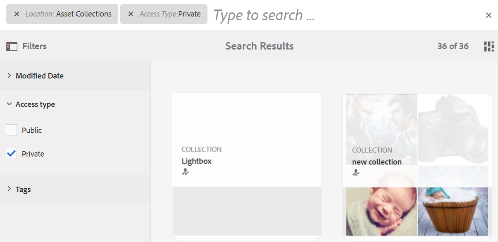

# Buscar recursos en Brand Portal {#search-assets-on-brand-portal}

La función de búsqueda de Brand Portal le permite buscar rápidamente recursos relevantes mediante la búsqueda de omnibúsqueda y la búsqueda de facetas que utiliza filtros para ayudarle a reducir aún más la búsqueda. Puede buscar recursos a nivel de archivos o carpetas y guardar los resultados de búsqueda como colecciones inteligentes.

>[!NOTE]
>
>Brand Portal no admite la búsqueda de colecciones mediante omnisearch.
>
>Sin embargo, puede usar [filtros de búsqueda para obtener la lista de colecciones relevantes](#search-collection).

## Buscar recursos mediante Omnisearch {#search-assets-using-omnisearch}

Para buscar recursos en Brand Portal:

1. En la barra de herramientas, haga clic en el **[!UICONTROL Buscar]** o presione la tecla **[!UICONTROL /]**&quot; para iniciar Omnisearch.

   

1. En el cuadro de búsqueda, escriba una palabra clave para los recursos que desee buscar.

   

   >[!NOTE]
   >
   >Se requieren al menos 3 caracteres en la búsqueda de contenido para que aparezcan las sugerencias de búsqueda.

1. Seleccione entre las sugerencias relacionadas que aparecen en la lista desplegable para acceder rápidamente a los recursos relevantes.

   

   *Búsqueda de recursos mediante omnisearch*

Para obtener información sobre el comportamiento de búsqueda con recursos etiquetados inteligentes, consulte [comprender los resultados y el comportamiento de la búsqueda](https://experienceleague.adobe.com/docs/experience-manager-65/assets/using/search-assets.html).

## Búsqueda mediante facetas en el panel Filtros {#search-using-facets-in-filters-panel}

Las facetas de búsqueda del panel Filtros agregan granularidad a la experiencia de búsqueda y hacen que la funcionalidad de búsqueda sea eficiente. Las facetas de búsqueda utilizan varias dimensiones (predicados) que permiten realizar búsquedas intrincadas. Puede explorar en profundidad hasta el nivel de detalle deseado para realizar una búsqueda más centrada.

Por ejemplo, si busca una imagen, puede elegir si desea un mapa de bits o una imagen vectorial. Puede reducir aún más el ámbito de la búsqueda especificando el tipo MIME de la imagen en la faceta de búsqueda Tipo de archivo . Del mismo modo, al buscar documentos, puede especificar el formato, por ejemplo, PDF o formato MS Word.

La variable **[!UICONTROL Filtros]** incluye algunas facetas estándar, como **[!UICONTROL Navegador de rutas]**, **[!UICONTROL Tipo de archivo]**, **[!UICONTROL Tamaño del archivo]**, **[!UICONTROL Estado]** y **[!UICONTROL Orientación]**. Sin embargo, puede [agregar facetas de búsqueda personalizadas](../using/brand-portal-search-facets.md) o quitar facetas de búsqueda específicas del **[!UICONTROL Filtros]** añadiendo o eliminando predicados en el formulario de búsqueda subyacente. Consulte la lista de los disponibles y utilizables [predicados de búsqueda en Brand Portal](../using/brand-portal-search-facets.md#list-of-search-predicates).

Para aplicar filtros a la búsqueda, use los [facetas de búsqueda](../using/brand-portal-search-facets.md):

1. Haga clic en el icono de superposición y seleccione **[!UICONTROL Filtro]**.

   

1. En el **[!UICONTROL Filtros]** a la izquierda, seleccione las opciones adecuadas para aplicar los filtros relevantes.
Por ejemplo, utilice los siguientes filtros estándar:

   * **[!UICONTROL Navegador de rutas]** para buscar recursos en un directorio específico. La ruta de búsqueda predeterminada del predicado para el explorador de rutas es `/content/dam/mac/<tenant-id>/`, que se puede configurar editando el formulario de búsqueda predeterminado.
   >[!NOTE]
   >
   >Para usuarios no administradores, [!UICONTROL Navegador de rutas] en [!UICONTROL Filtro] muestra únicamente la estructura de contenido de las carpetas (y sus carpetas antecesoras) compartidas con ellas.\
   >Para administrar usuarios, el explorador de rutas permite navegar a cualquier carpeta en Brand Portal.

   * **[!UICONTROL Tipo de archivo]** para especificar el tipo (imagen, documento, multimedia, archivo) del archivo de recursos que está buscando. Además, puede reducir el ámbito de la búsqueda, por ejemplo, especificar el tipo MIME (Tiff, Bitmap, GIMP Images) para la imagen o el formato (PDF o MS Word) de los documentos.
   * **[!UICONTROL Tamaño del archivo]** para buscar recursos en función de su tamaño. Puede especificar los límites inferior y superior del intervalo de tamaño para reducir la búsqueda y especificar la unidad de medida que desea buscar.
   * **[!UICONTROL Estado]** para buscar recursos basados en estados de recursos, como Aprobación (Aprobado, Cambios solicitados, Rechazado, Pendiente) y Caducidad.
   * **[!UICONTROL Puntuación media]** para buscar recursos en función de la clasificación de los recursos.
   * **[!UICONTROL Orientación]** para buscar recursos en función de la orientación (horizontal, vertical, cuadrada) de los recursos.
   * **[!UICONTROL Estilo]** para buscar recursos en función del estilo (coloreado, monocromo) de los recursos.
   * **[!UICONTROL Formato de vídeo]** para buscar recursos de vídeo basados en su formato (DVI, Flash, MPEG4, MPEG, OGG Theora, QuickTime, Windows Media, WebM).

   Puede usar [facetas de búsqueda personalizadas](../using/brand-portal-search-facets.md) en el panel Filtros editando el formulario de búsqueda subyacente.

   * **[!UICONTROL Predicado de propiedades]** si se utiliza en el formulario de búsqueda, permite buscar recursos que coincidan con una propiedad de metadatos a la que se asigna el predicado.\
      Por ejemplo, si el predicado de propiedades está asignado a [!UICONTROL `jcr:content /metadata/dc:title`], puede buscar recursos en función de su título.\
      La variable [!UICONTROL Predicado de propiedades] admite búsquedas de texto para:

      **Frases parciales** Para permitir la búsqueda de recursos utilizando frases parciales en el predicado de propiedad, habilite la casilla **[!UICONTROL Búsqueda parcial]** en el formulario de búsqueda.\
      Esto le permite buscar los recursos deseados aunque no especifique las palabras o frases exactas utilizadas en los metadatos del recurso.\
      Puede hacer lo siguiente:
      * Especifique una palabra que aparezca en la frase buscada en el aspecto del panel Filtros . Por ejemplo, si busca el término **escalar** (y el predicado de propiedades está asignado a [!UICONTROL `dc:title`] ), luego todos los recursos con la palabra **escalar** en su frase de título se devuelven.
      * Especificar una parte de la palabra que aparece en la frase buscada, junto con el carácter comodín (*) para rellenar los huecos.
Por ejemplo, buscar:
         * **escalada*** devuelve todos los recursos que tienen palabras que comienzan con los caracteres &quot;escalar&quot; en la frase de título.
         * ***escalar** devuelve todos los recursos que tienen palabras que terminan con caracteres &quot;escalar&quot; en la frase de título.
         * ***escalada*** devuelve todos los recursos que tienen palabras que contienen los caracteres &quot;escalar&quot; en la frase de título.

Para permitir la búsqueda que no distingue entre mayúsculas y minúsculas en el predicado de propiedades, habilite la variable       **Texto que distingue entre mayúsculas y minúsculas**
Para permitir la búsqueda que no distingue entre mayúsculas y minúsculas en el predicado de propiedades, habilite la variable **[!UICONTROL Ignorar mayúsculas y minúsculas]** en Buscar formulario. De forma predeterminada, la búsqueda de texto en el predicado de propiedades distingue entre mayúsculas y minúsculas.
   >[!NOTE]
   >
   >Al seleccionar **[!UICONTROL Búsqueda parcial]** casilla de verificación, **[!UICONTROL Ignorar mayúsculas y minúsculas]** está seleccionado de forma predeterminada.

   

   Los resultados de la búsqueda se muestran según los filtros aplicados, junto con el recuento de resultados de la búsqueda.

   

   Resultado de la búsqueda de recursos con recuento de resultados de la búsqueda.

1. Puede desplazarse fácilmente a un elemento desde el resultado de la búsqueda y regresar al mismo resultado de la búsqueda utilizando el botón Atrás en el explorador sin tener que volver a ejecutar la consulta de búsqueda.

## Guarde las búsquedas como colección inteligente {#save-your-searches-as-smart-collection}

Puede guardar la configuración de búsqueda como una colección inteligente para poder repetir rápidamente la misma búsqueda sin tener que rehacer la misma configuración más tarde. Sin embargo, no se pueden aplicar filtros de búsqueda en una colección.

Para guardar la configuración de búsqueda como una colección inteligente:

1. Toque o haga clic **[!UICONTROL Guardar colecciones inteligentes]** y proporcione un nombre para la colección inteligente.

   Para que todos los usuarios puedan acceder a la colección inteligente, seleccione **[!UICONTROL Público]**. Un mensaje confirma que la colección inteligente se ha creado y agregado a la lista de las búsquedas guardadas.

   >[!NOTE]
   >
   >Los usuarios no administradores no pueden hacer públicas las colecciones inteligentes, para evitar tener una gran cantidad de colecciones inteligentes públicas creadas por usuarios no administradores en Brand Portal de la organización. Las organizaciones pueden desactivar **[!UICONTROL Permitir la creación de colecciones inteligentes públicas]** configuración de **[!UICONTROL General]** configuración disponible en el panel Herramientas de administración.

   

1. Para guardar la colección inteligente con un nombre diferente, seleccione o borre **[!UICONTROL Público]** casilla de verificación, haga clic en **[!UICONTROL Editar colecciones inteligentes]**.

   

1. En el **[!UICONTROL Editar colecciones inteligentes]** cuadro de diálogo, seleccione **[!UICONTROL Guardar como]** e introduzca un nombre para la colección inteligente. Haga clic en **[!UICONTROL Guardar]**.

   

## Colección de búsqueda {#search-collection}

Omnisearch no es compatible con las colecciones. Sin embargo, puede aplicar filtros de búsqueda para enumerar las colecciones relevantes desde el [!UICONTROL Colecciones] interfaz.

En el [!UICONTROL Colecciones] , haga clic en el icono de superposición para abrir el panel de filtro en el carril izquierdo. Aplicar filtros de búsqueda únicos o múltiples desde los filtros disponibles (`modified date`, `access type`y `tags`). Enumera el conjunto de colecciones más relevante basado en los filtros aplicados.

