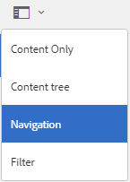
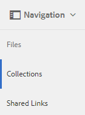
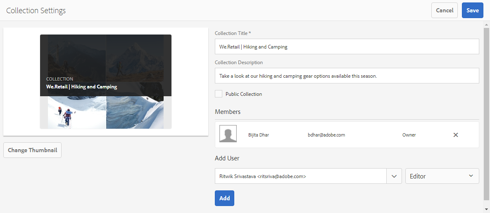
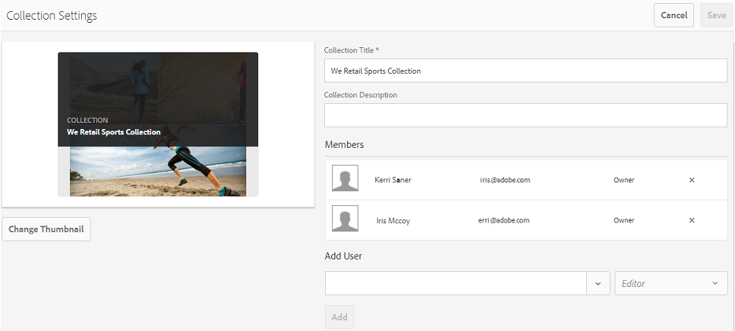
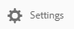
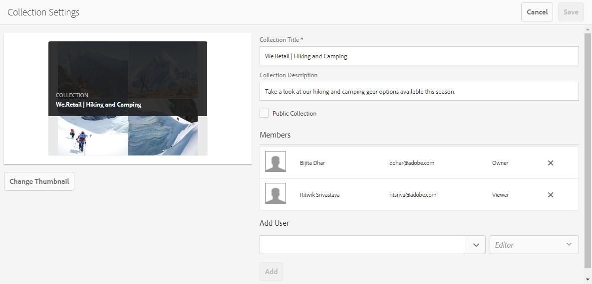

# Uso compartido de colecciones en Brand Portal {#share-collections-bp}

Los administradores de AEM Assets Brand Portal pueden compartir y dejar de compartir una colección o una colección inteligente con usuarios autorizados. Los editores pueden ver y compartir únicamente las colecciones creadas por ellos, compartidas con ellos y colecciones públicas. Sin embargo, los editores no pueden cambiar una colección pública a una colección no pública.

>[!NOTE]
>
>Los editores no pueden cambiar una colección pública a una colección no pública y, por lo tanto, no tienen la casilla [!UICONTROL de verificación Colección] pública disponible en [!UICONTROL el cuadro de] diálogo Configuración de la colección.

## Compartir una colección {#share-collection}

Para compartir una colección, siga estos pasos:

1. Haga clic en el icono de superposición a la izquierda y elija **[!UICONTROL Navegación]**.

   

2. En el sideril de la izquierda, haga clic **[!UICONTROL en Colecciones]**.

   

3. Desde la **[!UICONTROL consola Colecciones]** , realice una de las siguientes acciones:

   * Sitúe el puntero sobre la colección que desee compartir. Desde las miniaturas de acción rápida disponibles para la colección, haga clic en el icono **[!UICONTROL Configuración]** .
   

   * Seleccione la colección que desee compartir. En la barra de herramientas de la parte superior, haga clic **[!UICONTROL en Configuración]**.
   

4. En el [!UICONTROL cuadro de] diálogo Configuración de la colección, seleccione los usuarios o grupos con los que desee compartir la colección y seleccione la función para un usuario o grupo que coincida con su función global. Por ejemplo, asigne la función Editor a un editor global, la función Visor a un visor global.

   También puede hacer que la colección esté disponible para todos los usuarios independientemente de su pertenencia y función, haciendo pública la casilla **[!UICONTROL de]** verificación Colección pública.

   >[!NOTE]
   >
   >Sin embargo, los usuarios no administradores pueden no crear colecciones públicas, para evitar tener varias colecciones públicas, a fin de guardar el espacio del sistema. Las organizaciones pueden desactivar la configuración **[!UICONTROL de creación]** de colecciones públicas desde la configuración [!UICONTROL General] disponible en el panel de herramientas de administración.

   

   Los editores no pueden cambiar una colección pública a una colección no pública y, por lo tanto, no tienen la casilla [!UICONTROL de verificación Colección] pública disponible en [!UICONTROL el cuadro de] diálogo Configuración de la colección.

   

5. Seleccione **[!UICONTROL Agregar]** y, a continuación **[!UICONTROL , Guardar]**. La colección se comparte con los usuarios elegidos.

   >[!NOTE]
   >
   >La función de un usuario rige el acceso a los recursos y carpetas dentro de una colección. Si un usuario no tiene acceso a los recursos, se comparte una colección vacía con el usuario. Además, la función de un usuario rige las acciones disponibles para las colecciones.

## Dejar de compartir una colección {#unshare-a-collection}

Para dejar de compartir una colección compartida anteriormente, haga lo siguiente:

1. Desde la consola [!UICONTROL Colecciones] , seleccione la colección que desee dejar de compartir.

   En la barra de herramientas, haga clic **[!UICONTROL en Configuración]**.

   

2. En el [!UICONTROL cuadro de] diálogo Configuración de la colección, en [!UICONTROL Miembros], haga clic en el símbolo **[!UICONTROL X]** junto a usuarios o grupos para quitarlos de la lista de usuarios con los que compartió la colección.

   

3. En el cuadro de mensaje de advertencia, haga clic **[!UICONTROL en Confirmar]** para confirmar que no se comparte.

   Haga clic en **[!UICONTROL Guardar]**.

4. Inicie sesión en Brand Portal con las credenciales del usuario que ha eliminado de la lista compartida. La colección se elimina de la **[!UICONTROL consola Colecciones]** .
