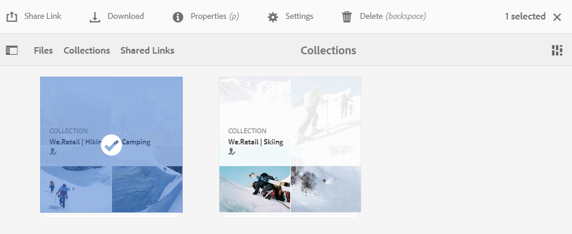

# Compartir colecciones {#share-collections}

Una colección representa un grupo de recursos relacionados almacenados juntos en Adobe Experience Manager Assets Brand Portal. Los usuarios pueden crear colecciones inteligentes de [aplicación de omnisearch o facet search para filtrar recursos relacionados](brand-portal-searching.md) y almacenarlos juntos para facilitar el acceso y compartirlos con otros usuarios de Brand Portal.

Los administradores pueden compartir y anular uso compartido una colección con los usuarios autorizados del portal de marca. Los editores y los visores pueden vista y compartir las colecciones creadas por ellas, compartirlas con ellas y colecciones públicas.

>[!NOTE]
>
>Los editores no pueden cambiar una colección pública a una colección no pública y, por lo tanto, no tiene la casilla de verificación colección ]**pública disponible en el**[!UICONTROL  cuadro de **[!UICONTROL diálogo Configuración]** colección.

## Compartir una colección {#share-collection}

A continuación se detallan los pasos para compartir una colección con los usuarios de Brand portal autorizados:

1. Inicie sesión en su inquilino de Brand portal. De forma predeterminada, se abre la **[!UICONTROL Archivos]** vista que contiene todos los activos y carpetas publicados.

1. Desde la navegación rápida de la parte superior, haga clic en **[!UICONTROL colecciones]** .

1. Desde el **[!UICONTROL Colecciones]** consola, realice una de las siguientes acciones:

   * Pase el puntero sobre la colección que desee compartir. En las miniaturas de acciones rápidas disponibles para la colección, haga clic en **[!UICONTROL Configuración]** icono.

      

   * Seleccione la colección que desee compartir. En la barra de herramientas de la parte superior, haga clic en **[!UICONTROL Configuración]**.

      

1. En el **[!UICONTROL cuadro de diálogo Configuración]** de colección, seleccione los usuarios con los que desee compartir el colección y seleccione la función de la usuario para que se corresponda con su función global. Por ejemplo, asigne función de editor a un editor global, función del visor a un visualizador global.

   Alternativamente, para que el colección esté disponible para todos los usuarios, independientemente de su miembros del grupo y función, haga público una vez que active la casilla de **[!UICONTROL verificación colección]** pública.

   >[!NOTE]
   >
   >Sin embargo, los usuarios que no son administradores se pueden restringir de la creación de colecciones públicas para evitar tener numerosas colecciones públicas, de modo que el espacio del sistema pueda guardarse. Las organizaciones pueden desactivar la **[!UICONTROL configuración de creación]** de colecciones públicas desde **[!UICONTROL las opciones generales]** disponibles en el panel herramientas de administración.

   

   Los editores no pueden cambiar una colección pública a una colección no pública y, por lo tanto, no **[!UICONTROL hay ninguna casilla de verificación de colección]** pública disponible en el cuadro de **[!UICONTROL diálogo Configuración]** colección.

   

1. Haga clic en el **[!UICONTROL botón Añadir]** para agregar el usuario y, a continuación, haga clic en **[!UICONTROL Guardar]** . El colección se comparte con los usuarios.

   >[!NOTE]
   >
   >La función de un usuario rige el acceso a los activos y las carpetas dentro de un colección. Si un usuario no tiene acceso a los recursos, se comparte una colección vacía con el usuario. Además, la función de un usuario rige las acciones disponibles para las colecciones.

## Dejar de compartir una colección {#unshare-a-collection}

Para dejar de compartir una colección previamente compartida, haga lo siguiente:

1. En la **[!UICONTROL consola colecciones]** , seleccione la colección que desee anular uso compartido.

   En la barra de herramientas de la parte superior, haga clic en **[!UICONTROL configuración]** .

   

1. En el **[!UICONTROL cuadro de diálogo Configuración]** de colección, en la **[!UICONTROL sección miembros]** , haga clic en el **[!UICONTROL símbolo x]** junto a usuarios para eliminarlos de la lista de usuarios que tienen acceso a la colección.

   

1. Aparece un mensaje de advertencia. Haga clic en **[!UICONTROL confirmar]** para anular uso compartido el colección.

1. Haga clic en **[!UICONTROL Guardar]** para aplicar los cambios.

   Una vez que la usuario se ha eliminado del lista compartido, la colección no compartida se eliminará de la consola colecciones ]**de**[!UICONTROL  usuario.

<!--
1. Click the overlay icon on the left, and choose **[!UICONTROL Navigation]**.

   

1. From the siderail on the left, click **[!UICONTROL Collections]**.

   

1. From the **[!UICONTROL Collections]** console, do one of the following:

    * Hover the pointer over the collection you want to share. From the quick action thumbnails available for the collection, click the **[!UICONTROL Settings]** icon.

   

    * Select the collection you want to share. From the toolbar at the top, click **[!UICONTROL Settings]**.
    
   

1. In the [!UICONTROL Collection Settings] dialog box, select the users or groups with whom you want to share the collection and select the role for a user or a group to match their global role. For example, assign the Editor role to a global editor, the Viewer role to a global viewer.

   Alternatively, to make the collection available to all users irrespective of their group membership and role, make it public by selecting the **[!UICONTROL Public Collection]** check-box.

   >[!NOTE]
   >
   >However, non-admin users can be restricted from creating public collections, to avoid having numerous public collections so that system space can be saved. Organizations can disable the **[!UICONTROL Allow public collections creation]** configuration from [!UICONTROL General] settings available in admin tools panel.

   

   Editors cannot change a public collection to a non-public collection and, therefore, do not have **[!UICONTROL Public Collection]** check-box available in **[!UICONTROL Collection Settings]** dialog.

   

1. Select **[!UICONTROL Add]**, and then **[!UICONTROL Save]**. The collection is shared with the chosen users.

   >[!NOTE]
   >
   >A user's role governs access to the assets and folders inside a collection. If a user does not have access to assets, an empty collection is shared with the user. Also, a user's role governs the actions available for collections.

## Unshare a collection {#unshare-a-collection}

To unshare a previously shared collection, do the following:

1. From the **[!UICONTROL Collections]** console, select the collection you want to unshare.

   In the toolbar, click **[!UICONTROL Settings]**.

   

1. On the **[!UICONTROL Collection Settings]** dialog box, under **[!UICONTROL Members]**, click the **[!UICONTROL x]** symbol next to users or groups to remove them from the list of users you shared the collection with.

   

1. In the warning message box, click **[!UICONTROL Confirm]** to confirm unshare.

   Click **[!UICONTROL Save]**.

1. Log in to Brand Portal with the credentials of the user you removed from the shared list. The collection is removed from the **[!UICONTROL Collections]** console.
-->
