# Compartir carpetas en Brand Portal {#share-folders}

Los recursos deben publicarse en Brand Portal desde una instancia preconfigurada de AEM Author, ya que Brand Portal no admite la ingesta de recursos.

## Flujo de trabajo de uso compartido de carpetas en Brand Portal {#folder-sharing-workflow-in-brand-portal}

A continuación se describe el flujo de trabajo compartido de carpetas y el acceso de usuario:

* De forma predeterminada, todas las carpetas publicadas desde AEM Assets a Brand Portal solo son visibles para el administrador de Brand Portal, a menos que se marque como público al configurar la replicación.
* El administrador utiliza la consola [!UICONTROL Propiedades] de carpeta para compartir una carpeta con usuarios o grupos selectivos. Solo los usuarios o grupos con los que se comparte la carpeta podrán ver la carpeta después de iniciar sesión en Brand Portal. La carpeta no es visible para otros usuarios.
* El administrador también puede elegir convertir una carpeta en pública mediante la casilla [!UICONTROL de] verificación Carpeta pública en [!UICONTROL la consola Propiedades] de carpeta. Todos los usuarios pueden ver una carpeta pública.

* Independientemente de las funciones y privilegios de usuario, cuando los usuarios inician sesión en Brand Portal, verán todas las carpetas públicas y las carpetas directamente compartidas con ellos o con un grupo al que pertenecen. Las carpetas privadas, o carpetas compartidas con otros usuarios, no son visibles para todos los usuarios.

### Compartir carpetas con grupos de usuarios en Brand Portal {#sharing-folders-with-user-groups-on-brand-portal}

Los derechos de acceso a los recursos de una carpeta dependen de los derechos de acceso en su carpeta principal, independientemente de la configuración de carpetas secundarias. Este comportamiento está regulado por [ACLS](https://helpx.adobe.com/experience-manager/6-5/sites/administering/using/security.html#PermissionsinAEM) en AEM, ya que las carpetas infantiles heredan ACL de sus carpetas principales. Por ejemplo, si una carpeta A contiene la carpeta B que contiene la carpeta C, un grupo de usuarios (o usuarios) que tengan derechos de acceso en la carpeta A tendrá también los mismos derechos de acceso en la carpeta B y la carpeta C. La carpeta B siendo la carpeta secundaria de A hereda sus ACLS y la carpeta C que sea la carpeta secundaria de B hereda sus ACL.

Del mismo modo, los grupos de usuarios (o usuarios) que tengan permisos para acceder solo a la carpeta B tienen los mismos permisos de acceso en la carpeta C pero no en la carpeta A. Por lo tanto, es aconsejable que las organizaciones organicen su contenido de forma que los recursos más expuestos se coloquen en la carpeta infantil y que, de los niños a los de la carpeta raíz, se pueda restringir el acceso.

### Public folder publish {#public-folder-publish}

A menos [!UICONTROL que se seleccione la opción Publicación] de carpeta pública al configurar la replicación de Brand Portal, los usuarios no administradores (como Editores y Visores) no tienen acceso a los recursos publicados desde AEM Assets a Brand Portal.

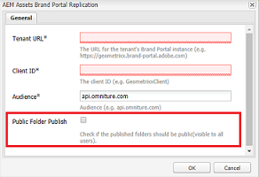

Si la [!UICONTROL opción Publicación] de carpeta pública está deshabilitada, los administradores deben compartir específicamente estos recursos con usuarios no administradores mediante la función de compartir.

>[!NOTE]
>
>La opción de habilitar [!UICONTROL Publicación] pública está disponible en AEM 6.3.2.1.

## Acceso a carpetas compartidas {#access-to-shared-folders}

La siguiente matriz analiza los derechos de acceso y los derechos para compartir/dejar de compartir recursos para diversas funciones de usuario:

|  | Acceso a todas las carpetas publicadas desde AEM Assets a Brand Portal | Acceso a carpetas compartidas | Compartir y dejar de compartir derechos de carpetas |
|---------------|-----------|-----------|------------|
| Administrador | Sí | Sí | Sí |
| Editor | No* | Sí, solo si se comparte con ellos o con el grupo al que pertenecen | Sí, solo para las carpetas compartidas con ellos o con el grupo al que pertenecen |
| Visor | No* | Sí, solo si se comparte con ellos o con el grupo al que pertenecen | No |
| Usuario invitado | No* | Sí, solo si se comparte con ellos o con el grupo al que pertenecen | No |

** De forma predeterminada,[!UICONTROL la opción Publicación]pública se desactiva al configurar la replicación de Brand Portal con AEM Author. Si la opción está habilitada, las carpetas publicadas en Brand Portal estarán accesibles para todos los usuarios (usuarios no administradores) de forma predeterminada.*

### Acceso de usuario no administrador a carpetas compartidas {#non-admin-user-access-to-shared-folders}

Los usuarios no administradores solo pueden acceder a las carpetas compartidas con ellos en Brand Portal. Sin embargo, la forma en que se muestran estas carpetas en el portal cuando inician sesión depende de la configuración de [!UICONTROL Habilitar la configuración de jerarquía] de carpetas.

**Si la configuración está deshabilitada**

Los usuarios no administradores ven todas las carpetas compartidas con ellos en la página de aterrizaje, al iniciar sesión en Brand Portal.

**Si la configuración está habilitada**

Los usuarios no administradores ven el árbol de carpetas (empezando por la carpeta raíz) y las carpetas compartidas organizadas en sus respectivas carpetas principales al iniciar sesión en Brand Portal.

Estas carpetas principales son las carpetas virtuales y no se pueden realizar acciones en ellas. Puede reconocer estas carpetas virtuales con un icono de candado.

No hay tareas de acción visibles al desplazarse o seleccionarlas en Vista de tarjeta, a diferencia de las carpetas compartidas. [!UICONTROL El] botón Información general se muestra al seleccionar una carpeta virtual en [!UICONTROL Vista de columna] y [!UICONTROL Vista de lista].

>[!NOTE]
>
>Tenga en cuenta que la miniatura predeterminada de las carpetas virtuales es la imagen en miniatura de la primera carpeta compartida.

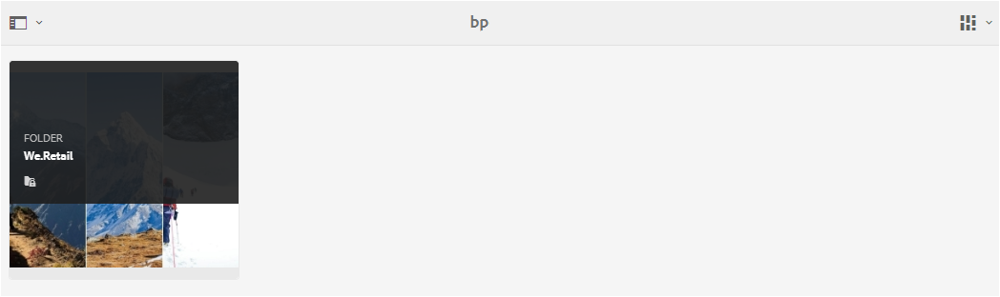 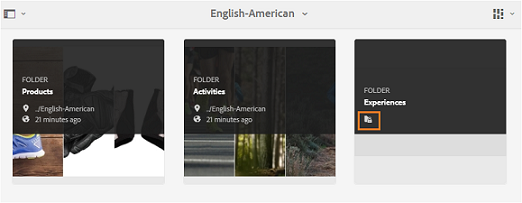 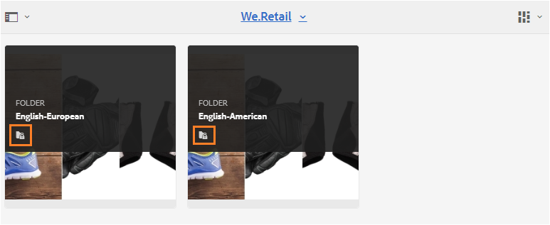 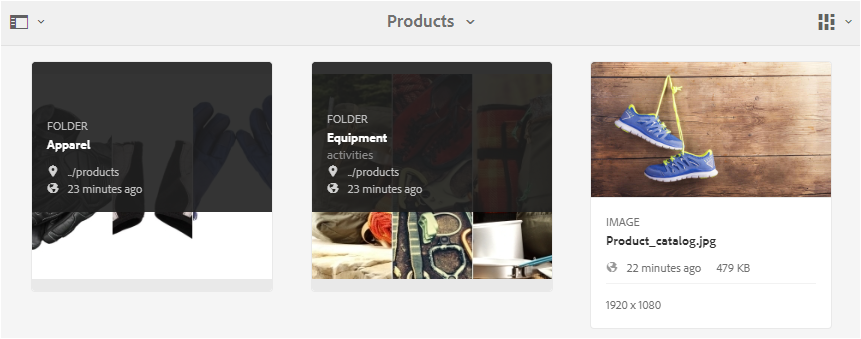

## Compartir carpetas {#how-to-share-folders}

Para compartir una carpeta con usuarios en Brand Portal, siga estos pasos:

1. Haga clic en el icono de superposición a la izquierda y elija **[!UICONTROL Navegación]**.

   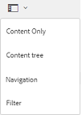

2. En el sideril de la izquierda, seleccione **[!UICONTROL Archivos]**.

   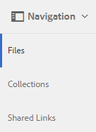

3. Desde la interfaz de Brand Portal, seleccione la carpeta que desee compartir.

   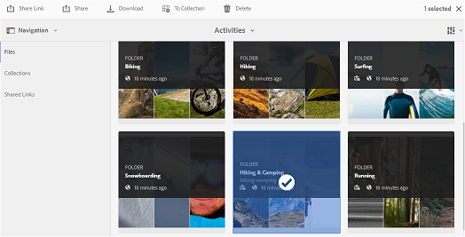

4. En la barra de herramientas de la parte superior, seleccione **[!UICONTROL Compartir]**.

   

   Aparece [!UICONTROL la consola Propiedades] de carpeta.

   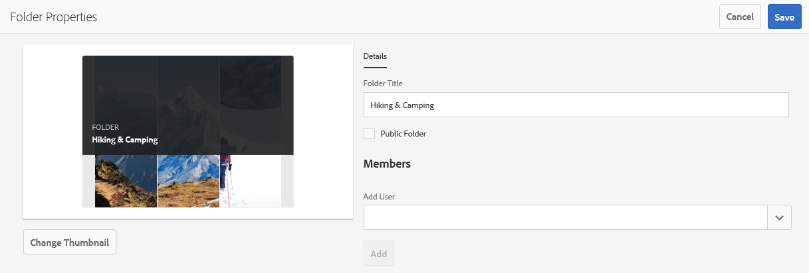

5. En [!UICONTROL la consola Propiedades] de carpeta, especifique el título de carpeta en [!UICONTROL el campo Título] de carpeta si no desea que se muestre el nombre predeterminado a los usuarios.
6. En [!UICONTROL la] lista Agregar usuario, seleccione los usuarios o grupos con los que desee compartir la carpeta y haga clic **[!UICONTROL en Agregar]**.
Para compartir la carpeta únicamente con usuarios invitados y ningún otro usuario, seleccione **[!UICONTROL Usuarios anónimos]** en la lista desplegable [!UICONTROL Miembros] .

   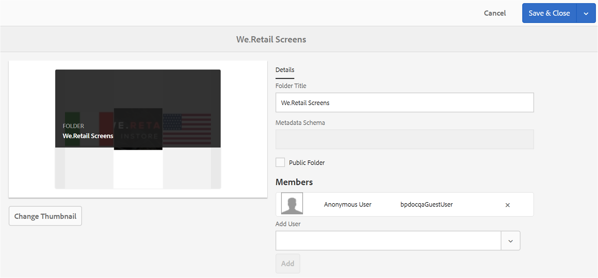

   >[!NOTE]
   >
   >Para que la carpeta esté disponible para todos los usuarios independientemente de su pertenencia y función, haga pública la casilla **[!UICONTROL de]** verificación Carpeta pública.

7. Si es necesario, haga clic **[!UICONTROL en Cambiar miniatura]** para modificar la imagen en miniatura de la carpeta.
8. Haga clic en **[!UICONTROL Guardar]**.
9. Para acceder a la carpeta compartida, inicie sesión en Brand Portal con las credenciales del usuario con el que ha compartido la carpeta. Revise la carpeta compartida en la interfaz.

## No compartir carpetas {#unshare-the-folders}

Para dejar de compartir una carpeta compartida anteriormente, siga estos pasos:

1. Desde la interfaz de Brand Portal, seleccione la carpeta que desee dejar de compartir.

   

2. En la barra de herramientas de la parte superior, haga clic **[!UICONTROL en Compartir]**.
3. En [!UICONTROL la consola Propiedades] de carpeta, en [!UICONTROL Miembros], haga clic en el símbolo **[!UICONTROL X]** junto al usuario para eliminarlo de la lista de usuarios con los que compartió la carpeta.

   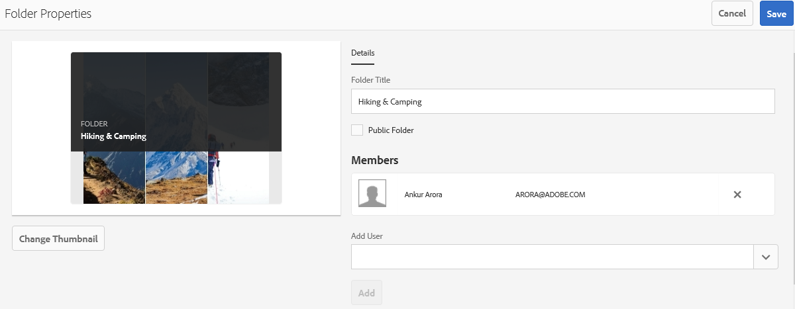

4. En el cuadro de mensaje de advertencia, haga clic **[!UICONTROL en Confirmar]** para confirmar que no se comparte.
Haga clic en **[!UICONTROL Guardar]**.

5. Inicie sesión en Brand Portal con las credenciales del usuario que ha eliminado de la lista compartida. La carpeta ya no está disponible en la interfaz de Brand Portal para el usuario.
