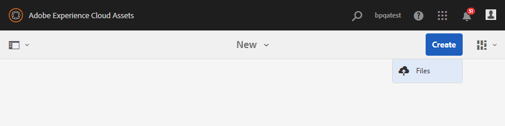

# Cargar recursos en la carpeta de contribución {#uplad-new-assets-to-contribution-folder}

Los usuarios de Brand Portal pueden [descargar los requisitos de recursos](brand-portal-download-asset-requirements.md) para comprender la necesidad de contribución.
A continuación, pueden crear nuevos recursos para contribución y cargarlos en la carpeta NEW de la carpeta de contribución.

>[!NOTE]
>
>Los usuarios de Brand Portal solo pueden cargar recursos en la carpeta NEW.
>
>El límite máximo de carga para cualquier inquilino de Brand Portal es **10** GB, que se aplica acumulativamente a todas las carpetas de contribución.

Después de publicar los recursos recién creados en AEM Assets, los usuarios de Brand Portal pueden eliminarlos de la carpeta NEW. En cambio, el administrador de Brand Portal puede eliminar los recursos de las carpetas NUEVO y COMPARTIDO.

Una vez alcanzado el objetivo de crear la carpeta de contribución, el administrador de Brand Portal puede eliminar la carpeta de contribución para liberar el espacio de carga para otros usuarios.

>[!NOTE]
>
>Se recomienda liberar el espacio de carga después de publicar la carpeta de contribución en AEM Assets para que esté disponible para los demás usuarios de Brand Portal para su contribución.
>
>Si es necesario ampliar el límite de carga del inquilino de Brand Portal más allá de **10** GB, póngase en contacto con el servicio de soporte técnico de Adobe para especificar el requisito.

**Para cargar recursos nuevos:**

1. Inicie sesión en la instancia de Brand Portal.
El panel de Brand Portal refleja todas las carpetas existentes permitidas al usuario de Brand Portal junto con la carpeta de contribución recientemente compartida.

1. Seleccione la carpeta de contribución y haga clic en para abrirla. La carpeta de contribución contiene dos subcarpetas: **[!UICONTROL SHARED]** y **[!UICONTROL NEW]**.

1. Haga clic en la carpeta **[!UICONTROL NEW]**.

   

1. Haga clic en **[!UICONTROL Crear]** > **[!UICONTROL Archivos]** para cargar archivos o carpetas individuales (.zip) que contengan varios recursos.

   

1. Explore y cargue recursos (archivos o carpetas) en la carpeta **[!UICONTROL NEW]**.

   

Después de cargar todos los recursos o carpetas en la carpeta NEW, publique la carpeta de contribución en AEM Assets. Consulte [Publicar carpeta de contribución en AEM Assets](brand-portal-publish-contribution-folder-to-aem-assets.md).
