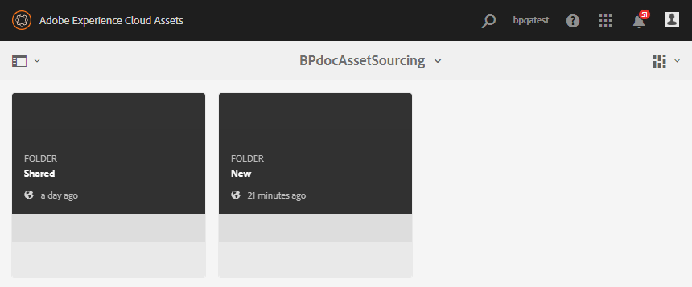

# Carga de recursos en la carpeta de contribución {#uplad-new-assets-to-contribution-folder}

Los usuarios de Brand Portal [descargan los requisitos](brand-portal-download-asset-requirements.md) de los recursos: un breve documento adjunto a la carpeta de contribución y descargue los recursos de línea de base de la carpeta **SHARED** para comprender la necesidad de la contribución.
Los usuarios de Brand Portal pueden crear nuevos recursos para la contribución y cargarlos en la carpeta **NEW** de la carpeta de contribución.

>[!NOTE]
>
>Los usuarios de Brand Portal solo pueden cargar contenido o recursos en la carpeta **NEW** . No tienen permiso para eliminar un recurso cargado.
>
>El límite máximo de carga para cualquier cuenta o inquilino de Brand Portal es de **10** GB.

**Para cargar recursos nuevos:**

1. Inicie sesión en la instancia de Brand Portal.
El panel de Brand Portal refleja todas las carpetas existentes permitidas al usuario de Brand Portal junto con la carpeta de contribución recientemente compartida.
1. Haga clic para abrir la carpeta de contribución y verá dos subcarpetas:**[!UICONTROL COMPARTIDO]** y **[!UICONTROL NUEVO]** en la carpeta de contribución.
1. Haga clic en **[!UICONTROL NUEVA]** carpeta.
   
1. Haga clic en **[!UICONTROL Crear > Archivos]**  para cargar archivos o carpetas individuales (.zip) que contengan varios recursos.
   
1. Busque y cargue nuevos recursos (archivos/carpetas) en la carpeta **[!UICONTROL NEW]** .
   

Una vez finalizada la carga, el usuario de Brand Portal puede volver a publicar la carpeta de contribución en AEM Assets. Consulte [Publicación de la carpeta de contribución en AEM Assets](brand-portal-publish-contribution-folder-to-aem-assets.md).