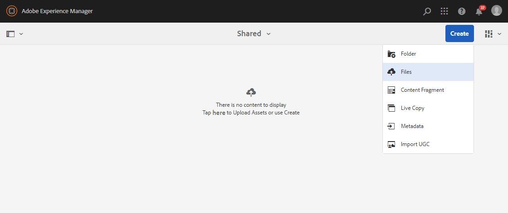
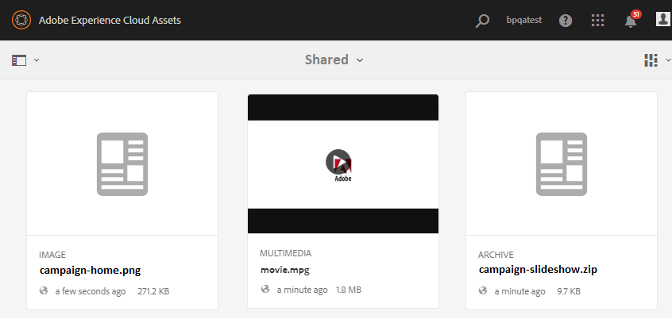

# Cargar recursos de línea de base {#upload-baseline-assets}

AEM administrador carga los recursos de línea de base en la carpeta **SHARED** para ayudar a los usuarios de Brand Portal a comprender los tipos de recursos necesarios durante la contribución. Los usuarios de Brand Portal pueden utilizar estos recursos como contenido de referencia al crear nuevos recursos para la contribución.

**Para cargar recursos de línea de base:**

1. Inicie sesión en la instancia de creación de AEM.
Dirección URL predeterminada: http:// localhost:4502/aem/start.html
1. Vaya a **[!UICONTROL Recursos > Archivos]** y busque la carpeta de contribución en la que desea cargar los recursos de línea de base.
1. Haga clic para abrir la carpeta de contribución y verá dos subcarpetas:**[!UICONTROL COMPARTIDO]** y **[!UICONTROL NUEVO]** dentro de la carpeta de contribución.
1. Haga clic en la carpeta **[!UICONTROL SHARED]**.
1. Haga clic en **[!UICONTROL Crear > Archivos]**  para cargar recursos individuales.
O bien, haga clic en **[!UICONTROL Crear > Carpeta]** para cargar la carpeta (.zip) que contiene varios recursos.
   
1. Explore y cargue los recursos de línea de base (archivos/carpetas) en la carpeta **[!UICONTROL SHARED]**.
   

Una vez finalizada la carga, los administradores pueden publicar la carpeta de contribución en Brand Portal. Consulte [Publicar carpeta de contribución en Brand Portal](brand-portal-publish-contribution-folder-to-brand-portal.md).