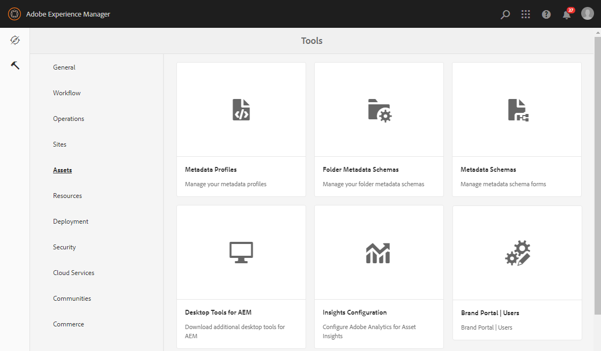

# Cargar lista de usuarios de Brand Portal {#upload-bp-user-list}

Los administradores de AEM pueden cargar el archivo de configuración de usuario de Brand Portal (.csv) que contiene la lista de usuarios activa de Brand Portal en Recursos AEM. Una carpeta de contribución solo se puede compartir con los usuarios activos de Brand Portal definidos en la lista de usuarios. El administrador también puede agregar usuarios nuevos en el archivo de configuración y cargar la lista de usuarios modificada.

El administrador puede agregar usuarios nuevos en la Consola de administración de AEM. Consulte [Administrar usuarios](brand-portal-adding-users.md) para obtener información detallada. Después de agregar usuarios en Admin Console, estos usuarios se pueden agregar al archivo de configuración de usuario de Brand Portal y, a continuación, se les puede asignar permiso para acceder a la carpeta de contribución.

**Para cargar la lista de usuarios de Brand Portal:**
1. Inicie sesión en la instancia de creación de AEMURL predeterminada: http:// localhost:4502/aem/start.html
1. En el panel **Herramientas**  , vaya a **[!UICONTROL Recursos &gt; Usuarios de Brand Portal]**
   
1. Se abre la ventana Contribuyentes de carga de Brand Portal.
Navegue desde el equipo local y cargue el archivo **de** configuración (.csv) que contiene la lista de usuarios activa de Brand Portal.
1. Haga clic en **[!UICONTROL Guardar]**.
   

Los administradores pueden proporcionar acceso a usuarios o grupos específicos desde esta lista de usuarios mientras configuran la carpeta de contribución.

Para obtener más información, consulte [Configurar carpeta](brand-portal-contribution-folder.md)de contribución.
