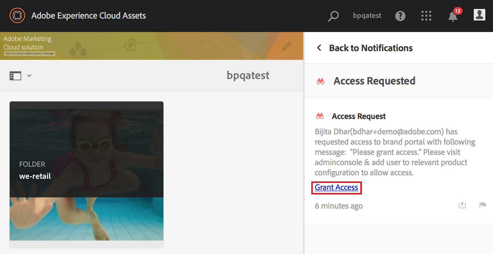

# Overview of AEM Assets Brand Portal {#overview-of-aem-assets-brand-portal}

As a marketer, you sometimes need to collaborate with channel partners and internal business users to quickly create, manage, and deliver relevant digital content to customers. Timely delivery of relevant content across the entire customer journey is critical to driving greater demand, conversion, engagement, and customer loyalty.

However, it is a challenge to develop solutions that support efficient and secure sharing of approved brand logos, guidelines, campaign assets, or product shots with extended internal teams, partners, and resellers.

**Adobe Experience Manager (AEM) Assets Brand Portal can help you easily acquire, control, and securely distribute approved creative assets to external parties and internal business users across devices.** Ayuda a mejorar la eficiencia del uso compartido de activos, acelera el tiempo de comercialización de los activos y reduce el riesgo de incumplimiento y acceso no autorizado.

The browser-based portal environment enables you to easily upload, browse, search, preview, and export assets in approved formats.

## Personas de usuario en Brand Portal {#Personas}

Brand Portal supports the following user roles:

* Usuario invitado
* Visor
* Editor
* Administrator

The following table lists the tasks that users in these roles can perform:

|  | **Examinar** | **Buscar** | **Descargar** | **Compartir carpetas** | **Compartir una colección** | **Share assets as a link** | **Acceso a las Herramientas de administración** |
|--- |--- |--- |--- |--- |--- |--- |--- |
| **Usuario invitado** | ✓* | ✓* | ✓* | x | x | x | x |
| **Visor** | ✓ | ✓ | ✓ | x | x | x | x |
| **Editor** | ✓ | ✓ | ✓ | ✓ | ✓ | ✓ | x |
| **Administrador** | ✓ | ✓ | ✓ | ✓ | ✓ | ✓ | ✓ |

* Los usuarios invitados pueden examinar, acceder y buscar recursos solo en carpetas públicas y colecciones.

### Guest user {#guest-user}

Cualquier usuario invitado que tenga acceso limitado a los recursos en Brand Portal sin someterse a autenticación. La sesión de invitado permite a los usuarios acceder a carpetas y colecciones públicas. Como usuario invitado, puede examinar los detalles de los recursos y tener una vista completa de los recursos de los miembros de las carpetas públicas y las colecciones. Puede buscar, descargar y agregar recursos públicos a la colección [!UICONTROL Lightbox] .

Sin embargo, la sesión de invitado le impide crear colecciones y guardar búsquedas, y compartirlas aún más. Los usuarios de una sesión de invitado no pueden acceder a la configuración de carpetas y colecciones, y no pueden compartir recursos como vínculos. Esta es una lista de tareas que un usuario invitado puede realizar:

[Explorar y acceder a los recursos públicos](browse-assets-brand-portal.md)

[Buscar recursos públicos](brand-portal-searching.md)

[Descargar recursos públicos](brand-portal-download-users.md)

[Agregar recursos a [!UICONTROL Lightbox]](brand-portal-light-box.md#add-assets-to-lightbox)

### Visor {#viewer}

Un usuario estándar de Brand Portal suele ser un usuario con la función de visor. Un usuario con esta función puede acceder a las carpetas, colecciones y recursos permitidos. El usuario también puede examinar, previsualizar, descargar y exportar recursos (representaciones originales o específicas), configurar la cuenta y buscar recursos. Esta es una lista de tareas que un visor puede realizar:

[Browse assets](browse-assets-brand-portal.md)

[Buscar recursos](brand-portal-searching.md)

[Descargar recursos](brand-portal-download-users.md)

### Editor {#editor}

Un usuario con la función de editor puede realizar todas las tareas que pueda realizar un visor. Además, y Editor pueden ver los archivos y carpetas que un administrador comparte. El usuario con la función de editor también puede compartir contenido (archivos, carpetas, colecciones) con otros usuarios.

Aparte de las tareas que puede realizar un visor, un editor puede realizar las siguientes tareas adicionales:

[Compartir carpetas](brand-portal-sharing-folders.md)

[Compartir una colección](brand-portal-share-collection.md)

[Compartir recursos como vínculo](brand-portal-link-share.md)

### Administrator {#administrator}

An administrator includes a user marked as system administrator or Brand Portal product administrator in Admin Console.  An administrator can add and remove system administrators and users, define presets, send email to users, and view portal usage and storage reports.

An administrator can perform all tasks that an Editor can perform the following additional tasks:

[Manage users, groups, and user roles](brand-portal-adding-users.md)

[Customize wallpaper, page headers, and emails](brand-portal-branding.md)

[Use custom search facets](brand-portal-search-facets.md)

[Use the metadata schema form](brand-portal-metadata-schemas.md)

[Apply image presets or dynamic renditions](brand-portal-image-presets.md)

[Work with reports](brand-portal-reports.md)

Además de las tareas anteriores, un autor de Recursos AEM puede realizar las siguientes tareas:

[Configure AEM Assets integration with Brand Portal](https://helpx.adobe.com/experience-manager/6-5/assets/using/brand-portal-configuring-integration.html)

[Publish folders to Brand Portal](https://helpx.adobe.com/experience-manager/6-5/assets/using/brand-portal-publish-folder.html)

[Publish collections to Brand Portal](https://helpx.adobe.com/experience-manager/6-5/assets/using/brand-portal-publish-collection.html)

## Alternate alias for Brand Portal url {#tenant-alias-for-portal-url}

A partir de Brand Portal 6.4.3, las organizaciones pueden tener una URL alternativa (alias) para la URL existente de su inquilino de Brand Portal. The alias URL can be created by having an alternate prefix in the URL.\
Note that only the prefix of the Brand Portal URL can be customized and not the entire URL. Por ejemplo, una organización con un dominio existente **[!UICONTROL geometSymmetrix.brand-portal.adobe.com]** puede obtener **[!UICONTROL geomettrixinc.brand-portal.adobe.com]** creada a petición.

Sin embargo, la instancia de AEM Author solo se puede [configurar](https://helpx.adobe.com/experience-manager/6-5/assets/using/brand-portal-configuring-integration.html) con la dirección URL de identificación del inquilino y no con la URL de alias del inquilino (alternativa).

>[!NOTE]
>
>Para obtener un alias para el nombre del inquilino en la URL del portal existente, las organizaciones deben ponerse en contacto con el servicio de asistencia de Adobe con una nueva solicitud de creación de alias del inquilino. Esta solicitud se procesa comprobando primero si el alias está disponible y, a continuación, creando el alias.
>
>Para reemplazar el alias antiguo o eliminarlo, debe seguirse el mismo proceso.

## Solicitar acceso a Brand Portal {#request-access-to-brand-portal}

Los usuarios pueden solicitar acceso a Brand Portal desde la pantalla de inicio de sesión. Estas solicitudes se envían a los administradores de Brand Portal, quienes otorgan acceso a los usuarios a través de Adobe [!UICONTROL Admin Console]. Una vez concedido el acceso, los usuarios reciben un correo electrónico de notificación.

Para solicitar acceso, haga lo siguiente:

1. En la página de inicio de sesión de Brand Portal, seleccione **[!UICONTROL ¿Hacer clic aquí]** correspondiente a **[!UICONTROL Necesita acceso?]**. Sin embargo, para entrar en la sesión de invitados, seleccione **[!UICONTROL Haga clic aquí]** correspondiente a Acceso de **[!UICONTROL invitados?]**.

   

   Se abre la página [!UICONTROL Solicitar acceso] .

2. Para solicitar acceso al portal de marca de una organización, debe tener un ID [!UICONTROL de]Adobe válido, un ID [!UICONTROL de]empresa o un ID [!UICONTROL federado].

   En la página [!UICONTROL Solicitar acceso] , inicie sesión con su ID (escenario 1) o cree un ID de [!UICONTROL Adobe] (escenario 2):
   ![[!UICONTROL Request access]](assets/bplogin_request_access_2.png)

   **Escenario 1**
   1. Si tiene un [!UICONTROL Adobe ID], un [!UICONTROL Enterprise ID]o un [!UICONTROL Federated ID], haga clic en **[!UICONTROL Iniciar sesión]**.
Se abre la página [!UICONTROL Iniciar sesión] .
   2. Proporcione sus credenciales de [!UICONTROL Adobe ID] y haga clic en **[!UICONTROL Iniciar sesión]**. 
   

   Se le redirige a la página [!UICONTROL Solicitar acceso] .
   **Escenario 2**
   1. Si no dispone de un ID [!UICONTROL de]Adobe, para crear uno, haga clic en **[!UICONTROL Obtener un ID]** de Adobe en la página [!UICONTROL Solicitar acceso] .
Se abre la página [!UICONTROL Iniciar sesión] .
   2. Click **[!UICONTROL Get an Adobe ID]**.
Se abre la página [!UICONTROL Registro] .
   3. Escriba su nombre y apellidos, ID de correo electrónico y contraseña.
   4. Seleccione **[!UICONTROL Registrarse]**. 
   

   You are redirected to the Request Access page.

3. The next page displays your name and email ID used to request access. Leave a comment for the administrator, and click Submit.****

   

## Product administrators grant access {#grant-access-to-brand-portal}

Brand Portal product administrators receive access requests in their Brand Portal notification area and through emails in their inbox.

To grant access, product administrators need to click the relevant notification in Brand Portal notification area and then click Grant Access.
****
Alternatively, product administrators can follow the link provided in the access request email to visit Adobe Admin Console and add the user to the relevant product configuration.

You are redirected to the Adobe [!UICONTROL Admin Console] home page.  Utilice Adobe [!UICONTROL Admin Console] para crear usuarios y asignarlos a perfiles de producto (anteriormente conocidos como configuraciones de producto), que se muestran como grupos en Brand Portal. For more information about adding users in Admin Console, see Add a user (follow Steps 4-7 in the procedure to add a user).

## Idiomas de Brand Portal {#brand-portal-language}

Puede cambiar el idioma de Brand Portal desde la configuración [!UICONTROL de Adobe]Experience Cloud.

Para cambiar el idioma:

1. Seleccione [!UICONTROL Usuario] &gt; [!UICONTROL Editar perfil] en el menú superior.
   

2. En la página Configuración [!UICONTROL de] Experience Cloud, seleccione un idioma en el menú desplegable [!UICONTROL Idioma] .

## Notificación de mantenimiento de Brand Portal {#brand-portal-maintenance-notification}

Antes de que el portal de marcas esté programado para su mantenimiento, se muestra una notificación como pancarta después de iniciar sesión en Brand Portal. Una notificación de muestra:

Puede rechazar esta notificación y continuar usando Brand Portal. Esta notificación aparece en cada nueva sesión.

## Información de la versión y del sistema {#release-and-system-information}

<!--* [What's new](../using/whats-new.md)-->
* [Notas de versión](brand-portal-release-notes.md)
* [Formatos de archivo admitidos](brand-portal-supported-formats.md)

## Related resources {#related-resources}

* [Servicio de atención al cliente de Adobe](https://helpx.adobe.com/marketing-cloud/contact-support.html)
* [Foros de AEM](https://www.adobe.com/go/aod_forums_en)