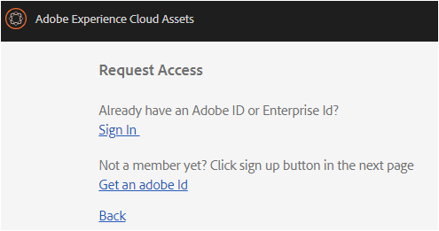

# Descripción general de AEM Assets Brand Portal {#overview-of-aem-assets-brand-portal}

Como especialista en mercadotecnia, a veces necesita colaborar con socios de canal y usuarios empresariales internos para crear, administrar y entregar rápidamente contenido digital relevante a los clientes. La entrega oportuna de contenido relevante en todo el viaje del cliente es fundamental para impulsar una mayor demanda, conversión, compromiso y lealtad del cliente.

Sin embargo, es un reto desarrollar soluciones que admitan un uso compartido eficiente y seguro de logotipos de marca aprobados, directrices, recursos de campañas o capturas de productos con equipos internos, socios y distribuidores ampliados.

**[!DNL Adobe Experience Manager (AEM) Assets Brand Portal]** puede ayudarle a adquirir, controlar y distribuir fácilmente recursos creativos aprobados a usuarios externos y a usuarios internos de la empresa entre dispositivos. Ayuda a mejorar la eficacia del uso compartido de recursos, acelera el tiempo de comercialización de los recursos y reduce el riesgo de acceso no autorizado y no autorizado.

El entorno de portal basado en explorador le permite cargar, examinar, buscar, previsualizar y exportar recursos fácilmente en formatos aprobados.

## Usuarios de usuarios en Brand Portal {#Personas}

[!DNL Brand Portal] admite las siguientes funciones de usuario:

* Usuario invitado
* Visor
* Editor
* Administrador

La siguiente tabla enumera las tareas que los usuarios pueden realizar:

|  | **Examinar** | **Buscar** | **Descargar** | **Compartir carpetas** | **Compartir una colección** | **Compartir recursos como un vínculo** | **Acceso a las herramientas de administración** |
|--- |--- |--- |--- |--- |--- |--- |--- |
| **Usuario invitado** | ✓* | ✓* | ✓* | x | x | x | x |
| **Visor** | ✓ | ✓ | ✓ | x | x | x | x |
| **Editor** | ✓ | ✓ | ✓ | ✓ | ✓ | ✓ | x |
| **Administrador** | ✓ | ✓ | ✓ | ✓ | ✓ | ✓ | ✓ |

* Los usuarios invitados pueden examinar, acceder y buscar recursos en carpetas y colecciones públicas únicamente.

### Guest user {#guest-user}

Cualquier usuario que tenga acceso limitado a recursos sin [!DNL Brand Portal] autenticación es un usuario invitado. La sesión de invitados permite a los usuarios acceder a carpetas y colecciones públicas. Como usuario invitado, puede navegar por los detalles del recurso y tener una vista completa de recursos de los miembros de carpetas y colecciones públicas. Puede buscar, descargar y agregar recursos públicos a la colección [!UICONTROL de cajas Lightbox].

Sin embargo, la sesión de invitado le impide crear colecciones y búsquedas guardadas, y compartirlas aún más. Los usuarios de una sesión de invitados no pueden acceder a la configuración de carpetas y colecciones y no pueden compartir recursos como vínculo. Esta es una lista de tareas que un usuario invitado puede realizar:

[Examinar y acceder a recursos públicos](browse-assets-brand-portal.md)

[Buscar recursos públicos](brand-portal-searching.md)

[Descarga de recursos públicos](brand-portal-download-users.md)

[Agregue recursos a [! UICONTROL Lightbox]](brand-portal-light-box.md#add-assets-to-lightbox)

### Visor {#viewer}

Un usuario estándar suele [!DNL Brand Portal] ser un usuario con la función de visor. Un usuario con esta función puede acceder a carpetas, colecciones y recursos permitidos. El usuario también puede examinar, obtener una vista previa, descargar y exportar recursos (representaciones originales o específicas), configurar la configuración de la cuenta y buscar recursos. Esta es una lista de tareas que un visor puede realizar:

[Explorar recursos](browse-assets-brand-portal.md)

[Buscar recursos](brand-portal-searching.md)

[Descargar recursos](brand-portal-download-users.md)

### Editor {#editor}

Un usuario con la función Editor puede realizar todas las tareas que pueda realizar un visor. Además, el Editor puede ver los archivos y las carpetas que comparte un administrador. El usuario con la función de editor también puede compartir contenido (archivos, carpetas, colecciones) con otros.

Además de las tareas que puede realizar un visor, un editor puede realizar las siguientes tareas adicionales:

[Compartir carpetas](brand-portal-sharing-folders.md)

[Compartir una colección](brand-portal-share-collection.md)

[Compartir recursos como un vínculo](brand-portal-link-share.md)

### Administrador {#administrator}

Un administrador incluye un usuario marcado como administrador del sistema o administrador [!DNL Brand Portal] de producto en la Consola [!UICONTROL de administración]. Un administrador puede agregar y quitar administradores y usuarios del sistema, definir ajustes preestablecidos, enviar correos electrónicos a los usuarios y ver informes de almacenamiento y uso del portal.

Un administrador puede realizar todas las tareas que un editor pueda realizar y las tareas adicionales siguientes:

[Administrar usuarios, grupos y funciones de usuario](brand-portal-adding-users.md)

[Personalizar el papel tapiz, los encabezados de página y los correos electrónicos](brand-portal-branding.md)

[Usar facetas de búsqueda personalizadas](brand-portal-search-facets.md)

[Uso del formulario de esquema de metadatos](brand-portal-metadata-schemas.md)

[Aplicación de ajustes preestablecidos de imagen o representaciones dinámicas](brand-portal-image-presets.md)

[Trabajar con informes](brand-portal-reports.md)

Además de las tareas anteriores, un Autor en [!DNL AEM Assets] puede realizar las tareas siguientes:

[Configure [! Integración de DNL Assets] con [! DNL Brand Portal]](https://helpx.adobe.com/experience-manager/6-5/assets/using/brand-portal-configuring-integration.html)

[Publicar carpetas en [! DNL Brand Portal]](https://helpx.adobe.com/experience-manager/6-5/assets/using/brand-portal-publish-folder.html)

[Publique colecciones en [! DNL Brand Portal]](https://helpx.adobe.com/experience-manager/6-5/assets/using/brand-portal-publish-collection.html)

## Alias alternativo para la URL de Brand Portal {#tenant-alias-for-portal-url}

[!DNL Brand Portal] 6.4.3 a partir de la versión 6.4.3, las organizaciones pueden tener una URL alternativa (alias) para la dirección URL existente de su [!DNL Brand Portal] inquilino. La URL del alias se puede crear con un prefijo alternativo en la dirección URL.\
Tenga en cuenta que solo se puede personalizar el prefijo [!DNL Brand Portal] de la dirección URL y no toda la dirección URL. Por ejemplo, una organización con dominio existente **[!UICONTROL geomettrix.brand-portal.adobe.com]** puede obtener **[!UICONTROL geomettrixinc.brand-portal.adobe.com]** creado on request.

Sin embargo,**[!DNL AEM] La instancia de autor solo se puede [configurar](https://helpx.adobe.com/experience-manager/6-5/assets/using/brand-portal-configuring-integration.html) con la URL de ID de inquilino y no con la URL (alternativa) del alias del inquilino.

>[!NOTE]
>
>Para obtener un alias para el nombre del inquilino en la URL del portal existente, las organizaciones deben ponerse en contacto**[!DNL Adobe support] con una nueva solicitud de creación alias del inquilino. Esta solicitud se procesa comprobando primero si el alias está disponible y luego creando el alias.
>
>Para reemplazar el antiguo o eliminar el alias antiguo, es necesario seguir el mismo proceso.

## Solicitar acceso a Brand Portal {#request-access-to-brand-portal}

Los usuarios pueden solicitar acceso [!DNL Brand Portal] a desde la pantalla de inicio de sesión. Estas solicitudes se envían a [!DNL Brand Portal] los administradores, quienes otorgan acceso a los usuarios a través de Adobe Admin Console. Cuando se otorga el acceso, los usuarios reciben un correo electrónico de notificación.

Para solicitar el acceso, haga lo siguiente:

1. En la página [!DNL Brand Portal] de inicio de sesión, seleccione **el clic aquí** correspondiente a **¿Necesita acceso?**. Sin embargo, para entrar en la sesión de invitado, seleccione el **clic aquí** correspondiente a **Acceso de invitados?**

   

   Se abre **la página Acceso** a solicitudes.

2. Para poder solicitar acceso a una organización, debe [!DNL Brand Portal]tener un [!UICONTROL Adobe ID], [!UICONTROL un Enterprise ID]o [!UICONTROL Federated ID válido].

   En **la página Acceso** a solicitudes, inicie sesión con su ID (escenario 1) o cree un [!UICONTROL Adobe ID] (escenario 2):
   

   **Escenario 1**
   1. Si tiene un [!UICONTROL Adobe ID], [!UICONTROL Enterprise ID]o [!UICONTROL Federated ID], haga clic **en Iniciar sesión**.
Se abre la página **Iniciar sesión** .
   2. Proporcione [!UICONTROL sus credenciales de ID] de Adobe y haga clic **en Iniciar sesión**.
      
   Se le redirigirá a la página **Acceso** a solicitudes.
   **Escenario 2**
   1. Si no tiene un [!UICONTROL Adobe ID], para crear uno, haga clic **en Obtener un Adobe ID** desde la **página Acceso** a solicitudes.
Se abre la página **Iniciar sesión** .
   2. Click **Get an Adobe ID**.
**Se abre** la página Registro.
   3. Introduzca su nombre y apellidos, ID de correo electrónico y contraseña. Haga clic **en Registrarse**.
      
   Se le redirigirá a la página **Acceso** a solicitudes.

3. La siguiente página muestra su nombre y el ID de correo electrónico utilizado para solicitar el acceso. Deje un comentario para el administrador y haga clic **en Enviar**.

   

## Los administradores de productos otorgan acceso {#grant-access-to-brand-portal}

[!DNL Brand Portal] los administradores de productos reciben solicitudes de acceso en su área [!DNL Brand Portal] de notificación y a través de correos electrónicos en su bandeja de entrada.

Para otorgar acceso, los administradores de productos deben hacer clic en la notificación pertinente en el área [!DNL Brand Portal] de notificación y, a continuación, hacer clic **en Conceder acceso**.
Como alternativa, los administradores de productos pueden seguir el vínculo proporcionado en el correo electrónico de solicitud de acceso para visitar [!DNL Adobe Admin Console] y agregar el usuario a la configuración de producto relevante.

Se le redirigirá al [[! Página](https://adminconsole.adobe.com/enterprise/overview) principal de DNL Adobe Admin Console. Utilice [!DNL Adobe Admin Console] para crear usuarios y asignarlos a perfiles de producto (anteriormente conocidos como configuraciones de producto), que se muestran como grupos en [!DNL Brand Portal]. Para obtener más información sobre cómo agregar usuarios, [!DNL Admin Console]consulte [Agregar un usuario](brand-portal-adding-users.md#add-a-user) (siga los pasos 4-7 del procedimiento para agregar un usuario).

## Notificación de mantenimiento de Brand Portal {#brand-portal-maintenance-notification}

Antes [!DNL Brand Portal] de que esté programado para el mantenimiento, se muestra una notificación como pancarta tras iniciar sesión [!DNL Brand Portal]. Una notificación de muestra:

Puede rechazar esta notificación y continuar utilizando [!DNL Brand Portal]. Esta notificación aparece en todas las sesiones nuevas.

## Versión y información del sistema {#release-and-system-information}

<!--* [What's new](../using/whats-new.md)-->
* [Notas de versión](brand-portal-release-notes.md)
* [Formatos de archivo admitidos](brand-portal-supported-formats.md)

## Related resources {#related-resources}

* [Servicio de atención al cliente de Adobe](https://helpx.adobe.com/marketing-cloud/contact-support.html)
* [Foros de AEM](https://www.adobe.com/go/aod_forums_en)