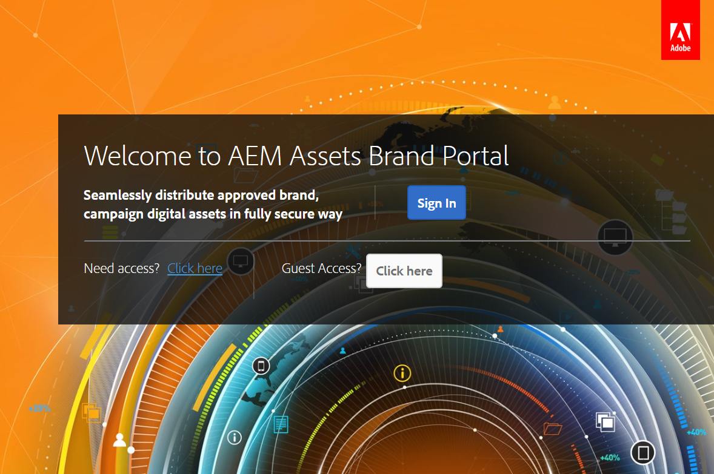
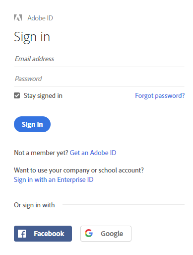
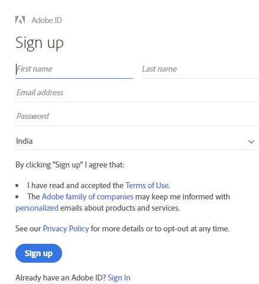
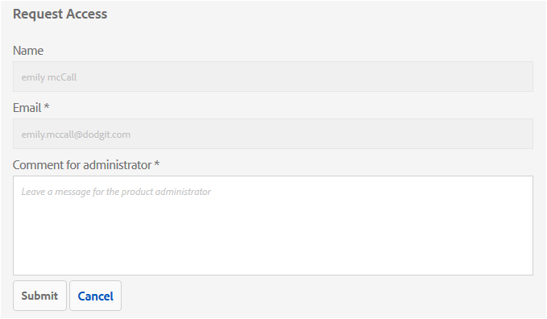
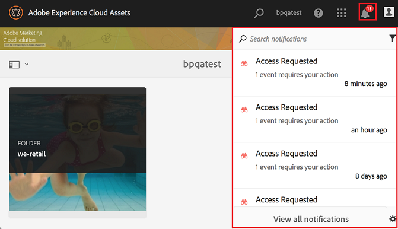
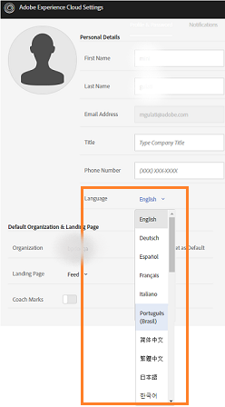
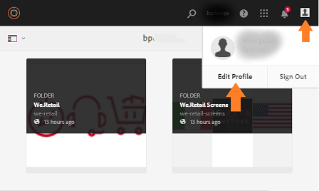
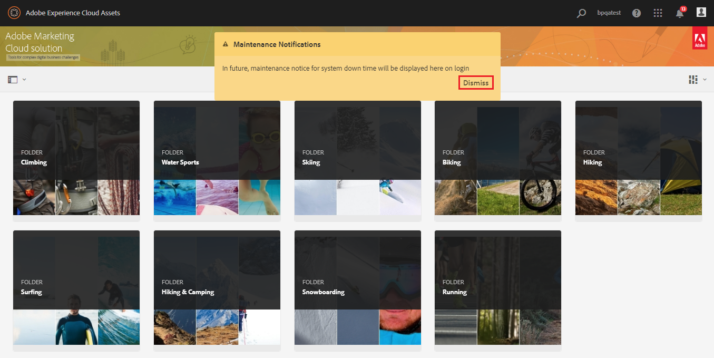

# Descripción general de AEM Assets Brand Portal {#overview-of-aem-assets-brand-portal}

Como especialista en marketing, a veces debe colaborar con socios de canal y usuarios empresariales internos para crear, administrar y entregar rápidamente contenido digital relevante a los clientes. La entrega oportuna de contenido relevante en todo el recorrido del cliente es fundamental para impulsar la buena demanda, conversión, participación y lealtad del cliente.

Sin embargo, es un desafío desarrollar soluciones que permitan un uso compartido eficiente y seguro de logotipos de marca, directrices, recursos de campaña o tomas de producto aprobados con equipos internos, socios y distribuidores ampliados.

**Adobe Experience Manager (AEM) Assets Brand** Portal se centra en la necesidad del especialista en marketing de colaborar eficazmente con los usuarios de Brand Portal distribuidos globalmente mediante la distribución de recursos y las funciones de contribución de recursos.

La distribución de recursos le permite adquirir, controlar y distribuir de forma segura recursos creativos aprobados a terceros externos y usuarios empresariales internos entre dispositivos. Por su parte, la contribución de recursos permite a los usuarios de Brand Portal cargar recursos en Brand Portal y publicarlos en AEM Assets, sin necesidad de acceder al entorno de creación. La función de contribución se denomina **Abastecimiento de recursos en Brand Portal**. Y, en conjunto, mejora la experiencia general de Brand Portal de distribución de recursos y contribución de los usuarios de Brand Portal (agencias/equipos externos), acelera el tiempo de comercialización de los recursos y reduce el riesgo de incumplimiento y acceso no autorizado.
Consulte [Abastecimiento de recursos en Brand Portal](brand-portal-asset-sourcing.md).

El entorno de portal basado en navegador le permite cargar, examinar, buscar, previsualizar y exportar fácilmente recursos en formatos aprobados.

## Configurar AEM Assets con Brand Portal {#configure-brand-portal}

La configuración de Adobe Experience Manager Assets con Brand Portal habilita la publicación de recursos, la distribución de recursos y las funciones de contribución de recursos para los usuarios de Brand Portal.

>[!NOTE]
>
>La configuración de AEM Assets con Brand Portal es compatible con AEM Assets as a Cloud Service, AEM Assets 6.3 y versiones posteriores.

AEM Assets as a Cloud Service se configura automáticamente con Brand Portal activando Brand Portal desde Cloud Manager. El flujo de trabajo de activación crea las configuraciones necesarias en el servidor y activa Brand Portal en la misma organización de IMS que AEM Assets como instancia de Cloud Service.

Por su parte, AEM Assets (local y Managed Services) se configura manualmente con Brand Portal mediante Adobe Developer Console, que obtiene un token de Identity Management Services (IMS) de Adobe para la autorización del inquilino de Brand Portal.

Para obtener más información, consulte [configuración de AEM Assets con Brand Portal](../using/configure-aem-assets-with-brand-portal.md).

## Personalidades de usuario en Brand Portal {#Personas}

Brand Portal admite las siguientes funciones de usuario:

* Usuario invitado
* Visor
* Editor
* Administrador

La tabla siguiente muestra las tareas que pueden realizar los usuarios con estas funciones:

|  | **Examinar** | **Buscar** | **Descargar** | **Compartir carpetas** | **Compartir una colección** | **Compartir recursos como un vínculo** | **Acceso a las Herramientas de administración** |
|--- |--- |--- |--- |--- |--- |--- |--- |
| **Usuario invitado** | ✓* | ✓* | ✓* | x | x | x | x |
| **Visor** | ✓ | ✓ | ✓ | x | x | x | x |
| **Editor** | ✓ | ✓ | ✓ | ✓ | ✓ | ✓ | x |
| **Administrador** | ✓ | ✓ | ✓ | ✓ | ✓ | ✓ | ✓ |

* Los usuarios invitados solo pueden examinar, acceder y buscar recursos en carpetas públicas y colecciones.

<!--
&#42; Viewer users can access and download the public assets shared with them, and can add these assets to create their own collections.

>[!NOTE]
>
>There is a known issue that the share link for collections is currently visible to the viewer users. The viewer users does not have the privilege to add users to create a share link. This issue will be fixed in the upcoming release, the option to share link for the collections will not be available to the viewer users.
-->

### Usuario invitado {#guest-user}

Cualquier usuario invitado que tenga acceso limitado a los recursos de Brand Portal sin someterse a autenticación. La sesión de invitado permite a los usuarios acceder a carpetas y colecciones públicas. Como usuario invitado, puede navegar por los detalles de los recursos y tener una vista completa de los recursos de los miembros de carpetas públicas y colecciones. Puede buscar, descargar y agregar recursos públicos a la colección [!UICONTROL Lightbox].

Sin embargo, la sesión de invitado le impide crear colecciones y guardar búsquedas, y compartirlas aún más. Los usuarios de una sesión de invitado no pueden acceder a la configuración de carpetas y colecciones, y no pueden compartir recursos como vínculos. Esta es una lista de tareas que un usuario invitado puede realizar:

[Examinar y acceder a recursos públicos](browse-assets-brand-portal.md)

[Buscar recursos públicos](brand-portal-searching.md)

[Descargar recursos públicos](brand-portal-download-assets.md)

[Adición de recursos a  [!UICONTROL Lightbox]](brand-portal-light-box.md#add-assets-to-lightbox)

### Visor {#viewer}

Un usuario estándar en Brand Portal suele ser un usuario con la función de visor. Un usuario con esta función puede acceder a las carpetas, colecciones y recursos permitidos. El usuario también puede examinar, previsualizar, descargar y exportar recursos (representaciones originales o específicas), configurar la cuenta y buscar recursos. Esta es una lista de tareas que un visor puede realizar:

[Examinar recursos](browse-assets-brand-portal.md)

[Buscar recursos](brand-portal-searching.md)

[Descargar recursos](brand-portal-download-assets.md)

### Editor {#editor}

Un usuario con la función de Editor puede realizar todas las tareas que un visor pueda realizar. Además, y Editor pueden ver los archivos y carpetas que comparte un administrador. El usuario con la función de editor también puede compartir contenido (archivos, carpetas, colecciones) con otros usuarios.

Además de las tareas que puede realizar un visor, un editor puede realizar las siguientes tareas adicionales:

[Compartir carpetas](brand-portal-sharing-folders.md)

[Compartir una colección](brand-portal-share-collection.md)

[Compartir recursos como un vínculo](brand-portal-link-share.md)

### Administrador {#administrator}

Un administrador incluye un usuario marcado como administrador del sistema o administrador de producto de Brand Portal en [!UICONTROL Admin Console]. Un administrador puede agregar y eliminar administradores y usuarios del sistema, definir ajustes preestablecidos, enviar correos electrónicos a los usuarios y ver informes de almacenamiento y uso del portal.

Un administrador puede realizar todas las tareas que un editor pueda realizar a continuación:

[Administrar usuarios, grupos y funciones de usuario](brand-portal-adding-users.md)

[Personalización de papel tapiz, encabezados de página y correos electrónicos](brand-portal-branding.md)

[Utilizar facetas de búsqueda personalizadas](brand-portal-search-facets.md)

[Utilizar el formulario de esquema de metadatos](brand-portal-metadata-schemas.md)

[Aplicar ajustes preestablecidos de imagen o representaciones dinámicas](brand-portal-image-presets.md)

[Trabajar con informes](brand-portal-reports.md)

Además de las tareas anteriores, un Autor en AEM Assets puede realizar las siguientes tareas:

[Configurar AEM Assets con Brand Portal](../using/configure-aem-assets-with-brand-portal.md)

[Publicar carpetas en Brand Portal](https://helpx.adobe.com/experience-manager/6-5/assets/using/brand-portal-publish-folder.html)

[Publicar colecciones en Brand Portal](https://helpx.adobe.com/experience-manager/6-5/assets/using/brand-portal-publish-collection.html)

## Alias alternativo para la URL de Brand Portal {#tenant-alias-for-portal-url}

A partir de Brand Portal 6.4.3, las organizaciones pueden tener una URL alternativa (alias) para la URL existente de su inquilino de Brand Portal. La dirección URL del alias se puede crear teniendo un prefijo alternativo en la dirección URL.\
Tenga en cuenta que solo se puede personalizar el prefijo de la dirección URL de Brand Portal y no toda la dirección URL. Por ejemplo, una organización con el dominio existente **[!UICONTROL geomettrix.brand-portal.adobe.com]** puede obtener **[!UICONTROL geomettrixinc.brand-portal.adobe.com]** creado si se solicita.

Sin embargo, la instancia de Autor de AEM solo puede [configurarse](../using/configure-aem-assets-with-brand-portal.md) con la dirección URL de identificación del inquilino y no con la dirección URL de alias del inquilino (alternativa).

>[!NOTE]
>
>Para obtener un alias para el nombre de inquilino en la URL del portal existente, las organizaciones deben ponerse en contacto con el servicio de asistencia de Adobe con una nueva solicitud de creación de alias de inquilino. Esta solicitud se procesa comprobando primero si el alias está disponible y, a continuación, creando el alias.
>
>Para reemplazar el alias antiguo o eliminarlo, se debe seguir el mismo proceso.

## Solicitar acceso a Brand Portal {#request-access-to-brand-portal}

Los usuarios pueden solicitar acceso a Brand Portal desde la pantalla de inicio de sesión. Estas solicitudes se envían a los administradores de Brand Portal, que conceden acceso a los usuarios a través del Adobe [!UICONTROL Admin Console]. Una vez concedido el acceso, los usuarios reciben un correo electrónico de notificación.

Para solicitar el acceso, haga lo siguiente:

1. En la página de inicio de sesión de Brand Portal, seleccione **[!UICONTROL Haga clic aquí]** correspondiente a **[!UICONTROL ¿Necesita acceso?]**. Sin embargo, para entrar en la sesión de invitados, seleccione **[!UICONTROL Click here]** correspondiente a **[!UICONTROL Guest Access?]**.

   

   Se abre la página [!UICONTROL Solicitar acceso].

1. Para solicitar acceso a Brand Portal de una organización, debe tener un [!UICONTROL Adobe ID], [!UICONTROL Enterprise ID] o un [!UICONTROL Federated ID] válido.

   En la página [!UICONTROL Solicitar acceso], inicie sesión con su ID (escenario 1) o cree un [!UICONTROL Adobe ID] (escenario 2): 
   ![[!UICONTROL Solicitud de acceso]](assets/bplogin_request_access_2.png)

   **Escenario 1**
   1. Si tiene un [!UICONTROL Adobe ID], [!UICONTROL Enterprise ID] o [!UICONTROL Federated ID], haga clic en **[!UICONTROL Iniciar sesión]**.
Se abre la página [!UICONTROL Iniciar sesión].
   1. Proporcione sus credenciales de [!UICONTROL Adobe ID] y haga clic en **[!UICONTROL Iniciar sesión]**. 

   

   Se le redirige a la página [!UICONTROL Solicitar acceso]. 
   **Escenario 2**
   1. Si no tiene un [!UICONTROL Adobe ID], para crear uno, haga clic en **[!UICONTROL Obtener un Adobe ID]** desde la página [!UICONTROL Solicitar acceso].
Se abre la página [!UICONTROL Iniciar sesión].
   1. Haga clic en **[!UICONTROL Obtener un Adobe ID]**.
Se abre la página [!UICONTROL Regístrese].
   1. Introduzca su nombre y apellidos, ID de correo electrónico y contraseña.
   1. Seleccione **[!UICONTROL Regístrese]**. 

   

   Se le redirige a la página [!UICONTROL Solicitar acceso].

1. La siguiente página muestra su nombre y el ID de correo electrónico que se utilizó para solicitar acceso. Deje un comentario para el administrador y haga clic en **[!UICONTROL Enviar]**. 

   

## Los administradores de productos otorgan acceso {#grant-access-to-brand-portal}

Los administradores de productos de Brand Portal reciben solicitudes de acceso en el área de notificación de Brand Portal y a través de correos electrónicos en su bandeja de entrada.

Para conceder acceso, los administradores de productos deben hacer clic en la notificación correspondiente del área de notificación de Brand Portal y luego hacer clic en **[!UICONTROL Conceder acceso]**.
Los administradores de productos también pueden seguir el vínculo proporcionado en el correo electrónico de solicitud de acceso para visitar el Adobe [!UICONTROL Admin Console] y agregar el usuario a la configuración de producto pertinente.

Se le redirige a la página de inicio [Adobe [!UICONTROL Admin Console]](https://adminconsole.adobe.com/enterprise/overview). Utilice el Adobe [!UICONTROL Admin Console] para crear usuarios y asignarlos a perfiles de producto (anteriormente conocidos como configuraciones de producto), que se muestran como grupos en Brand Portal. Para obtener más información sobre cómo agregar usuarios en [!UICONTROL Admin Console], consulte [Agregar un usuario](brand-portal-adding-users.md#add-a-user) (siga los pasos 4 a 7 del procedimiento para agregar un usuario).

## Idiomas de Brand Portal {#brand-portal-language}

Puede cambiar el idioma de Brand Portal desde el Adobe [!UICONTROL Configuración del Experience Cloud].

Para cambiar el idioma:

1. Seleccione [!UICONTROL Usuario] > [!UICONTROL Editar perfil] en el menú superior. 

   

1. En la página [!UICONTROL Configuración del Experience Cloud], seleccione un idioma en el menú desplegable [!UICONTROL Idioma].

## Notificación de mantenimiento de Brand Portal {#brand-portal-maintenance-notification}

Antes de que Brand Portal esté programado para su mantenimiento, se mostrará una notificación como un banner después de iniciar sesión en Brand Portal. Una notificación de ejemplo:

Puede rechazar esta notificación y continuar usando Brand Portal. Esta notificación aparece en cada nueva sesión.

## Información sobre la versión y el sistema {#release-and-system-information}

* [Novedades](whats-new.md)
* [Notas de la versión](brand-portal-release-notes.md)
* [Formatos de archivo admitidos](brand-portal-supported-formats.md)

## Recursos relacionados {#related-resources}

* [Servicio de atención al cliente de Adobe](https://helpx.adobe.com/es/marketing-cloud/contact-support.html)
* [Foros de AEM](https://experienceleaguecommunities.adobe.com/t5/adobe-experience-manager/ct-p/adobe-experience-manager-community)