# Examinar recursos en Brand Portal {#browsing-assets-on-brand-portal}

Experience Manager Assets Brand Portal proporciona varias funciones y elementos de la interfaz de usuario que facilitan la navegación por los recursos, atravesando jerarquías de recursos y buscando recursos, mientras utiliza diferentes opciones de vista.

Logotipo de Experience Manager en la barra de herramientas de la parte superior facilita a los usuarios administradores el acceso al panel de herramientas administrativas.

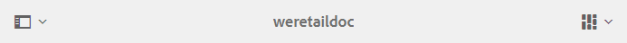 

El selector de carril en la esquina superior izquierda de Brand Portal se muestra en el menú desplegable para mostrar las opciones y navegar en jerarquías de recursos, optimizar la búsqueda y mostrar recursos.

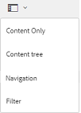

Puede ver, navegar y seleccionar recursos mediante cualquiera de las vistas disponibles (Tarjeta, Columna y Lista) en el selector de vista situado en la parte superior derecha de Brand Portal.

## Visualización y selección de los recursos {#viewing-and-selecting-resources}

Conceptualmente, la visualización, la navegación y la selección de cada una son iguales en todas las vistas, pero tienen pequeñas variaciones en el manejo, dependiendo de la vista que esté utilizando.

Puede ver, navegar y seleccionar sus recursos (para realizar más acciones) con cualquiera de las vistas disponibles:

* Vista de columna
* Vista de tarjeta
* Vista de lista   

### Vista de tarjeta

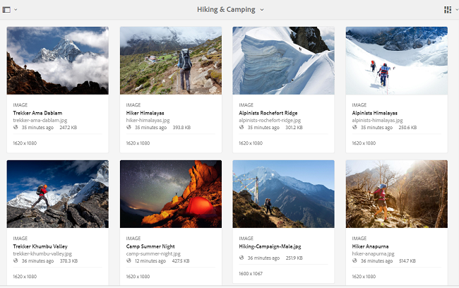

La vista de tarjeta muestra tarjetas de información para cada elemento del nivel actual. Estas tarjetas proporcionan los siguientes detalles:

* Una representación visual del recurso o la carpeta.
* Tipo
* Título
* Nombre
* Fecha y hora en que se publicó el recurso en Brand Portal desde AEM
* Tamaño
* Dimensiones

Puede bajar por la jerarquía tocando o haciendo clic en las tarjetas (con cuidado de evitar las acciones rápidas) o hacia arriba de nuevo mediante las [rutas de exploración del encabezado](https://helpx.adobe.com/experience-manager/6-5/sites/authoring/using/basic-handling.html#TheHeader).

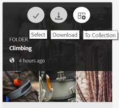

#### Vista de tarjeta para usuarios no administradores

Las tarjetas de carpetas, en la vista de tarjeta, muestran información sobre la jerarquía de carpetas a los usuarios no administradores (Editor, Visualizador y Usuario invitado). Esta funcionalidad permite a los usuarios conocer la ubicación de las carpetas a las que acceden, con respecto a la jerarquía principal.
La información sobre la jerarquía de carpetas es especialmente útil para diferenciar las carpetas que tienen nombres similares a otras carpetas compartidas desde una jerarquía de carpetas diferente. Si los usuarios que no son administradores no conocen la estructura de carpetas de los recursos compartidos con ellos, los recursos o carpetas con nombres similares parecen confusos.

* Las rutas mostradas en las tarjetas respectivas se truncan para adaptarse a los tamaños de las tarjetas. Sin embargo, los usuarios pueden ver la ruta completa como información del objeto al pasar el ratón por encima de la ruta truncada.

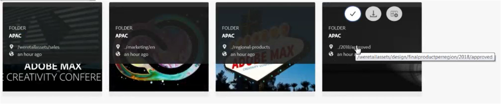

**Opción Información general para ver las propiedades de los recursos**

La opción Información general está disponible para los usuarios no administradores (editores, visualizadores, usuarios invitados) para ver las propiedades de los recursos o carpetas seleccionados. La opción Información general está visible:

* en la barra de herramientas situada en la parte superior, al seleccionar un recurso o una carpeta.
* en la lista desplegable al seleccionar el selector de raíl.

Al seleccionar la opción **[!UICONTROL Información general]** mientras está seleccionado un recurso/carpeta, los usuarios pueden ver el título, la ruta y la hora de creación de los recursos. Por su parte, en la página de detalles del recurso, seleccionar la opción Información general permite que los usuarios vean los metadatos del recurso.

#### Ver configuración en la vista de tarjeta

**[!UICONTROL Ver]** configuración se abre al seleccionar  **[!UICONTROL Ver]** configuración en el selector de vistas. Permite cambiar el tamaño de las miniaturas de los recursos en la vista de tarjeta. De este modo, puede personalizar la vista y controlar el número de miniaturas que se muestran.

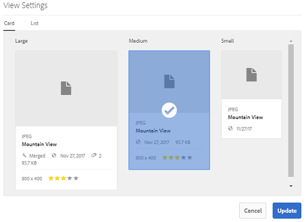

### Vista de lista   

La vista de lista muestra información de cada recurso en el nivel actual. La vista de lista proporciona los siguientes detalles:

* Imagen en miniatura de los recursos
* Nombre
* Título
* Conf. regional
* Tipo
* Dimension
* Tamaño
* Clasificación
* La ruta de la carpeta muestra la jerarquía de recursos*
* Fecha de publicación del recurso en Brand Portal

La columna Ruta permite identificar fácilmente la ubicación del recurso en la jerarquía de carpetas. Puede bajar por la jerarquía tocando o haciendo clic en el nombre del recurso y hacia arriba utilizando las [rutas de exploración del encabezado](https://helpx.adobe.com/experience-manager/6-5/sites/authoring/using/basic-handling.html#TheHeader).

<!--
Comment Type: draft lastmodifiedby="mgulati" lastmodifieddate="2018-08-17T03:12:05.096-0400" type="annotation">Removed:- "Selecting assets in list view To select all items in the list, use the checkbox at the upper left of the list. When all items in the list are selected, this check box appears checked. To deselect all, click or tap the checkbox. When only some items are selected, it appears with a minus sign. To select all, click or tap the checkbox. To deselect all, click or tap the checkbox again. You can change the order of items using the dotted vertical bar at the far right of each item in the list. Tap/click the vertical selection bar and drag the item to a new position in the list."
 -->

### Ver configuración en la vista de lista

La vista de lista muestra el recurso **[!UICONTROL Name]** como la primera columna de forma predeterminada. También se muestra información adicional, como **[!UICONTROL Título]**, **[!UICONTROL Configuración regional]**, **[!UICONTROL Tipo]**, **[!UICONTROL Dimension]**, **[!UICONTROL Tamaño]**, **[!UICONTROL Clasificación]**, estado de publicación. Sin embargo, puede seleccionar las columnas que desea mostrar mediante **[!UICONTROL Configuración de vista]**.

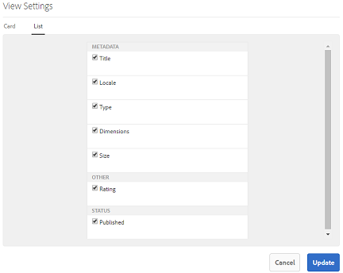

### Vista de columna

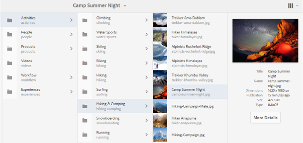

Utilice la vista de columna para navegar por un árbol de contenido a través de una serie de columnas en cascada. Esta vista le ayuda a visualizar y recorrer la jerarquía de recursos.

Al seleccionar un recurso en la primera columna (situada más a la izquierda), se muestran los recursos secundarios en la segunda columna a la derecha. Al seleccionar un recurso en la segunda columna, se muestran los recursos secundarios en la tercera columna a la derecha, etc.

Puede desplazarse hacia arriba o hacia abajo en el árbol tocando o haciendo clic en el nombre del recurso o en las comillas angulares a la derecha del nombre del recurso.

* El nombre del recurso y las comillas angulares se resaltan al tocar o hacer clic en ellos.
* Al tocar o hacer clic en la miniatura, se selecciona el recurso.
* Cuando se selecciona, se superpone una marca de verificación en la miniatura y el nombre del recurso se resalta.
* Los detalles del recurso seleccionado se muestran en la última columna.

Cuando se selecciona un recurso en la vista de columna, la representación visual del recurso se muestra en la última columna junto con los siguientes detalles:

* Título
* Nombre
* Dimensiones
* Fecha y hora en que se publicó el recurso en Brand Portal desde AEM
* Tamaño
* Tipo
* Opción Más detalles , para acceder a la página de detalles del recurso

<!--
Comment Type: draft

<h3>Selecting Resources</h3>
-->

<!--
Comment Type: draft

Selecting a specific resource depends on a combination of the view and the device:

-->

<!--
Comment Type: draft

<table border="1" cellpadding="1" cellspacing="0" width="100%">
<tbody>
<tr>
<td> </td>
<td>Select</td>
<td>Deselect</td>
</tr>
<tr>
<td>Column View  </td>
<td>
<ul>
<li>Desktop:  Mouseover, then use the check mark quick action</li>
<li>Mobile device:  Tap the thumbnail</li>
</ul> </td>
<td>
<ul>
<li>Desktop:  Click the thumbnail</li>
<li>Mobile device:  Tap the thumbnail</li>
</ul> </td>
</tr>
<tr>
<td>Card View  </td>
<td>
<ul>
<li>Desktop:  Mouseover, then use the check mark quick action</li>
<li>Mobile device:  Tap-and-hold the card</li>
</ul> </td>
<td>
<ul>
<li>Desktop:  Click the card</li>
<li>Mobile device:  Tap the card</li>
</ul> </td>
</tr>
<tr>
<td>List View</td>
<td>
<ul>
<li>Desktop:  Mouseover, then use the check mark quick action</li>
<li>Mobile device:  Tap the thumbnail</li>
</ul> </td>
<td>
<ul>
<li>Desktop:  Click the thumbnail</li>
<li>Mobile device:  Tap the thumbnail</li>
</ul> </td>
</tr>
</tbody>
</table>
-->

<!--
Comment Type: draft

Deselecting All
-->

<!--
Comment Type: draft

In all cases, as you select items the count of the items selected is displayed at the upper right of the toolbar.

You can deselect all items and exit selection mode by clicking or tapping the X next to the count.

-->

<!--
Comment Type: draft

In all views, all items can be deselected by tapping escape on the keyboard if you are using a desktop device.

-->

## Árbol de contenido {#content-tree}

Además de estas vistas, utilice la vista de árbol para explorar en profundidad la jerarquía de recursos mientras ve y selecciona los recursos o carpetas que desee.

Para abrir la vista de árbol, toque o haga clic en el selector de raíl en la esquina superior izquierda y seleccione el **[!UICONTROL árbol de contenido]** en el menú.

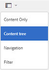

Desde la jerarquía de contenido, vaya al recurso deseado.

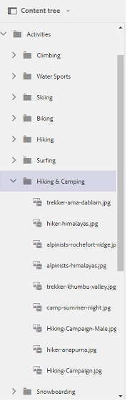

## Detalles del recurso {#asset-details}

La página de detalles del recurso permite ver un recurso, descargar, compartir el vínculo del recurso, moverlo a una colección o ver su página de propiedades. También le permite navegar por la página de detalles de otros recursos de la misma carpeta una tras otra.

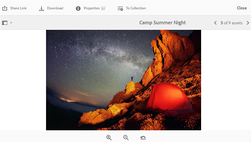

Para ver los metadatos del recurso o ver sus distintas representaciones, utilice el selector de raíl en la página de detalles del recurso.

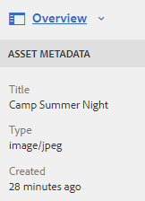

Puede ver todas las representaciones disponibles del recurso en la página de detalles del recurso y seleccionar una representación para previsualizarla.

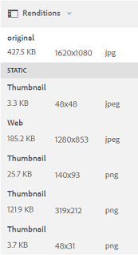

Para abrir la página de propiedades del recurso, utilice la opción **[!UICONTROL Propiedades (p)]** de la barra superior.

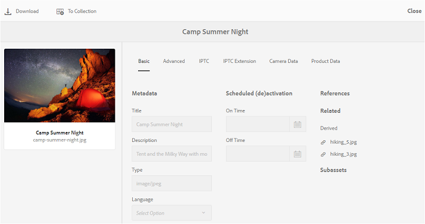

También puede ver una lista de todos sus recursos relacionados (recursos de origen o derivados en AEM) en la página de propiedades de un recurso, ya que la relación de recursos también se publica de AEM a Brand Portal.
