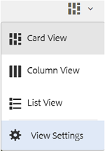

# Examinar activos en el portal de marca {#browsing-assets-on-brand-portal}

Experience Manager Assets portal Brand ofrece diversas funciones y usuario elementos de interfaz que facilitan la navegación por los recursos, el recorrido recurso jerarquías y la búsqueda activos al utilizar diferentes opciones de vista.

Experience Manager logotipo en la barra de herramientas de la parte superior facilita el acceso de los usuarios administradores al panel Herramientas administrativas.

Selector de carril en la parte superior izquierda de Brand portal se despliega para exponer las opciones de desplazamiento hacia recurso jerarquías, optimizar el búsqueda y mostrar los recursos.

Puede vista, navegar y seleccionar activos con cualquiera de las vistas disponibles (tarjeta, columna y lista) en el vista selector en la parte superior derecha del portal de marca.

## Visualización y selección de los recursos {#viewing-and-selecting-resources}

La visualización, el desplazamiento y la selección de cada uno de ellos son conceptualmente iguales en todas las vistas, pero tienen pequeñas variaciones en la administración, según la vista que esté utilizando.

Puede ver, navegar y seleccionar sus recursos (para realizar más acciones) con cualquiera de las vistas disponibles:

* Vista de columna
* Vista de tarjeta
* Vista de lista   

### Vista de tarjeta

La tarjeta vista muestra tarjetas de información para cada elemento del nivel actual. Estas tarjetas proporcionan los siguientes detalles:

* Una representación visual de la recurso/carpeta.
* Tipo
* Título
* Nombre
* Fecha y hora en que se publicó recurso en Brand portal desde AEM
* Tamaño
* Dimensiones

Para desplazarse hacia abajo por la jerarquía, toque o haga clic en las tarjetas (tenga cuidado de evitar las acciones rápidas) o vuelva a intentarlo utilizando las [ rutas de exploración en el encabezado ](https://experienceleague.adobe.com/docs/experience-manager-65/authoring/essentials/basic-handling.html) .

#### vista de tarjeta para usuarios que no son administradores

Las tarjetas de carpetas, en la Ver de tarjetas, muestran la información jerarquía a los usuarios que no son administradores (editor, visor y usuario Guest). Esta funcionalidad permite a los usuarios conocer la ubicación de las carpetas, a las que se accede, con respecto a la jerarquía principal.
Carpeta información jerarquía es especialmente útil para diferenciar las carpetas que tienen nombres similares a otras carpetas compartidas desde una carpeta diferente jerarquía. Si los usuarios que no son administradores no saben la estructura de carpetas del activos compartidos con ellos, activos/folders con nombres similares parece confuso.

* Las rutas mostradas en las respectivas tarjetas se truncan para adaptarse a los tamaños de tarjeta. Sin embargo, los usuarios pueden ver la ruta completa como una herramienta-sugerencia sobre el desplazamiento de la ruta truncada.

**Opción de resumen para vista Propiedades de recursos**

La opción de información general está disponible para los usuarios que no son administradores (editores, visores, usuarios invitados) para vista Propiedades de recursos de activos/carpetas seleccionados. La opción Información general está visible:

* en la barra de herramientas de la parte superior, al seleccionar un recurso o una carpeta.
* en la lista desplegable al seleccionar el Selector de carril.

Al seleccionar la variable **[!UICONTROL Información general]** opción mientras hay un recurso o una carpeta seleccionados, los usuarios pueden ver el título, la ruta y la hora de creación del recurso. Por su parte, en la página de detalles del recurso, al seleccionar la opción Información general, los usuarios pueden ver los metadatos del recurso.

#### Configuración de vista en la vista de tarjeta

**[!UICONTROL Se abre Ver Configuración]** cuadro de diálogo al seleccionar **[!UICONTROL Ver configuración]** en el vista selector. Le permite cambiar el tamaño de las miniaturas de recurso en el vista de la tarjeta. De este modo, puede personalizar el vista y controlar el número de miniaturas que se muestran.

### Vista de lista   

La lista vista muestra información de cada recurso en el nivel actual. Vista de lista proporciona los siguientes detalles:

* Imagen en miniatura de activos
* Nombre
* Título
* Configuración regional
* Tipo
* Dimension
* Tamaño
* Clasificación
* Ruta de carpeta que muestra la jerarquía de recursos
* Fecha de publicación del recurso en Brand Portal

La columna Ruta permite identificar fácilmente la ubicación de los recursos en la jerarquía de carpetas. Puede desplazarse hacia abajo en la jerarquía tocando o haciendo clic en el nombre del recurso, y hacia arriba utilizando el icono [rutas de exploración en el encabezado](https://experienceleague.adobe.com/docs/experience-manager-65/authoring/essentials/basic-handling.html).

<!--
Comment Type: draft lastmodifiedby="mgulati" lastmodifieddate="2018-08-17T03:12:05.096-0400" type="annotation">Removed:- "Selecting assets in list view To select all items in the list, use the checkbox at the upper left of the list. When all items in the list are selected, this check box appears checked. To deselect all, click or tap the checkbox. When only some items are selected, it appears with a minus sign. To select all, click or tap the checkbox. To deselect all, click or tap the checkbox again. You can change the order of items using the dotted vertical bar at the far right of each item in the list. Tap/click the vertical selection bar and drag the item to a new position in the list."
 -->

### Configuración de vista en la vista de lista

La lista vista muestra recurso **[!UICONTROL nombre]** como la primera columna de forma predeterminada. También se muestra información adicional como recurso **[!UICONTROL título]** , **[!UICONTROL configuración regional]** , **[!UICONTROL tipo]** , **[!UICONTROL dimensiones]** , **[!UICONTROL tamaño]** , **[!UICONTROL clasificación]** , publicar estado. Sin embargo, puede seleccionar las columnas que se mostrarán mediante **[!UICONTROL Ver configuración]** .

### Vista de columna

Utilice la vista de columna para desplazarse por el árbol de contenido a través de una serie de columnas en cascada. Este vista le ayuda a visualizar y recorrer la jerarquía de recurso.

Al seleccionar un recurso en la primera columna (a la izquierda) se muestran los recursos secundarios en la segunda columna de la derecha. Al seleccionar un recurso en la segunda columna, se muestran los recursos secundarios en la tercera columna de la derecha, y así sucesivamente.

Puede desplazarse hacia arriba o abajo en el árbol pulsando o haciendo clic en el nombre del recurso o en el cheurón a la derecha del nombre del recurso.

* El nombre y el cheurón del recurso se resaltan al tocar o hacer clic.
* Al tocar o hacer clic en la miniatura, se selecciona el recurso.
* Cuando se selecciona, se superpone una marca de verificación en la miniatura y el nombre del recurso se resalta.
* Los detalles del recurso seleccionado se muestran en la última columna.

Cuando se selecciona un recurso en la columna vista, la representación visual de la recurso se muestra en la última columna junto con los siguientes detalles:

* Título
* Nombre
* Dimensiones
* Fecha y hora en que se publicó recurso en Brand portal desde AEM
* Tamaño
* Tipo
* Más detalles, para ir a la página de detalles del recurso

<!--
Comment Type: draft

<h3>Selecting Resources</h3>
-->

<!--
Comment Type: draft

Selecting a specific resource depends on a combination of the view and the device:

-->

<!--
Comment Type: draft

<table border="1" cellpadding="1" cellspacing="0" width="100%">
<tbody>
<tr>
<td> </td>
<td>Select</td>
<td>Deselect</td>
</tr>
<tr>
<td>Column View  </td>
<td>
<ul>
<li>Desktop:  Mouseover, then use the check mark quick action</li>
<li>Mobile device:  Tap the thumbnail</li>
</ul> </td>
<td>
<ul>
<li>Desktop:  Click the thumbnail</li>
<li>Mobile device:  Tap the thumbnail</li>
</ul> </td>
</tr>
<tr>
<td>Card View  </td>
<td>
<ul>
<li>Desktop:  Mouseover, then use the check mark quick action</li>
<li>Mobile device:  Tap-and-hold the card</li>
</ul> </td>
<td>
<ul>
<li>Desktop:  Click the card</li>
<li>Mobile device:  Tap the card</li>
</ul> </td>
</tr>
<tr>
<td>List View</td>
<td>
<ul>
<li>Desktop:  Mouseover, then use the check mark quick action</li>
<li>Mobile device:  Tap the thumbnail</li>
</ul> </td>
<td>
<ul>
<li>Desktop:  Click the thumbnail</li>
<li>Mobile device:  Tap the thumbnail</li>
</ul> </td>
</tr>
</tbody>
</table>
-->

<!--
Comment Type: draft

Deselecting All
-->

<!--
Comment Type: draft

In all cases, as you select items the count of the items selected is displayed at the upper right of the toolbar.

You can deselect all items and exit selection mode by clicking or tapping the X next to the count.

-->

<!--
Comment Type: draft

In all views, all items can be deselected by tapping escape on the keyboard if you are using a desktop device.

-->

## Árbol de contenido {#content-tree}

Además de estas vistas, utilice la vista de árbol para explorar en profundidad la jerarquía de recursos mientras ve y selecciona los recursos o carpetas que desee.

Para abrir la vista de árbol, pulse o haga clic en el selector de carril en la parte superior izquierda y seleccione **[!UICONTROL Árbol de contenido]** en el menú.

En el jerarquía contenido, vaya a la recurso deseada.

## Detalles del recurso {#asset-details}

La Página de detalles del recurso le permite vista una recurso, descargar, compartir recurso de vincular, moverla a un colección o vista sus propiedades Página. También permite desplazarse por los detalles Página de otros activos de la misma carpeta sucesivamente.

Para vista el metadatos de recurso, o vista sus distintas representaciones, utilice el carril selector en recurso página de detalles.

Puede vista todas las representaciones disponibles de la recurso en recurso detalles Página y seleccionar un representación en el **[!UICONTROL Panel de representaciones]** para previsualizaciónlo.

<!-- removed as it is fixed in 2022.02.0 release
>[!CAUTION]
>
>(**Experience Manager Assets as a Cloud Service** only) The following known issues will be fixed in the upcoming release:
>
>The **[!UICONTROL Renditions]** panel does not list all the static renditions of the assets that are published to Brand Portal after December 16, 2021.
>
>The **[!UICONTROL Renditions]** panel lists the smart crop renditions of the asset, however, the user cannot preview or download the smart crop renditions.
-->

Para abrir el Página de propiedades de recurso, utilice **[!UICONTROL la opción Propiedades (p)]** de la barra superior.

También puede vista una lista de todos sus activos relacionados (origen o activos derivadas en AEM) en las propiedades de un recurso página, ya que la relación de recurso también se ha publicado desde AEM a Brand portal.
