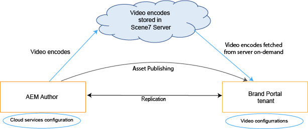
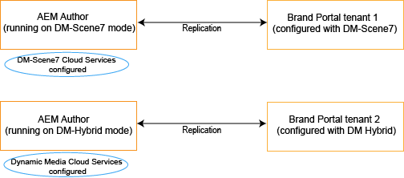
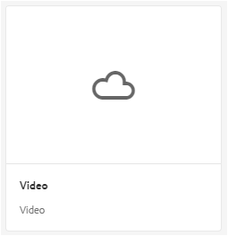

# Compatibilidad con vídeos dinámicos en Brand Portal {#dynamic-video-support-on-brand-portal}

Previsualice y reproduzca vídeos adaptablemente con [!DNL Brand Portal] la compatibilidad con Dynamic Media. Descargue también las representaciones dinámicas del portal y los vínculos compartidos.
[!DNL Brand Portal] los usuarios pueden:

* Previsualice vídeos en la página Detalles del recurso, la Vista de tarjeta y la página de vista previa del vínculo.
* Reproducir codificaciones de vídeo en la página Detalles del recurso.
* Vea representaciones dinámicas en la ficha Representaciones en la página Detalles del recurso.
* Descargue codificaciones y codificaciones de vídeo que contengan vídeos.

>[!NOTE]
>
>Para trabajar con vídeos y publicarlos, [!DNL Brand Portal]asegúrese de que la instancia [!DNL AEM] de Autor esté configurada en modo Dynamic Media Híbrido o en [!DNL Scene 7] modo Dynamic Media.

Para obtener una vista previa, reproducir y descargar vídeos [!DNL Brand Portal] , exponga las dos configuraciones siguientes a los administradores:

* [Configuración
híbrida de Dynamic Media](#configure-dm-hybrid-settings)Si [!DNL AEM] la instancia de Autor se está ejecutando en modo Híbrido Dynamic Media.
* [Dynamic Media [! Configuración
DNL Scene 7]](#configure-dm-scene7-settings)Si [!DNL AEM] la instancia de Autor se está ejecutando en medios dinámicos.
[!DNL Scene 7]
Configure cualquiera de estas configuraciones según las configuraciones configuradas en su [!DNL AEM] instancia de Autor con el [!DNL Brand Portal] usuario que se replica.

>[!NOTE]
>
>Los vídeos dinámicos no son compatibles con [!DNL Brand Portal] inquilinos integrados con [!DNL AEM] Autor que se ejecuta en [!UICONTROL el modo de ejecución de Scene 7 Connect] .

## ¿Cómo se reproducen los vídeos dinámicos? {#how-are-dynamic-videos-played}

Si las configuraciones de Dynamic Media ([híbrido](../using/dynamic-video-brand-portal.md#configure-dm-hybrid-settings) o [[! Configuraciones](../using/dynamic-video-brand-portal.md#configure-dm-scene7-settings) DNL Scene 7) están configuradas [!DNL Brand Portal], las representaciones dinámicas se obtienen del [!DNL Scene 7] servidor. Por lo tanto, las codificaciones de vídeo se previsualizan y se reproducen sin retraso y distorsión en calidad.

Dado que las codificaciones de vídeo no se almacenan en [!DNL Brand Portal] el repositorio y se obtienen del [!DNL Scene 7] servidor, asegúrese de que las configuraciones de Dynamic Media en [!DNL AEM] Instance Instance y [!DNL Brand Portal] son iguales.

>[!NOTE]
>
>Los visores de vídeo y los ajustes preestablecidos de visor no son compatibles [!DNL Brand Portal]. Los vídeos se previsualizan y se reproducen en los visores predeterminados en [!DNL Brand Portal].

## Requisitos previos {#prerequisites}

Para trabajar con vídeos dinámicos, [!DNL Brand Portal]asegúrese de:

* **Inicie[!DNL AEM]el modo
Autor en DM (Dynamic Media)** Start up the [!DNL AEM] Author instance (with which [!DNL Brand Portal] is integrated) either on [Dynamic Media Hybrid mode](https://helpx.adobe.com/experience-manager/6-5/assets/using/config-dynamic.html#EnablingDynamicMedia) or [Dynamic Media [! Modo DNL Scene 7]](https://helpx.adobe.com/experience-manager/6-5/assets/using/config-dms7.html#EnablingDynamicMediainScene7mode).
* **Configurar los servicios de nube de Dynamic Media en[!DNL AEM]Autor**
basado en el modo de medios dinámicos [!DNL AEM] en el que se ejecuta el autor, configure los servicios de nube [Dynamic Media](https://helpx.adobe.com/experience-manager/6-5/assets/using/config-dynamic.html#ConfiguringDynamicMediaCloudServices) o [[! Servicios de nube DNL Scene 7](https://helpx.adobe.com/experience-manager/6-5/assets/using/config-dms7.html#ConfiguringDynamicMediaCloudServices) on [!DNL AEM] Author desde **Herramientas** | **Servicios de nube** | **Dynamic Media**.
* **Configuración de Dynamic Media en el portal**
de marca basado en las configuraciones de nube de Dynamic Media en [!DNL AEM] Autor, configure [la configuración de Dynamic Media](#configure-dm-hybrid-settings) o [[! Configuración DNL Scene 7](#configure-dm-scene7-settings) de [!DNL Brand Portal] herramientas administrativas.
Asegúrese de [que [! Los inquilinos](#separate-tenants) de DNL Brand Portal se utilizan para [!DNL AEM] instancias de autor configuradas con los modos Dynamic Media Híbrido y Dynamic Media [!UICONTROL Scene 7] , si utiliza funcionalidades de Dynamic Media Híbrido y Dynamic Media [!UICONTROL S 7].
* **Publique carpetas con codificaciones de vídeo aplicadas a Brand Portal**
Aplicación [de codificaciones](https://helpx.adobe.com/experience-manager/6-5/assets/using/video-profiles.html) de vídeo y publique la carpeta que contenga recursos de medios enriquecidos de [!DNL AEM] la instancia de Autor.[!DNL Brand Portal]
* **Lista blanca de Egress en SPS si se habilita
la vista previa segura** Si se utiliza Dynamic Media ([!DNL Scene 7] con [la vista previa segura habilitada](https://docs.adobe.com/content/help/en/dynamic-media-classic/using/upload-publish/testing-assets-making-them-public.html) para una empresa), se aconseja a los [!DNL Scene 7] administradores [de la empresa que agreguen las direcciones IP](https://docs.adobe.com/content/help/en/dynamic-media-classic/using/upload-publish/testing-assets-making-them-public.html#testing-the-secure-testing-service) públicas de las regiones correspondientes utilizando la IU Flash de SPS ([!UICONTROL Scene 7] Publishing System).
Las IP de Egress son las siguientes:

| **Región** | **IP de Egress** |
|--- |--- |
| ND | 192.243.237.86 |
| EMEA | 185.34.189.4 |
| APAC | 63.140.44.54 |

Para incluir cualquiera de estas IP de favoritos, consulte [preparación de su cuenta para servicios de prueba seguros](https://docs.adobe.com/content/help/en/dynamic-media-classic/using/upload-publish/testing-assets-making-them-public.html#testing-the-secure-testing-service).

## Prácticas recomendadas

Para garantizar que los recursos de vídeo dinámicos se previsualicen, reproduzcan y descarguen de forma satisfactoria desde [!DNL Brand Portal] (y vínculos compartidos), siga estas prácticas:

### Inquilinos independientes para los modos Híbridos de Dynamic Media y Dynamic Media Scene 7 {#separate-tenants}

Si utiliza funciones híbridas de Dynamic Media [!DNL Scene 7] y Dynamic Media, se recomienda utilizar [!DNL Brand Portal] distintos inquilinos para las instancias [!DNL AEM] de autor configuradas con [!DNL Scene 7] los modos Dynamic Media Híbrido y Dynamic Media.

### Los mismos detalles de configuración en la instancia de AEM Author y Brand Portal

Asegúrese de que los detalles de configuración, como Título, ID de registro, URL del servicio de vídeo (en Dynamic Media Híbrido) y Título, las credenciales (Correo electrónico y Contraseña), Región, Empresa (en Dynamic Media [!DNL Scene 7])-son los mismos en [!DNL Brand Portal] la configuración de nube y [!DNL AEM] en la nube.

### Lista de direcciones IP públicas para el modo Scene 7 de Dynamic Media

Si se utiliza Dynamic Media Scene 7-tiene [una vista previa segura habilitada](https://docs.adobe.com/content/help/en/dynamic-media-classic/using/upload-publish/testing-assets-making-them-public.html)para proporcionar recursos de vídeo, [!DNL Brand Portal]Scene 7 establece un servidor de imágenes dedicado para entornos de ensayo o aplicaciones internas. Cualquier solicitud a este servidor comprueba la dirección IP de origen. Si la solicitud entrante no está dentro de la lista aprobada de direcciones IP, se devuelve una respuesta de error.
Por lo tanto, el administrador de Scene -7 configura una lista aprobada de direcciones IP para el entorno Secure Testing de su empresa, a través de la interfaz de usuario de SPS (Scene -7 Publishing System). Asegúrese de que la IP de la cookie para su región respectiva (de lo siguiente) se añada a esa lista aprobada.
Para incluir cualquiera de estas IP de favoritos, consulte [preparación de su cuenta para servicios de prueba seguros](https://docs.adobe.com/content/help/en/dynamic-media-classic/using/upload-publish/testing-assets-making-them-public.html#testing-the-secure-testing-service).
Las IP de la edición son las siguientes:

| **Región** | **IP de Egress** |
|--- |--- |
| ND | 192.243.237.86 |
| EMEA | 185.34.189.4 |
| APAC | 63.140.44.54 |

## Configuración de la configuración de Dynamic Media (Híbrido) {#configure-dm-hybrid-settings}

Si [!DNL AEM] la instancia de Autor se está ejecutando en modo híbrido Dynamic Media, utilice el mosaico de vídeo de panel de herramientas administrativas para configurar la configuración de puerta de enlace de Dynamic Media.
>[!NOTE]
>
>Los [perfiles](https://helpx.adobe.com/experience-manager/6-5/assets/using/video-profiles.html) de codificación de vídeo no se publican en [!DNL Brand Portal]su lugar, se obtienen del servidor de Scene 7. Por lo tanto, para que los codificaciones de vídeo se reproduzcan correctamente, [!DNL Brand Portal]asegúrese de que los detalles de configuración sean los mismos que la configuración de la nube [de Scene 7](https://helpx.adobe.com/experience-manager/6-5/assets/using/config-dms7.html#ConfiguringDynamicMediaCloudServices) en su instancia [!DNL AEM] de Autor.
Para configurar configuraciones de Dynamic Media en [!DNL Brand Portal] inquilinos:

1. Seleccione [!DNL AEM] el logotipo para acceder a las herramientas administrativas desde la barra de herramientas en la parte superior, en [!DNL Brand Portal].

2. En el panel de herramientas administrativas, seleccione el mosaico **Vídeo** .
   
   **Se abre la página Editar configuración** de Dynamic Media.
   

3. Especifique **la ID de registro** y la URL del servicio **de vídeo** (URL de puerta de enlace DM-Gateway). Asegúrese de que estos detalles son los mismos que los de **Herramientas** &gt; **Cloud Services** en su instancia [!DNL AEM] de Autor.

4. Seleccione **Guardar** para guardar la configuración.

## Configuración de la configuración de Scene 7 de Dynamic Media {#configure-dm-scene7-settings}

Si [!DNL AEM] la instancia de Autor se está ejecutando en Dynamic Media- [!UICONTROL Scene 7] , utilice **el mosaico de configuración** de Dynamic Media desde el panel de herramientas administrativas para configurar los ajustes del servidor [!UICONTROL de Scene 7] .

Para configurar las configuraciones [!UICONTROL de Scene 7] de Dynamic Media en [!DNL Brand Portal] inquilinos:

1. Seleccione [!DNL AEM] el logotipo para acceder a las herramientas administrativas desde la barra de herramientas en la parte superior, en [!DNL Brand Portal].

2. En el panel de herramientas administrativas, seleccione **el mosaico Configuración** de Dynamic Media.
   ![Se abre la configuración de DM Scene 7 en [!DNL Brand Portal]](assets/DMS7-Tile.png)la página Editar configuración de Dynamic Media.
   ![Configuración de Scene 7 [!DNL Brand Portal]](assets/S7Config.png)

3. Proporcionar:
   * Título
   * Credenciales (ID de correo electrónico y contraseña) para acceder al servidor de Scene 7
   * Región
Asegúrese de que estos valores sean los mismos que los de la [!DNL AEM] instancia de Autor.

4. Select **Connect to Dynamic Media**.

5. Proporcione el nombre **de Empresa** y **guarde** la configuración.
