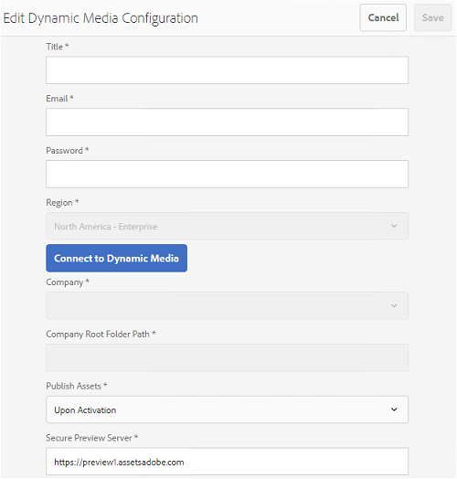

# Compatibilidad con vídeos dinámicos en Brand Portal {#dynamic-video-support-on-brand-portal}

Vista previa y reproducción de vídeos de forma adaptativa en Brand Portal compatible con Dynamic Media. Descargue también las representaciones dinámicas desde el portal y los vínculos compartidos.
Los usuarios de Brand Portal pueden:

* Vista previa de vídeos en la página Detalles del recurso, Vista de tarjeta y vista previa del recurso compartido de vínculos.
* Reproducir codificaciones de vídeo en la página Detalles del recurso.
* Vea las representaciones dinámicas en la pestaña Representaciones de la página Detalles del recurso.
* Descargue las codificaciones de vídeo y las carpetas que contengan vídeos.

>[!NOTE]
>
>Para trabajar con vídeos y publicarlos en Brand Portal, asegúrese de que la instancia de autor de Experience Manager esté configurada en el modo híbrido de Dynamic Media o en Dynamic Media **[!DNL Scene7]** modo.

Para obtener una vista previa, reproducir y descargar vídeos, Brand Portal expone las dos configuraciones siguientes a los administradores:

* [Configuración híbrida de Dynamic Media](#configure-dm-hybrid-settings)
Si la instancia de autor de Experience Manager se está ejecutando en el modo híbrido de medios dinámicos.
* [Dynamic Media [!DNL Scene7] configuración](#configure-dm-scene7-settings)
Si la instancia de autor de Experience Manager se está ejecutando en medios dinámicos:**[!DNL Scene7]** modo.
Establezca cualquiera de estas configuraciones en función de las configuraciones establecidas en la instancia de autor de Experience Manager con la que se replica el inquilino de Brand Portal.

>[!NOTE]
>
>Los vídeos dinámicos no son compatibles con los inquilinos de Brand Portal configurados con Experience Manager Author en **[!UICONTROL Scene7Connect]** modo de ejecución.

## ¿Cómo se reproducen los vídeos dinámicos? {#how-are-dynamic-videos-played}

Si las configuraciones de Dynamic Media ([Híbrido](../using/dynamic-video-brand-portal.md#configure-dm-hybrid-settings) o [[!DNL Scene7]](../using/dynamic-video-brand-portal.md#configure-dm-scene7-settings) configuraciones) en Brand Portal, las representaciones dinámicas se recuperan de **[!DNL Scene7]** servidor. Las codificaciones de vídeo se previsualizan y reproducen sin demora y distorsionan la calidad.

Como, las codificaciones de vídeo no se almacenan en el repositorio de Brand Portal y se recuperan de **[!DNL Scene7]** Asegúrese de que las configuraciones de Dynamic Media en la instancia de autor de Adobe Experience Manager y en Brand Portal sean las mismas.

>[!NOTE]
>
>Los visores de vídeo y los ajustes preestablecidos de visualizador no son compatibles con Brand Portal. Los vídeos se previsualizan y reproducen en los visores predeterminados de Brand Portal.

## Requisitos previos {#prerequisites}

Para trabajar con vídeos dinámicos en Brand Portal, asegúrese de lo siguiente:

* **Iniciar Experience Manager Author en modo Dynamic Media**
Inicie la instancia de autor del Experience Manager (con la que está configurado Brand Portal) en [DYNAMIC MEDIA - [!DNL Scene7] modo](https://experienceleague.adobe.com/docs/experience-manager-65/assets/dynamic/config-dms7.html?lang=en#enabling-dynamic-media-in-scene-mode) o en [Dynamic Media: modo híbrido](https://experienceleague.adobe.com/docs/experience-manager-65/assets/dynamic/config-dynamic.html) o
* **Configuración de Cloud Services de Dynamic Media en Autor del Experience Manager**
En función del modo Dynamic Media (modo Scene7 o híbrido) en el que se ejecuta Experience Manager Author, establezca [Cloud Services de Dynamic Media ([!DNL Scene7] mode)](https://experienceleague.adobe.com/docs/experience-manager-65/assets/dynamic/config-dms7.html?lang=es#configuring-dynamic-media-cloud-services) o [Cloud Services de Dynamic Media (modo híbrido)](https://experienceleague.adobe.com/docs/experience-manager-65/assets/dynamic/config-dynamic.html?lang=en#configuring-dynamic-media-cloud-services) al Experience Manager Author de **Herramientas** | **Cloud Services** | **Dynamic Media**.
* **Configuración de Dynamic Media en Brand Portal**
En función de las configuraciones en la nube de Dynamic Media de Experience Manager Author, configure lo siguiente [Configuración de Dynamic Media](#configure-dm-hybrid-settings) o [[!DNL Scene7] configuración](#configure-dm-scene7-settings) desde las herramientas administrativas de Brand Portal.
Asegúrese de que [inquilinos de Brand Portal independientes](#separate-tenants) se utilizan para instancias de autor de Experience Manager configuradas en Dynamic Media: **[!UICONTROL Scene7]** y Dynamic Media: modo híbrido. Especialmente si utiliza las funcionalidades de Dynamic Media **[!UICONTROL S7]** y Dynamic Media Hybrid.
* **Publicar carpetas con codificaciones de vídeo aplicadas a Brand Portal**
Aplicar [codificaciones de vídeo](https://experienceleague.adobe.com/docs/experience-manager-65/assets/dynamic/video-profiles.html) y publique la carpeta que contiene los recursos de medios enriquecidos de la instancia de autor de Experience Manager en Brand Portal.
* **IP de salida de lista de permitidos en SPS si la previsualización segura está habilitada**
Si usa Dynamic Media-**[!DNL Scene7]** (con [vista previa segura habilitada](https://experienceleague.adobe.com/docs/dynamic-media-classic/using/upload-publish/testing-assets-making-them-public.html) para una empresa), se aconseja que **[!DNL Scene7]** administrador de empresa [lista de permitidos de las IP de salida pública](https://experienceleague.adobe.com/docs/dynamic-media-classic/using/upload-publish/testing-assets-making-them-public.html#testing-the-secure-testing-service) para las regiones respectivas que utilizan SPS (**[!UICONTROL Scene7]** Publishing System).
Las IP de salida son las siguientes:

| **Región** | **IP de salida** |
|--- |--- |
| ND | 130.248.160.68,  20.94.203.130 |
| EMEA | 185.34.189.3,  51.132.146.75 |
| APAC | 63.140.44.54 |

Para incluir alguna de estas IP de salida en la lista de permitidos, consulte [prepare su cuenta para el servicio de pruebas seguras](https://experienceleague.adobe.com/docs/dynamic-media-classic/using/upload-publish/testing-assets-making-them-public.html#testing-the-secure-testing-service).

## Prácticas recomendadas

Para asegurarse de que los recursos de vídeo dinámico se previsualizan, reproducen y descargan correctamente desde Brand Portal (y vínculos compartidos), siga estas prácticas:

### Inquilinos independientes para Dynamic Media: Scene7 y Dynamic Media: modos híbridos {#separate-tenants}

Si usa tanto Dynamic Media - **[!DNL Scene7]** y Dynamic Media: funciones del modo híbrido, utilice diferentes inquilinos de Brand Portal para instancias de autor de Experience Manager configuradas con Dynamic Media: **[!DNL Scene7]** y Dynamic Media: modos híbridos.

### Mismos detalles de configuración en la instancia de autor del Experience Manager y en Brand Portal

Asegúrese de que los detalles de configuración sean los mismos en Brand Portal y **[!UICONTROL Configuración de Experience Manager Cloud]**. Los mismos detalles de configuración incluyen lo siguiente:

* **[!UICONTROL Título]**
* **[!UICONTROL ID de registro]**
* **[!UICONTROL URL del servicio de vídeo]** in **[!UICONTROL Dynamic Media: modo híbrido]**
* **[!UICONTROL Título]**
* Credenciales (**[!UICONTROL Correo electrónico]** y contraseña)
* **[!UICONTROL Región]**
* **[!UICONTROL Compañía]** en Dynamic Media - **[!DNL Scene7]** modo

### Lista de permitidos de direcciones IP de salida públicas para el modo Scene7 de Dynamic Media

Si Dynamic Media **[!UICONTROL Scene7]**-teniendo [vista previa segura habilitada](https://experienceleague.adobe.com/docs/dynamic-media-classic/using/upload-publish/testing-assets-making-them-public.html): se utiliza para proporcionar recursos de vídeo a Brand Portal y, a continuación, **[!UICONTROL Scene7]** establece un servidor de imágenes dedicado para entornos de ensayo o aplicaciones internas. Cualquier solicitud a este servidor comprueba la dirección IP de origen. Si la solicitud entrante no se encuentra dentro de la lista aprobada de direcciones IP, se devuelve una respuesta de error.
El **[!UICONTROL Scene7]** Por lo tanto, el administrador de la empresa configura una lista aprobada de direcciones IP para el **[!UICONTROL Prueba de seguridad]** entorno, mediante **[!UICONTROL SPS]** (Scene7 Publishing System) IU de Flash. Asegúrese de que la IP de salida de su región respectiva (de la siguiente lista) se añada a esa lista aprobada.
Para incluir alguna de estas IP de salida en la lista de permitidos, consulte [prepare su cuenta para el servicio de pruebas seguras](https://experienceleague.adobe.com/docs/dynamic-media-classic/using/upload-publish/testing-assets-making-them-public.html#testing-the-secure-testing-service).
Las direcciones IP de salida son las siguientes:

| **Región** | **IP de salida** |
|--- |--- |
| ND | 130.248.160.66, 20.94.203.130 |
| EMEA | 51.132.146.75, 130.248.244.202, 130.248.244.203, 130.248.244.204, 130.248.244.210, 130.248.244.211, 130.248.244.212 |
| APAC | 63.140.44.54 |

## Configuración de Dynamic Media (híbrido) {#configure-dm-hybrid-settings}

Si la instancia de autor de Experience Manager se está ejecutando en el modo híbrido de medios dinámicos, utilice **[!UICONTROL Vídeo]** mosaico del panel herramientas administrativas para establecer la configuración de la puerta de enlace de Dynamic Media.

>[!NOTE]
>
>El [perfiles de codificación de vídeo](https://experienceleague.adobe.com/docs/experience-manager-65/assets/dynamic/video-profiles.html) no se han publicado en Brand Portal, sino que se recuperan de **[!UICONTROL Scene7]** servidor. Por lo tanto, para que las codificaciones de vídeo se reproduzcan correctamente en Brand Portal, asegúrese de que los detalles de configuración sean los mismos que los de [Cloud Services de Dynamic Media ([!DNL Scene7] mode)](https://experienceleague.adobe.com/docs/experience-manager-65/assets/dynamic/config-dms7.html?lang=es#configuring-dynamic-media-cloud-services) en la instancia de autor de Experience Manager.

Para establecer las configuraciones de Dynamic Media en los inquilinos de Brand Portal:

1. Seleccione el logotipo del Experience Manager para poder acceder a las herramientas administrativas desde la barra de herramientas de la parte superior de Brand Portal.
1. En el panel de herramientas administrativas, seleccione **[!UICONTROL Vídeo]** mosaico.

   

   **[!UICONTROL Editar configuración de Dynamic Media]** se abre la página.

   

1. Especificar **[!UICONTROL ID de registro]** y **[!UICONTROL URL del servicio de vídeo]** (URL de puerta de enlace DM). Asegúrese de que estos detalles son los mismos que los de **[!UICONTROL Herramientas > Cloud Services]** en la instancia de autor de Experience Manager.
1. Seleccionar **Guardar** para guardar la configuración.

## Configuración de Dynamic Media Scene7 {#configure-dm-scene7-settings}

Si la instancia de autor de Experience Manager se ejecuta en Dynamic Media- **[!UICONTROL Scene7]** modo y, a continuación utilice **[!UICONTROL Configuración de Dynamic Media]** mosaico del panel herramientas administrativas para configurar el **[!UICONTROL Scene7]** configuración del servidor.

Para configurar Dynamic Media **[!UICONTROL Scene7]** configuraciones en inquilinos de Brand Portal:

1. Seleccione el logotipo del Experience Manager para poder acceder a las herramientas administrativas desde la barra de herramientas de la parte superior de Brand Portal.

2. En el panel de herramientas administrativas, seleccione **[!UICONTROL Configuración de Dynamic Media]** mosaico.

   ![DM [!UICONTROL Scene7] Configuración de en Brand Portal](assets/DMS7-Tile.png)

   **[!UICONTROL Editar configuración de Dynamic Media]** se abre la página.

   

3. Proporcionar:

   * **[!UICONTROL Título]**
   * Credenciales (**[!UICONTROL ID de correo electrónico]** y **[!UICONTROL Contraseña]**) para acceder al servidor de Scene7
   * **[!UICONTROL Región]**

   Asegúrese de que estos valores sean los mismos que los encontrados en la instancia de autor de Experience Manager.

4. Seleccionar **[!UICONTROL Conectar con Dynamic Media]**.

5. Proporcione el **[!UICONTROL Nombre de empresa]**, y **[!UICONTROL Guardar]** la configuración.
