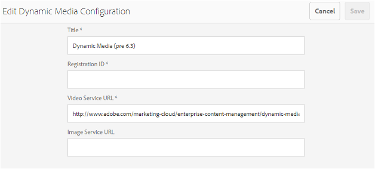

# Compatibilidad con vídeos dinámicos en Brand Portal {#dynamic-video-support-on-brand-portal}

Previsualización y reproducción de vídeos adaptables en Brand Portal con compatibilidad con Dynamic Media. Descargue también las representaciones dinámicas desde el portal y los vínculos compartidos.
Los usuarios de Brand Portal pueden:

* Vídeos de Previsualización en la página Detalles del recurso, Vista de tarjetas y página de previsualización de uso compartido de vínculos.
* Reproducir codificaciones de vídeo en la página Detalles del recurso.
* Vista las representaciones dinámicas en la ficha Representaciones de la página Detalles del recurso.
* Descargue codificaciones de vídeo y carpetas que contengan vídeos.

>[!NOTE]
>
>Para trabajar con vídeos y publicarlos en Brand Portal, asegúrese de que la instancia de AEM Author está configurada en modo Dynamic Media Hybrid o en modo Dynamic Media **[!DNL Scene 7]** .

Para la previsualización, reproducción y descarga de vídeos, Brand Portal expone las dos configuraciones siguientes a los administradores:

* [Configuración](#configure-dm-hybrid-settings)híbrida de Dynamic Media Si la instancia de AEM Author se está ejecutando en modo híbrido de Dynamic Media.
* [Mediaconfiguración dinámica [!DNL Scene 7] ](#configure-dm-scene7-settings)Si la instancia de AEM Author se está ejecutando en modo de Dynamic Media-**[!DNL Scene 7]** .
Configure cualquiera de estas configuraciones en función de las configuraciones que configure en la instancia de AEM Author con la que se replique el inquilino de Brand Portal.

>[!NOTE]
>
>Los vídeos dinámicos no son compatibles con los inquilinos de Brand Portal configurados con AEM Author que se ejecuta en el modo de ejecución de **[!UICONTROL Scene7 Connect]** .

## ¿Cómo se reproducen los vídeos dinámicos? {#how-are-dynamic-videos-played}

Si las configuraciones de Dynamic Media (configuraciones[híbridas](../using/dynamic-video-brand-portal.md#configure-dm-hybrid-settings) o [[!DNL Scene7]](../using/dynamic-video-brand-portal.md#configure-dm-scene7-settings) ) están configuradas en Brand Portal, las representaciones dinámicas se recuperan del **[!DNL Scene 7]** servidor. Por lo tanto, las codificaciones de vídeo se previsualizan y reproducen sin demora y con distorsión de la calidad.

Dado que las codificaciones de vídeo no se almacenan en el repositorio de Brand Portal y se recuperan del **[!DNL Scene 7]** servidor, asegúrese de que las configuraciones de Dynamic Media en la instancia de AEM Author y en Brand Portal sean las mismas.

>[!NOTE]
>
>Los visores de vídeo y los ajustes preestablecidos de visor no son compatibles con Brand Portal. Los vídeos se previsualizan y se reproducen en los visores predeterminados de Brand Portal.

## Requisitos previos {#prerequisites}

Para trabajar con vídeos dinámicos en Brand Portal, asegúrese de:

* **Inicio AEM Author en modo** DM (Dynamic Media) [Inicio de la instancia de AEM Author (con la que se configura Brand Portal) en modo](https://helpx.adobe.com/experience-manager/6-5/assets/using/config-dynamic.html#EnablingDynamicMedia) híbrido de [Dynamic Media o [!DNL Scene 7] Dynamic](https://helpx.adobe.com/experience-manager/6-5/assets/using/config-dms7.html#EnablingDynamicMediainScene7mode)Media.
* **Configuración de servicios en la nube de Dynamic Media en AEM Author** En función de la ejecución del AEM Author de modo de Dynamic Media, configure los servicios [en la nube de](https://helpx.adobe.com/experience-manager/6-5/assets/using/config-dynamic.html#ConfiguringDynamicMediaCloudServices) Dynamic Media o los servicios [[!DNL Scene 7] en la](https://helpx.adobe.com/experience-manager/6-5/assets/using/config-dms7.html#ConfiguringDynamicMediaCloudServices) nube en AEM Author desde **Herramientas** | **Cloud Service** | **Dynamic Media**.
* **Configure Dynamic Media en Brand Portal** En función de las configuraciones de nube de Dynamic Media en AEM Author, configure las opciones [o](#configure-dm-hybrid-settings) las opciones [[!DNL Scene 7] de](#configure-dm-scene7-settings) Dynamic Media en las herramientas administrativas de Brand Portal.
Asegúrese de que los inquilinos  separados de Brand Portal se utilizan para instancias de AEM Author configuradas con los modos Dynamic Media Hybrid y Dynamic Media **[!UICONTROL Scene7]** , si utiliza funcionalidades de Dynamic Media Hybrid y Dynamic Media **[!UICONTROL S7]**.
* **Publique carpetas con codificaciones de vídeo aplicadas a Brand Portal** Aplique codificaciones [de](https://helpx.adobe.com/experience-manager/6-5/assets/using/video-profiles.html) vídeo y publique la carpeta que contiene recursos de medios enriquecidos desde la instancia de AEM Author hasta Brand Portal.
* **IP de salida de Lista de permitidos en SPS si la previsualización segura está habilitada**. Si se utiliza Dynamic Media-**[!DNL Scene 7]** (con previsualización [segura habilitada](https://docs.adobe.com/content/help/en/dynamic-media-classic/using/upload-publish/testing-assets-making-them-public.html) para una compañía), se recomienda que el administrador de la **[!DNL Scene 7]** compañía [lista de permitidos las IP de salida](https://docs.adobe.com/content/help/en/dynamic-media-classic/using/upload-publish/testing-assets-making-them-public.html#testing-the-secure-testing-service) públicas para las regiones respectivas mediante la interfaz de usuario flash de SPS (**[!UICONTROL Scene 7]** Publishing System).
Las direcciones IP de salida son las siguientes:

| **Región** | **IP de salida** |
|--- |--- |
| ND | 192.243.237.86 |
| EMEA | 185.34.189.4 |
| APAC | 63.140.44.54 |

Para permitir cualquiera de estas direcciones IP de salida, consulte [Preparación de la cuenta para un servicio](https://docs.adobe.com/content/help/en/dynamic-media-classic/using/upload-publish/testing-assets-making-them-public.html#testing-the-secure-testing-service)de prueba seguro.

## Prácticas recomendadas 

Para asegurarse de que los recursos de vídeo dinámicos se previsualizan, reproducen y descargan correctamente desde Brand Portal (y vínculos compartidos), siga estas prácticas:

### Inquilinos independientes para los modos Dynamic Media Hybrid y Dynamic Media Scene7 {#separate-tenants}

Si está utilizando las funciones Dynamic Media **[!DNL Scene 7]** y Dynamic Media Hybrid, se recomienda utilizar diferentes inquilinos de Brand Portal para instancias de AEM Author configuradas con los modos Dynamic Media Hybrid y Dynamic Media **[!DNL Scene 7]** . 

### Los mismos detalles de configuración en la instancia de AEM Author y en Brand Portal

Asegúrese de que los detalles de configuración, tales como **[!UICONTROL Título]**, Id **** de registro, URL **[!UICONTROL del servicio de]** vídeo (en **[!UICONTROL Dynamic Media Hybrid]**) y **[!UICONTROL Título]****** ******** **[!DNL Scene 7]******, credenciales (Correo electrónico y contraseña),Región(en Dynamic Media)-sean los mismos en la configuración de Brand Portal y en la nube AEM.

### IP de salida pública de Lista de permitidos para el modo Dynamic Media Scene 7

Si Dynamic Media **[!UICONTROL Scene 7]** tiene habilitada [la previsualización](https://docs.adobe.com/content/help/en/dynamic-media-classic/using/upload-publish/testing-assets-making-them-public.html)segura para ofrecer recursos de vídeo a Brand Portal, **[!UICONTROL Scene 7]** establece un servidor de imágenes dedicado para entornos de ensayo o aplicaciones internas. Cualquier solicitud a este servidor comprueba la dirección IP del origen. Si la solicitud entrante no está dentro de la lista aprobada de direcciones IP, se devuelve una respuesta de error.
Por lo tanto, el administrador de Compañías de **[!UICONTROL Scene-7]** configura una lista aprobada de direcciones IP para el entorno de pruebas **** seguras de su compañía mediante la interfaz de usuario flash de **[!UICONTROL SPS]** (Scene-7 Publishing System). Asegúrese de que la dirección IP de salida de su región respectiva (de lo siguiente) se agrega a esa lista aprobada.
Para permitir cualquiera de estas direcciones IP de salida, consulte [Preparación de la cuenta para un servicio](https://docs.adobe.com/content/help/en/dynamic-media-classic/using/upload-publish/testing-assets-making-them-public.html#testing-the-secure-testing-service)de prueba seguro.
Las direcciones IP de salida son las siguientes:

| **Región** | **IP de salida** |
|--- |--- |
| ND | 192.243.237.86 |
| EMEA | 185.34.189.4 |
| APAC | 63.140.44.54 |

## Configuración de la configuración de Dynamic Media (híbrido) {#configure-dm-hybrid-settings}

Si la instancia de AEM Author se está ejecutando en el modo híbrido de medios dinámicos, utilice el mosaico **[!UICONTROL Vídeo]** del panel Herramientas administrativas para configurar las opciones de la puerta de enlace de Dynamic Media.

>[!NOTE]
>
>Los perfiles [de codificación de](https://helpx.adobe.com/experience-manager/6-5/assets/using/video-profiles.html) vídeo no se publican en Brand Portal, sino que se recuperan del servidor de **[!UICONTROL Scene 7]** . Por lo tanto, para que las codificaciones de vídeo se reproduzcan correctamente en Brand Portal, asegúrese de que los detalles de configuración sean los mismos que los de la configuración [[!UICONTROL de nube de]](https://helpx.adobe.com/experience-manager/6-5/assets/using/config-dms7.html#ConfiguringDynamicMediaCloudServices) Scene7 en la instancia de AEM Author.

Para configurar las configuraciones de Dynamic Media en los inquilinos de Brand Portal:

1. Seleccione el logotipo de AEM para acceder a las herramientas administrativas desde la barra de herramientas situada en la parte superior, en Brand Portal.
1. En el panel Herramientas administrativas, seleccione el mosaico **[!UICONTROL Vídeo]** .

   

   **[!UICONTROL Se abre la página Editar configuración]** de Dynamic Media.

   

1. Especifique el ID **** de registro y la URL **[!UICONTROL del servicio]** de vídeo (URL de DM-Gateway). Asegúrese de que estos detalles son los mismos que los de **[!UICONTROL Herramientas > Cloud Service]** en la instancia de AEM Author.
1. Seleccione **Guardar** para guardar la configuración.

## Configuración de la configuración de Dynamic Media Scene7 {#configure-dm-scene7-settings}

Si la instancia de AEM Author se está ejecutando en el modo Dynamic Media- **[!UICONTROL Scene 7]** , utilice el mosaico Configuración **[!UICONTROL de]** Dynamic Media del panel Herramientas administrativas para configurar la configuración del servidor de **[!UICONTROL Scene 7]** .

Para configurar las configuraciones de Dynamic Media **[!UICONTROL Scene 7]** en los inquilinos de Brand Portal:

1. Seleccione el logotipo de AEM para acceder a las herramientas administrativas desde la barra de herramientas situada en la parte superior, en Brand Portal.

2. En el panel Herramientas administrativas, seleccione el mosaico Configuración **[!UICONTROL de]** Dynamic Media. 
   ![Configuración de DM [!UICONTROL Scene 7] en Brand Portal](assets/DMS7-Tile.png)
   **[!UICONTROL Se abre la página Editar configuración]** de Dynamic Media. 
   

3. Proporcione:
   * **[!UICONTROL Título]**
   * Credenciales (ID **[!UICONTROL de]** correo electrónico y **[!UICONTROL contraseña]**) para acceder al servidor de Scene 7
   * **[!UICONTROL Región]** Asegúrese de que estos valores son los mismos que los de la instancia de AEM Author.

4. Select **[!UICONTROL Connect to Dynamic Media]**.

5. Proporcione el nombre **[!UICONTROL de la]** Compañía y **[!UICONTROL guarde]** la configuración.
