# Acceso de invitado a Brand Portal {#guest-access-to-brand-portal}

AEM portal de marca permite a los invitados acceder al portal. Un usuario invitado no necesita credenciales para entrar en el portal y tiene acceso a los recursos públicos (y colecciones) del portal. Los usuarios de la sesión de invitados pueden agregar recursos a su caja de luz (colección privada) y descargarlos hasta que dure la sesión, es decir, 2 horas después del inicio de la sesión, a menos que el usuario invitado elija [[!UICONTROL Finalizar sesión]](#exit-guest-session).

La funcionalidad de acceso de invitados permite a las organizaciones compartir [rápidamente los activos](../using/brand-portal-sharing-folders.md#how-to-share-folders) aprobados con la audiencia prevista a escala sin tener que incorporarlos. A partir de la versión 6.4.2, Brand Portal está equipado para servir a varios usuarios invitados simultáneos, lo que representa el 10 % de la cuota total de usuarios por organización. Permitir el acceso de los invitados ahorra tiempo para administrar y agregar puntuaciones de usuarios que necesitan usar funcionalidades limitadas en Brand Portal.\
Las organizaciones pueden habilitar (o deshabilitar) el acceso de invitados en la cuenta de Brand Portal de la organización mediante la opción **[!UICONTROL Permitir acceso]** de invitados desde la configuración de **[!UICONTROL Access]** en el panel de herramientas administrativas.

<!--
Comment Type: annotation
Last Modified By: mgulati
Last Modified Date: 2018-08-17T10:42:59.879-0400
Removed the first para: "AEM Assets Brand Portal allows public users to enter the portal anonymously and have restricted access to the allowed public resources as guests. Organization users with guest role need not seek access and authentication from administrators."
-->

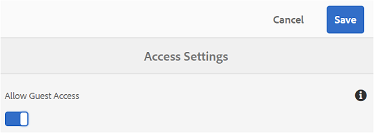

## Iniciar sesión de invitado {#begin-guest-session}

Para entrar en Brand Portal de forma anónima, seleccione **[!UICONTROL Haga clic aquí]** correspondiente a **[!UICONTROL Acceso de invitado?]** en la pantalla de bienvenida de Brand Portal. Introduzca la comprobación de seguridad catcha para conceder acceso a la utilización del portal de marca.

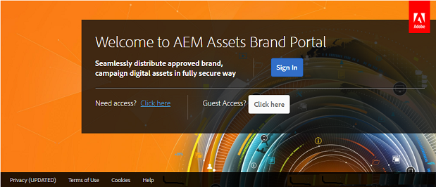

## Duración de la sesión del invitado {#guest-session-duration}

Una sesión de usuario invitado permanece activa durante 2 horas. Esto significa que el estado de **[!UICONTROL Lightbox]** se conserva hasta 1 hora desde el inicio de la sesión y después de 2 horas la sesión de invitado actual se reinicia para que se pierda el estado de Lightbox.\
Por ejemplo, un usuario invitado inicia sesión en Brand Portal a las 15.00 horas y agrega recursos a Lightbox para descargarlos a las 16.50 horas. Si el usuario no descarga la colección **[!UICONTROL Lightbox]** (o sus recursos) antes de las 17:00 horas, el **[!UICONTROL Lightbox]** quedará vacío, ya que el usuario tendrá que reiniciar la sesión al final de 1 hora (es decir, 1700 horas).

## Sesiones de invitados simultáneas permitidas {#concurrent-guest-sessions-allowed}

El número de sesiones de invitados simultáneas está limitado al 10 % de la cuota total de usuarios por organización. Esto significa que para una organización con una cuota de usuario de 200, un máximo de 20 usuarios invitados pueden trabajar al mismo tiempo. Al usuario número 21 se le deniega el acceso y solo puede acceder como invitado si finaliza la sesión de cualquiera de los 20 usuarios invitados activos.

## Interacción del usuario invitado con Brand Portal {#guest-user-interaction-with-brand-portal}

### Navegación de la interfaz de usuario del invitado

Al entrar en el portal de marca como invitado, los usuarios pueden ver todos los [recursos y carpetas compartidos](../using/brand-portal-sharing-folders.md#sharefolders) públicamente o con usuarios invitados exclusivamente. Esta vista es la vista de contenido único, que muestra los recursos en cualquiera de los diseños de tarjeta, lista o columna.

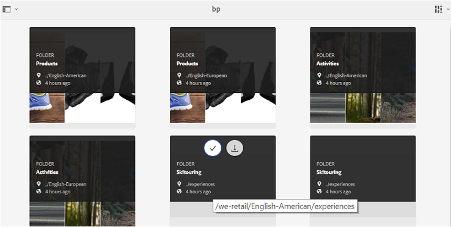

Sin embargo, los usuarios invitados verán el árbol de carpetas (a partir de la carpeta raíz) y las carpetas compartidas organizadas dentro de sus respectivas carpetas principales al iniciar sesión en Brand Portal, si los administradores han habilitado la configuración de [Habilitar jerarquía](../using/brand-portal-general-configuration.md#main-pars-header-1621071021) de carpetas.

Estas carpetas principales son las carpetas virtuales y no se pueden realizar acciones en ellas. Puede reconocer estas carpetas virtuales con un icono de candado.

No hay tareas de acción visibles al pasar el ratón o seleccionarlas en la Vista **[!UICONTROL de]** tarjetas, a diferencia de las carpetas compartidas. **[!UICONTROL El botón Información general]** se muestra al seleccionar una carpeta virtual en Vista **[!UICONTROL de]** columna y Vista **[!UICONTROL de]** Lista.

>[!NOTE]
>
>La miniatura predeterminada de las carpetas virtuales es la imagen en miniatura de la primera carpeta compartida.

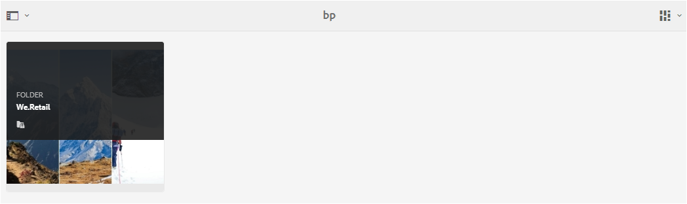 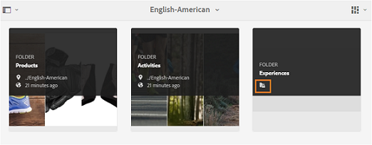 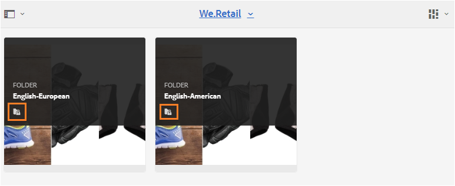 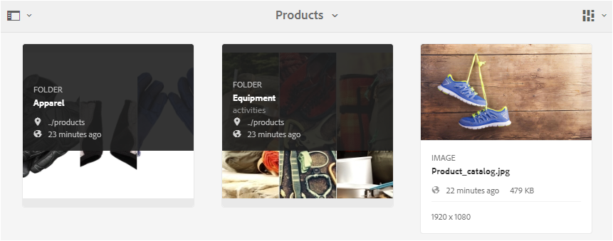

**[!UICONTROL La opción Configuración]** de vista permite a los usuarios invitados ajustar el tamaño de las tarjetas en la Vista **[!UICONTROL de]** tarjetas o en las columnas para que se muestren en la Vista **[!UICONTROL de]** Lista.

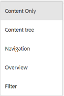

El árbol **** Contenido le permite moverse por la jerarquía de recursos.

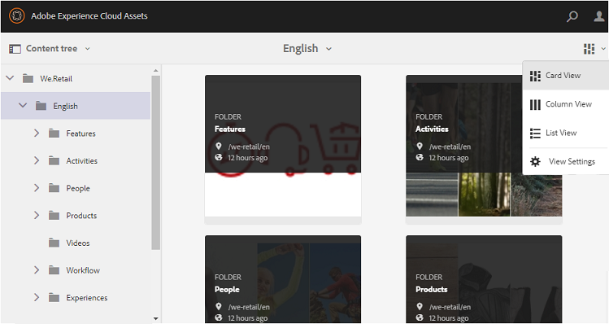

Brand Portal ofrece a los usuarios invitados la opción **[!UICONTROL Información general]** de vista de propiedades **[!UICONTROL de]** recursos de los recursos o carpetas seleccionados. La opción **[!UICONTROL Información general]** está visible:

* En la barra de herramientas de la parte superior, seleccione un recurso o una carpeta.
* En la lista desplegable al seleccionar el Selector de raíl.
Al seleccionar la opción **[!UICONTROL Información general]** mientras se selecciona un recurso o carpeta, los usuarios pueden ver el título, la ruta y la hora de creación de recursos. Mientras que, en la página de detalles de recursos, si selecciona la opción **[!UICONTROL Información general]** , los usuarios podrán ver los metadatos del recurso.

 

**[!UICONTROL La opción de navegación]** en el carril izquierdo permite desplazarse de archivos a colecciones y volver a la sesión de invitado para que los usuarios puedan navegar por los recursos de archivos o colecciones.

**[!UICONTROL La opción Filtro]** permite a los usuarios invitados filtrar archivos y carpetas de recursos mediante predicados de búsqueda establecidos por el administrador.

### Funciones de usuario invitado

Los usuarios invitados pueden acceder a los recursos públicos de Brand Portal y también tienen pocas restricciones, como se explica más adelante.

**Los usuarios invitados pueden**:

* Acceda a todas las carpetas públicas y colecciones destinadas a todos los usuarios de Brand Portal.
* Examinar los miembros, la página de detalles y la vista de recursos completa de los miembros de todas las carpetas y colecciones públicas.
* Buscar recursos en carpetas y colecciones públicas.
* Añada los recursos en una colección de Lightbox. Estos cambios en la colección persisten durante la sesión.
* Descargue recursos directamente o a través de una colección de Lightbox.

**Los usuarios invitados no pueden**:

* Cree colecciones y búsquedas guardadas, o compártalas más.
* Acceda a la configuración de carpetas y colecciones.
* Compartir recursos como vínculos.

### Descargar recursos en la sesión de invitados

Los usuarios invitados pueden descargar directamente recursos compartidos pública o exclusivamente con usuarios invitados en Brand Portal. Los usuarios invitados también pueden agregar recursos a **[!UICONTROL Lightbox]** (colección pública) y descargar la colección **[!UICONTROL Lightbox]** antes de que caduque la sesión.

Para descargar recursos y colecciones, utilice el icono de descarga de:

* Miniaturas de acción rápida, que aparecen al pasar el ratón sobre el recurso o la colección
* La barra de herramientas de la parte superior, que aparece al seleccionar el recurso o la colección

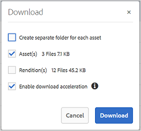

Si selecciona **[!UICONTROL Activar aceleración]** de descarga en el cuadro de diálogo [!UICONTROL Descargar] , podrá [mejorar el rendimiento](../using/accelerated-download.md)de descarga.

## Salir de la sesión de invitados {#exit-guest-session}

Para salir de una sesión de invitado, utilice **[!UICONTROL Finalizar sesión]** desde las opciones disponibles en el encabezado. Sin embargo, si la ficha del explorador utilizada para la sesión de invitado está inactiva, la sesión caduca automáticamente tras dos horas de inactividad.

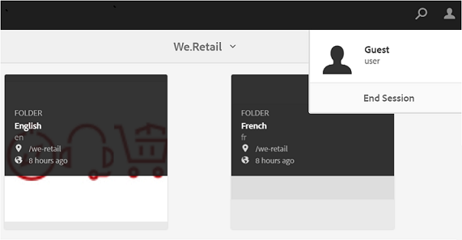

## Supervisión de actividades de usuarios invitados {#monitoring-guest-user-activities}

Los administradores pueden supervisar la interacción del usuario invitado con Brand Portal. Los informes generados en Brand Portal pueden proporcionar información clave sobre las actividades de los usuarios invitados. Por ejemplo: el informe **[!UICONTROL Descargar]** se puede utilizar para rastrear el recuento de recursos descargados por el usuario invitado. **[!UICONTROL El informe de inicios de sesión]** del usuario invitado puede informar en qué momento el usuario invitado inició sesión por última vez en el portal y la frecuencia de inicios de sesión en un período de tiempo especificado.
